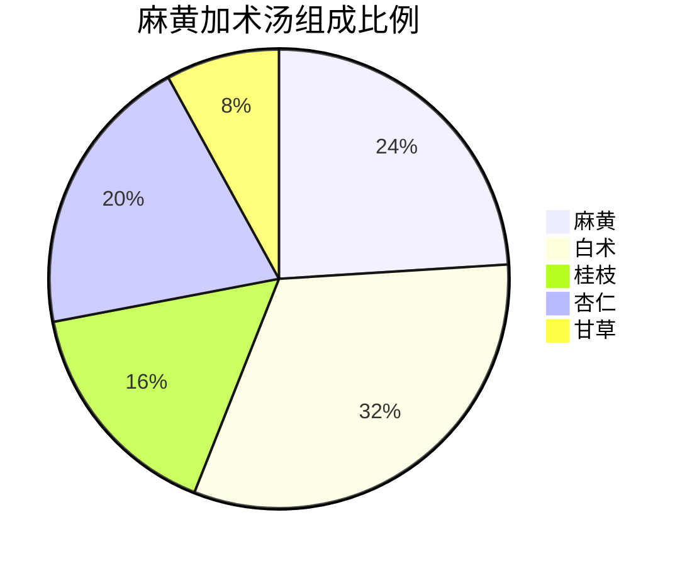
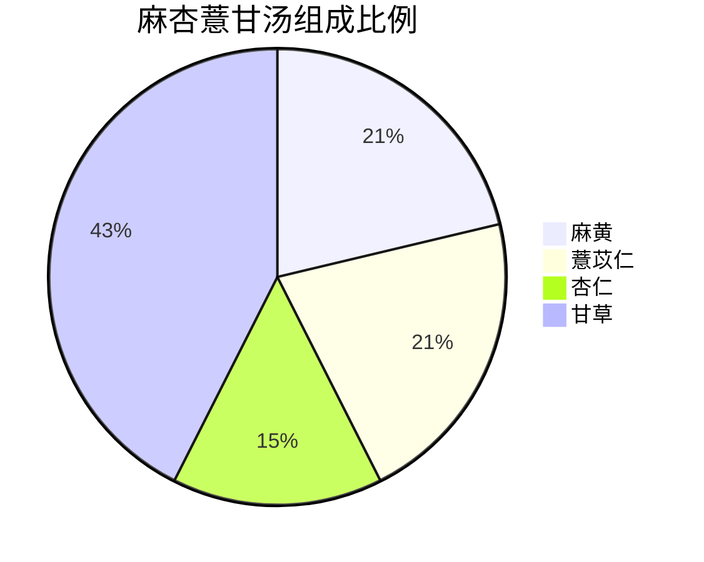

# 痉湿暍病脉证治法第二


中医讲的痉病区分为刚痉和柔痉二种，类似西医讲的「脑脊髓神经炎」简言叫「脑膜炎」。

「湿病」就是中湿，湿有时候在身体里面，有时候在关节上面。

「暍 yē」就是中暑，热天的时候中暑，这一篇就是在讲这些病症。

<!--more-->

## 📜太阳病，发热、无汗、反恶寒者，名曰刚痉。太阳病发热汗出，而不恶寒，名曰柔痉。

#### 一、痉病基本分型
1. **刚痉**
- 主证特征：  
  ✓ 发热无汗  
  ✓ 恶寒明显  
- 病理特点：  
  ✓ 寒邪束表  
  ✓ 津液不布  
- 代表方剂：葛根汤

2. **柔痉**
- 主证特征：  
  ✓ 发热汗出  
  ✓ 不恶寒  
- 病理特点：  
  ✓ 风邪伤卫  
  ✓ 营阴不足  
- 代表方剂：栝蒌桂枝汤

#### 二、鉴别诊断要点
| 鉴别点 | 刚痉 | 柔痉 |
|--------|------|------|
| 汗出情况 | 无汗 | 有汗 |
| 恶寒表现 | 明显 | 轻微或无 |
| 肌肉紧张度 | 强直明显 | 拘挛较轻 |
| 好发人群 | 各年龄段 | 小儿多见 |

#### 三、治疗注意事项
1. **用药禁忌**
- 刚痉：忌过早滋阴
- 柔痉：忌过用辛温

2. **儿科特殊考量**
- 剂量调整：  
  ✓ 根据年龄体重减量  
  ✓ 宜少量频服  
- 给药方式：  
  ✓ 可考虑药浴等外治法  

注：痉病常见于小儿外感热病过程中，现代医学中的脑膜炎、破伤风等疾病出现类似症状时可参考此辨证思路。临床需注意，出现痉病症状时应及时就医，避免延误病情。两种痉病可相互转化，治疗过程中需密切观察病情变化。

## 📜太阳病，发热，脉沉而细者，名曰痉，为难治。

#### 一、太阳痉病脉证特点
1. **异常脉象**
- 脉沉而细（区别于太阳病常脉）
- 病理机制：  
  ✓ 沉主里病  
  ✓ 细主阴寒  

2. **鉴别诊断**
| 证型       | 脉象特点 | 病机要点       |
|------------|----------|----------------|
| 太阳伤寒   | 浮紧     | 寒邪束表       |
| 太阳中风   | 浮缓     | 风邪伤卫       |
| 太阳痉病   | 沉细     | 里寒津伤       |

#### 二、痉病核心病机
1. **津液失调**
- 水液代谢障碍：  
  ✓ 里寒不化（水入即排）  
  ✓ 筋脉失养  
- 发展转归：  
  ✓ 轻者拘急  
  ✓ 重者抽搐  

2. **证型演变**
- 刚痉（葛根汤证）
- 柔痉（栝蒌桂枝汤证）
- 阳明痉（大承气汤证）

#### 三、治疗难点与对策
1. **治疗困境**
- 寒热矛盾：  
  ✓ 需温里散寒  
  ✓ 忌燥热伤阴  
- 补泻两难：  
  ✓ 需补充津液  
  ✓ 忌滋腻碍阳  

2. **用药思路**
- 温阳化气以布津
- 甘寒生津不助湿
- 通阳不在温，而在利小便

注：痉病见沉细脉提示里阳衰微，属"阴痉"范畴，较表证痉病更为危重。临床遇此证候，当急温其里，可考虑四逆汤类方回阳救逆，待阳回津复，再议治痉。治疗过程中需密切观察小便情况，以判断津液代谢状态。

## 📜太阳病，发汗太多，因致痉。

#### 一、病因病机
1. **致病原因**
- 过汗伤津：  
  ✓ 医源性（发汗剂过量）  
  ✓ 自然汗出（剧烈运动等）  
- 误治演变：  
  ✓ 葛根汤误用（缺少姜枣草）  
  ✓ 麻黄剂过服  

2. **病理机制**
- 津液骤脱：  
  ✓ 筋脉失养  
  ✓ 风动抽搐  
- 阳气外泄：  
  ✓ 阳虚不固  
  ✓ 寒水内生  

#### 二、证候演变与救治
1. **发展过程**
| 阶段 | 临床表现 | 救治方剂 |
|------|----------|----------|
| 初起 | 大汗不止未痉 | 桂枝加附子汤 |
| 中期 | 拘急初现 | 真武汤 |
| 重证 | 角弓反张 | 附子汤 |

2. **危重表现**
- 典型痉证：  
  ✓ 角弓反张（背反张）  
  ✓ 口噤目吊  
  ✓ 腹凹胸挺  
- 伴随症状：  
  ✓ 手足拘挛  
  ✓ 牙关紧闭  

#### 三、治疗要点
1. **用药警示**
- 发汗剂使用：  
  ✓ 中病即止（勿尽剂）  
  ✓ 必佐甘缓（姜枣草）  
- 补救措施：  
  ✓ 及时固表（桂枝加附）  
  ✓ 温阳化津（真武类方）  

2. **预防原则**
- 小儿用药：  
  ✓ 剂量酌减  
  ✓ 密切观察  
- 服药方法：  
  ✓ 少量频服  
  ✓ 汗出即停  

注：本文强调"汗为心液"的基本观念，过汗不仅伤津更能亡阳。临床使用发汗剂时当遵循"遍身漐漐微似有汗"的标准，切忌大汗淋漓。真武汤与附子汤的运用区别在于阳虚水泛与纯阳虚损的不同。遇痉病危候，当配合现代急救措施。

## 📜夫风病，下之则痉，复发汗，必拘急。

#### 一、误治演变过程
1. **错误治疗步骤**
- 第一阶段（误下）：  
  ✓ 使用承气汤类攻下  
  ✓ 损伤胃中生血之源  
- 第二阶段（误汗）：  
  ✓ 继用发汗解表剂  
  ✓ 津血进一步耗伤  

2. **病理连锁反应**
胃气受损 → 血源不足 → 津液耗竭 → 筋脉失养 → 拘急成痉

#### 二、病机关键
1. **气血生化关系**
- 胃为气血之海：  
  ✓ 攻下伤胃则血虚  
  ✓ 血虚则津不化  
- 汗血同源：  
  ✓ 过汗直接耗血  
  ✓ 血虚加重津伤  

2. **痉病形成条件**
- 直接因素：津液枯涸
- 根本原因：气血两伤
- 诱发条件：误治连锁

#### 三、临床警示
1. **治疗禁忌**
- 表证未解忌单纯攻下
- 血虚状态忌强行发汗
- 已现拘急慎用辛燥

2. **补救措施**
- 急则：  
  ✓ 芍药甘草汤缓急  
- 缓则：  
  ✓ 建中汤类补虚  

#### 四、经典治疗对照
| 误治阶段 | 补救方案 | 方药组成 |
|----------|----------|----------|
| 误下初起 | 培土生金 | 小建中汤 |
| 已汗未痉 | 滋阴和阳 | 芍药甘草附子汤 |
| 拘急已现 | 柔肝息风 | 阿胶鸡子黄汤 |

注：本文揭示"表里先后"治疗原则的重要性，强调风病当先解表。误下伤胃为痉病根源，提示临床见拘急症状需追溯治疗史。所述救逆方法需根据具体证候灵活运用，不可拘泥。

## 📜疮家，虽身疼痛，不可发汗，汗出则痉。

#### 一、疮家禁汗原理
1. **病理基础**
- 疮家本质：营血不足
- 疮疡成因：  
  ✓ 血虚湿蕴  
  ✓ 热毒郁结  

2. **误汗后果**
- 汗血同源：  
  ✓ 发汗加重血虚  
  ✓ 筋脉失养致痉  
- 典型表现：  
  ✓ 角弓反张  
  ✓ 四肢抽搐  

#### 二、鉴别诊断
| 疮疡类型 | 可否发汗 | 特征表现 |
|----------|----------|----------|
| 化脓性疮 | 绝对禁汗 | 流脓渗液 |
| 痤疮粉刺 | 可适度汗 | 闭合性丘疹 |
| 灸疮金疮 | 严格禁汗 | 创面未愈 |

#### 三、治疗方案
1. **基础方剂**
- 芍药甘草附子汤：  
  ✓ 芍药（30g以上）：活血利湿  
  ✓ 炙甘草（15g）：缓急止痛  
  ✓ 炮附子（10g）：温阳固表  

2. **加减法则**
- 热毒明显：  
  ✓ 加黄芩、黄连  
  ✓ 剂量比例（芩连：芍药=1:3）  
- 湿重渗液：  
  ✓ 加白术、茯苓  
  ✓ 配合外洗方  
- 血虚甚者：  
  ✓ 合四物汤  
  ✓ 重用当归  

#### 四、临床运用扩展
1. **类似证候处理**
- 腿抽筋（芍甘附汤证）
- 妇科带下（合完带汤）
- 慢性溃疡（加黄芪托毒）

2. **用药注意**
- 芍药选择：  
  ✓ 赤芍偏外症  
  ✓ 白芍偏里症  
  ✓ 临床常混用  
- 附子用法：  
  ✓ 先煎去毒  
  ✓ 量随证增减  

#### 五、预防调护
1. **疮家护理**
- 避免辛辣发物
- 保持创面清洁
- 慎用辛温药剂

2. **痉后调理**
- 食疗：  
  ✓ 山药粥养阴  
  ✓ 红枣汤补血  
- 药浴：  
  ✓ 黄柏煎汤外洗  

注：疮家痉病属误治变证，临床需严格掌握禁忌。所述方药剂量为参考值，实际应用需因人制宜。治疗过程中需监测：①疮面变化；②抽搐频率；③二便情况。危重者当配合现代医学手段。

## 📜病者，身热足寒，颈项强急，恶寒，时头热，面赤目赤独头动摇，卒口噤，背反张者，痉病也。若发其汗，其脉如蛇。

#### 一、典型症状特征
1. **核心表现**
- 身热足寒（阳浮于上）
- 颈项强急（太阳经证）
- 头面征象：  
  ✓ 独头动摇  
  ✓ 面赤目赤  
  ✓ 卒口噤  
- 危重体征：  
  ✓ 背反张（角弓反张）  

2. **病理机制**
- 热邪上壅：  
  ✓ 热性上炎（如火山喷发）  
  ✓ 津伤风动  
- 表闭里郁：  
  ✓ 汗尿不通  
  ✓ 热无出路  

#### 二、诊断与鉴别
| 证型   | 关键鉴别点 | 代表方剂 |
|--------|------------|----------|
| 刚痉   | 无汗恶寒  | 葛根汤   |
| 柔痉   | 有汗不恶寒| 栝蒌桂枝汤 |
| 危重证 | 脉如蛇行  | 需急救   |

#### 三、治疗原则与禁忌
1. **正确治法**
- 发汗要点：  
  ✓ 葛根汤（无汗）  
  ✓ 栝蒌桂枝汤（有汗）  
- 配伍关键：  
  ✓ 发汗兼生津  
  ✓ 剂量精准控制  

2. **治疗禁忌**
- 津枯发汗：  
  ✓ 导致"脉如蛇"  
  ✓ 加重抽搐  
- 误治后果：  
  ✓ 血液浓缩  
  ✓ 经脉扭曲  

#### 四、病机阐微
1. **热邪特性**
- 自然规律：  
  ✓ 热气上升（热气球原理）  
  ✓ 郁热上冲  
- 人体对应：  
  ✓ 热壅头脑  
  ✓ 下焦虚寒  

2. **津液意义**
- 正常状态：  
  ✓ 汗尿双通路  
- 病理状态：  
  ✓ 表闭尿少  
  ✓ 热无出路  

#### 五、临床提示
1. **儿科注意**
- 常见人群：  
  ✓ 小儿脑膜炎  
  ✓ 高热惊厥  
- 观察要点：  
  ✓ 汗出情况  
  ✓ 小便通利  

2. **急救原则**
- 先保津液
- 慎用强汗
- 防伤阴血

注：本文所述"脉如蛇"是误治后的特殊脉象，形容脉道扭曲如蛇行，提示津液枯竭危候。临床遇此证候，当立即停用发汗剂，改用滋阴熄风法。所述方剂使用需专业中医师指导，尤其小儿用药更需谨慎。

## 📜暴腹胀大者，为欲解。脉如故，反伏弦者，痉。夫痉脉，按之紧如弦，直上下行。

#### 一、痉病转归判断
1. **向愈征兆**
- 暴腹胀大：  
  ✓ 热极返下（非腹水）  
  ✓ 津液回流（肠胃功能恢复）  
- 伴随表现：  
  ✓ 热退神清  
  ✓ 项强缓解  

2. **未愈指征**
- 脉象持续：
  ✓ 伏弦不退  
  ✓ 紧如弓弦  
- 危险信号：  
  ✓ 角弓反张未解  
  ✓ 牙关紧闭仍作  

#### 二、痉病特征脉象
1. **典型脉诊**
- 脉形特征：  
  ✓ 紧直如弦  
  ✓ 上下径走  
- 触感特点：  
  ✓ 按之硬急  
  ✓ 缺乏柔和  

2. **病理机制**
- 血热津伤：  
  ✓ 血液浓缩  
  ✓ 脉道失柔  
- 类比现象：  
  ✓ 滚水煮肉（蛋白质变性）  
  ✓ 热灼猪血（凝血成块）  

#### 三、临床救治经验
1. **儿科急救**
- 痰湿型痉病：  
  ✓ 控涎丹应用（涤痰通络）  
  ✓ 见效标志（腹形复原）  
- 脑膜炎痉病：  
  ✓ 葛根汤运用要点  
  ✓ 观察指标（眼神反应）  

2. **治疗禁忌**
- 误治风险：  
  ✓ 强直脉忌辛燥  
  ✓ 高热慎用温补  
- 护理要点：  
  ✓ 防舌咬伤  
  ✓ 保持气道通畅  

#### 四、生理病理对照
| 状态 | 腹部表现 | 脉象特征 |
|------|----------|----------|
| 病进 | 凹陷如舟 | 弦急如蛇 |
| 病退 | 自然膨起 | 渐转柔和 |
| 危重 | 板状强直 | 直上下行 |

注：本文所述"暴腹胀大"属病情向愈的特殊反应，与肝病腹水需严格鉴别。痉病脉象的"直上下行"特征，现代可见于脑膜炎、破伤风等疾病。临床遇此证候，在中医辨证施治同时，应及时配合现代医学检查。所述控涎丹等方剂使用需严格掌握适应证，中病即止。

## 📜痉病有灸疮，难治。

#### 一、特殊证候特点
1. **复杂病情**
- 双重病机：  
  ✓ 津伤致痉（内在）  
  ✓ 灸疮未愈（外在）  
- 治疗矛盾：  
  ✓ 需解痉（通常需汗）  
  ✓ 忌发汗（疮家禁汗）  

2. **危重表现**
- 典型症状：  
  ✓ 角弓反张  
  ✓ 高热不退  
  ✓ 疮面渗液  
- 预后判断：  
  ✓ 较单纯痉病更为凶险  

#### 二、急救处理方法
1. **传统方药**
- 傅青主蝉衣方：  
  ✓ 组成：蝉蜕（去头足）一钱 + 黄酒两碗  
  ✓ 煎法：煎至一碗  
  ✓ 服法：顿服取汗  
- 作用特点：  
  ✓ 透邪不伤正  
  ✓ 解痉兼解毒  

2. **外治方案**
- 灸疮处理：  
  ✓ 白术粉外敷（祛湿）  
  ✓ 黄连末外涂（清热）  
  ✓ 知母调敷（烦躁加用）  

#### 三、现代应急措施
1. **静脉补液**
- 适用情况：  
  ✓ 津枯热炽  
  ✓ 无法口服  
- 液体选择：  
  ✓ 葡萄糖溶液  
  ✓ 平衡电解质  

2. **中西结合**
- 优势互补：  
  ✓ 西医：快速补液  
  ✓ 中医：辨证用药  
- 注意事项：  
  ✓ 监测皮疹变化  
  ✓ 防止二次感染  

#### 四、治疗机制解析
1. **蝉衣黄酒方**
- 药物特性：  
  ✓ 蝉衣：息风透疹  
  ✓ 黄酒：通络助药  
- 汗出特点：  
  ✓ 黏滞不爽（湿邪外透）  
  ✓ 不同于麻黄剂之汗  

2. **现代应用参考**
| 治疗方法 | 作用特点 | 后续表现 |
|----------|----------|----------|
| 蝉衣方 | 透邪外达 | 黏汗出疹 |
| 静脉补液 | 直接补津 | 白疹粗糙 |
| 常规发汗 | 解表退热 | 禁忌用此 |

注：本文所述蝉衣黄酒方出自《傅青主男科》，使用需专业指导。灸疮处理应遵循"湿重祛湿、热重清热"原则。临床遇此危候，建议中西医结合救治。所述静脉补液为应急之法，不能代替中医辨证论治。预防方面，强调正确施灸，避免灸疮发生。

## 📜太阳病其证备，身体强，几几然，脉反沉迟，此为栝蒌桂枝汤主之。

> [!TIP]**栝篓桂枝汤方**
>
> 栝蒌根二两 | 桂枝三两 | 芍药三两 | 甘草二两 | 生姜三两 | 大枣十二枚
>
> 上六味，以水九升，煮取三升，分温三服，取微汗。汗不出，食顷，热发之。

#### 一、证候特点
1. **主证辨识**
- 太阳病证备：  
  ✓ 恶风发热  
  ✓ 汗出脉浮    
- 特殊表现：  
  ✓ 身体强几几（项背强直）  
  ✓ 脉反沉迟（区别于典型太阳病）  

2. **鉴别诊断**
| 证型       | 汗出情况 | 脉象特点 | 代表方剂 |
|------------|----------|----------|----------|
| 太阳伤寒   | 无汗     | 浮紧     | 葛根汤   |
| 太阳中风   | 有汗     | 浮缓     | 桂枝汤   |
| 柔痉       | 有汗     | 沉迟     | 栝蒌桂枝汤 |

#### 二、方药解析
1. **组方原理**
- 基础方：桂枝汤（调和营卫）  
  ✓ 桂枝三两（通阳解肌）  
  ✓ 芍药三两（敛阴和营）  
- 关键加味：  
  ✓ 栝蒌根二两（天花粉）  
    ▪ 生津润燥
    ▪ 清经热

2. **现代剂量参考**
- 栝蒌根：15-30g
- 桂枝/芍药：9-12g
- 姜枣草：常规用量

#### 三、病机阐微
1. **津伤致痉**
- 病理链条：  
  ✓ 汗出过多→津液耗伤→筋脉失养→拘急成痉  
- 脉象意义：  
  ✓ 沉迟示阴伤  

2. **药效特点**
- 葛根 vs 栝蒌根：  
  ✓ 葛根：升提津液（专走太阳经）  
  ✓ 栝蒌根：直接生津（全身作用）  

#### 四、临床拓展应用
1. **现代疾病对应**
- 流行性脑膜炎（轻症）
- 高热惊厥（有汗型）
- 糖尿病合并外感

2. **加减原则**
- 津伤甚：  
  ✓ 加生地、麦冬  
- 热重：  
  ✓ 加石膏  
- 抽搐：  
  ✓ 加钩藤  

#### 五、治疗要点
1. **服药方法**
- 传统：  
  ✓ 分三次温服  
  ✓ 啜热粥助汗  
- 现代：  
  ✓ 少量频服  
  ✓ 观察汗出情况  

2. **预后判断**
- 有效指征：  
  ✓ 微汗出  
  ✓ 项强缓解  
- 无效警示：  
  ✓ 汗不出  
  ✓ 热不退  

注：本方适用于表虚津伤的柔痉证，与葛根汤证（表实）需严格区分。栝蒌根兼具降糖功效，糖尿病患使用尤宜。临床遇脑膜炎等急症，当结合现代诊疗手段。所述剂量供参考，实际应用需因人制宜。

## 📜太阳病，无汗，小便反少，气上胸，口噤不得语，欲作刚痉，葛根汤主之。

> [!TIP]**葛根汤方**
> 
> 葛根四两 | 麻黄三两，去节 | 桂枝，甘草炙，芍药各二两 | 生姜三两 | 大枣十二枚
> 
> 上七味，以水一斗，先煮麻黄葛根，减三升去沫，内诸药，煮取三升，去温服一升，覆取微似汗，不须啜粥，余如桂枝汤法，将息及禁忌。

#### 一、证候特点
1. **核心症状**
- 无汗恶寒（表实）
- 小便反少（热郁于内）
- 气上冲胸（热邪上逆）
- 口噤不语（筋脉拘急）

2. **发病特点**
- 起病急骤（较柔痉更危重）
- 热郁机理：  
  ✓ 汗尿同源受阻  
  ✓ 热无出路内壅  

#### 二、方药解析
1. **组方奥秘**
- 剂量黄金比：  
  ✓ 葛根4：麻黄3：桂枝2：芍药2  
- 配伍精义：  
  ✓ 葛根（升津解肌）  
  ✓ 麻黄（开表发汗）  
  ✓ 桂枝（助阳化气）  

2. **煎服要点**
- 先煎麻黄葛根（去沫减毒）
- 不须啜粥（不同于桂枝汤）
- 饮食禁忌：  
  ✓ 忌油腻难化  
  ✓ 宜稀粥养胃  

#### 三、临床运用
1. **典型适应症**
- 刚痉发作（脑膜炎类证）
- 特殊体质：  
  ✓ 先天汗闭者  
  ✓ 运动易昏厥  
- 兼症处理：  
  ✓ 项强（重用葛根）  
  ✓ 夜尿（温阳化气）  

2. **儿科要点**
- 常见情况：  
  ✓ 夏季感冒伴咽痛  
  ✓ 高热无汗抽搐  
- 剂量调整：  
  ✓ 按体重递减  
  ✓ 密切观察汗出  

#### 四、病机与治疗原理
1. **病理链条**
表寒束闭→津液郁滞→热壅筋脉→痉病发作

2. **治疗机制**
- 葛根：  
  ✓ 升提津液（不同于栝蒌根生津）  
  ✓ 专走太阳经  
- 麻黄桂枝协同：  
  ✓ 开表透邪  
  ✓ 汗出热泄  

#### 五、鉴别与警示
1. **类证鉴别**
| 特征 | 刚痉（葛根汤证） | 柔痉（栝蒌桂枝汤证） |
|------|------------------|----------------------|
| 汗出 | 无汗 | 有汗 |
| 脉象 | 浮紧 | 沉迟 |
| 病势 | 急重 | 相对缓和 |

2. **治疗禁忌**
- 误汗风险：  
  ✓ 津伤未复忌强汗  
  ✓ 疮家慎用  
- 误治后果：  
  ✓ 伤津化燥  
  ✓ 痉病加重  

注：葛根汤是治疗太阳表实致痉的要方，临床运用需严格把握"无汗"这一关键指征。所述剂量比例为经典配伍，现代应用可按1钱≈3g换算。遇急重痉病，当配合现代急救措施。先天汗闭体质者，可考虑阶段性调理以改善体质。

## 📜痉为病，胸满口噤，卧不着席，脚挛急，必齘齿，可与大承气汤。

> [!TIP]**大承气汤方**
>
> 大黄四两，酒洗 | 厚朴半斤，炙，去皮 | 枳实五枚，炙 | 芒硝三合
>
> 上四味，以水一斗，先煮枳朴，取五升，去内大黄，煮二升，去内芒硝，更上微火一两沸，分温再服，得下利，余勿服。

#### 症状表现  
- 胸满口噤  
- 卧不着席（角弓反张，仅肩臀着床）  
- 脚挛急  
- 必齘齿（牙关紧咬）  
- 舌苔黄厚  
- 多日未大便  

#### 病因病机  
- **肠道燥屎壅塞**，浊气上冲脑部，引发“无菌性脑膜炎”（西医诊断）。  
- 与栝蒌桂枝汤、葛根汤证（有菌性脑膜炎）不同，属阳明腑实证。  

#### 方剂：大承气汤  
**组成与比例**  
- 大黄四两（酒洗）  
- 厚朴半斤（炙，去皮）  
- 枳实五枚（炙）  
- 芒硝三合  
- **原方比例**：厚朴:枳实:大黄:芒硝 ≈ 5:5:4:3  
- **临床调整**：可加大黄、芒硝量以增强泻下速度。  

**煎服法**  
1. 先煮厚朴、枳实，后下大黄，最后溶入芒硝。  
2. 芒硝生用冲服，取其迅捷之力。  
3. 得下利即停服，避免过泻伤正。  

#### 方义解析  
- **厚朴**：宽肠行气，刺激津液生成，缓解腹痛。  
- **枳实**：入心与小肠，破气消积。  
- **芒硝**：软坚散结，碎化燥屎。  
- **大黄**：泻下攻积，通腑泄热。  
- **配伍特点**：四药合用，泻下而不致腹痛，速去燥实。  

#### 辨证要点  
1. **腹诊**：腹胀硬满，拒按。  
2. **神志症状**：谵语、捻衣摸床、弃衣登高（浊热扰神）。  
3. **病程**：便秘史，高热不退。  

#### 治疗关键  
- **急下存阴**：燥屎内结时需果断峻下，延误则伤阴危殆。  
- **疗效验证**：服药后20-30分钟热退神清，若无效则为误治。  

#### 对比鉴别  
| 证型          | 关键症状                     | 方剂          |  
|---------------|----------------------------|--------------|  
| 大承气汤证    | 便秘、齘齿、谵语、腹硬      | 大承气汤     |  
| 栝蒌桂枝汤证  | 有汗、津伤                  | 栝蒌桂枝汤   |  
| 葛根汤证      | 无汗、项背强急              | 葛根汤       |  

#### 临床注意  
- 不可因方剂峻猛而改用小承气汤或调味承气汤，贻误病情。  
- 西医易误诊为“无菌性脑膜炎”，然病根在肠腑，需通下治本。

## 📜太阳病，关节疼痛而烦，脉沉而细者，此名中湿，亦名湿痹。湿痹之候，小便不利，大便反快，但当利其小便。

#### **基本概念**  
- **中湿（湿痹）**：湿邪内蕴中焦，流注关节，导致疼痛、小便不利等症。  
- **病因**：外感湿邪或内伤生湿，与气候、生活习惯密切相关。  

#### **主要症状**  
1. **关节疼痛而烦**（湿阻经络，气血不通）。  
2. **脉沉而细**（沉主里证，细则为寒湿束缚）。  
3. **小便不利，大便反快**（湿浊下注大肠，肠道喜湿恶燥）。  

#### **湿邪来源**  
1. **外感湿邪**  
   - 暑热大汗后骤入冷室，汗液郁闭肌表，久则成湿。  
   - 劳力者夏日汗出当风，或夜间露宿受寒，湿邪内滞。  
   - 妇女操劳后汗出当风（如洗衣后吹风），湿气内困。  
2. **湿邪特性**  
   - 湿性黏腻，易滞留关节、肌肉，与外界气候相应（阴雨天加重）。  
   - 遇热则缓（温化湿邪），遇寒则剧（湿寒凝结）。  

#### **病机与治疗原则**  
- **湿痹关键病机**：湿浊壅滞三焦，影响脾运，水液偏渗大肠（便溏），而非膀胱（小便不利）。  
- **治则**：**利小便为主**（通调水道，使湿从尿出）。  

#### **治法分类**  
1. **湿在体表（关节、皮肤）**  
   - **治法**：发汗解湿（如麻黄加术汤、防己黄芪汤等）。  
   - **表现**：风湿酸痛、湿疹、荨麻疹等。  
2. **湿在体内（中焦、三焦）**  
   - **治法**：利小便化湿（如五苓散、真武汤）。  
   - **表现**：小便不利、便溏、水肿。  

#### **临床要点**  
- **诊断关键**：  
  - 关节痛+脉沉细+小便不利+便溏 → 湿痹。  
  - 湿邪与气候相应（雨天加重，热敷减轻）。  
- **误治警示**：不可见便溏即止泻，需辨湿浊下注之本质，利小便以分消湿邪。  

#### **代表方剂**（后续详述）  
- **五苓散**：化气利水，治三焦湿滞。  
- **真武汤**：温阳利水，治脾肾阳虚水停。  
- **发汗方**：如麻黄加术汤，治表湿疼痛。  

#### **总结**  
湿痹以“通利小便”为核心治法，需区分湿邪在表在里，结合体质与气候因素辨证施治。

## 📜湿家之为病，一身尽疼，发热，身色如熏黄也。

#### **主要症状**  
1. **一身尽疼**（湿邪阻滞经络，气血不通）。  
2. **发热**（湿郁化热，或表邪与湿相搏）。  
3. **身色如熏黄**（脾湿郁蒸，黄色外泛，属“阴黄”）。  

#### **湿家的基本特点**  
- **舌象**：舌苔厚腻（黄厚为湿热，白厚为寒湿）。  
- **体质**：平素湿盛，可能无明显病痛，但易受外邪诱发。  

#### **病机分析**  
1. **湿阻脾阳**：  
   - 脾主湿，湿盛则脾运受阻，黄色精微外溢，故身发黄。  
   - **阴黄特点**：黄而晦暗（熏黄），与阳黄（鲜明如橘子色）不同。  
2. **表邪与湿相搏**：  
   - 湿家感邪后，表热欲外发，但被湿邪阻滞，热不得透，郁蒸成黄。  
   - 湿邪停留肌肉、关节，故一身尽疼。  

#### **治疗原则**  
- **湿在肌表、关节** → **发汗解表除湿**（湿邪近表，汗法最捷）。  
- **代表方剂**：**麻黄加术汤**（麻黄汤+白术）。  
   - 麻黄发汗解表，白术健脾燥湿。  
   - **服药反应**：微汗出，汗液黏腻（湿邪随汗外透）。  

#### **阴黄 vs 阳黄**  
| **证型** | **特点**               | **治法**               |  
|----------|------------------------|------------------------|  
| **阴黄** | 黄而晦暗（熏黄），湿盛 | 温化湿浊，发汗（麻黄加术汤） |  
| **阳黄** | 黄而鲜明（如橘子色），湿热 | 清热利湿（茵陈蒿汤等） |  

#### **临床要点**  
1. **湿家感邪**，不可单纯解表（如桂枝汤），需兼顾化湿。  
2. **发汗需微汗**，不可过汗（以免伤阳，反助湿邪）。  
3. **湿邪黏滞**，若仅利小便（如五苓散），难以速效，需就近祛邪（汗法）。  

#### **总结**  
湿家病以“身痛、发热、熏黄”为特征，核心病机为**湿郁肌表，热不得越**，治宜**微汗祛湿**（麻黄加术汤）。临床需辨阴黄、阳黄，并注意湿邪的兼夹（寒湿/湿热）。

## 📜湿家，其人但头汗出，背强欲得被覆向火，若下之早，则哕，或胸满，小便不利，舌上如胎者，以丹田有热，胸上有寒，渴欲得饮而不能饮，则口燥烦也。

#### **核心症状（湿家本证）**  
1. **但头汗出**（湿郁中焦，肺津不降，热蒸于上）。  
2. **背强欲得被覆向火**（寒湿客于太阳经，喜温恶寒）。  
3. **误下后变证**：  
   - **哕（呃逆）**：中阳受损，胃气上逆（茯苓四逆汤证）。  
   - **胸满、小便不利**：下药伤阳，三焦气化失司。  
   - **舌上如胎（厚腻苔）**：湿浊内蕴。  
   - **口燥烦**（渴不欲饮）：上焦寒湿阻滞，津不上承；下焦（丹田）有热，形成上寒下热格局。  

#### **病机与误治分析**  
1. **湿家本质**：  
   - 脾胃虚寒，水湿不化，久成湿浊（湿性黏滞，易阻三焦）。  
   - **湿停部位不同，症状各异**：  
     - **中焦** → 头汗、口渴不饮。  
     - **上焦** → 胸满、舌苔厚腻。  
     - **关节** → 酸痛、恶寒喜温。  

2. **误治关键**：  
   - **过早攻下**：湿家本虚寒，下法（寒凉药）更伤中阳，导致：  
     - 胃寒哕逆（打嗝）。  
     - 湿浊壅滞三焦（胸满、小便不利）。  
   - **发汗不慎**：湿家中焦湿盛，单纯发汗（如葛根汤）可能迫使湿邪上泛头面（如“桃子脸”）。  

#### **治疗原则与方药调整**  
1. **湿家发汗需兼顾化湿**：  
   - **正确方剂**：桂枝汤加白术、茯苓（健脾利湿）。  
     - **兼热**：加黄芩、黄连。  
     - **兼寒**：加白术、附子（术附汤）。  
   - **错误案例**：单用葛根汤发汗，致湿邪上冲头面。  

2. **误下后救逆**：  
   - **茯苓四逆汤**：温阳化湿，救胃气（治哕逆）。  
   - **通阳利湿法**：恢复三焦气化（如五苓散类）。  

3. **上寒下热证处理**：  
   - **温上清下**：调和寒热（如黄连汤加减）。  
   - **禁忌**：不可单纯清热或攻下。  

#### **临床鉴别要点**  
| **证型**         | **关键表现**                  | **治法**               |  
|------------------|-----------------------------|-----------------------|  
| **湿家本证**     | 头汗、背强、喜温、苔腻       | 温化寒湿（桂枝加术苓） |  
| **误下变证**     | 哕逆、胸满、小便不利         | 温阳救逆（茯苓四逆汤） |  
| **上寒下热证**   | 口渴不饮、口燥烦、丹田热     | 调和寒热（黄连汤类）   |  

#### **总结与警示**  
1. **湿家治疗核心**：  
   - **忌攻下**：脾胃虚寒为本，下法易致变证。  
   - **慎发汗**：需配伍健脾化湿药（如白术、茯苓）。  
2. **湿邪特点**：  
   - 黏滞难去，易与寒/热胶结，需分消走泄（汗、利小便并用）。  
3. **辨病机层次**：  
   - 湿停上焦（寒）→ 渴不欲饮。  
   - 湿阻中焦（气滞）→ 头汗、胸闷。  
   - 湿注下焦（热）→ 小便不利、口燥烦。  

**临床提示**：湿家复杂多变，需详辨寒热虚实，避免误治致逆！

## 📜湿家下之，额上汗出，微喘，小便利者，死；若下利不止者，亦死。

#### **核心病机与禁忌**  
- **湿家本质**：脾胃虚寒，湿浊内停，应以**温阳化湿、利小便**为主治。  
- **绝对禁忌**：**不可攻下**（下法伤阳，致湿邪内陷，阴阳离决）。  

#### **误下后的危候表现**  
1. **额上汗出（微汗）**  
   - 误下后阳气上脱，虚阳浮越于头面（非正常汗出，属“绝汗”）。  
   - **关键鉴别**：大汗为阳明热盛，微汗为阳脱危象。  

2. **微喘**  
   - 上焦阳虚，肺气衰败（呼吸无力，气短不续）。  

3. **小便利（失禁）或下利不止**  
   - **小便利**：阳气外脱，膀胱失固（阳绝）。  
   - **下利不止**：阴液下脱，脾胃败绝（阴绝）。  
   - **阴阳两脱**：大小便俱失（濒死之兆）。  

#### **病机解析**  
- **误下伤阳**：  
  - 湿家本虚，攻下更损脾胃阳气，湿浊未去而正气先溃。  
  - 阳气上越→额汗、微喘；阴液下泄→利不止。  
- **“湿为阴邪，非温不化”**：  
  - 正确治法应温脾阳（如白术、附子）、利小便（如五苓散），误下则逆其道而行。  

#### **临床警示**  
1. **湿家治疗铁律**：  
   - **绝对禁用**大黄、芒硝等寒下药。  
   - **必用温化**：如桂枝加术汤、真武汤、苓桂术甘汤等。  

2. **预后判断**：  
   - 见**额汗+微喘+二便失禁**→ **阴阳离决，死证**（现代医学相当于休克末期）。  

3. **类比参考**：  
   - 类似“吊死时二便失禁”的生理崩溃状态，提示脏腑功能彻底衰竭。  

#### **总结**  
- **治湿大法**：温阳化气、通利小便。  
- **误治之祸**：下法致阳脱阴竭，必死无疑！  
- **临证要点**：湿家见虚象（汗、喘、利），急当回阳固脱（如四逆汤类），然若已至二便失禁，多难救治。  

**注**：此条为仲景警示后世——湿证误治可致骤亡，辨证用药不可不慎！

## 📜风湿相抟(应为「抟 tuán」非「搏」，后文同此)，一身尽疼痛，法当汗出而解，值天阴雨不止，医云:此可发其汗，汗之病不愈者，何也?盖发其汗，汗大出者，但风气去，湿气在，是故不愈也。若治风湿者，但微微似欲汗出者，风湿俱去也。

#### **一、风湿病的核心病机**
1. **风邪特性**：游走性疼痛（今日左关节痛，明日右关节痛）
2. **湿邪特性**：固定性疼痛（长期固定在某一部位）
3. **风湿相抟**：既有游走痛又有固定痛，全身尽疼痛

#### **二、治疗大法**
1. **基本法则**：当汗出而解（需通过发汗祛邪）
2. **关键要点**：
   - 必须"微微似欲汗出"
   - 忌大汗淋漓

#### **三、误治分析**
| **错误治法** | **后果** | **机理** |
|--------------|----------|----------|
| 大发其汗 | 风气去而湿气存 | ①汗大出则风邪随急汗而去<br>②湿性黏滞，不能随急汗排出<br>③毛孔开张，外界湿气反易侵入 |
| 阴雨天发汗 | 病不愈 | 外界湿盛，与体内湿邪相应 |

#### **四、正确汗法特征**
1. **最佳汗出状态**：
   - 全身微汗（似有似无）
   - 汗液黏腻（与洗澡汗的滑爽不同）
2. **生理指征**：
   - 病人自觉将要大汗，实际仅出微汗
   - 触摸皮肤有黏滞感

#### **五、治疗原则详解**
1. **剂量控制**：
   - 需精确把握发汗力度
   - 以"微微似欲汗出"为度
2. **与纯表证区别**：
   - 太阳中风（纯风邪）：桂枝汤即可
   - 风湿相抟：需特殊发汗法

#### **六、临床启示**
1. **现代对应**：
   - 类风湿性关节炎活动期
   - 风湿性多肌痛
2. **治疗要诀**：
   - "治湿如抽丝"，贵在缓图
   - 配合适当运动（促进黏汗排出）
   - 避免潮湿环境治疗

#### **七、后续治疗方向**
（根据湿邪停留部位不同）
1. 湿在肌表：防己黄芪汤类
2. 湿在关节：桂枝附子汤类
3. 湿深在里：白术附子汤类

> **关键总结**：风湿治疗，发汗贵在"微"字。大汗则风去湿留，微汗则风湿俱去。此乃仲景治疗风湿之金科玉律，临证务必谨记。

## 📜湿家，病身疼发热，面黄而喘，头痛鼻塞而烦，其脉大，自能饮食，腹中和无病，病在头中寒湿，故鼻塞，内药鼻中则愈。

#### 一、核心辨证要点
1. **典型症状**：
   - 身疼发热、面黄而喘
   - 头痛鼻塞烦闷（湿壅上焦）
   - 脉大有力、饮食正常（中下焦无病）

2. **舌诊特征**：
   - 舌苔黄厚黏腻
   - 口腔黏液分泌旺盛

3. **病位特点**：
   - 湿邪独聚头面（鼻窦/脑窍）
   - 与全身性湿证鉴别：无腹满、二便异常

#### 二、特色外治法
1. **鼻窍给药体系**：
   - 基础方：石菖蒲粉（辛窜开窍）
   - 进阶方：麝香矾石散（1:50）
     - 麝香：透窍力强，直入颅脑
     - 矾石：燥湿收敛，改变病原环境

2. **针灸配穴**：
   | 部位       | 主穴       | 配穴               | 作用               |
   |------------|------------|--------------------|--------------------|
   | 局部取穴   | 迎香（必取）| 和髎（加强效果）    | 即刻通鼻           |
   | 头部取穴   | 上星（灸） | 百会、前顶         | 引阳气下行         |
   | 远端取穴   | 风池       | 肺俞（背俞穴）     | 调节气机升降       |

#### 三、重症拓展应用
1. **脑积水/脑瘤急救**：
   - 作用原理：
     - 鼻-脑通道引流（"开窍泄水"）
     - 麝香穿透血脑屏障
   - 配合内服：
     - 生半夏（去至高之水）
     - 大黄茶（清头目热毒）

2. **昏迷急救**：
   - 替代"嗅盐"：
     - 刺激喷嚏反射（排出瘀血痰浊）
     - 较西医嗅盐更具治疗性

#### 四、禁忌与替代方案
1. **手术警示**：
   - 鼻窦炎术后复发率极高（未解决湿性本质）
   - 对比：中药外治改变局部微环境

2. **大黄的特殊用法**：
   - 生大黄片泡茶：
     - 专治头面湿热（眼睑化脓、颅咽管瘤压迫）
     - 与煎煮大黄区别（生用走上焦）

#### 五、传统智慧延伸
1. **水菖蒲外用**：
   - 适应症：重度水肿（皮肤透亮）
   - 制法：煅灰调麻油外敷
   - 作用：刺激体表-三焦-膀胱气化通路

2. **治疗层次**：
   ```mermaid
   graph TD
   A[湿在鼻窍] -->|轻症| B(石菖蒲+辛夷)
   A -->|重症| C(麝香矾石散)
   A -->|合并脑病| D(配合生半夏/大黄)
   ```

#### 六、现代临床启示
1. **剂型革新**：
   - 将传统散剂改良为气雾剂
   - 保留麝香透窍特性，控制用量

2. **治疗理念**：
   - "给邪出路"原则：
     - 鼻塞→喷嚏排湿
     - 脑积水→鼻窍引流
     - 区别于西医对抗疗法

> **关键总结**：此证体现中医"就近祛邪"智慧，通过鼻窍给药建立直接治疗通道，尤其适用于西医疗法棘手的鼻窦炎、脑积水等疾病。外治法与内服药配合，形成立体治疗网络。

## 📜湿家，身烦疼，可与麻黄加术汤，发其汗为宜，慎不可以火攻之。

> [!TIP]**麻黄加术汤方**
>
> 麻黄三两，去节 | 桂技二两 | 甘草一两 | 白术四两 | 杏仁七十个，去皮尖 
>
> 上五味，以水九升，先煮麻黄，减二升，去上沫，内诸药，煮取二升半，去温服八合，覆取微汗。

#### 一、核心辨证要点
1. **典型症状**：
   - 身烦疼（湿郁肌表，阳气被遏）
   - 皮肤湿疹/荨麻疹（急性发作期）
   - 阴黄（晦暗如烟熏）
   - 无汗恶寒（表实见证）

2. **舌脉特征**：
   - 舌苔白腻或水滑
   - 脉浮紧或濡缓

3. **病机关键**：
   - 寒湿郁表（肺气不宣）
   - 湿重于寒（区别于纯麻黄汤证）

#### 二、方剂解析
**组成与配比**：


**配伍精义**：
1. **麻黄-白术药对**：
   - 麻黄：开鬼门（发汗解表）
   - 白术：洁净府（健脾燥湿）
   - 比例3:4确保"微微似汗"

2. **现代剂量参考**：
   - 基础量：麻黄9g 白术12g 桂枝6g 杏仁9g 甘草3g
   - 急救量：可按经方原量换算（1两≈15g）

#### 三、临床应用拓展
1. **皮肤病症**：
   - 急性湿疹：加连翘、银花（解毒）
   - 慢性荨麻疹：合玉屏风散（固表）
   - 虫咬皮炎：外用粉剂（麻黄+白术等份）

2. **危急重症**：
   - 沼气中毒：配合吸氧使用
   - 高原反应：预防性用药（减量）

3. **特殊用法**：
   - 鼻病加减：辛夷花10g+石菖蒲6g
   - 缺氧急救：静脉给药转化剂型研究

#### 四、禁忌与注意事项
1. **绝对禁忌**：
   - 火疗法（艾灸/烤电可能助热伤阴）
   - 大汗伤阳（违背"微汗"原则）

2. **现代研究**：
   - 药理证实：白术多糖可抑制麻黄碱过量反应
   - 剂型改良：雾化吸入治疗肺水肿

#### 五、类证鉴别
| 证型         | 麻黄汤证       | 麻黄加术汤证     | 桂枝附子汤证   |
|--------------|----------------|------------------|----------------|
| **疼痛特点** | 全身骨节疼痛   | 肌肉烦疼         | 关节沉痛       |
| **汗出情况** | 无汗           | 微汗黏腻         | 汗出恶风       |
| **舌象**     | 苔薄白         | 苔白腻           | 苔白滑         |
| **病位**     | 纯表寒         | 表寒+肌表湿      | 表虚+深部湿    |

#### 六、临床案例参考
**湿疹重症案**：
患者男性，双手指掌部湿疹溃烂3月，外用激素无效。诊见：
- 皮损渗液结痂，周围红肿
- 舌胖大齿痕，苔白厚腻
- 脉沉滑

**处方**：
麻黄加术汤原方+生薏仁30g
3剂后渗液减少，7剂皮损平复

> **仲景心法**：此方体现"湿在皮者，汗而发之"的治疗准则，通过麻黄与白术的相反相成，达到"发汗不伤正，祛湿不助热"的精准平衡。现代应用已突破原文范畴，在中毒急救、高原病防治等领域展现独特价值。

## 📜病者，一身尽疼，发热，日晡所剧者，名风湿。此病伤于汗出当风，或久伤取冷所致也，可与麻黄杏仁慧苡甘草汤。

> [!TIP]**麻黄杏仁薏苡甘草汤方（麻杏薏甘汤）**
>
> 麻黄半两 | 杏仁十个，去皮尖 | 薏苡半两 | 甘草一两，炙
>
> 右锉麻豆大，每服四钱匕，匕者茶匙也，四钱匕者四茶匙也。水一盏半，煮八分，去滓，温服，有微汗，避风。

#### 一、核心辨证要点
1. **典型症状**：
   - 一身尽疼（肌肉层疼痛为主）
   - 发热日晡所剧（申时加重）
   - 皮肤改变：疣体、手足皲裂、头皮屑
   - 气候敏感（阴雨天前发作）

2. **特征性表现**：
   - 痛在深层肌肉/关节
   - 皮肤干燥或角质增厚（区别于麻黄加术汤的湿疹）

3. **发病诱因**：
   - 汗出当风（如运动后吹空调）
   - 久处寒湿（如沿海居住、监狱环境）

#### 二、方剂解析
**组成与配伍**：


**煎服要点**：
- 原方剂量轻（半两≈7.5g）
- 现代常用量：麻黄6g 薏苡仁30g 杏仁9g 甘草6g
- 特殊服法：可作散剂（薏苡仁需打粉）

#### 三、临床应用拓展
1. **皮肤病变**：
   - 扁平疣、寻常疣（肌肉层湿毒）
   - 手足皲裂（湿郁化燥）
   - 脂溢性皮炎（头皮屑多）

2. **风湿病症**：
   - 游走性肌肉痛（非关节痛）
   - 纤维肌痛综合征

3. **特殊用途**：
   - 预防性用药（雨季前1周服用）
   - 美容功效（改善皮肤粗糙）

#### 四、鉴别诊断
| 鉴别要点       | 麻黄加术汤证         | 麻杏薏甘汤证         |
|----------------|----------------------|----------------------|
| **病位**       | 皮肤表层             | 肌肉/皮下组织        |
| **皮损表现**   | 湿疹、荨麻疹         | 疣体、角质增厚       |
| **疼痛特点**   | 表皮灼痛             | 深层肌肉酸痛         |
| **气候影响**   | 持续潮湿加重         | 天气变化前发作       |
| **代表用药**   | 白术（健脾燥湿）     | 薏苡仁（利湿排脓）   |

#### 五、现代机理阐释
1. **薏苡仁双重作用**：
   - 表层：收敛皮肤渗出
   - 深层：促进组织液代谢

2. **时间医学**：
   - 申时（15-17时）加重对应膀胱经循行
   - 薏苡仁归经脾、肺、肾，调节水液代谢

#### 六、临床案例参考
**顽固性扁平疣案**：
患者女性，面颈部多发扁平疣2年，曾行冷冻治疗复发。诊见：
- 疣体表面干燥粗糙
- 舌淡胖有齿痕
- 脉濡缓

**处方**：
麻杏薏甘汤改散剂（薏苡仁60g 余药各15g）
每次6g冲服，2周后疣体消退80%

> **仲景心法**：此方体现"湿在肌肉者，轻清宣化"的治疗思想。通过麻黄杏仁宣肺气、薏苡甘草化湿浊，形成"宣-化-利"的立体治湿体系。现代应用已从风湿病扩展到皮肤美容领域，展现经方的广谱效用。

## 📜风湿，脉浮，身重，汗出恶风者，防己黄耆汤主之。

> [!TIP]**防己黄耆汤方/防己黄芪汤**
>
> 防己一两 | 甘草半两，炙 | 白术七钱半 | 黄耆一两一分
>
> 右锉麻豆大，每抄五钱匕，生姜四片，大枣一枚，水盏半，煎八分，去滓温服。
>
> 喘者加麻黄半两。胃中不和者，加芍药三分。气上冲者，加桂枝三分。下有陈寒者，加细辛三分。服后当如虫行皮中，自腰下如冰，后坐被上，又以一被绕腰下，温令微汗差。

#### 证候特征  
- **脉浮**：病在表，属太阳中风证。  
- **身重**：湿盛的表现，湿性沉滞，易致疲劳、关节沉重。  
- **汗出恶风**：表虚不固，津液外泄，风吹则不适。  

#### 湿邪层次与对应方剂  
1. **湿在皮肤**（无汗）：麻黄加术汤。  
2. **湿在肌肉**（无汗）：麻杏薏甘汤。  
3. **湿在血脉周围**（表虚有汗）：防己黄耆汤。  
4. **湿入血脉**（血管扩张）：桂枝芍药知母汤。  

#### 方剂组成与配伍  
**防己黄耆汤方**：  
- 防己一两 | 炙甘草半两 | 白术七钱半 | 黄芪一两一分  
- **煎服法**：锉如麻豆大，每服五钱匕，加生姜四片、大枣一枚，水煎温服。  

**药效解析**：  
- **黄芪**：补气固表，推动水液运行。  
- **防己**：专祛血脉周围之湿，其形如车轮，绕血管而行。  
- **白术**：健脾祛湿，针对里湿。  
- **炙甘草**：强心（心主血脉），调和诸药。  

#### 临床应用  
- **适用人群**：中年久坐少动、体胖（尤其腹大）、易汗、身重者。  
- **加减法**：  
  - **喘者**：加麻黄半两（宣肺平喘）。  
  - **胃中不和（少腹痛）**：加芍药三分（缓急止痛）。  
  - **气上冲**：加桂枝三分（降逆平冲）。  
  - **下有陈寒**：加细辛三分（散寒通络）。  

#### 服药反应  
- **如虫行皮中**：湿邪外透之象。  
- **腰下如冰**：寒湿下注，需温覆微汗以散邪。  

#### 鉴别要点  
- **表虚与表实**：  
  - 防己黄耆汤证为表虚有汗，湿在血脉周围。  
  - 麻黄加术汤、麻杏薏甘汤证均为无汗，湿在表或肌肉。  
- **与桂枝芍药知母汤区别**：后者湿已入血脉，见血管扩张、消瘦痨瘵。  

#### 病机与治则  
- **表虚湿阻**：湿邪滞留血脉外围，阻碍气血达表，导致汗出恶风。  
- **治法**：补气固表（黄芪）、祛湿通络（防己、白术），兼调和营卫（姜、枣）。  

#### 注意事项  
- **慎用附子**：表虚需发汗祛湿时，误用附子固表会闭邪，反致湿邪内陷。  
- **防己选择**：临床多用木防己（非广防己），剂量宜大（一两）。

## 📜伤寒八九日，风湿相搏，身体疼烦，不能自转侧，不呕不渴，脉浮虚而涩者，桂枝附子汤主之；若大便坚，小便自利，去桂枝加白术汤主之。

> [!TIP]**桂枝附子汤方**
>
> 桂枝四两 | 附子三枚，炮，去皮，破八片 | 生姜三两，切 | 甘草二两，炙 | 大枣十二枚，擘
>
> 上五味，以水六升，煮取二升，去滓，分温三服。

> [!TIP]**白术附子汤方/术附汤**
>
> 白术二两 | 附子一枚，炮，去皮 | 甘草二两炙 | 生姜一两半 | 大枣六枚
>
> 上五味，以水三升，煮取一升，去滓，分温三服。一服觉身痹，半日许再服，三服都尽，其人如冒状，勿怪，即是术、附并走皮中，逐水气，未得除故耳。

#### **证候特征**  
1. **主症**：  
   - 身体疼烦，不能自转侧（风湿相搏，寒湿阻滞肌肉关节）。  
   - **不呕**：排除少阳病。  
   - **不渴**：排除阳明病（无里热）。  
   - **脉浮虚而涩**：  
     - 浮虚：表阳虚，卫外不固。  
     - 涩：血不足或寒湿阻滞气血运行。  

2. **兼症鉴别**：  
   - **大便坚、小便自利**：湿阻中焦，津液不布肠道（非阳明腑实），改用白术附子汤。  

#### **方剂对比**  

| **方剂**         | **组成**                                                                 | **主治**                               | **病机与治法**                                                                 |
|------------------|--------------------------------------------------------------------------|----------------------------------------|--------------------------------------------------------------------------------|
| **桂枝附子汤**   | 桂枝四两、炮附子三枚、生姜三两、炙甘草二两、大枣十二枚                   | 风湿在表，寒湿痹阻肌肉（身痛、表虚）   | - 桂枝祛风解肌，附子温阳散寒。<br>- 姜枣草调和营卫，助附子温里。                |
| **白术附子汤**   | 白术二两、炮附子一枚、炙甘草二两、生姜一两半、大枣六枚（去桂枝加白术）   | 湿阻中焦，津液不布（大便坚、小便自利） | - 白术健脾祛湿，升提中焦湿邪。<br>- 附子助阳化湿，协同白术使湿从表散（微汗）。  |

#### **关键解析**  
1. **湿邪层次与用药**：  
   - **寒湿在表肌肉**（无汗）：麻黄加术汤。  
   - **风湿在表**（有汗、身重）：防己黄芪汤。  
   - **寒湿痹阻肌肉关节**（身痛、表虚）：桂枝附子汤。  
   - **湿阻中焦**（便硬、溲利）：白术附子汤。  

2. **去桂枝加白术的意义**：  
   - 大便坚硬因湿阻中焦，非热结，故不可攻下。  
   - 白术健脾胃、升津液，附子温阳化湿，使湿从三焦外达皮表（微汗或小便）。  

3. **附子的使用与反应**：  
   - **药后瞑眩**：服药后身麻、头昏（如冒状），为湿邪外透之效，属正常反应（“药勿瞑眩，厥疾弗瘳”）。  
   - **剂量要点**：  
     - 炮附子一枚≈三钱半，白术量需大于附子（如白术五钱，附子三钱）。  
     - 若无效，需连续服药（半日一服），不可间隔过久。  

4. **芍药的禁忌**：  
   - 脉虚涩为血不足，芍药酸收敛阴，反易致虚，故去之（对比四物汤中白芍仅活血，非补血）。  

#### **临床要点**  
1. **鉴别诊断**：  
   - **与阳明腑实区别**：大便硬但无口渴、舌黄燥，小便淡白（寒湿）而非短赤（热结）。  
   - **与少阳病区别**：无呕（排除少阳）、无汗出恶风（排除太阳表虚）。  

2. **现代应用**：  
   - **肌纤维痛、风湿性关节炎**：寒湿型身痛、活动受限。  
   - **代谢综合征（腹型肥胖）**：白术附子汤可化中焦湿浊（需结合辨证）。  

3. **注意事项**：  
   - **不可误下**：湿证误用攻下易伤阳，转为虚寒湿。  
   - **津液维护**：姜、枣、草防发表伤津，尤其白术附子汤中需保肠胃津液。  

#### **仲景思路总结**  
- **因势利导**：湿邪在表则发汗（桂枝附子汤），在中焦则健运（白术附子汤）。  
- **动态调整**：根据二便变化（大便坚、小便利）转换方药，体现“观其脉证，知犯何逆，随证治之”。

## 📜风湿相抟，骨节疼烦，痛不得屈伸，近之则痛剧，汗出短气，小便不利，恶风不欲去衣，或身微肿，甘草附子汤主之。

> [!TIP]**甘草附子汤方**
>
> 甘草二两，炙 | 附子二枚，炮，去皮 | 白术二两 | 桂枝四两
>
> 右四味，以水六升，煮取三升，去滓。温服一升，日三服，初服得微汗则解。能食，汗出复烦者，服五合。恐一升多者，取六七合为妙。

#### **证候特征**  
1. **主症**：  
   - **骨节疼烦，痛不得屈伸**：风寒湿邪深入关节，气血痹阻，活动受限。  
   - **近之则痛剧**：触碰或轻微压迫即剧痛（痛风典型表现）。  
   - **汗出短气**：表阳虚，卫外不固，兼湿阻气机。  
   - **小便不利**：湿邪内停，气化不利。  
   - **恶风不欲去衣**：阳虚畏寒，风寒未解。  
   - **或身微肿**：湿邪泛溢肌肤（局部关节肿甚）。  

2. **病机**：  
   - **风寒湿三邪痹阻关节**，湿邪深伏，阳气被郁，局部红肿热痛（看似热证，实为寒湿郁阳）。  

#### **方剂组成与配伍**  
**甘草附子汤方**：  
- **炙甘草二两** | **炮附子二枚** | **白术二两** | **桂枝四两**  
- **煎服法**：六升水煮取三升，温服一升，日三服。初服微汗则解。  

**药效解析**：  
| **药物**   | **作用**                                                                 | **配伍意义**                                                                 |
|------------|--------------------------------------------------------------------------|------------------------------------------------------------------------------|
| **桂枝**   | 祛风通阳，引药达关节末梢                                                 | 重用桂枝（四两）带动附子深入关节，兼解表邪。                                |
| **炮附子** | 温阳散寒，逐关节寒湿                                                     | 与桂枝协同，专攻骨节寒湿；量大（二枚）但因桂枝引导，不至滞留髋膝。          |
| **白术**   | 健脾祛湿，收敛关节湿邪                                                   | 与附子等量，固护中焦的同时化湿。                                            |
| **炙甘草** | 缓急止痛，调和药性，延缓药力速散                                         | 使药力持久作用于关节，避免附子过快走窜。                                    |

#### **临床运用**  
1. **主治病症**：  
   - **痛风性关节炎**（关节红肿热痛、拒按）。  
   - **类风湿关节炎**（寒湿型，关节僵痛、畏冷）。  
   - **鹤膝风**（膝关节肿大致畸形，西医术后复发）。  

2. **辨证要点**：  
   - **局部红肿但本质属寒**：虽关节烫热，但恶风、喜暖、舌淡苔白腻。  
   - **区别于热痹**：若无口渴、脉数等热象，不可误用清热药（如白虎加桂枝汤）。  

3. **加减法**：  
   - **痛剧**：浓煎（五碗水煮一碗），增强药力。  
   - **汗多表虚甚**：加黄芪固表。  
   - **小便不利明显**：加茯苓、泽泻利水渗湿。  

#### **治疗机理**  
1. **湿邪层次与方剂对比**：  
   - **表湿**（麻黄加术汤）→ **肌肉湿**（麻杏薏甘汤）→ **血脉湿**（防己黄芪汤）→ **关节湿**（甘草附子汤）。  
   - 甘草附子汤为风湿深入关节的终极方，需重用桂枝引导药力。  

2. **附子使用关键**：  
   - **配伍桂枝**：避免附子滞留躯干，确保药达末梢关节。  
   - **瞑眩反应**：服药后身麻、微汗为湿邪外透之兆（“药勿瞑眩，厥疾弗瘳”）。  

#### **现代应用注意事项**  
1. **剂量与煎法**：  
   - 炮附子需足量（一般3-5钱），久煎（1小时以上）去麻味。  
   - 体格壮实者可用原方比例（桂枝:附子:白术:甘草=4:2:2:1）。  

2. **禁忌与误治**：  
   - **不可见红肿即清热**：误用寒凉药（如黄柏、石膏）会加重寒湿凝滞。  
   - **慎用西药激素**：临时止痛但易致湿邪深伏，迁延不愈。  

3. **疗效判断**：  
   - **有效指标**：初服微汗出，疼痛减轻；若汗后复烦，需再服（减量为五合）。  
   - **疗程**：急性痛风1-3剂可缓，慢性关节变形需长期调治（合肾气丸等）。  

#### **仲景学术思想**  
- **因位治湿**：湿邪所在部位不同，治法迥异（从表发汗、从肌肉化解、从关节温通）。  
- **动态调整**：根据汗、二便反应调整服药量（“恐一升多者，取六七合为妙”），体现个体化治疗。  

**结语**：甘草附子汤是治疗风寒湿痹关节重症的经典方，尤擅痛风急性期。其组方精妙在于桂枝与附子的协同作用，临床需严格辨证，避免被假热迷惑。

## 太阳中暍，发热恶寒，身重而疼痛，其脉弦细芤迟，小便已，洒洒然毛耸，手足逆冷，小有劳，身即热，口开前板齿燥；若发其汗，则恶寒甚；加温针，则发热甚；数下之，则淋甚。

#### **证候特征**  
1. **主症**：  
   - **发热恶寒**：表热（暑邪外袭）兼里热（津伤内燥），非单纯表寒。  
   - **身重疼痛**：暑湿阻滞经络，气机不畅。  
   - **脉弦细芤迟**：  
     - 弦细：津液不足，血脉失充。  
     - 芤迟：血虚（如失水后血液浓缩）。  
   - **小便已，洒洒然毛耸**：小便后寒战（津亏反射性反应）。  
   - **手足逆冷**：阳郁不达四末（真热假寒）。  
   - **小劳身热，口开前板齿燥**：阴虚内热，任督二脉津液耗伤（上颚干燥）。  

2. **误治变证**：  
   - **发汗**：津液更伤→恶寒加重（心阳受损）。  
   - **温针**：助热化燥→发热更剧（里热炽盛）。  
   - **攻下**：津枯肠燥→小便淋涩（尿浓浊短少）。  

#### **病机与鉴别**  
1. **核心病机**：  
   - **暑热伤津** + **湿邪困表** → 表里俱热，气阴两虚。  
   - 区别于普通太阳病：无汗表实（麻黄汤证）或表虚（桂枝汤证）。  

2. **与类似证鉴别**：  
   | **证型**       | **关键鉴别点**                          | **治法**              |  
   |----------------|----------------------------------------|-----------------------|  
   | **太阳中暍**   | 脉芤迟、前板齿燥、劳则身热             | 清热益气生津（白虎加人参汤） |  
   | **阳明经热**   | 大汗、大渴、脉洪大                     | 白虎汤                |  
   | **湿热痹证**   | 身重痛、苔腻、小便不利                 | 麻杏薏甘汤/防己黄芪汤 |  

#### **治疗思路**  
1. **经典方剂**：  
   - **白虎加人参汤**：  
     - 适用：大汗、大渴、脉洪大（暑热耗气伤津）。  
     - 组成：石膏、知母、粳米、甘草、人参。  
   - **瓜蒂散**（少用）：  
     - 适用：暑湿壅塞胸膈，欲吐不吐（急祛湿浊）。  

2. **禁忌与误治教训**：  
   - **不可发汗**：津亏者发汗则亡阳（如麻黄汤误用→转承气汤证）。  
   - **不可温针**：助热劫阴，加重烦躁。  
   - **不可攻下**：津枯便秘误下→小便淋涩（类似现代脱水性尿路感染）。  

#### **现代应用与案例**  
1. **中暑急救**：  
   - 先补液（口服补盐液或静脉输液），再辨证用药。  
   - 白虎加人参汤可用于热射病（高热无汗、神昏）。  

2. **津伤调理**：  
   - 恢复期用生脉饮（人参、麦冬、五味子）或竹叶石膏汤。  

3. **误治案例**：  
   - 患者暑天劳作后发热，误用麻黄汤发汗→次日便秘、尿赤（津枯化燥），需急转增液承气汤救逆。  

#### **仲景学术精髓**  
1. **因势利导**：  
   - 暑邪当清透（白虎汤），非汗、下、火法所宜。  
2. **顾护津液**：  
   - “留得一分津液，便有一分生机”——中暑治疗首重滋阴益气。  
3. **脉证合参**：  
   - 芤脉（如葱管）提示血容量不足，需禁汗、下。  

**结语**：太阳中暍是暑、热、湿、虚交织的复杂证候，治需清补并行。现代虽空调普及，但高温作业、运动猝死仍可见此证，掌握经方思路可救命于顷刻。

## 📜太阳中热者，暍是也，汗出恶寒，身热而渴，白虎加人参汤主之。

> [!TIP]**白虎加人参汤方**
>
> 知母六两 | 生石膏一斤，碎 | 甘草二两，炙 | 粳米六合 | 人参三两
>
> 上五味，以水一斗，煮米熟，汤成去滓，温服一升，日三服。

#### **证候特征**  
1. **主症**（暑热伤津证）：  
   - **汗出恶寒**：表虚不固（非表寒，实为里热迫津外泄）。  
   - **身热而渴**：高热（体温可达39℃以上）+ 大渴引饮（津液大伤）。  
   - **其他或见证**：  
     - 手足躁扰（知母证）、前板齿燥（任督津枯）、小便短赤。  

2. **关键鉴别点**：  
   - **与阳明经热（白虎汤证）区别**：必兼“渴甚”“脉芤”（津气两伤）。  
   - **与太阳中暍轻证区别**：无身重疼痛、脉非弦细芤迟（白虎人参汤热更盛）。  

#### **方剂组成与配伍**  
**白虎加人参汤方**：  
- **生石膏一斤（约240g）** | **知母六两（约90g）** | **炙甘草二两（约30g）**  
- **粳米六合（约100g）** | **人参三两（约45g）**  
- **煎服法**：水十升（2000ml），煮米熟后去滓，分三次温服。  

**药效解析**：  
| **药物**   | **作用**                                                                 | **现代等效剂量参考**          |  
|------------|--------------------------------------------------------------------------|-----------------------------|  
| **石膏**   | 清热泻火，直折阳明气分高热（关键药，需大剂量）                           | 30-120g（高热可渐增至240g） |  
| **知母**   | 滋阴除烦，清肺胃燥热（针对口渴、手足躁扰）                               | 15-30g                      |  
| **人参**   | 益气生津，防石膏寒凉伤正（补气摄津，非单纯补虚）                         | 10-15g（红参/西洋参替代）   |  
| **粳米**   | 护胃生津，缓和石膏寒性（现代可用山药或糯米替代）                         | 30-50g                      |  
| **甘草**   | 调和诸药，缓石膏沉降之性                                                 | 6-10g                       |  

#### **临床运用**  
1. **主治病症**：  
   - **急性热病**：暑热高热（中暑、热射病）、病毒性脑膜炎、大叶性肺炎。  
   - **代谢性疾病**：糖尿病酮症酸中毒（烦渴多尿）、甲亢危象。  
   - **肿瘤热**：晚期癌性发热（津伤型）。  

2. **剂量突破关键**：  
   - **石膏用量**：常规30g起，高热不退可递增至120-240g（需配伍粳米/甘草防伤胃）。  
   - **“热极生寒”变法**：  
     - 若大剂量石膏反致热势更炽（如案例中石膏用至500g无效），需考虑“阳极生阴”，换**生附子**（3-10g）引火归元。  

3. **禁忌与误治**：  
   - **不可冰敷/冷饮**：外寒闭遏，热邪内陷（西医物理降温法可能加重病情）。  
   - **非阳明证禁用**：无大汗、大渴、脉洪大者慎用（防寒凉伤阳）。  

#### **经典医案启示**  
1. **极端热证处理**：  
   - 案例中患者“热极反胖”，石膏增至500g无效，转用生附子后寒战、瘦身、尿增。  
   - **机理**：阴阳互根，热极化燥时，需以热药触发机体自我调节（类似“重阴必阳”）。  

2. **与厥阴病对比**：  
   - **寒极生热**：厥阴病四肢逆冷，用附子无效时，反需**黄芩、黄连**（如乌梅丸法）。  
   - **热极生寒**：阳明燥热用石膏无效时，反需**附子**（如本案）。  

#### **现代研究支持**  
1. **药理作用**：  
   - 石膏（CaSO₄·2H₂O）：抑制体温中枢、降低毛细血管通透性。  
   - 知母（皂苷类）：抗炎、调节自主神经（除烦）。  
   - 人参（人参皂苷）：增强应激能力，改善微循环。  

2. **临床提示**：  
   - 白虎加人参汤可用于**抗生素无效的感染性高热**（如耐药菌肺炎）。  
   - 糖尿病应用时，可加天花粉、麦冬增强生津（替代粳米）。  

#### **仲景思想精髓**  
1. **动态辨证**：  
   - “观其脉证，知犯何逆，随证治之”——热证用寒药不效时，需思变通（如阳极生阴）。  
2. **保胃存津**：  
   - 粳米、甘草的配伍体现“祛邪不伤正”原则，现代可灵活替代（如山药、蜂蜜）。  

**结语**：白虎加人参汤是治疗气分热盛津伤的代表方，其核心在于石膏与人参的配伍——清热不伤气，补津不助热。临床需突破剂量思维定式，在“热极生寒”时敢于逆治，此乃仲景“圆机活法”之真谛。

## 📜太阳中暍，身热疼重，而脉微弱，此以夏月伤冷水，水行皮中所致也，一物瓜蒂汤主之。

> [!TIP]**一物瓜蒂汤方**
>
> 瓜蒂二十个
>
> 右锉，以水一升，煮取五合，去滓顿服。

#### 病因病机  
- **太阳中暍**：身热疼重，脉微弱。  
- **夏月伤冷水**：因夏季贪凉，冷水浸渍皮肤，导致水行皮中，毛孔闭塞，汗液无法排出。  

#### 治法与方药  
- **一物瓜蒂汤主之**：  
  - **瓜蒂二十个**，水煎顿服，通过吐法使邪从口出，并激发微汗以解表。  
  - **吐法原理**：吐后气机通畅，毛孔得开，水湿随汗而出（类比吸管实验：寒束毛孔如按压吸管口，吐法则如松开吸管，水液得泄）。  

#### 禁忌与鉴别  
1. **禁用麻黄汤**：  
   - 因津液已伤，再发汗会加重津耗。  
2. **与白虎人参汤区别**：  
   - 表里俱热高热时，需白虎人参汤清热生津；  
   - 仅里热浮肿、昏沉微热者，宜瓜蒂散吐法微汗解热。  

#### 临床要点  
- **瓜蒂特性**：越甜的瓜，瓜蒂越苦，催吐力强。  
- **吐法优势**：  
  - 吐后自然发汗，避免药物发汗伤津；  
  - 适用于津亏里热、表邪不重者。    

#### 仲景治疗思想  
- **顾护津液**：里虚不可攻下，津伤慎用发汗，吐法为权宜之策。  
- **分层论治**：根据表里热轻重选择吐法（瓜蒂散）或清热法（白虎汤）。

---

> 作者: [AcuHerb](https://acuherb.xyz)  
> URL: https://acuherb.xyz/posts/jingui-02/  

