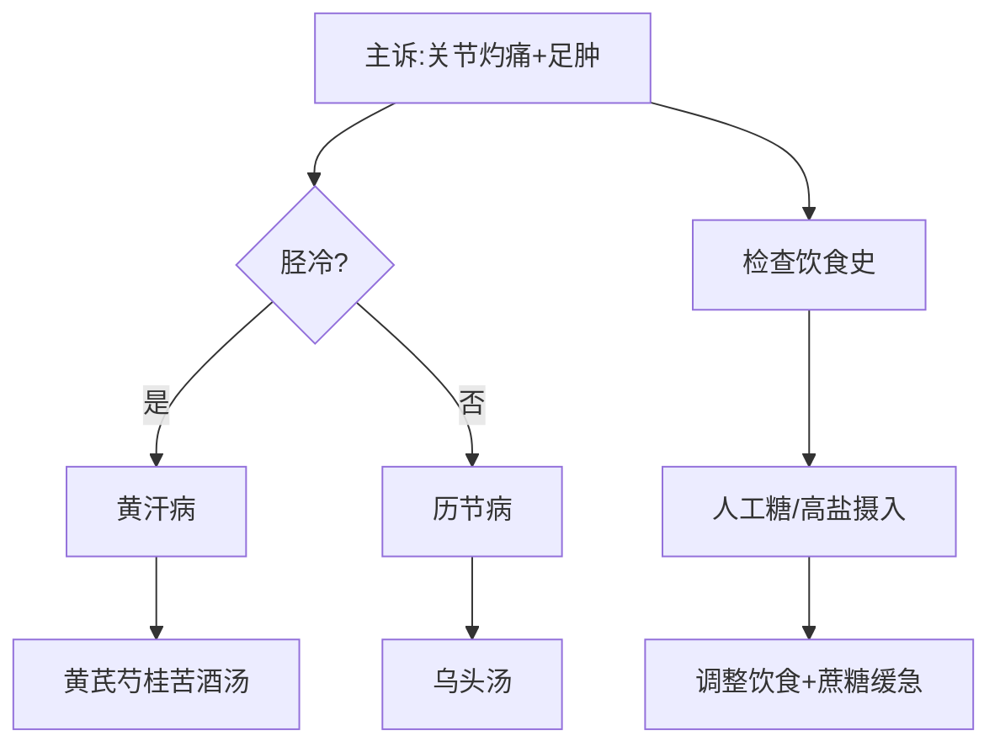

# 中风历节病脉并第五


这一篇就是在说，怎么预防中风，治疗中风，什么人会得到中风。了解了之后，应该就不会得中风了。

<!--more-->

## 📜夫风之为病，当半身不遂，或但臂不遂者，此为痹。脉微而数，中风使然。

#### 病因病机  
- **气血两虚**是中风的主因，非单纯高血压所致。  
- **痹症定义**：麻木不仁，分风痹、血痹（与虚劳相关）。  
- **风痹表现**：肌表麻木、皮肤粗糙，或半身/单臂不遂，皆属气血两虚。  

> **注**：气血充足时中风，属表证（如桂枝汤证）；气血两虚时中风，则现中风症状。  

#### 治疗与预防  

##### 1. 补气血防中风  
- **处方**：  
  - **补气**：黄芪、党参（非人参，除非胃气将绝）。  
  - **补血**：当归、川芎活血。  
  - **祛风**：独活、防风（轻剂祛风，避免发汗过强）。  
- **作用**：调和气血，预防中风。  

##### 2. 中西医治法对比  
- **西医局限**：降血压药无法预防中风，血压受情绪影响，非中风直接指标。  
- **中医优势**：从补气血入手，改善根本。  

#### 针灸治疗  
##### 1. 中风七大穴  
- **上肢**：肩髃、曲池、外关。  
- **下肢**：环跳、风市、阳陵泉。  
- **配穴**：  
  - 舌强不语：针百会。  
  - 背针：风府穴。  
  - 加强胃气：足三里（灸可防二次中风）。  

##### 2. 针刺原则  
- **三步法**：  
  1. 先补健侧（捻转/插提补法）。  
  2. 后泻患侧（泻法进针）。  
  3. 选穴以通经活络为主。  

#### 中风先兆  
1. **长期失眠**（血不归肝、心脾两虚，半年内易中风）。  
2. **手指麻木**（肺/大肠/心包经，2-3个月内易中风）。  
3. **足胫骨麻**（足阳明胃经，2周内易中风）。  

> **注**：此阶段西医多误诊为风湿，中医需及早干预。  

#### 急救处理  

##### 1. 昏迷急救针法  
- **穴位**：百会、人中、十宣放血、涌泉。  
- **脑溢血**：加然谷穴瘀青处放血。  

##### 2. 重症促醒法  
- **血余炭疗法**（《内经》传方）：  
  1. 剪左额角一寸发，烧灰成粉。  
  2. 吹粉入左耳，引鼻出血以排脑部瘀血。  
  3. 适用于植物人或深度昏迷。  

> **附**：同气相求原理（如鱼骨梗喉，用同鱼骨烧灰吞服）。  

#### 总结  
- **治则**：补气血为本，针药并用。  
- **关键**：识别先兆，及早干预；急救时重通瘀醒神。  
- **特色**：中医整体观优于西医对症处理。

## 📜寸口脉浮而紧，紧则为寒，浮则为虚，寒虚相搏，邪在皮肤。浮者血虚，络脉空虚，贼邪不泻，或左或右，邪气反缓，正气即急，正气引邪，喎僻不遂。邪在于络，肌肤不仁；邪在于经，即重不胜；邪入于府，即不识人；邪入于藏，舌即难言，口吐涎。

#### 寸口脉浮而紧的病理分析  
**寸口脉浮而紧**，主上焦（胸阳、肺、心）。  
- **浮脉**：表虚，气旺血衰（脉外盛而内虚）。  
- **紧脉**：主寒。  
- **寒虚相搏**：邪客皮肤，血虚络空，贼邪滞留。  

> **关键病机**：  
> - 浮者为血虚，络脉空虚。  
> - 邪气或左或右，正气引邪，导致「喎僻不遂」（口眼歪斜）。  

#### 邪气深浅与症状分层  
##### 1. 邪在于络  
- **症状**：肌肤麻木不仁（如局部皮肤麻痹）。  
- **治法**：轻证可用麻黄加术汤散寒祛湿。  

##### 2. 邪在于经  
- **症状**：四肢沉重无力（「重不胜」）。  
- **病位**：深入血脉、神经。  

##### 3. 邪入于腑  
- **症状**：神识昏蒙（「不识人」），邪入脑腑，影响记忆。  

##### 4. 邪入于脏  
- **症状**：舌强难言、口吐涎沫（心藏神，开窍于舌）。  
  - **治法**：肺寒津溢者，用甘草干姜汤温肺化饮。  

> **注**：  
> - 络/经证可缓治，腑/脏证需急治（超过1个月难愈）。  
> - 西医误治常见于延误时机，致长期瘫痪。  

#### 面部中风的诊治要点  
##### 1. 病机与辨证  
- **邪气侧注**：  
  - 右脸受邪→正气左引→口歪向左（初病邪在健侧）。  
  - **针灸原则**：初病刺健侧（如左歪针右），久病双刺（正气已虚）。  

##### 2. 病因与预防  
- **诱因**：大汗后单侧受冷（如直吹冷风）。  
- **方药**：  
  - **基础方**：桂枝汤加葛根（解肌散寒，升津舒络）。  
  - **加减**：  
    - 头痛：加川芎三钱。  
    - 胃寒：生姜改干姜，重用白芍（兼治静脉曲张）。  
    - 烦躁抑郁：加钩藤（勾陈）安神解郁。  

#### 中风防治的方药策略  
##### 1. 补气固表防中风  
- **代表方**：黄风汤（黄芪、防风煎汤熏蒸）。  
- **组方逻辑**：  
  - **补气**：黄芪、党参（固表防邪）。  
  - **养血**：当归、川芎（活血通络）。  

##### 2. 中西医对比  
- **西医局限**：降压药仅降「形」未调「神」，无法阻断情绪致病的血逆上冲。  
- **中医优势**：气血双补，从本源预防（需长期调理）。  

#### 附：急救与特殊疗法  

##### 1. 中风不语急救  
- **黄风汤熏法**：黄芪、防风煎汤熏蒸，药气透表醒神。  

##### 2. 久病顽固症  
- **针灸配合**：初病刺健侧，久病双侧取穴（如地仓透颊车）。  

> **临床注意**：  
> - 情绪管理为防中风核心（喜怒忧思皆可致气血逆乱）。  
> - 治未病胜于治已病（及早干预手麻、失眠等先兆）。  

#### 总结  
- **辨证分层**：络→经→腑→脏，症状逐级加重。  
- **治疗核心**：养血补气为主，初病重祛邪，久病重扶正。  
- **特色疗法**：桂枝汤加葛根治面瘫，黄风汤固表防复发。

## 📜寸口脉迟而缓，迟则为寒，缓则为虚;荣缓则为亡血，卫缓则为中风;邪气中经，则身痒而瘾疹;心气不足，邪气入中，则胸满而短气。

#### 寸口脉迟而缓的病理分析

##### 脉象解析
- **迟脉**：脉跳缓慢（一息一至、二至），主寒证
- **缓脉**：脉来无力，主虚证
- **复合脉象**：迟而缓提示患者既寒且虚

##### 营卫分属
- **营缓（尺脉缓）**：提示亡血失血
- **卫缓（寸脉缓）**：提示中风证候

#### 病机与临床表现

##### 邪气中经（表证）
- **病理机制**：
  - 气虚卫外不固，风邪袭表
  - 寒热失调（如运动后骤遇冷气）
- **主要症状**：
  - 皮肤瘙痒
  - 瘾疹（红色疹子）
- **代表方剂**：麻黄加术汤
  - 组成：麻黄汤基础上加白术
  - 功效：解表散寒，除湿止痒

##### 邪气入中（里证）
- **病理基础**：心气不足
- **传变特点**：
  - 邪气由表入里
  - 首犯肺脏
- **主要症状**：
  - 胸满闷胀
  - 呼吸短促
- **病机分析**：
  - 寒邪束肺，肺气不宣
  - 气虚失于推动，呼吸受限

#### 鉴别要点
1. **表里辨证**：
   - 表证：以皮肤症状为主（痒、疹）
   - 里证：以胸闷气短为特征
2. **虚实辨证**：
   - 单纯表证：正气尚可抗邪
   - 转为里证：提示心气先虚

#### 治疗原则
- **表证**：解表祛邪为主（麻黄加术汤）
- **里证**：需温补心气、宣肺平喘
- **预防要点**：
  - 避免骤冷骤热
  - 气虚者当固护卫阳

注：本文所述"中风"为中医术语，指外感风邪致病，与现代医学脑血管意外不同。

## 防己地黄汤 治病如狂状，妄行独语不休，无寒热，其脉浮。

> [!TIP]**防己地黄汤方**
>
> 防己 甘草各一分 | 桂枝 防风各三分
>
> 右四味，以酒一杯渍之，绞取汁，生地黄二斤，呚咀蒸之，如斗米饭久，以铜器盛药汁，更绞地黄汁和，分再服。

#### 基本方证
**主症**：
- 如狂状（未至真狂）
- 妄行独语不休
- 脉浮而无寒热

**病机特点**：
- 表邪未解（脉浮示邪在表）
- 气血两虚为本
- 风邪扰肝致动

#### 虚实鉴别
| 鉴别点       | 实证（大承气汤证） | 虚证（防己地黄汤证） |
|--------------|--------------------|----------------------|
| 小便         | 色黄               | 色白                 |
| 病机         | 阳明腑实，浊气上攻 | 气血两虚，风邪扰神   |
| 精神症状特点 | 真性狂躁           | 似狂非狂             |

#### 组方原理
**药物组成与比例**：
- 防己、甘草（1分）
- 桂枝、防风（3分）
- 生地黄（2斤，君药）

**特殊制法**：
1. 四味药酒浸取汁
2. 生地黄蒸绞取汁（非水煮）
3. 药汁与地黄汁混合服用

**配伍意义**：
- 防己、防风：轻清祛表风
- 桂枝、甘草：温补中阳
- 生地黄：大补阴血
- 酒渍法：缓和药性，避免过汗伤正

#### 治疗要点
1. **剂量原则**：
   - 生地黄须大剂（现代用量30-120g）
   - 祛风药轻用（防己、防风各3-6g）

2. **煎服禁忌**：
   - 不可煎煮（防药力过猛）
   - 蒸地黄忌水浸（保滋阴之效）

3. **病位判断**：
   - 脉浮：邪在表（易治）
   - 脉沉：邪入里（难治）

#### 临床拓展
1. **现代应用**：
   - 中风后精神症状
   - 帕金森病（肝风内动型）
   - 轻度精神分裂症（虚证）

2. **禁忌证候**：
   - 表实证（禁用麻黄类方）
   - 阳明腑实证（当用承气类）

3. **病机延伸**：
   - "诸风掉眩皆属于肝"
   - 虚性动风与肝血不足相关

#### 治疗警示
1. **误治风险**：
   - 过汗：伤津耗气（麻黄汤之戒）
   - 峻补：恋邪碍表（参芪之忌）

2. **调护要点**：
   - 饮食宜滋阴养血
   - 避风寒免复感

> **注**：本方体现"治风先治血，血行风自灭"理念，通过养血祛风治疗虚性风证，与真中风实证治法迥异。

## 📜侯氏黑散 治大风,四肢烦重心中恶寒不足者。

> [!TIP]**侯氏黑散**
>
> 菊花四十分 白术 防风各十分 桔梗八分 黄芩五分 细辛、干姜、人参、茯苓、当归、川芎、牡蛎、矾石、桂枝各三分
>
> 上十四味杵为散，酒服方寸匕，日一服，初服二十日，温酒调服，禁一切鱼肉，大蒜常宜冷食，六十日止，即药积腹中不下也。热食即下矣，冷食自能助药力。

#### **侯氏黑散解析**  

##### **方剂来源与特点**  
- **非仲景原方**：推测为后世医家（姓侯者）托名所创，属填补类方剂。  
- **适用证候**：  
  - **大风**（较重的风邪侵袭）  
  - **四肢烦重**（肢体沉重、活动不利）  
  - **心中恶寒不足**（阳虚内寒，气血不充）  

##### **组方分析**  
**药物组成（比例）**：  
- **君药**：菊花（40分）——清肝明目，疏散风热  
- **臣药**：  
  - 白术、防风（各10分）——健脾祛风  
  - 桔梗（8分）——宣肺化痰  
  - 黄芩（5分）——清热燥湿  
- **佐使药**：  
  - 细辛、干姜、桂枝（各3分）——温阳散寒  
  - 人参、茯苓、当归、川芎（各3分）——补气养血  
  - 牡蛎、矾石（各3分）——收敛固涩，化痰通络  

**配伍特点**：  
1. **补虚为主，兼顾祛风**：人参、当归、川芎补气血，防风、桂枝祛风通络。  
2. **寒温并用**：菊花、黄芩清热，细辛、干姜温阳，适用于寒热错杂证。  
3. **收敛固涩**：牡蛎、矾石防止气血耗散，助药力久留体内。  

#### **临床应用与服用方法**  
##### **1. 制剂与用法**  
- **剂型**：散剂（杵为细粉）  
- **服法**：  
  - **初服20天**：温酒调服（酒助药力，温通血脉）  
  - **后续40天**：冷食送服（使药力缓释，沉积于体内）  
- **禁忌**：禁食鱼肉、大蒜（防助热生痰）  

##### **2. 作用机制**  
- **填补气血空隙**：适用于中风后气血不续，肢体麻痹者。  
- **药力缓释**：冷服使药力缓慢渗透，长期调理。  

#### **与现代经方的对比**  
1. **疗效评价**：  
   - 侯氏黑散偏重**填补虚损**，但临床使用较少，效果不如后续介绍的**《外台秘要》方**（如续命汤类）。  
   - 经方（如小续命汤、黄芪桂枝五物汤）更直接针对**气血两虚+风邪**，见效更快。  

2. **适用人群**：  
   - 侯氏黑散适合**长期虚损、风邪滞留**者，需缓慢调理。  
   - 经方更适合**急性或亚急性中风**，以通络、补虚、祛风并重。  

#### **总结**  
- **侯氏黑散**为后世填补类方，适用于**气血虚损、风邪久留**的中风后遗症。  
- **冷服法**独特，强调药力沉积，但临床效果不如经方（如续命汤类）。  
- **现代应用较少**，更多作为参考方，实际治疗推荐**《外台秘要》续命汤系列**（后续详述）。  

> **注**：此方体现“**填补虚损，缓祛风邪**”思路，但并非仲景主流治法，临床应辨证选用更高效的经方。

## 📜风引汤 治除热瘫痫

> [!TIP]**风引汤**
>
> 大黄、干姜、龙骨各四两 | 桂枝三两 | 甘草、牡蛎各二两 | 寒水石、滑石、赤石脂、白石脂、紫石英、石膏各六两
>
> 上十二味杵，粗筛，以韦囊盛之，取三指撮，井花水三升煮三沸，温服一升。治大人风引，少小惊痫瘛痰日数发，医所不疗，除热方。巢氏云:脚气宜风引汤。

#### **风引汤证治解析**  

##### **基本方证**  
**主治**：**热瘫痫**（热性中风，占中风证10%）  
**核心病机**：  
- **里热壅盛**（虚久化热）  
- **表风未解**（外风引动内热）  
- **热极生风**（瘫痫、惊厥）  

**症状特点**（与寒证中风对比）：  
| **证型** | **肢体状态** | **二便** | **其他特征** |  
|----------|--------------|----------|--------------|  
| **热瘫痫**（风引汤证） | 四肢弛缓、瘫软无力（“热则纵”） | 二便失禁（尿道、肛门松弛） | 可能伴惊痫、抽搐 |  
| **寒性中风**（90%常见） | 肢体拘挛、强直（“寒则缩”） | 二便控制尚可 | 手足僵硬，难以伸展 |  

#### **组方原理与配伍**  
##### **药物组成与剂量**  
- **清热泻实**：  
  - **大黄（4两）**——通腑泻热  
  - **石膏、寒水石、滑石（各6两）**——清脏腑郁热  
- **温阳固涩**：  
  - **干姜（4两）、桂枝（3两）**——温里通阳，防寒凉伤正  
  - **龙骨、牡蛎（各4两/2两）**——潜阳熄风，固摄二便  
- **金石镇敛**：  
  - **赤石脂、白石脂、紫石英（各6两）**——涩肠固脱，镇惊安神  
- **调和药性**：  
  - **甘草（2两）**——缓和大黄、石膏峻烈之性  

##### **配伍特点**  
1. **攻补兼施**：  
   - 大黄、石膏**泻热**，干姜、桂枝**温阳**，防过寒伤正。  
2. **敛散并用**：  
   - 赤石脂、紫石英**收敛固脱**，桂枝、大黄**宣通散邪**。  
3. **重镇潜阳**：  
   - 金石类药（龙骨、牡蛎、石英）沉降内热，平肝熄风。  

#### **煎服法与禁忌**  
##### **特殊制法**  
1. **粗筛散剂**：药材捣碎粗筛，用韦囊（皮袋）盛装。  
2. **井花水煎煮**：  
   - 取三指撮药末 + 井花水三升，煮沸三次。  
   - 温服一升/次（分次服用）。  

##### **临床注意**  
- **适用人群**：热瘫痫、小儿惊痫（频繁发作）、脚气病（巢元方推荐）。  
- **禁忌**：寒性中风（90%常见证型）**绝对禁用**！  

#### **现代应用与思考**  
1. **应用场景**：  
   - 脑卒中后**弛缓性瘫痪**（肌张力低下+二便失禁）。  
   - 小儿高热惊厥（需辨证属热极生风者）。  
2. **争议点**：  
   - 方中**赤石脂+大黄**同用，看似矛盾（涩肠与攻下），实则针对**热迫津泄**（泻邪热而固正脱）。  
3. **与经方关系**：  
   - 虽非仲景原方，但符合“**热者寒之，虚者补之**”原则，属后世发展方剂。  

#### **总结**  
- **风引汤**为**热性中风**专方，针对“热瘫痫”之弛缓、失禁、惊厥。  
- **核心思路**：清热泻火 + 温阳固涩 + 重镇熄风，三者协同。  
- **临床提示**：  
  - 热瘫痫较少见（10%），需严格辨证。  
  - 金石药用量大，宜谨慎（现代可减量调整）。  

> **注**：此方体现“**急则治标**”（泻热熄风）与“**固护根本**”（温阳敛正）的结合，适用于特殊类型中风，非通用方。

## 📜头风摩散方

> [!TIP]**头风摩散方**
>
> 大附子一枚、盐等分 
>
> 上二味为散，沐了。以方寸匕摩疾上，令药力行。

#### **头风摩散方证解析**  

##### **基本方证**  
**主治**：**偏头痛（头风）伴热象**  
**适用症状**：  
- 头痛剧烈，痛如刀劈  
- **局部热证表现**（如目赤、面红）  
- 针灸（太阳透率谷）暂效后复发  

**禁忌**：  
- 纯寒性头痛（无热象者慎用）  
- 皮肤破损处禁用  

#### **组方与制法**  
##### **药物组成**  
1. **炮附子**（大附子一枚）——温阳通络，扩张血管  
2. **青盐**（等量）——清热散结，引药入经  

##### **制备要点**  
1. **分研分储**：  
   - 炮附子、青盐**单独打粉**，分装两罐（防提前反应失效）  
   - 临用前按1:1混合（类似"现炒现用"原则）  
2. **调和介质**：  
   - 推荐**麻油**调敷（助药力渗透，避免干粉脱落）  
   - 紧急时可用清水调糊  

##### **现代替代建议**  
- 青盐缺货时可用**粗海盐**（忌用精制碘盐/人工盐）  
- 炮附子需规范炮制（减毒存效）  

#### **使用方法与机理**  

##### **操作步骤**  
1. 清洁头部（"沐了"指洗发后）  
2. 取混合药粉**方寸匕**（约1-2克）  
3. 用麻油调匀，外敷痛处（避开发际、眼周）  
4. 轻按摩至药力渗透（"令药力行"）  

##### **作用机理**  
- **炮附子**：  
  - 辛热走窜，**扩张头面血管**，改善血瘀性头痛  
  - 现代研究提示含乌头类生物碱，可局部刺激增血流  
- **青盐**：  
  - 咸寒清热，平衡附子燥性  
  - 电解质渗透助药力深入  

#### **临床拓展应用**  
1. **联合治疗方案**：  
   - 先针**太阳透率谷**（急治标）  
   - 再外敷头风摩散（巩固疗效）  
2. **适应症扩展**：  
   - 血管神经性头痛  
   - 丛集性头痛（需辨证属寒热错杂）  

#### **注意事项**  
1. **毒性防控**：  
   - 避免黏膜接触（眼、口、鼻）  
   - 敷药时间≤2小时/次（防附子刺激）  
2. **疗效判断**：  
   - 有效者30分钟内痛减  
   - 无效需停用（可能辨证不符）  

#### **总结**  
- 头风摩散为**外治经典方**，体现"外治之理即内治之理"思想  
- 关键在**辨热象**（目赤为要点）与**规范制用**  
- 现代可改良为**止痛膏贴**形式（如附子盐巴凝胶贴）  

> **注**：此方与风引汤形成对比——  
> - **头风摩散**：外治**局部热瘀**头痛  
> - **风引汤**：内治**全身热瘫痫**

## 接下来我跟大家介绍三个方剂，大家可以补注在这里，或是做在笔记里面，这第一个处方是从千金要方里面摘录出来的，这三个就比较像经方了。

> [!TIP]**千金三黄汤**
>
> 麻黄 | 黄芪 | 黄芩 | 细辛 | 独活


> [!TIP]**小续命汤**
>
> 麻黄三钱 | 杏仁三钱 | 桂枝五钱 | 炙甘草三钱 | 当归三钱 | 川芎三钱 | 石膏五钱 | 干姜两钱、三钱 | 人参三钱


> [!TIP]**白术附子汤/术附汤**
>
> 白术五钱 | 炮附子三钱 | 生姜两片 | 炙甘草三钱 | 大枣十枚

> [!TIP]**补阳还五汤**
>
> 黄芪5 | 当归3 | 白芍3 | 川芎2 | 桃仁2 | 红花2 | 地龙2

#### **中风三效方解析**  
（千金三黄汤、小续命汤、术附汤）

##### **1. 千金三黄汤**  
**组成**：麻黄、黄芪、黄芩、细辛、独活  
**原方剂量**（唐制）：  
- 麻黄30铢（约3.75g）  
- 黄芪12铢（约1.5g）  
- 黄芩18铢（约2.25g）  
- 独活13.75g  
- 细辛12铢（约1.5g）  

**主治**：  
- **浅层中风**（神清能言）  
- 手足拘急 + 全身骨节酸痛  
- 烦热恶寒 + 食欲不振  

**配伍特点**：  
- **麻黄+黄芪**：解表固表（防过汗）  
- **麻黄+细辛**：深入少阴温里寒（类麻黄附子细辛汤）  
- **黄芩**：清上焦虚热除烦  
- **独活**：轻祛风邪（避羌活之燥）  

**禁忌**：  
- 不可加甘草（缓药性，延误急救）  

##### **2. 小续命汤**（核心方）  
**组成**：  
- 麻黄、杏仁、桂枝、炙甘草  
- 当归、川芎、石膏、干姜、人参  

**剂量参考**（现代临床）：  
- 麻黄3-5钱 | 杏仁等量  
- 桂枝5钱 | 石膏5-8钱  
- 当归/川芎3-5钱（血虚甚可加至1两）  
- 人参3钱 | 干姜2-3钱  

**主治**：  
- **深度中风**（占90%病例）  
- 口不能言 + 四肢拘急  
- 不知痛处 + 神志昏蒙  

**关键配伍**：  
- **麻桂同用**：强力开表（需配伍补气血药）  
- **当归+川芎**：补血活血（改善肢端循环）  
- **石膏+干姜**：寒热并调（清里热+温中焦）  

**使用要点**：  
1. 服药后需**坐姿取汗**（汗出即效）  
2. 杏仁与麻黄**等量**（防过汗伤肺）  
3. 脑充血（面赤热）者**重用石膏**  

> **注**：此方为《外台秘要》所载经方，具"还魂"之力，需把握黄金治疗期。

##### **3. 术附汤**  
**组成**：白术5钱、炮附子3钱、生姜2片、炙甘草3钱、大枣10枚  

**主治**：  
- **风虚头眩型中风**  
- 极度眩晕（睁眼即呕）  
- 平卧不动（湿浊中阻）  

**配伍精要**：  
- **白术>附子**：健脾利湿为主（如5:3）  
- **姜枣草**：固护胃气  
- **炮附子**：温阳化饮（非生附子急攻）  

**剂量调整**：  
- 肥胖者：白术1两 + 附子5-8钱  
- 瘦弱者：白术3钱 + 附子2钱  

#### **三方案例对比**  
| 方剂       | 适用证型       | 核心症状               | 关键药对          |  
|------------|----------------|------------------------|-------------------|  
| 千金三黄汤 | 表寒里热       | 拘急+烦热+恶寒        | 麻黄+黄芪+黄芩    |  
| 小续命汤   | 气血两虚+表闭  | 失语+神昏+四肢僵硬     | 麻桂+归芎+石膏    |  
| 术附汤     | 脾虚湿盛       | 眩晕+呕恶+卧不能起    | 白术+炮附子       |  

#### **临床注意事项**  
1. **鉴别诊断**：  
   - 补阳还五汤（脑溢血后遗症）需配合脉诊（涩脉）  
   - 血府逐瘀汤（瘀血证）舌必紫暗  

2. **动物药慎用**：  
   - 地龙（蚯蚓）虽活血强，但易耗血（见血虚即减量）  

3. **急救优先级**：  
   ```mermaid  
   graph LR  
   A[中风发作] --> B{神志清醒?}  
   B -->|是| C[千金三黄汤]  
   B -->|否| D[小续命汤]  
   D --> E{眩晕呕吐?}  
   E -->|是| F[术附汤]  
   ```  

> **附**：现代改良建议  
> - 小续命汤可制成**浓缩颗粒**（麻黄需先煎）  
> - 术附汤加茯苓15g增强利水（针对美尼尔氏症）

## 📜历节病。寸口脉沉而弱，沉即主骨，弱即主筋，沉即为肾，弱即为肝，汗出入水中，如水伤心，历节黄汗出，故曰历节。

#### **历节病证治解析**  

##### **基本定义与病机**  
**历节病**：以**关节剧痛（不麻）**为主症，属肝肾两虚、寒湿痹阻筋骨之证。  
**类比西医**：痛风、风湿性关节炎（但需结合中医辨证）。  

**核心病机**：  
1. **肝肾两虚**（寸口脉沉弱）：  
   - **沉主肾虚**（肾主骨，代谢失常→尿酸沉积）  
   - **弱主肝虚**（肝主筋，排毒不力→结晶堆积）  
2. **外邪诱发**：  
   - **汗出入水**（如洗衣、烹饪时冷热骤变）→ 寒湿内侵  
   - **寒热交错**→ 痹阻关节（“如水伤心”）  

#### **三类痹证鉴别**  
| **类型** | **主要症状**       | **病机**           | **代表方剂**       |  
|----------|--------------------|--------------------|--------------------|  
| **风痹** | **又痛又麻**       | 风寒湿杂至，偏风盛 | 甘草附子汤         |  
| **血痹** | **只麻不痛**       | 血虚络空（如长期手麻） | 黄芪桂枝五物汤     |  
| **历节** | **只痛不麻**（剧痛如灼） | 肝肾虚+寒湿结晶     | 乌头汤/大乌头煎   |  

> **注**：历节痛特点——**痛如油煎**（脚背、关节红肿热痛），发作期持续1-2周。

#### **历节病因与高危人群**  
##### **1. 内因（本虚）**  
- **肾虚**：尿酸代谢障碍（沉积为结晶）  
- **肝虚**：解毒功能下降（废物堆积筋骨）  

##### **2. 外因（诱发）**  
- **职业暴露**：  
  - 水中作业者（如渔民、洗衣工）  
  - 厨师（冷热交替操作）  
- **生活史**：长期汗出受凉（如运动后冲冷水）  

> **预防**：练易筋经（增强筋骨协调），避免寒热骤变。  

#### **治疗方药与思路**  
##### **1. 急性期（剧痛红肿）**  
**主方**：**乌头汤**（《金匮要略》）  
- **组成**：川乌、麻黄、芍药、黄芪、甘草  
- **关键**：  
  - 川乌**大热破阴凝**（需蜜煎减毒）  
  - 麻黄+黄芪**宣通表里**  
  - 芍药甘草**缓急止痛**  

**加减**：  
- 热象明显（局部灼热）：加黄柏、知母  
- 肿胀甚：加防己、茯苓  

##### **2. 慢性期（反复发作）**  
**主方**：**肾气丸+独活寄生汤**  
- **思路**：  
  - 补肾（熟地、山茱萸）→ 调代谢  
  - 养肝（当归、白芍）→ 强解毒  
  - 祛风湿（独活、桑寄生）→ 通痹止痛  

#### **临床注意事项**  
1. **鉴别诊断**：  
   - **黄汗病**：伴全身黄汗（用黄芪苦酒汤）  
   - **类风湿关节炎**：晨僵+小关节对称痛（需加虫类药搜剔）  

2. **乌头使用要点**：  
   - 必须先煎1小时以上减毒  
   - 配伍蜂蜜或生姜解毒  
   - **禁忌**：心律不齐者慎用  

3. **预后判断**：  
   - 脉沉弱转柔和→ 肝肾渐复  
   - 痛减肿消→ 寒湿已化  

#### **总结**  
- 历节病**标在关节，本在肝肾**，需攻补兼施。  
- **急性攻邪**（乌头类方），**慢性调本**（补肾养肝）。  
- 避免**“汗出入水”**是预防关键（尤其高危职业）。  

> **附：食疗建议**  
> - **急性期**：赤小豆薏仁粥（利湿消肿）  
> - **慢性期**：杜仲牛膝炖猪骨（强筋壮骨）

## 📜趺阳脉浮而滑，滑则谷气实，浮则汗自出。太阴脉浮而弱，弱则血不足，浮则为风，风血相抟，即疼痛如掣。盛人脉涩小，短气，自汗出，历节疼，不可屈伸，此皆饮酒汗出当风所致。

#### **一、脉象与病机分析**
1. **趺阳脉（胃脉）浮滑**
   - **滑象**：谷气实（胃有宿食停滞）
   - **浮象**：卫阳外越（易自汗）
   - **病理链**：  
     *饮食过饱→胃热汗出→汗出当风/入水→寒闭汗孔→湿郁关节→历节痛*

2. **太阴脉（脾脉）浮弱**
   - **弱象**：脾虚血亏（肌肉失养）
   - **浮象**：风邪外袭
   - **特征人群**：  
     *女性/少动者→血虚风入→风血相搏→关节掣痛*

3. **盛人脉涩小**
   - **人群特征**：养尊处优者（体胖内虚）
   - **病机关键**：  
     *酗酒→内生湿热*  
     *纵欲→肝肾亏虚*  
     *少动→脾阳不运*  
   - **典型表现**：  
     *短气自汗+关节剧痛不可屈伸*

#### **二、三类病因归纳**
| **类型**         | **核心病机**                | **诱发因素**               | **易感人群**         |
|------------------|----------------------------|---------------------------|---------------------|
| **寒湿闭阻型**   | 汗出入水，寒凝关节          | 冷水刺激（洗衣/游泳）      | 体力劳动者          |
| **血虚风袭型**   | 脾虚血弱，风邪乘虚          | 经期/产后受风             | 中年女性            |
| **酒湿内伤型**   | 酒毒伤肝，湿聚化热          | 酗酒+房劳+缺乏运动        | 肥胖男性            |

#### **三、特色诊断要点**
1. **疼痛特征**  
   - 呈**撕裂样掣痛**（风邪）  
   - 多见**下肢大关节**（湿性趋下）  
   - 夜间/饮酒后加重（阴寒时段/湿热诱发）

2. **伴随症状**  
   - 自汗而痛不减（区别于气虚自汗）  
   - 局部肿胀但皮色不变（寒湿为主）

#### **四、治疗与调护**
**1. 分型论治**
- **寒湿型**：乌头汤+五苓散（温经散寒+利湿）  
- **血虚型**：黄芪桂枝五物汤+四物汤（益气养血+通络）  
- **湿热型**：加味苍术泽泻汤（解酒毒+清湿热）  
  *（苍术15g 泽泻12g 黄柏9g 牛膝12g）*

**2. 预防关键**
- **饮食禁忌**：  
  ▶ 忌饱食汗出当风  
  ▶ 限酒（每日黄酒≤100ml）  
- **生活调摄**：  
  ▶ 劳作后擦干汗液再更衣  
  ▶ 坚持八段锦"摇头摆尾去心火"式  

**3. 现代延伸**
- **西药损伤**：长期痛风西药需配伍  
  *土茯苓30g 萆薢15g* 减毒  
- **代谢综合征**：加山楂20g 绞股蓝12g 调脂  

> **注**：历节病机本质为**本虚标实**，急性期重在祛邪，缓解期需补肾柔肝（龟鹿二仙胶+芍药甘草汤）。

## 📜诸肢节疼痛，身体尪羸，脚肿如脱，头眩短气，温温欲吐，桂枝芍药知母汤主之。

> [!TIP]**桂枝芍药知母汤方**
>
> 桂枝四两 | 芍药三两 | 甘草、麻黄、附子各二两 | 炮白术、知母、防风各四两 | 生姜五两
>
> 上九味，以水七升，煮取二升，温服七合，日三服。

#### **一、核心方证**
**主治**：  
- **阴虚型历节病**（关节剧痛+形体消瘦）  
- **特征症状**：  
  ✓ 肢节疼痛（膝痛尤效）  
  ✓ 身体羸瘦 + 脚肿如脱  
  ✓ 头眩短气 + 温温欲吐（湿阻三焦）  

**现代对应**：  
- 糖尿病末期消瘦伴关节肿痛  
- 风湿性关节炎（膝部为主）  
- 痛风急性发作（寒湿型）  

#### **二、组方解析**
**原方剂量（汉制）**：  
- 桂枝4两 | 芍药3两 | 甘草/麻黄/附子各2两  
- 白术/知母/防风各4两 | 生姜5两  

**现代换算（示例）**：  
- 桂枝12g | 芍药9g | 炙甘草6g  
- 麻黄6g | 炮附子6g | 白术12g  
- 知母12g | 防风12g | 生姜15g  

**配伍精义**：  
| **药组**       | **作用**                  | **现代机理**              |  
|----------------|--------------------------|--------------------------|  
| **桂枝+芍药**  | 调和营卫，通阳止痛        | 改善微循环，抗炎镇痛      |  
| **麻黄+附子**  | 温经散寒，透邪出表        | 兴奋交感神经，促进代谢    |  
| **白术+防风**  | 健脾祛湿，除风胜湿        | 调节免疫，抑制滑膜增生    |  
| **生姜（重用）**| 散胃阳于三焦              | 促进胃肠动力，利水消肿    |  
| **知母**       | 滋阴清热，防燥热伤阴      | 抑制前列腺素过度分泌      |  

#### **三、临床应用要点**
**1. 特效部位**：  
- **膝关节肿痛**（有效率＞90%）  
- **禁忌部位**：手指关节变形（类风湿无效）  

**2. 经典组合**：  
- **膝五针**（犊鼻、内膝眼、阳陵泉、阴陵泉、梁丘）  
  → 针后服本方，疗效倍增  

**3. 现代加减**：  
- **便秘者**：  
  ✓ 初诊暂不攻下，待风湿去后评估  
  ✓ 长期服止痛药致便秘：加酒大黄6g  
- **软骨磨损**：加牡蛎30g、补骨脂12g  
- **癌症骨痛**：生附子+炮附子各6g（需久煎）  

**4. 鉴别应用**：  
- **vs 甘草附子汤**：  
  ✓ 本方治**消瘦+上热下寒**  
  ✓ 彼方治**体实+纯寒湿**  
- **vs 乌头汤**：  
  ✓ 本方治**慢性虚损型**  
  ✓ 彼方治**急性剧痛型**  

#### **四、病机深析**
**三重病理**：  
1. **脾虚失运**（尪羸短气）→ 湿浊内生  
2. **肝血不足**（头眩）→ 筋脉失养  
3. **肾阳亏虚**（脚肿如脱）→ 寒湿下注  

**治疗策略**：  
- **三焦同治**：  
  ✓ 生姜散上焦郁热  
  ✓ 桂枝芍药调中焦气血  
  ✓ 附子麻黄温下焦寒湿  

#### **五、典型案例**
**案例1**：矿泉水搬运工  
- **症状**：膝/髋关节肿痛+解溪红肿  
- **治疗**：  
  ✓ 膝五针+本方原方  
  ✓ **疗效**：2剂痛止，恢复负重  

**案例2**：糖尿病消瘦型  
- **症状**：血糖300+，体重锐减，膝肿  
- **治疗**：  
  ✓ 本方加苍术15g  
  ✓ **疗效**：3剂血糖降至150，膝肿消  

#### **六、使用注意**
1. **附子使用**：  
   - 初诊用炮附子，无效改生附子  
   - 需配伍生姜/甘草减毒  
2. **饮食禁忌**：  
   - 忌冷饮（易致药力下坠）  
   - 服后避风2小时  
3. **疗程判断**：  
   - 有效标准：服1剂痛减，3剂肿消  
   - 无效需重新辨证  

> **创新应用**：本方改良为外敷剂（桂枝10g+附子5g打粉，黄酒调敷膝部），适用于口服困难者。  

## 📜味酸则伤筋，筋伤则缓，名曰泄。咸则伤骨，骨伤则痿,名曰枯;枯泄相抟，名曰断泄。营气不通，卫不独行，营卫俱微，三焦无所御，四属断绝，身体羸瘦，独足肿大，黄汗出，胫冷，假令发热，使为历节也。

#### **一、饮食偏嗜致病规律**
| **五味偏盛** | **损伤靶点** | **病理表现**         | **现代对应**               |
|--------------|--------------|----------------------|---------------------------|
| **酸味过盛** | 伤筋（肝）   | 筋缓、夜半抽筋       | 人工甜味剂代谢性酸中毒    |
| **咸味过盛** | 伤骨（肾）   | 骨痿、肌肉萎缩       | 骨质疏松伴肌少症          |

**临床警示**：  
- **假甜真酸**：烘焙食品中的人工糖（如阿斯巴甜）→ 代谢为酸性物质→ 夜间腓肠肌痉挛  
- **解酸方案**：发作时服**蔗糖水**（遵《内经》"肝苦急，急食甘以缓之"）

#### **二、核心病机演变**
**1. 枯泄相搏（筋骨俱伤）**  
- **筋伤（泄）**：肌腱松弛无力  
- **骨伤（枯）**：骨质流失+肌肉萎缩（鹤膝风样改变）  
- **终极状态**：**断泄**（肢体废用）

**2. 营卫三焦失调**  
- **营卫俱微**→ 气血不能濡养四肢  
- **三焦失御**→ 水液代谢紊乱  
- **四属断绝**→ 肢体远端萎缩（近端独肿）

#### **三、历节与黄汗鉴别**
| **特征**       | **历节**                  | **黄汗**                |
|----------------|---------------------------|-------------------------|
| **局部表现**   | 关节灼痛如油炸（但热不寒） | 全身黄汗（无关节痛）    |
| **全身状态**   | 独足肿大+身体羸瘦         | 浮肿均匀                |
| **关键指征**   | 胫冷+假性发热             | 汗黄染衣                |

#### **四、治疗方略**
**1. 饮食调控**  
- **忌口清单**：  
  ✓ 酸：柠檬汁/人工甜味剂（睡前禁食）  
  ✓ 咸：加工食品/腌制品（骨折期尤忌）  

**2. 特效方剂**  
- **鹤膝风**：**乌头汤**（生川乌需蜜煎）  
  - 组成：川乌、麻黄、芍药、黄芪、甘草  
  - 现代改良：川乌6g先煎1小时，加蜂蜜30ml  

**3. 经方拓展**  
- **糖代谢异常者**：桂枝芍药知母汤+苍术15g  
- **肌萎缩明显**：虎潜丸（龟板+锁阳+当归）  

#### **五、病案思维导图**


#### **六、临床要点**
1. **鹤膝风辨识**：  
   - 膝关节肿大如球+大腿小腿肌肉萎缩  
   - 需与**类风湿关节炎**鉴别（X线见骨侵蚀）  

2. **乌头使用安全**：  
   - 配伍生姜20g解毒  
   - 服药后监测唇舌麻木感  

3. **预后判断**：  
   - 有效标准：3日内痛减，10日肌肉渐丰  
   - 恶化指征：出现手套样感觉障碍（需停乌头）  

> **创新建议**：对人工糖依赖者，可用**甜菊叶代茶饮**逐步替代，既满足甜味需求又不伤筋。

## 📜病历节，不可屈伸，疼痛，乌头汤主之。

乌头汤方 治脚气疼痛，不可屈伸。

> [!TIP]**乌头汤方**
>
> 麻黄、芍药、黄耆、甘草炙，各三两 | 乌头五枚呚咀以蜜二升，煎去一升即出乌头
>
> 上五味，以水三升，煮取一升，去滓内蜜煎中更煎之，服七合。不知尽服之。

#### 乌头汤方证  
**原文**：  
> 病历节，不可屈伸，疼痛，乌头汤主之。  

**主治**：  
- 脚气疼痛不可屈伸（风湿/类风湿关节炎重症）。  
- 寒湿历节（关节肿胀疼痛，无麻木症状）。  

#### 方剂组成与制法  
**原方**：  
- 麻黄、芍药、黄耆、炙甘草（各三两）  
- 乌头五枚（蜜煎法）  

**制法**：  
1. **乌头蜜制备**：  
   - 乌头捣碎，以蜜二升煎至一升，滤出乌头渣，得乌头蜜。  
   - 现代简化法：乌头一两 + 水两碗 → 煮成一碗 → 滤渣后加蜂蜜一碗 → 复煎成一碗。  
2. **汤剂煎服**：  
   - 麻黄、芍药、黄耆、甘草（各三钱，重症可加至五钱） + 水六碗 → 煮成两碗 → 取一碗混合乌头蜜一汤匙 → 再煎至八分。  

#### 服用方法与禁忌  
**服法**：  
- 每次一汤匙乌头蜜混合药汤，日服两次（早晚各一）。  
- **关键**：逐量增加，若出现舌麻、头晕即停服，不可过量。  

**禁忌**：  
1. **心脏病患者禁用麻黄**：因麻黄加速心率，美国临床多以桂枝汤替代原方。  
2. **酒客或湿盛者慎用**：甘味（蜂蜜）可能加重不适。  

#### 药理解析  
1. **乌头**：  
   - 热性极强，专祛深部寒湿，蜜制后减毒缓效。  
   - 与附子同科，天雄（五年生）为最强壮阳药。  
2. **配伍意义**：  
   - 麻黄：透达四肢，驱散寒湿。  
   - 白芍：促进四肢血液回流。  
   - 黄耆：固表防外邪。  
   - 炙甘草：保护肠胃津液，防麻黄耗液。  

#### 临床注意事项  
1. **美国化裁方案**：  
   - 因当地患者多心功能不佳，改用桂枝汤配合乌头蜜，避免麻黄风险。  
2. **毒性控制**：  
   - 乌头过量可致命，必须严格遵循剂量（一汤匙/次）。  
3. **扩展应用**：  
   - 类似症状（如红斑性狼疮关节痛）可参考桂枝芍药知母汤加减，不必拘泥病名。  

#### 总结  
乌头汤为历节重症经典方，通过蜜制乌头与麻黄配伍强力驱寒湿，但需谨慎心脏毒性及个体差异。临床需灵活化裁，确保安全性与疗效。

## 📜矾石汤 治脚气冲心

> [!TIP]**矾石汤**
>
> 矾石二两
>
> 上一味，以浆水一斗五升，煎三五沸，浸脚良。

#### **矾石汤方证**  
**原文**：  
> 矾石汤，治脚气冲心。  

**主治**：  
- **脚气冲心**（脚部红肿、溃烂、丹毒等病邪上行）。  
- **香港脚（足癣）、糖尿病足溃烂**（湿毒上冲）。  
- **外用泡脚**，不可内服（明矾内服会导致津液、血液沉淀）。  

#### **方剂组成与用法**  
**组成**：  
- **矾石（明矾）二两**（天然矾石为佳，烧后呈白色）。  

**煎服法**：  
1. **浆水（或普通水）一斗五升**（约3升）。  
2. **煮沸3~5次**（矾石完全溶解即可，无需久煎）。  
3. **待温后浸泡双脚**。  

**现代简化法**：  
- 明矾60g + 水3000ml，煮沸溶解后泡脚。  

#### **作用机理**  
1. **矾石特性**：  
   - **燥湿收敛**：强力除湿，使局部干燥（类似用于鼻窦炎的麝香矾石散）。  
   - **解毒消肿**：抑制脚部湿毒上行（如丹毒、破伤风毒素扩散）。  
2. **外治优势**：  
   - 直接作用于病灶，避免内服毒性（明矾内服易致津液凝滞）。  

#### **临床运用与配合疗法**  
1. **适用症状**：  
   - 脚部红肿溃烂、湿毒上冲（如糖尿病足、严重香港脚）。  
   - **禁忌**：轻微瘙痒无需使用。  
2. **增效方案**：  
   - **内服**：配合 **桂枝芍药知母汤**（治风湿历节）。  
   - **针灸**：取 **三皇穴（阴陵泉、地机、三阴交） + 肾经水泉穴**，再泡矾石汤。  

#### **脚气与历节的分类**  
历节（关节病变）分三种：  
1. **风痹**（游走性疼痛，风邪为主）。  
2. **血痹**（麻木不仁，血行不畅）。  
3. **历节**（寒湿固定剧痛，如乌头汤证）。  
**矾石汤专治脚气湿毒上冲，属外治急症方案**。  

#### **总结**  
- **矾石汤为外治专方**，适用于脚部湿毒上冲（红肿、溃烂、丹毒等）。  
- **关键点**：  
  - 仅限外用，不可内服！  
  - 重症可配合内服方（如桂枝芍药知母汤）及针灸增强疗效。  
  - 天然矾石优于人工矾石（色泽与纯度差异）。

---

> 作者: [AcuHerb](https://acuherb.xyz)  
> URL: https://acuherb.xyz/posts/jingui-04/  

