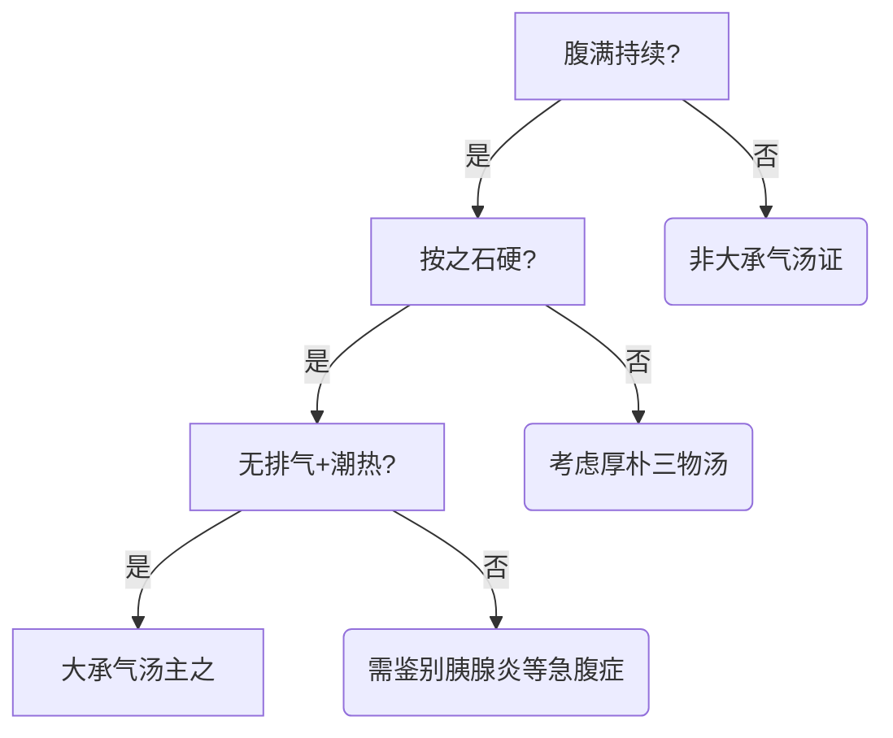

# 腹满寒疝宿食病脉证并治第十


这一篇分三样，腹满、寒疝、宿食，三个重点。

腹满，包括实、虚。包含一般的气胀，比如每次吃完饭，胃口正常，能吃能喝能拉能睡，可是每天肚子很胀，常常排气，上面嗝气，下面放屁，没有脾脏肿大，没有胰脏癌，肝癌等，就是一个肚子大。这种人去旅游，一个人一个房间最好，实在没办法，就用厚朴生姜半夏人参甘草汤，专门去掉气胀，气胀本身不是很严重的病。

<!--more-->

## 📜趺阳脉微弦，法当腹满，不满者必便难，两胠疼痛，此虚寒从下上也，当以温药服之。

#### 1. 脉象解析  
- **趺阳脉**（胃经冲阳脉）正常应为**缓而洪**，代表胃气正常。  
- 若呈现**微弦**，提示**内有寒**，主因寒邪影响胃肠功能。  

#### 2. 症状表现  
- **腹满**：因寒导致胃胀、肠蠕动减弱，但**无腹痛**（单纯寒证）。  
  > 弦脉主寒，寒水内停。  
- **若无腹满**：必有**便难**（寒凝气滞，肠内容物停滞）。  
- **持续胀满**：属**实满**（有实质阻滞），需结合其他症状鉴别。  

#### 3. 虚寒证特征  
- **两胠疼痛**（腰部两侧输尿管至膀胱区域）：提示**虚寒从下焦上逆**。  
  - 与热实证鉴别：  
    - **热实**：持续腹痛、拒按、舌苔黄。  
    - **寒实**：大黄附子细辛汤证（持续胀满）。  
  - **虚寒**：喜按、无大便（肠中空虚）。  

#### 4. 病因病机  
- 下焦虚寒未愈，寒邪上逆至胃，形成虚寒证。  

#### 5. 治疗原则  
- **当以温药服之**：  
  - **代表方剂**：  
    - 大黄附子细辛汤（寒实）。  
    - 甘草干姜汤、附子汤、理中汤（虚寒）。  
    > 温药举例：人参、白术、茯苓、甘草、干姜等。  

#### 6. 核心总结  
- 通过趺阳脉微弦判断虚寒证，需结合腹满、便难、两胠痛等表现，选用温药温补下焦、散寒通滞。

## 📜病者腹满，按之不痛为虚，痛者为实，可下之。舌黄未下者，下之黄自去。

#### 1. **虚实辨证**  
- **腹满按诊**：  
  - **虚证**：按之不痛，喜按（患者希望继续按压）。  
  - **实证**：按之痛，拒按（按压时疼痛加重）。  
  > **关键穴位**：天枢、中脘、下脘、关元。  

#### 2. **舌诊辅助判断**  
- **实证舌象**：舌苔黄（提示宿便或热结）。  
  - **治疗原则**：可攻下（如大承气汤类方）。  
  - **疗效观察**：攻下后舌苔由黄转淡白，即停攻，避免过伤正气。  
  > **特殊情况**：  
  > - 患者刷舌苔或食用染色食物（如薄荷）可能干扰舌诊。  
  > - 远程问诊时，可参考**小便颜色**（深黄→热盛；淡黄→热退）。  

#### 3. **治疗注意事项**  
- **实证攻下**：  
  - 分次用药（如大承气汤），舌苔退即停，避免过度攻伐。  
  - 若继续攻下，可能损伤正气。  
- **虚证治疗**：宜用温补（如理中汤类）。  

#### 4. **腹水虚实鉴别**（扩展应用）  
- **实证腹水**：口渴、肚脐凸出（如肝硬化腹水），治以**分消汤**（甘淡渗利）。  
- **虚证腹水**：口不渴，治以**补气建中汤**。  
  > **常用药**：白术、苍术、茯苓、泽泻、大腹皮、灯芯草等。  

#### 5. **核心总结**  
- **诊断关键**：腹诊（喜按/拒按）+ 舌诊（黄苔）。  
- **治疗原则**：实证攻下，虚证温补，中病即止。  
- **延伸应用**：腹水等病症亦需分虚实论治（口渴为实，不渴为虚）。

## 📜腹满时减，复如故，此为寒，当与温药。

#### **1. 辨证要点**  
- **症状特征**：腹满 **时轻时重**（时减复如故），提示 **虚寒证**。  
  - 与 **实证腹满** 鉴别：实证为 **持续胀满不减**（如宿便、瘀血等有形实邪阻滞）。  
  > **临床延伸**：  
  > - 其他病症（如心脏病）的虚实判断：  
  >   - **实证**：疼痛持续（如动脉堵塞）。  
  >   - **虚证**：疼痛时作时止。  

#### **2. 治疗原则**  
- **虚寒证**：当用 **温药**（如理中汤、附子干姜类方）。  
- **误治风险**：  
  - 若误将 **虚寒** 辨为 **实证** 而攻下，会加重里虚寒（因攻下药多寒凉）。  
  - 若误将 **实证**（如燥屎）辨为 **虚寒** 而用温药，会导致大便更干硬难下（甚至芒硝也难以攻破）。  

#### **3. 诊断关键**  
- **四诊合参**：  
  1. **问诊**：腹满是否时减（虚寒）或持续（实证）。  
  2. **腹诊**：喜按（虚）或拒按（实）。  
  3. **舌诊**：舌苔白滑（寒）或黄厚（热实）。  
  > **注意**：勿仅凭脉诊，需结合多维度判断。  

#### **4. 核心总结**  
- **虚寒腹满**：时轻时重 → 温补。  
- **实热腹满**：持续拒按 → 攻下。  
- **慎防误治**：辨证不准易导致病情恶化（虚者更虚，实者更结）。

## 📜病者痿黄，躁而不渴，胸中寒实，而利不止者，死。

#### **1. 症状解析**  
- **痿黄（阴黄）**：面色黯黄无光，提示 **重证**（如肝、脾、胰病变）。  
  - 对比 **阳黄（鲜黄）**：病较轻（如胆汁淤积、黄汗）。  
- **躁而不渴**：  
  - **躁**：血虚神浮（贫血、心神失守）→ 手足躁扰、烦躁不安。  
  - **不渴**：胸中寒实（寒邪壅滞上焦）。  
  > **关键鉴别**：  
  > - **躁而渴**：里热证（可治）。  
  > - **躁而不渴**：寒实证（危重）。  

#### **2. 病机与预后**  
- **胸中寒实**：上焦阳气被寒邪遏阻（诸阳之会失司）。  
- **下利不止**：中下焦虚寒，阴液下脱 → **阴阳俱竭**。  
  > **死症机理**：  
  > - 上焦寒实（阳绝） + 下利不止（阴脱） → 生机断绝。  

#### **3. 治疗与急救**  
- **胸中寒实（未至下利）**：  
  - **三物小白散**（贝母、桔梗、巴豆）→ 攻逐寒积。  
  > **适用场景**：寒食积滞胸脘（如暴饮冷食后昏迷）。  
- **下利不止的危证**：  
  - **回阳固脱**：大剂 **白术、附子**（单刀直入，不加姜枣）。  
  - **涩肠止利**：赤石脂禹余粮汤（固摄下焦）。  
  > **虽云“必死”，仍当全力救治**。  

#### **4. 临床注意事项**  
- **早期干预**：  
  - 若见 **暴食冷饮后胸脘寒实**，可先用 **白虎汤** 清里热，防传变。  
  - 已现寒实闭阻，速用 **三物小白散** 攻逐（巴豆力峻，不可延误）。  
- **误治风险**：  
  - 寒实证误用温补（如姜、枣）→ 加重壅滞。  
  - 下利不止误用攻下 → 加速阴脱。  

#### **5. 核心总结**  
- **辨证关键**：痿黄 + 躁而不渴 + 下利 → **寒实阳衰危候**。  
- **治则**：  
  - 寒实未脱：急攻寒积（三物小白散）。  
  - 已现脱证：回阳固脱（术附 + 涩肠）。  
- **预后**：极差，但需全力救治，不可弃疗。

## 📜寸口脉弦者，即胁下拘急而痛，其人啬啬恶寒也。

#### **1. 脉证解析**
- **寸口脉弦**：  
  - 弦脉主**寒水停滞**，寸口候**上焦（胸胁部）**，提示**水饮停聚胸胁**。  
- **胁下拘急而痛**：  
  - 寒水内停，气机不畅 → **胸胁部拘紧、疼痛**（类似少阳证“胸胁苦满”）。  
- **啬啬恶寒**：  
  - **表阳虚**，卫外不固 → 怕冷明显（非单纯表证，属**表里同病**）。  

#### **2. 病因病机**
- **素体虚弱者外感**：  
  - 常人外感（太阳病）→ 桂枝汤证（恶风、汗出）。  
  - **体虚者外感**→ **直接表现为少阳证**（寒水内停胸胁，表里俱病）。  

#### **3. 辨证要点**
- **与太阳病鉴别**：  
  | **症状**       | **太阳病（桂枝汤证）** | **本证（少阳兼表虚）** |  
  |--------------|------------------|------------------|  
  | **恶寒**     | 恶风（轻）       | 啬啬恶寒（明显） |  
  | **主症**     | 头痛、汗出       | 胁下拘急而痛     |  
  | **脉象**     | 浮缓             | 寸口弦           |  

#### **4. 治疗方向**
- **核心病机**：**少阳枢机不利 + 表虚寒**  
  - **小柴胡汤**：和解少阳，疏利胸胁气机（若纯少阳证）。  
  - **柴胡桂枝汤**：**少阳+太阳表虚**（和解兼调和营卫）。  

#### **5. 临床提示**
- **体虚外感特点**：  
  - 可能**跳过太阳病阶段**，直接出现少阳或太阴证。  
  - 需结合**脉象（弦）、胸胁症状、恶寒程度**综合判断。  
- **误治风险**：  
  - 若误用单纯发汗（如麻黄汤）→ 伤津液，加重里虚。  

#### **6. 总结**
- **证型**：素体虚寒，外邪直入少阳，表里同病。  
- **治则**：和解少阳为主，兼固表（柴胡剂+桂枝）。  
- **关键句**：  
  > “**寸口弦+胁下拘急+恶寒**” → **非纯表证，需从少阳论治**。

## 📜夫中寒家，喜欠，其人清涕出，发热、色和者，善嚏。中寒，其人下利，以里虚也，欲嚏不能，此人肚中寒。

#### **1. 肺寒证（上焦寒）**
- **症状表现**：
  - **喜欠（常打哈欠）**：肺寒者借深呼吸（哈欠）吸入阳气以温肺。
  - **清涕出**：肺开窍于鼻，寒饮不化则流清涕。
  - **发热而色和**：体表微热但面色如常 → **正气尚足，驱寒外出**。
  - **善嚏（易打喷嚏）**：肺气宣发，排寒反应（生理性自愈表现）。

> **临床提示**：
> - 此类情况常见于**外感初起**或**素体肺寒**者。
> - **治疗方向**：温肺散寒（如甘草干姜汤、小青龙汤）。

#### **2. 中焦虚寒证（里寒下利）**
- **症状表现**：
  - **下利清谷**：大便稀溏夹未消化食物（无臭秽），属**里阳虚衰**。
  - **欲嚏不能**：因中焦虚寒，无力推动横膈上提（打喷嚏需膈肌收缩）。
  - **肚中寒**：脘腹冷痛、喜温喜按。

> **病机关键**：
> - 中焦虚寒 → 土不生金 → 肺寒继发（寒邪由中焦上传）。
> - **与肺寒证鉴别**：
>   | **肺寒（上焦）** | **中焦虚寒** |
>   |----------------|--------------|
>   | 善嚏、清涕     | 欲嚏不能     |
>   | 色和、发热     | 下利、面白   |

> **治疗方向**：
> - 温中散寒（如理中汤、附子粳米汤）。
> - 若兼肺寒，可合**温肺药**（如干姜、细辛）。

#### **3. 核心辨证要点**
- **辨寒位**：
  - **上焦（肺）寒**：以**鼻窍症状（涕、嚏）**为主。
  - **中焦（脾胃）寒**：以**下利、膈肌无力**为主。
- **辨正气强弱**：
  - **能打喷嚏**：正气尚可，驱邪外出（预后佳）。
  - **欲嚏不能**：里阳已虚，病情较重。

#### **4. 临床注意事项**
- **勿抑喷嚏**：打喷嚏是排寒反应，强行抑制易致寒邪内陷（如鼻窦炎加重）。
- **虚寒体质调理**：
  - 长期肺寒者需兼顾**健脾温中**（培土生金）。
  - 中焦虚寒者忌生冷，宜艾灸**神阙、中脘**。

#### **5. 总结**
- **肺寒证**：哈欠、清涕、善嚏 → **温宣肺气**。
- **中焦寒证**：下利、欲嚏不能 → **温补中阳**。
- **关键句**：
  > “**嚏出于肺，赖于中气**” → 打喷嚏能力反映中焦阳气状态。

## 📜夫瘦人绕脐痛，必有风冷，谷气不行，而反下之，其气必冲，不冲者，心下则痞。

#### **1. 病因病机**
- **体质特点**：素体瘦弱（中阳不足，卫外不固）。
- **外邪性质**：风冷（寒邪挟风）侵袭脐周（神阙穴）。
- **核心病机**：
  - 风冷直中 → 寒凝气滞 → **绕脐痛**（阵发性、游走性）。
  - 寒客胃肠 → 运化失司 → **谷气不行**（轻者腹胀、重者便秘）。

#### **2. 误治变证**
- **错误治疗**：医者误判为「实热便秘」而用攻下法（如承气类）。
- **两种转归**：
  | **变证类型** | **病机**                  | **症状表现**              | **对应方剂**      |
  |--------------|---------------------------|---------------------------|-------------------|
  | **气上冲**   | 下后虚阳上浮              | 奔豚气（气从少腹上冲胸） | 桂枝加桂汤        |
  | **心下痞**   | 下后中焦虚寒，气机壅滞    | 胃脘堵闷、按之柔软不痛   | 泻心汤类（如半夏泻心汤） |

#### **3. 正确辨证要点**
- **虚实鉴别**：
  - **风冷绕脐痛**（虚寒）：痛时喜按、得温则减，多伴肠鸣。
  - **实热腹痛**：痛而拒按、便秘臭秽、舌苔黄厚。
- **风邪特点**：
  > 「风性善行」→ 疼痛呈游走性（区别纯寒痛的固定性）。

#### **4. 治疗与调护**
- **正治方药**：
  - **理中汤**（人参、白术、干姜、甘草）：温中散寒基础方。
  - **附子粳米汤**（腹中雷鸣切痛者尤宜）。
- **外治法**：
  - 艾灸神阙、关元。
  - 佩戴「肚兜」防风冷（传统有效方法）。
- **预防要点**：
  > 睡眠时避免脐部受风（尤其儿童、瘦弱人群）。

#### **5. 经典误案启示**
- **案例模拟**：
  - 患者表现：瘦弱儿童绕脐痛、轻微便秘。
  - 误诊思维：见便秘即用大黄 → 致心下痞或奔豚。
  - 正确思路：先温中（理中汤），待阳复则便自通。

#### **6. 现代应用延伸**
- **对应病症**：
  - 肠易激综合征（腹泻型）。
  - 功能性腹痛（与情绪相关的游走性痛）。
- **中西医对照**：
  > 中医「风冷」概念 ≈ 现代「内脏高敏感+胃肠动力紊乱」。

#### **7. 总结**
- **核心法则**：
  - 瘦人腹痛首重温补（忌妄攻下）。
  - 治风需兼行气（如加陈皮、木香）。
- **警句**：
  > 「瘦人之痛，多虚多风；妄下之害，上冲或痞」。

## 📜病腹满，发热十日，脉浮而数，饮食如故，厚朴七物汤主之。

> [!TIP]**厚朴七物汤方**
>
> 厚朴半斤 | 甘草、大黄各三两 | 大枣十枚 | 枳实五枚 | 桂枝二两 | 生姜五两
>
> 上七味，以水一斗，煮取四升，温服八合，日三服。呕者加半夏五合，下利去大黄，寒多者加生姜至半斤。

#### **1. 辨证要点**
- **主症**：  
  - **腹满**（腹胀明显，按之或有抵抗感）。  
  - **发热十日**：表邪未解，病程较长。  
  - **脉浮而数**：浮为表证（太阳），数为里热（阳明）。  
  - **饮食如故**：脾胃功能未伤，提示病位在肠（宿食或气滞）。  

#### **2. 病机分析**
- **太阳阳明合病**：  
  - **表证未解**（发热、脉浮） + **里实已成**（腹满、脉数）。  
  - 里实以**气滞为主**（非燥屎内结，故饮食正常）。  

#### **3. 方剂解析：厚朴七物汤**
- **组成**：  
  - **小承气汤**（厚朴、大黄、枳实）→ 行气通腑，消胀除满。  
  - **桂枝汤去芍药**（桂枝、生姜、甘草、大枣）→ 解表和营，调和脾胃。  
    > **去芍药原因**：  
    > 1. 腹满非腹痛，无需芍药敛阴缓急。  
    > 2. 攻下需行散，芍药酸收反碍药力。  

- **加减法**：  
  | **症状**   | **加减**               | **意义**                  |  
  |------------|------------------------|---------------------------|  
  | **呕**     | 加半夏五合            | 降逆止呕                 |  
  | **下利**   | 去大黄                | 防攻伐伤正               |  
  | **寒多**   | 生姜加至半斤          | 温中散寒                 |  

#### **4. 临床应用**
- **适用证型**：  
  - 外感表证未解，兼有肠道气滞（如感冒后腹胀、便秘）。  
  - 现代对应：胃肠型感冒、功能性消化不良伴表证。  
- **鉴别诊断**：  
  - **大承气汤证**：腹痛拒按、潮热、谵语（燥屎内结）。  
  - **桂枝加芍药汤证**：腹满时痛（虚性挛痛）。  

#### **5. 治疗思路**
- **表里双解**：  
  - 解表（桂枝、生姜） + 通里（厚朴、枳实、大黄）。  
- **顾护脾胃**：  
  - 甘草、大枣和中，防攻下伤胃。  

#### **6. 现代参考**
- **药理作用**：  
  - 厚朴、枳实→促进胃肠蠕动；大黄→轻泻；桂枝→发汗解热。  
- **注意事项**：  
  - 虚寒性腹满禁用（需理中汤类）。  

#### **7. 总结**
- **核心病机**：表邪未解，里气壅滞。  
- **方剂特色**：表里同治，重在行气除满。  
- **关键句**：  
  > “表里俱病腹满者，厚朴七物汤主之；若纯里实，则承气汤类当先。”

## 📜腹中寒气，雷鸣切痛，胸胁逆满，呕吐，附子粳米汤主之。

> [!TIP]**附子粳米汤方**
>
> 附子一枚，炮 | 半夏、粳米各半升 | 甘草一两 | 大枣十枚
>
> 上五味，以水八升，煮米熟，汤成去滓，温服一升，日三服。

#### **1. 核心辨证要点**
- **主症三联征**：
  - **雷鸣切痛**：肠鸣亢进（咕噜声明显）+ 剧烈痉挛性疼痛（寒性收引）
  - **胸胁逆满**：下焦寒邪上逆，气机冲逆
  - **呕吐**：寒气犯胃，胃失和降

- **体征特点**：
  - 腹痛喜温喜按（虚寒本质）
  - 舌淡苔白滑，小便清长
  - 无燥屎内结（区别于承气汤证）

#### **2. 病机详解**
- **寒凝下焦**：
  - 小肠寒盛 → 蠕动停滞（类似现代"肠痉挛/肠套叠"病理）
  - 寒性收引 → 肠管挛急（切痛）
  - 水饮不化 → 肠鸣漉漉（雷鸣）

- **气机逆乱**：
  - 下焦寒气上冲 → 胸胁胀满（膈肌运动受限）
  - 寒邪犯胃 → 呕吐不止

#### **3. 方剂解析：附子粳米汤**
- **组方原理**：
  | **药物** | **剂量** | **作用**                  | **现代对应**               |
  |----------|----------|---------------------------|---------------------------|
  | 炮附子   | 1枚      | 温肾阳，散下焦寒凝       | 改善肠道微循环           |
  | 半夏     | 半升     | 降逆止呕，化饮利水       | 调节胃肠蠕动             |
  | 粳米     | 半升     | 补益胃肠津液             | 提供易吸收营养           |
  | 甘草     | 1两      | 缓急止痛，调和药性       | 解痉                     |
  | 大枣     | 10枚     | 补脾和胃                 | 营养支持                 |

- **煎服要点**：
  - 米熟为度（保留粳米滋补之性）
  - 去滓温服（避免粳米滞胃）

#### **4. 临床运用拓展**
- **现代对应病症**：
  - 急慢性肠梗阻（寒证型）
  - 肠易激综合征（腹泻型）
  - 术后肠麻痹
  - 妇科寒性痛经伴胃肠症状

- **鉴别诊断**：
  | **证型**       | **附子粳米汤证**       | **大建中汤证**           |
  |----------------|------------------------|--------------------------|
  | **病位**       | 下焦小肠为主           | 中焦脾胃为主             |
  | **特征**       | 肠鸣亢进               | 腹部膨满如鼓             |
  | **方药特点**   | 侧重温阳利水           | 侧重温中补虚             |

#### **5. 治疗警示**
- **误治风险**：
  - 误用承气汤攻下 → 加重寒凝（如案例中肠套叠手术悲剧）
  - 过用止痛西药 → 掩盖病情

- **疗效指征**：
  - 首剂服后肠鸣减弱
  - 呕吐止、矢气通为转机

#### **6. 案例启示**
- **经典医案**：
  > 患者突发脐周绞痛，肠鸣如雷，呕吐清水，四肢厥冷。予附子粳米汤原方，2小时后肠鸣减弱，6小时后排稀便而痛止。

- **现代验证**：
  > 实验显示：附子提取物可显著抑制肠道平滑肌痉挛，半夏具有中枢性镇吐作用。

#### **7. 总结精要**
- **核心病机**：下焦寒盛，水气冲逆
- **治疗法则**：温阳散寒，降逆和胃
- **临证口诀**：
  > "肠鸣呕吐痛剧烈，舌白尿清用此方，
  > 附子温阳夏降逆，粳米护胃效非常"

## 📜痛而闭者，厚朴三物汤主之。

> [!TIP]**厚朴三物汤方**
>
> 厚朴八两 | 大黄四两 | 枳实五枚
>
> 上三味以水一斗二升，先煮二味取五升，内大黄煮取三升，温服一升。以利为度。

#### **1. 辨证核心**
- **主症特征**：
  - **痛而闭**：腹痛（胀痛/绞痛）伴便秘 → **气滞重于积滞**
  - 区别于：
    - 小承气汤证：**闭而不痛**（纯便秘无腹痛）
    - 大承气汤证：**痛闭俱重**（燥屎内结，拒按潮热）

#### **2. 方剂解析：厚朴三物汤**
- **药物组成**：
  | **药物** | **用量** | **作用特点**              | **与小承气汤对比**      |
  |----------|----------|---------------------------|-------------------------|
  | 厚朴     | 八两     | **君药**，行气除满       | 小承气汤中仅用二两     |
  | 枳实     | 五枚     | 破气消痞                 | 小承气汤用三枚         |
  | 大黄     | 四两     | 泻下通便                 | 用量少于厚朴（气滞为主）|

- **煎服要点**：
  - 先煮厚朴、枳实（取行气之力）
  - 后下大黄（保泻下之效）
  - **以利为度**（中病即止，防过下伤正）

#### **3. 病机与治法**
- **核心病机**：  
  **气机壅滞 > 燥屎内结**  
  （肠蠕动障碍为主，粪便干结为次）

- **治疗策略**：  
  **行气优先，通便为辅**  
  （重用厚朴解除肠管痉挛，而非单纯泻下）

#### **4. 临床鉴别应用**
| **汤证**       | **厚朴三物汤**          | **小承气汤**            | **大承气汤**            |
|----------------|-------------------------|-------------------------|-------------------------|
| **主症**       | 腹痛+便秘               | 便秘无痛                | 腹痛拒按+便秘+潮热      |
| **病机侧重**   | 气滞为主                | 轻证燥结                | 燥屎热结                |
| **腹诊特点**   | 胀满压痛，肠鸣减弱      | 腹软无压痛              | 硬满拒按，肠鸣消失      |
| **排气情况**   | 排气减少                | 仍有排气                | 完全无排气              |
| **舌脉**       | 舌苔厚腻，脉弦          | 苔微黄，脉滑            | 苔黄燥，脉沉实          |

#### **5. 现代应用拓展**
- **适用病症**：
  - 功能性便秘（痉挛型）
  - 术后肠粘连
  - 肠易激综合征（便秘型）

- **药理机制**：
  - 厚朴：松弛肠平滑肌（解痉）
  - 枳实：增强胃肠收缩节律
  - 大黄：刺激肠蠕动

#### **6. 使用要点**
- **剂量关键**：
  - 气滞甚者：厚朴>枳实>大黄
  - 积滞明显：可加大黄量（但不超过厚朴）

- **疗效观察**：
  - 初服得矢气（气机开始通畅）
  - 续服大便通（积滞得下）

#### **7. 类方对比示意图**
```
腹满便秘证候谱：
[气滞型]━━━厚朴三物汤（痛而闭）
　　　　┃
[轻实证]━━━小承气汤（闭不痛）
　　　　┃
[重实证]━━━大承气汤（痛闭俱重）
```

#### **8. 临证口诀**
> "痛闭同见重厚朴，  
> 气行便通痛自除；  
> 若见但闭而无痛，  
> 小承气汤正相符。"  

此方体现张仲景"同药异量"的组方智慧，临床需严格把握气滞与积滞的比重。

## 📜按之心下满痛者，此为实也，当下之，宜大柴胡汤。

> [!TIP]**大柴胡汤方**
>
> 柴胡半斤 | 黄芩、芍药各三两 | 半夏半升 | 枳实四枚 | 大黄二两 | 大枣十二枚 | 生姜五两
>
> 上八味以水一斗二升，煮取六升，去滓再煎，温服一升，日三服。

#### **1. 核心辨证要点**
- **主症特征**：
  - **心下满痛**：剑突至脐上区域（中脘-下脘）压痛、胀满
  - **必兼少阳证**：往来寒热、胸胁苦满、恶心呕吐
  - **阳明里实**：便秘、小便黄赤、午后潮热

- **腹诊关键**：
  > 按压心下区有抵抗感及明显压痛，但**无全腹硬满**（区别于大承气汤证）

#### **2. 病机与方剂解析**
- **少阳阳明合病**：
  - 少阳枢机不利 + 阳明腑实初结
  - 病位在**胆胃同病**（胆热犯胃，肠腑不通）

- **大柴胡汤组成**：
  | **药物** | **剂量** | **作用**                  | **配伍意义**              |
  |----------|----------|---------------------------|---------------------------|
  | 柴胡     | 半斤     | 疏解少阳                  | 和解表里                  |
  | 黄芩     | 三两     | 清胆热                    |                           |
  | 芍药     | 三两     | 缓急止痛（针对腹痛）      | 替代小柴胡汤中的人参      |
  | 半夏     | 半升     | 降逆止呕                  |                           |
  | 枳实     | 四枚     | 破气消痞（通心包-三焦）   | 增强胃肠动力              |
  | 大黄     | 二两     | 轻下热结                  | 必须有（否则非大柴胡汤）  |
  | 生姜     | 五两     | 和胃止呕                  |                           |
  | 大枣     | 十二枚   | 调和营卫                  |                           |

#### **3. 临床鉴别应用**
| **汤证**       | **大柴胡汤证**            | **小承气汤证**          | **大承气汤证**          |
|----------------|---------------------------|-------------------------|-------------------------|
| **病机**       | 胆胃热结+腑实初起         | 单纯阳明轻证燥结        | 阳明燥屎内结重症        |
| **腹痛特点**   | 心下压痛伴胸胁苦满        | 全腹胀满，痛较轻        | 全腹硬满，痛而拒按      |
| **发热特征**   | 往来寒热+午后潮热         | 单纯潮热                | 日晡潮热+谵语          |
| **大便情况**   | 便秘或干结                | 便秘无排气              | 燥屎内结（完全不通）    |
| **呕吐表现**   | 必有恶心呕吐              | 一般无呕吐              | 严重者可呕不止          |

#### **4. 现代应用拓展**
- **适用病症**：
  - 胆石症/胆囊炎急性发作
  - 急性胰腺炎（水肿型）
  - 胃肠型感冒伴便秘
  - 肿瘤化疗后胆胃不和（如大肠癌未手术者）

- **经典医案**：
  > 患者右腹股沟肿块，伴往来寒热、胸胁苦满、便秘。脉弦，舌红苔黄腻。予大柴胡汤原方，一周后肿块明显缩小。

#### **5. 使用要点**
- **辨证关键**：
  - **少阳阳明症状必须并存**（缺一不可）
  - 大黄为必用药（无大黄则非大柴胡汤）

- **加减法**：
  - **无排气+燥结甚**：加芒硝（大柴胡加芒硝汤）
  - **黄疸**：加茵陈、栀子
  - **剧痛**：加延胡索、川楝子

#### **6. 治疗警示**
- **禁忌证**：
  - 纯少阳证（无阳明症）→ 用小柴胡汤
  - 纯阳明腑实证 → 用承气汤类
  - 虚寒性腹痛 → 绝对禁用

- **现代注意**：
  > 对肿瘤患者，需确认未接受重大手术/放化疗（以免正气过虚）

#### **7. 总结精要**
- **核心病机**：少阳枢机不利，阳明腑实初结
- **治疗法则**：和解少阳，内泻热结
- **临证口诀**：
  > "心下满痛连胁肋，  
  > 寒热便秘呕勿缺；  
  > 少阳阳明同病时，  
  > 大柴胡汤效最捷。"  

此方体现张仲景"表里双解"的治法精髓，临床需严格把握少阳与阳明的证候比例。

## 📜腹满不减，减不足言，当须下之，宜大承气汤。

> [!TIP]**大承气汤方(见痉病)**
>
> 大黄四两，酒洗 | 厚朴半斤，炙，去皮 | 枳实五枚，炙 芒硝三合
>
> 上四味，以水一斗，先煮枳、朴，取五升，去滓，内大黄，煮二升，去滓，内芒硝更上微火一两沸，分温再服，得下利，余勿服。

#### **1. 核心辨证要点**
- **主症特征**：
  - **腹满持续不减**：全腹胀满硬痛，24小时无缓解
  - **减不足言**：下后症状改善<10%（粪便未排尽）
  - **伴随症状**：
    - 日晡潮热（下午3-5点高热）
    - 手足濈然汗出
    - 谵语或烦躁
    - 完全无排气（肠鸣消失）

#### **2. 病机与治疗逻辑**
- **燥屎内结重症**：
  - 阳明腑实已形成**燥屎栓子**
  - 肠管机械性梗阻（非功能性便秘）
- **治疗法则**：
  > "除恶务尽"——必须彻底清除肠腔燥屎  
  > （但需严格把握"中病即止"原则）

#### **3. 大承气汤运用要点**
- **药物配伍精义**：
  | **药物** | **特殊处理**       | **作用机理**                  |
  |----------|--------------------|-------------------------------|
  | 厚朴     | 半斤（最大剂量）   | 行气除满，解除肠管痉挛        |
  | 枳实     | 五枚（破气之力强） | 增强肠蠕动节律                |
  | 大黄     | 酒洗（减其寒性）   | 刺激肠壁分泌液软化粪便        |
  | 芒硝     | 后下（保留结晶）   | 高渗脱水，使燥屎崩解          |

- **煎服法关键**：
  1. 先煮枳实、厚朴（40分钟）
  2. 入大黄（再煮15分钟）
  3. 最后溶入芒硝（1-2沸即可）
  > 得下利即停服（防过下伤阴）

#### **4. 临床决策树**


#### **5. 现代应用警示**
- **耐药性处理**：
  - 长期滥用泻剂者（如案例中大黄需用至20g以上）
  - 解决方案：递增剂量法+灌肠辅助
- **禁忌证**：
  - 老年肠系膜动脉硬化
  - 妊娠后期
  - 低钾血症患者

#### **6. 经典医案启示**
> 患者女性，长期便秘史，服大黄6g无效。诊见：
> - 腹硬如板（脐周可触及粪块）
> - 舌焦黑起芒刺
> - 脉沉实有力
> 予大承气汤（大黄18g，芒硝冲服），首剂排出鹅蛋大燥屎3枚，后续调理2周痊愈。

#### **7. 类方比较**
| **对比项**   | **大承气汤**            | **小承气汤**          | **调胃承气汤**        |
|--------------|-------------------------|-----------------------|-----------------------|
| **病势**     | 燥屎内结（重症）        | 腑实初结（轻症）      | 燥热为主（未成硬屎）  |
| **腹诊**     | 全腹硬满拒按            | 腹胀按之痛            | 心下痞硬              |
| **芒硝应用** | 必用（三合）            | 不用                  | 少量（一升）          |
| **攻下力度** | ★★★★★                  | ★★★                   | ★★                    |

#### **8. 临证口诀**
> "腹满不减燥屎结，  
> 日晡潮热汗不绝；  
> 若见谵语手足汗，  
> 大承气汤泻如铁。"  

此方为攻下法巅峰之作，须精准把握"痞、满、燥、实"四证俱全方可投剂。

## 📜心胸中大寒痛，呕不能饮食，腹中满，上冲皮起，出见有头足，上下痛不可触近者，大建中汤主之。

> [!TIP]**大建中汤方**
?
> 蜀椒二合，炒去汗 | 干姜一两 | 人参二两
>
> 上三味以水四升，煮取二升，去滓内胶饴一升，微火煎取一升，分温再服：如一炊顷可饮粥二升，后更服，当一日食糜温覆之。

#### **1. 核心辨证要点**
- **主症三联征**：
  - **心胸中大寒痛**：心窝至胸骨后剧烈冷痛（需与心绞痛鉴别）
  - **呕不能饮食**：进食即吐，呕吐清水或未消化食物
  - **腹中蠕动**：肠型可见（"出见有头足"），触之坚硬拒按

- **体征特点**：
  - 腹壁可见肠管蠕动波形（现代对应：机械性肠梗阻早期）
  - 四肢厥冷，面色青白
  - 舌淡苔白滑，脉沉迟紧

#### **2. 病机详解**
- **三阴寒凝**：
  - 太阴（脾）寒盛 → 运化停滞 → 腹满呕吐
  - 少阴（肾）阳衰 → 失于温煦 → 四肢厥冷
  - 厥阴（肝）寒逆 → 气机上冲 → 胸腹剧痛

- **寒邪特性**：
  > "寒性收引" → 胃肠痉挛（类似现代"肠痉挛/肠梗阻"病理）

#### **3. 方剂解析：大建中汤**
- **药物配伍精义**：
  | **药物** | **剂量** | **作用**                  | **现代药理**              |
  |----------|----------|---------------------------|---------------------------|
  | 蜀椒     | 二合     | 温中杀虫，破阴回阳       | 调节胃肠蠕动，驱蛔        |
  | 干姜     | 一两     | 温脾散寒，降逆止呕       | 改善胃肠血液循环         |
  | 人参     | 二两     | 大补元气，益阴生津       | 保护胃肠黏膜             |
  | 胶饴     | 一升     | 缓急止痛，补虚建中       | 提供快速能量             |

- **煎服要点**：
  1. 先煎三药取汁
  2. 入饴糖文火烊化
  3. 服后啜热粥助药力

#### **4. 类证鉴别**
| **证型**       | **大建中汤证**          | **附子粳米汤证**        | **小建中汤证**          |
|----------------|-------------------------|-------------------------|-------------------------|
| **病位**       | 中上焦（胃脘为主）      | 下焦（小肠为主）        | 中焦（脾虚为主）        |
| **疼痛特点**   | 心胸剧痛伴肠型          | 脐周绞痛伴肠鸣          | 绵绵作痛喜按            |
 | **呕吐表现**   | 食入即吐                | 呕吐清水                | 偶有干呕                |
| **方药特点**   | 蜀椒+胶饴（峻补）       | 附子+粳米（温利）       | 芍药+饴糖（缓补）       |

#### **5. 现代应用拓展**
- **适用病症**：
  - 急性胃肠痉挛
  - 不完全性肠梗阻（寒证型）
  - 胆道蛔虫症
  - 化疗后胃肠道反应

- **典型案例**：
  > 患者突发上腹部剧痛，腹壁可见肠管蠕动波，呕吐清水。予大建中汤原方，2小时后肠型消失，6小时痛止。

#### **6. 使用要点**
- **辨证关键**：
  - 必须见"腹型+呕痛"三联征
  - 舌脉必现虚寒之象

- **禁忌证**：
  - 实热腹痛（如胰腺炎急性期）
  - 完全性肠梗阻（需外科干预）

#### **7. 临证口诀**
> "心胸寒痛呕不休，  
> 腹现肠型拒触手；  
> 蜀椒干姜参饴配，  
> 建中温里效最优。"  

此方体现仲景"辛甘化阳"的制方精髓，堪称温中散寒第一方。

## 📜胁下偏痛，发热，其脉紧弦，此寒也，以温药下之，宜大黄附子汤。

> [!TIP]**大黄附子汤方（大黄附子细辛汤）**
>
> 大黄三两 | 附子三枚 | 细辛三两
>
> 上三味以水五升，煮取二升，分温三服：若强人煮取二升半，分温三服，服后如人行四五里进一服。

#### **1. 核心辨证要点**
- **主症特征**：
  - **胁下偏痛**：单侧胁肋部或季肋区持续性冷痛（区别于少阳证游走痛）
  - **发热**：低热或不规则发热（非阳明高热）
  - **脉象**：紧弦（主寒主痛）

- **关键鉴别**：
  | **寒实证**              | **热实证**              |
  |-------------------------|-------------------------|
  | 小便清长                | 小便短赤                |
  | 舌淡苔白滑              | 舌红苔黄燥              |
  | 便秘但无腹胀痛苦        | 便秘伴腹痛拒按          |
  | 脉紧弦                  | 脉洪大                  |

#### **2. 病机与治法**
- **寒实内结**：
  - 寒邪凝滞 + 积滞内停 → 肠道麻痹性梗阻
  - 阳气被郁 → 郁而发热（非实热）

- **治疗法则**：
  > "温阳通便"——寒者热之，结者攻之  
  > （开创"温下法"先河）

#### **3. 方剂解析：大黄附子汤**
- **药物配伍**：
  | **药物** | **剂量** | **作用**                  | **配伍意义**              |
  |----------|----------|---------------------------|---------------------------|
  | 附子     | 三枚     | 温肾阳，散寒凝           | 治本（恢复肠蠕动）        |
  | 细辛     | 三两     | 散寒止痛，通阳破结       | 助附子温通                |
  | 大黄     | 三两     | 泻下通便                 | 治标（攻积导滞）          |

- **煎服要点**：
  - 三药同煎（不同于大承气汤后下法）
  - 分次温服（观察药后反应）
  - "强人"可加量（体质辨证）

#### **4. 临床应用**
- **现代对应病症**：
  - 老年习惯性便秘（虚寒型）
  - 肠粘连轻度梗阻
  - 慢性阑尾炎急性发作（寒证型）

- **经典医案**：
  > 患者右胁下持续性隐痛3月，伴便秘，脉沉弦。予大黄附子汤原方，3剂后排出宿便，疼痛消失。

#### **5. 类方鉴别**
| **方剂**       | **病机**          | **主症**                | **药物特点**              |
|----------------|-------------------|-------------------------|---------------------------|
| 大黄附子汤     | 寒实内结          | 胁痛便秘脉弦            | 附子+大黄（温下）         |
| 大承气汤       | 热实燥结          | 腹痛拒按潮热            | 芒硝+大黄（寒下）         |
| 温脾汤         | 寒积兼脾虚        | 便秘肢冷乏力            | 人参+附子+大黄（攻补兼施）|

#### **6. 使用要点**
- **辨证关键**：
  - 必须"寒象+实积"并存
  - 发热需与阳明证鉴别

- **剂量调整**：
  - 体弱者：附子:大黄:细辛=3:2:2
  - 体壮者：三者等量

#### **7. 总结精要**
- **核心病机**：阴寒内结，阳气郁滞
- **治疗特色**：温阳与攻下并举
- **临证口诀**：
  > "胁痛便秘脉紧弦，  
  > 小便清长苔白滑；  
  > 寒实内结须温下，  
  > 附子大黄细辛煎。"  

此方为仲景"温下法"代表方，完美体现"寒热并用"的组方智慧。

## 📜寒气厥逆，赤丸主之。

> [!TIP]**赤丸方**
>
> 乌头二两，炮 | 茯苓四两 | 半夏四两 | 细辛一两
>
> 上四味末之，内真朱为色，炼蜜为丸，如麻子大，先食饮，酒下三丸，日再夜一服；不知，稍增之，以知为度。

#### **1. 核心辨证要点**
- **主症特征**：
  - **全身性水肿**（皮肤光亮，按之凹陷）
  - **四肢厥逆**（冷至肘膝）
  - **吐息寒冷**（呼气温度明显低于常人）
  - **呕吐清水**（甚则水入即吐）

- **脉象舌诊**：
  - 脉微细而弦（水盛血虚之象）
  - 舌淡胖大，苔白滑

#### **2. 病机与鉴别**
- **病机本质**：
  - 阳虚水泛（肾阳衰微，水气凌心）
  - 血虚水盛（水血比例失衡）

- **鉴别诊断**：
  | **证型**       | **赤丸证**              | **四逆汤证**            |
  |----------------|-------------------------|-------------------------|
  | **水液代谢**   | 全身水肿                | 无水肿                  |
  | **寒象表现**   | 吐息寒冷                | 四肢厥冷                |
  | **病理关键**   | 水盛血虚                | 纯阳虚衰                |

#### **3. 方剂解析：赤丸**
- **药物组成与作用**：
  | **药物** | **剂量** | **功效**                  | **现代药理**              |
  |----------|----------|---------------------------|---------------------------|
  | 炮乌头   | 二两     | 温阳散寒（强于附子）      | 强心，改善微循环          |
  | 茯苓     | 四两     | 利水渗湿                  | 利尿，调节电解质          |
  | 半夏     | 四两     | 降逆止呕，化痰饮          | 抑制呕吐中枢              |
  | 细辛     | 一两     | 温经散寒，通阳化饮        | 抗炎，镇痛                |
  | 朱砂     | 微量     | 镇心安神，补铁生血        | 含铁血红蛋白前体          |

- **制剂特色**：
  - 蜜丸缓释（减轻乌头毒性）
  - 朱砂外衣（补血安神）
  - 酒服助药（增强温通之力）

#### **4. 临床应用**
- **现代对应病症**：
  - 心源性水肿（右心衰竭）
  - 肾病综合征（阳虚型）
  - 顽固性呕吐（寒饮型）

- **使用要点**：
  - 初始剂量宜小（3丸起）
  - 密切观察尿量变化
  - 中病即止（水肿消退70%即需调整）

#### **5. 毒性管控**
- **乌头安全使用**：
  - 必须炮制
  - 久煎（>1小时）
  - 配伍蜂蜜解毒
- **朱砂注意事项**：
  - 仅作外衣（不内服）
  - 禁用人群：孕妇、肝肾功能不全者

#### **6. 类方比较**
| **方剂** | **主治**          | **组方特点**            | **适用阶段**            |
|----------|-------------------|-------------------------|-------------------------|
| 赤丸     | 阳虚水泛重证      | 乌头+朱砂（峻补峻泻）   | 急性期水肿              |
| 真武汤   | 阳虚水停轻证      | 附子+白术（温利并重）   | 慢性水肿                |
| 五苓散   | 气化不利水停      | 桂枝+泽泻（通阳利水）   | 功能性水液代谢障碍      |

#### **7. 总结精要**
- **核心病机**：阳微水盛，血虚寒凝
- **治疗法则**：温阳利水，补血安神
- **临证口诀**：
  > "身肿肢冷吐寒息，  
  > 脉微弦细水泛溢；  
  > 乌夏苓辛朱砂衣，  
  > 赤丸温利建奇绩。"

此方为仲景治疗阳虚水泛重症的代表方，体现了"温阳-利水-补血"三位一体的治疗策略。临床应用需严格把握适应证，合理控制毒性药物用量。

## 📜腹满，脉弦而紧，弦则卫气不行，即恶寒，紧则不欲食,邪正相抟，即为寒疝。寒疝绕脐痛，若发则白津出，手足厥冷，其脉沉紧者，大乌头煎主之。

> [!TIP]**大乌头煎**
>
> 乌头大者五枚熬，去皮不必咀
>
> 上以水三升，煮取一升，去滓，内蜜二升，煎令水气尽，取二升，强人服七合，弱人服五合。不差，明日更服，不可一日更服。

#### **1. 核心辨证要点**
- **寒疝四联征**：
  - **绕脐剧痛**：阵发性绞痛，喜温拒按
  - **白津外泄**：①口吐清冷涎沫 ②全身冷汗淋漓
  - **四肢厥冷**：冷过肘膝（肘膝以下冰冷）
  - **脉象沉紧**：重按始得，如绞绳索

- **伴随症状**：
  - 面色青灰或苍白
  - 唇甲紫绀
  - 小便清长或失禁
  - 神识淡漠（严重者可见昏迷）

#### **2. 病机与鉴别**
- **病机本质**：
  - 三阴寒凝（太阴、少阴、厥阴同病）
  - 阳气衰微，阴寒内盛

- **鉴别诊断**：
  | **证型**       | **大乌头煎证**          | **四逆汤证**            | **当归四逆汤证**        |
  |----------------|-------------------------|-------------------------|-------------------------|
  | **疼痛特点**   | 绕脐绞痛                | 全腹隐痛                | 少腹拘急                |
  | **寒象程度**   | 全身性寒凝              | 四肢厥逆                | 手足厥寒                |
  | **特殊表现**   | 白津外泄                | 下利清谷                | 脉细欲绝                |

#### **3. 方剂解析：大乌头煎**
- **药物特性**：
  - 生乌头（优于炮制）：温阳散寒力峻猛
  - 蜂蜜：①解毒 ②缓急止痛 ③延长药效

- **煎服要点**：
  1. 乌头先煎（3碗→1碗，去滓）
  2. 加蜜复煎（1碗乌头汁+2碗蜜→2碗）
  3. 服法：
     - 首剂1茶匙（约5ml）
     - 不效隔日加量（最大量≤7ml）
     - 得效即止（出现舌麻为度）

- **解毒指征**：
  > 口唇麻木→饮蜂蜜水或黑豆甘草汤

#### **4. 临床应用**
- **现代对应病症**：
  - 急性肠系膜动脉缺血
  - 重度冻伤
  - 休克早期（寒厥型）
  - 恶性肿瘤晚期（阳虚寒凝型）

- **经典医案**：
  > 患者突发全腹绞痛，冷汗淋漓，四肢厥冷至肘膝。脉沉紧如转索。予大乌头煎1茶匙，30分钟后痛减半，续服当归生姜羊肉汤调理而愈。

#### **5. 后续调理**
- **当归生姜羊肉汤**：
  - 组成：当归3两 生姜5两 羊肉1斤
  - 作用：温补精血（乌头煎后必用）
  - 现代用法：乌头煎得效后，次日开始服用

#### **6. 使用警示**
- **绝对禁忌**：
  - 热证腹痛
  - 阴虚阳亢
  - 孕妇

- **现代注意**：
  > 需心电监护（防心律失常）
  > 备好阿托品注射液（解毒用）

#### **7. 总结精要**
- **核心病机**：阳气暴脱，阴寒内盛
- **治疗策略**：单刀直入，峻逐阴寒
- **临证口诀**：
  > "绕脐绞痛冷汗流，  
  > 肢冷脉沉白津出；  
  > 乌头蜜煎斩阴霾，  
  > 羊肉汤方继后投。"

此方为仲景急救阴寒重证之峻剂，体现"药专力宏"的组方思想。临床应用须严格把握适应证，遵循"渐加得效"的服药原则。

## 📜寒疝，腹中痛，及胁痛里急者，当归生姜羊肉汤主之。

> [!TIP]**当归生姜羊肉汤方**
>
> 当归三两 | 生姜五两 | 羊肉一斤
>
> 上三味，以水八升，煮取三升，温服七合，日三服。若寒多加生姜成一斤；痛多而呕者，加橘皮二两，白术一两。加生姜者，亦加水五升，煮取三升二合服之。

#### **1. 核心辨证要点**
- **主症特征**：
  - **腹中绵绵冷痛**（喜温喜按）
  - **胁肋拘急疼痛**（牵掣不适）
  - **里急**（腹部挛急感）

- **伴随症状**：
  - 面色苍白或萎黄
  - 唇甲淡白
  - 手足不温（未至厥逆）
  - 舌淡苔白，脉沉细弦

#### **2. 病机与鉴别**
- **病机本质**：
  - 血虚寒凝（血虚为本，寒凝为标）
  - 肝脉失养（胁痛里急）

- **鉴别诊断**：
  | **证型**       | **当归生姜羊肉汤证**    | **大乌头煎证**          |
  |----------------|-------------------------|-------------------------|
  | **寒象程度**   | 慢性虚寒                | 急性阴寒                |
  | **疼痛特点**   | 绵绵作痛                | 剧烈绞痛                |
  | **全身症状**   | 血虚表现为主            | 阳虚危象突出            |
  | **白津**       | 无                      | 必有                    |

#### **3. 方剂解析：当归生姜羊肉汤**
- **药物配伍精义**：
  | **组成** | **剂量** | **作用**                  | **现代研究**              |
  |----------|----------|---------------------------|---------------------------|
  | 当归     | 三两     | 补血活血，调经止痛        | 促进造血，改善微循环      |
  | 生姜     | 五两     | 温中散寒，和胃止呕        | 促进消化液分泌            |
  | 羊肉     | 一斤     | 温补精血，壮阳暖下        | 优质蛋白+铁元素           |

- **加减法**：
  - **寒重**：生姜加至一斤（温中力增）
  - **痛呕甚**：加橘皮二两、白术一两（理气健脾）

#### **4. 临床应用**
- **现代适应症**：
  - 产后血虚寒凝腹痛
  - 慢性盆腔炎（寒凝血瘀型）
  - 贫血伴胃肠功能紊乱
  - 肿瘤放化疗后血虚证

- **经典医案**：
  > 产妇产后一周，脐周冷痛，恶露量少色暗。予原方加黄酒煎服，3剂痛止，5剂面色转红润。

#### **5. 食疗要点**
- **选材标准**：
  - 羊肉：优选山羊肉（脂肪熔点高）
  - 生姜：老姜为佳（不去皮）
  - 当归：甘肃岷县产（挥发油含量高）

- **煎煮技巧**：
  1. 羊肉焯水去腥
  2. 文火慢炖2小时以上
  3. 当归后下（最后30分钟）

#### **6. 使用注意**
- **禁忌证**：
  - 阴虚火旺（舌红少津）
  - 湿热内蕴（苔黄腻）
  - 外感发热

- **现代改良**：
  > 可加黄酒50ml同煎（增强温通之效）  
  > 血脂高者去羊肉浮油

#### **7. 类方比较**
| **方剂**       | **主治特点**            | **组方核心**              |
|----------------|-------------------------|---------------------------|
| 当归生姜羊肉汤 | 血虚寒凝之慢性病        | 血肉有情之品温补          |
| 黄芪建中汤     | 气虚血弱之虚劳里急      | 甘温建中                  |
| 温经汤         | 冲任虚寒之月经病        | 温养通调并用              |

#### **8. 总结精要**
- **核心病机**：血虚为本，寒凝为标
- **治疗特色**：药食同源，温补兼施
- **临证口诀**：
  > "腹胁冷痛脉沉弦，  
  > 面白唇淡血虚寒；  
  > 归姜羊肉三味煮，  
  > 温养精血效非凡。"

此方体现仲景"以形补形"的食疗智慧，是中医"药膳同源"的典范之作。临床应用需把握"虚寒"病机本质，区分急性阴寒与慢性虚寒的用药差异。

## 📜寒疝，腹中痛，逆冷，手足不仁，若身疼痛，灸刺诸药不能治，抵当乌头桂枝汤主之。

> [!TIP]**乌头桂枝汤方**
>
> 乌头五枚
>
> 上一味，以蜜二升，煎减半，去滓，以桂枝汤五合解之，令得一升后，初服五合，不知，即服三合：又不知，复加至五合。其知者如醉状，得吐者为中病。

#### **1. 核心辨证要点**
- **主症四联征**：
  - **腹中冷痛**（绕脐绞痛，喜温拒按）
  - **四肢逆冷**（冷过肘膝）
  - **手足麻痹**（感觉减退或消失）
  - **身体疼痛**（肌肉关节酸痛）

- **关键指征**：
  - 常规治疗无效（针灸、药物）
  - 舌淡紫苔白滑
  - 脉沉紧或弦紧

#### **2. 病机与鉴别**
- **病机本质**：
  - 表里俱寒（太阳与太阴同病）
  - 阳气痹阻（气血不能温煦四末）

- **鉴别诊断**：
  | **证型**       | **乌头桂枝汤证**        | **乌头煎证**            | **当归四逆汤证**        |
  |----------------|-------------------------|-------------------------|-------------------------|
  | **病位**       | 表里同病                | 纯里寒证                | 血虚寒厥                |
  | **特殊表现**   | 身疼痛+手足不仁         | 白津出+冷汗淋漓         | 脉细欲绝                |
  | **治疗特点**   | 解表温里并举            | 单刀直入温里            | 温经散寒养血            |

#### **3. 方剂解析：乌头桂枝汤**
- **组成与配伍**：
  | **组成部分** | **作用**                  | **现代机理**              |
  |--------------|---------------------------|---------------------------|
  | 乌头蜜煎     | 温阳散寒止痛              | 改善微循环，镇痛          |
  | 桂枝汤       | 调和营卫，解肌发表        | 抗炎，调节免疫            |

- **煎服要点**：
  1. **乌头蜜煎制法**：
     - 乌头5枚（约30g）先煎
     - 加蜜浓缩至半量（解毒缓释）
  2. **桂枝汤煎法**：
     - 常规煎煮（6碗→2碗）
  3. **服用方法**：
     - 取桂枝汤1碗（200ml）
     - 加入乌头蜜5ml（初服）
     - 渐加至15ml（以知为度）

- **解毒指征**：
  > "如醉状"（轻度眩晕）→ 最佳治疗窗  
  > "得吐"（排病反应）→ 中病即止

#### **4. 临床应用**
- **现代适应症**：
  - 类风湿关节炎（寒湿型）
  - 硬皮病（阳虚寒凝）
  - 重度冻伤恢复期
  - 糖尿病周围神经病变（寒证）

- **经典医案**：
  > 患者类风湿关节炎10年，手指变形，遇冷痛剧。予乌头桂枝汤渐进治疗，3月后疼痛消失，关节活动度改善。

#### **5. 使用注意**
- **安全用量**：
  - 乌头日用量≤10g（制）
  - 蜂蜜用量≥1:1（解毒）
- **禁忌人群**：
  - 阴虚阳亢
  - 心律失常者
  - 孕妇

#### **6. 现代改良用法**
1. **外用疗法**：
   - 乌头蜜煎外敷痛处
   - 配合艾灸关元、足三里
2. **替代方案**：
   - 心功能不全者：以附子代乌头
   - 体质弱者：改用桂枝加附子汤

#### **7. 总结精要**
- **核心病机**：表里俱寒，阳气痹阻
- **治疗特色**：峻药缓攻，表里双解
- **临证口诀**：
  > "腹冷肢麻身疼痛，  
  > 诸法不效寒邪壅；  
  > 乌头蜜煎合桂汤，  
  > 表里双解建奇功。"

此方为仲景治疗顽固性寒痹的峻剂，体现"毒药攻邪"的治疗思想。临床应用必须严格把握渐进给药原则，确保用药安全有效。

## 📜其脉数而紧，乃弦，状如弓弦，按之不移。脉弦数者当下其寒。脉紧大而迟者，必心下坚。脉大而紧者，阳中有阴，可下之。

#### **1. 脉象辨证精要**
- **三种关键脉象**：
  | **脉象**       | **特征**                  | **临床意义**              |
  |----------------|---------------------------|---------------------------|
  | **弦数脉**     | 如弓弦紧绷，数而有力      | 寒实内结（大黄附子汤证）  |
  | **紧大迟脉**   | 脉管粗大但搏动迟缓        | 心下痞硬（寒实证）        |
  | **大紧脉**     | 脉形宽大兼紧象            | 阳热中夹寒实（可下证）    |

#### **2. 病机与治疗原则**
- **"阳中有阴"解析**：
  - **阳**：指实热证候（如发热、烦躁）
  - **阴**：指寒实病理（如便秘、腹痛）
  - **治疗法则**：寒热并用（如大黄附子汤）

- **脉证顺逆判断**：
  ```mermaid
  graph LR
    A[症状] -->|阴证+阴脉| B(顺证可治)
    A -->|阳证+阳脉| C(顺证可治)
    A -->|阴证+阳脉| D(逆证危重)
    A -->|阳证+阴脉| E(逆证危重)
  ```

#### **3. 临床鉴别应用**
- **可下证鉴别**：
  | **证型**       | **脉象特点**      | **代表方剂**          |
  |----------------|-------------------|-----------------------|
  | 纯热实证       | 洪大滑数          | 大承气汤              |
  | 寒实证         | 弦紧或紧迟        | 大黄附子汤            |
  | 寒热错杂证     | 大而紧            | 附子泻心汤            |

#### **4. 危重证识别**
- **真寒假热**：
  - 症状：面赤烦躁（阳）
  - 脉象：细微欲绝（阴）
  - 本质：阴盛格阳

- **真热假寒**：
  - 症状：手足厥冷（阴）
  - 脉象：滑数有力（阳）
  - 本质：阳盛格阴

#### **5. 仲景脉学精髓**
- **脉证合参原则**：
  1. 形气相符者生（如虚人见虚脉）
  2. 形气相失者死（如虚人见实脉）
  3. 阴阳互见者治（如阳证见阴脉需扶阳）

#### **6. 现代临床指导**
- **肿瘤患者应用**：
  - 化疗后便秘伴虚寒：脉沉紧→温脾汤
  - 癌性发热伴便结：脉大紧→大黄附子汤加石膏

- **急腹症鉴别**：
  > 急性胰腺炎见弦紧脉→提示寒实证  
  > 需结合淀粉酶检查

#### **7. 总结精要**
- **核心法则**：
  > "脉证相合顺，  
  > 脉证相逆凶；  
  > 阳中见阴可下，  
  > 阴中见阳生机。"

此条体现仲景脉学"以脉测机"的深意，临床需把握：
1. 脉象的动态变化比单一脉象更重要
2. 脉证合参是判断预后的金标准
3. "阳中有阴"提示可攻下的特殊病机

## 📜问曰：人病有宿食，何以别之？师曰：寸口脉浮而大，按之反涩，尺中亦微而涩，故知有宿食，大承气汤主之。脉数而滑者，实也，此有宿食，下之愈，宜大承气汤。下利不欲食者，此有宿食，当下之，宜大承气汤。

> [!TIP]**大承气汤方(见痉病)**
>
> 大黄四两，酒洗 | 厚朴半斤，炙去皮 | 枳实五枚，炙 | 芒硝三合
>
> 上四味，以水一斗，先煮枳朴，取五升，去滓内大黄，煮二升，去滓内芒硝更上微火一两沸，分温再服，得下利，余勿服。

#### **1. 宿食三证辨析**
| **辨证要点**       | **脉象特征**              | **症状表现**                          | **病机本质**              |
|--------------------|---------------------------|---------------------------------------|---------------------------|
| **上热下涩证**     | 寸浮大，按之涩；尺微涩    | 腹胀硬满，潮热烦躁                    | 燥热伤阴，腑实内结        |
| **实热滑数证**     | 脉数而滑                  | 便秘腹痛，小便黄赤                    | 阳明腑实，热结旁流        |
| **下利厌食证**     | 脉沉实有力                | 下利清水（热结旁流），厌食拒食        | 燥屎内阻，通降失常        |

#### **2. 大承气汤运用精要**
- **药物配伍特点**：
  ```mermaid
  graph LR
    A[厚朴] -->|行气除满| B(解除肠管痉挛)
    C[枳实] -->|破气消痞| D(增强肠蠕动)
    E[大黄] -->|泻热通便| F(刺激肠液分泌)
    G[芒硝] -->|软坚散结| H(渗透性导泻)
  ```

- **煎服法关键**：
  1. 先煮枳朴（40分钟）
  2. 次入大黄（15分钟）
  3. 后溶芒硝（1-2沸）
  > 得下即止（防过下伤阴）

#### **3. 特殊证型识别**
- **热结旁流**：
  - 特征：下利清水伴脐周硬痛
  - 鉴别：粪水分离（恶臭）
  - 检查：左下腹可触及粪块

- **假性腹泻**：
  > 案例：患者日泻10余次，查肠镜见粪块嵌顿  
  > 治疗：大承气汤1剂，排出燥屎7枚后泻止

#### **4. 禁忌证与类证鉴别**
- **绝对禁忌**：
  - 脉微细或迟弱
  - 舌淡苔白滑
  - 腹软喜按

- **类证鉴别**：
  | **汤证**       | **大承气汤证**          | **大柴胡汤证**          |
  |----------------|-------------------------|-------------------------|
  | **呕吐**       | 无                      | 必见                    |
  | **痛位**       | 全腹硬满                | 心下满痛                |
  | **发热特点**   | 日晡潮热                | 往来寒热                |

#### **5. 现代应用拓展**
- **急重症应用**：
  - 急性肠梗阻（单纯性）
  - 重症胰腺炎（腑实期）
  - 肝性脑病（通腑泄热）

- **剂量调整原则**：
  - 老年体弱：厚朴:大黄=2:1
  - 燥结甚者：芒硝加至15g
  - 痔疮患者：加槐花10g

#### **6. 疗效判断标准**
- **有效指征**：
  - 药后2-4小时肠鸣增强
  - 排出燥屎或恶臭粪便
  - 腹胀痛顿减

- **停药标准**：
  > 排便3次或出现轻度腹痛即停  
  > （防电解质紊乱）

#### **7. 总结精要**
- **核心辨证**：
  > "苔黄脉实腹坚满，  
  > 潮热谵语小便难；  
  > 纵见下利亦当攻，  
  > 硝黄枳朴泻腑热。"

- **临床心法**：
  1. 阙上压痛（印堂-山根）为阳明腑实特异征
  2. 黄昏时症状加重是使用时辰药理学指征
  3. 芒硝冲服可减少痔疮出血风险

此方为"急下存阴"代表方，体现仲景"六腑以通为用"的治疗思想。临床应用需严格把握"痞、满、燥、实"四证俱全的适应证。

## 📜宿食在上脘，当吐之，宜瓜蒂散。

> [!TIP]**瓜蒂散方**
>
> 瓜蒂一分，熬黄 | 赤小豆二分，煮
>
> 上二味，杵为散，以香豉七合，煮取汁，和散一钱匕，温服之，不吐者少加之，以快吐为度而止。

#### **1. 核心辨证要点**
- **病位特征**：
  - **上脘定义**：胸膈至鸠尾穴区域（食管、胃贲门部）
  - **宿食特征**：①食物嵌顿 ②痰涎壅塞 ③异物梗阻

- **典型症状**：
  - 胸膈满闷，欲吐不得
  - 呼吸不畅，吞咽困难
  - 舌苔厚腻，脉寸部浮滑

#### **2. 吐法应用原则**
- **三焦治疗法则**：
  ```mermaid
  graph TD
    A[病位] --> B{治疗法}
    B -->|上焦| C[吐法]
    B -->|中焦| D[和法]
    B -->|下焦| E[下法]
  ```

- **禁忌证**：
  - 虚证（脉弱声低）
  - 出血倾向（呕血、咯血）
  - 高血压危象

#### **3. 方剂解析：瓜蒂散**
- **药物组成**：
  | **药物** | **剂量** | **作用机理**              | **现代替代方案**          |
  |----------|----------|---------------------------|---------------------------|
  | 瓜蒂     | 1分      | 刺激胃黏膜催吐            | 浓盐汤（NaCl饱和溶液）    |
  | 赤小豆   | 2分      | 利湿排脓，兼缓瓜蒂毒性    | 茯苓（增强利湿）          |
  | 香豉汁   | 7合      | 宣郁开结，载药上行        | 生姜汁（和胃止呕）        |

- **改良用法**：
  1. 瓜蒂3g+赤小豆6g研末
  2. 豆豉15g煎汤送服
  3. 不吐者渐加至5g（以吐为度）

#### **4. 临床场景应用**
- **急症处理**：
  - 食管异物（硬币、鱼刺）
  - 急性胃扩张
  - 痰厥昏迷（痰阻气道）

- **现代替代方案**：
  - **浓盐汤法**：食盐30g+温水200ml顿服
  - **探吐法**：压舌板刺激咽后壁

#### **5. 吐后调护**
- **护理要点**：
  1. 吐后禁食2小时
  2. 啜饮小米汤护胃
  3. 忌生冷油腻3日

- **并发症处理**：
  - 呕吐不止：生姜汁10ml口服
  - 电解质紊乱：口服补液盐

#### **6. 类证鉴别**
| **证型**       | **瓜蒂散证**            | **乌梅丸证**            |
|----------------|-------------------------|-------------------------|
| **病机**       | 有形实邪壅塞上焦        | 寒热错杂，蛔虫扰膈      |
| **舌象**       | 苔厚腻                  | 苔白腻间黄              |
| **治疗**       | 急则治标（吐法）        | 缓则治本（安蛔）        |

#### **7. 总结精要**
- **核心法则**：
  > "其高者因而越之"  
  > ——《素问·阴阳应象大论》

- **临证口诀**：
  > "胸膈痞塞欲吐难，  
  > 寸脉浮滑苔腻看；  
  > 瓜蒂赤豆豉汁引，  
  > 得吐即止莫过伤。"

此方体现中医"给邪出路"的治疗智慧，临床应用需严格把握：
1. 病位在上原则
2. 实证可用原则
3. 中病即止原则

> **注**：现代临床因瓜蒂毒性已少用原方，多采用改良吐法或内镜取物。然其治疗思想仍具指导价值。

## 📜脉紧如转索无常者，有宿食也。脉紧，头痛风寒，腹中有宿食不化也。

#### **1. 宿食脉诊精要**
- **特征脉象**：
  - **转索脉**：脉来紧束，如拧转绳索般忽紧忽松
  - **形成机理**：宿食阻滞→肠络痉挛→脉气不匀

- **鉴别诊断**：
  | **脉象**       | **宿食脉**              | **风寒脉**              |
  |----------------|-------------------------|-------------------------|
  | **紧象特点**   | 沉紧如转索              | 浮紧如弦                |
  | **伴随症状**   | 阙上痛+腹拒按           | 恶寒发热+身痛           |

#### **2. 腹诊定位法**
- **三焦压痛辨症**：
  ```mermaid
  graph LR
    A[中脘压痛] -->|调胃承气汤证| B(燥热初结)
    C[天枢压痛] -->|大承气汤证| D(燥屎内阻)
    E[关元压痛] -->|小承气汤证| F(气滞便结)
  ```

- **操作要点**：
  1. 按压深度：缓按至腹膜层
  2. 观察指标：①肌肉紧张度 ②患者表情
  3. 哑巴诊法：喜按（虚）vs 拒按（实）

#### **3. 头痛鉴别诊断**
- **宿食头痛特征**：
  - **定位**：阙上痛（印堂-山根区）
  - **机理**：浊气上攻阳明经
  - **特点**：排便后缓解

- **六经头痛辨治**：
  | **痛位**       | **病经**      | **代表方剂**          |
  |----------------|---------------|-----------------------|
  | 前额痛         | 阳明经        | 承气汤类              |
  | 两侧痛         | 少阳经        | 小柴胡汤              |
  | 巅顶痛         | 厥阴经        | 吴茱萸汤              |
  | 后头痛         | 太阳经        | 葛根汤                |

#### **4. 现代医学对照**
- **病理对应**：
  - 宿食头痛≈肠源性毒素吸收
  - 转索脉≈肠系膜动脉痉挛

- **诊断陷阱**：
  > 西医常误诊为"紧张性头痛"  
  > 忽略腹部触诊致漏诊率高达40%

#### **5. 治疗策略**
- **急则治标**：
  - 大承气汤（天枢压痛+阙上痛）
  - 针刺中脘（腑会穴）

- **缓则治本**：
  - 麻子仁丸（习惯性便秘）
  - 保和丸（食积轻证）

#### **6. 预防调护**
- **饮食禁忌**：
  - 忌过食精制碳水化合物
  - 睡前3小时禁食

- **养生功法**：
  ```mermaid
  graph TB
    A[晨起] --> B(摩腹100次)
    B --> C(饮水300ml)
    C --> D(蹲便5分钟)
  ```

#### **7. 总结精要**
- **核心辨证**：
  > "按腹知虚实，观脉辨食积；  
  > 阙上独痛者，通腑效最奇。"

- **临证心法**：
  1. 凡见顽固性前额痛，必查腹部
  2. 转索脉是宿食的特异性指征
  3. 通腑可治脑，中医整体观体现

此条揭示"胃肠-大脑轴"的古典认知，为现代心身医学提供传统智慧。临床需打破"头痛医头"的局限思维，善用腹诊与脉诊结合的综合辨证方法。

---

> 作者: [AcuHerb](https://acuherb.xyz)  
> URL: https://acuherb.xyz/posts/jingui-10/  

