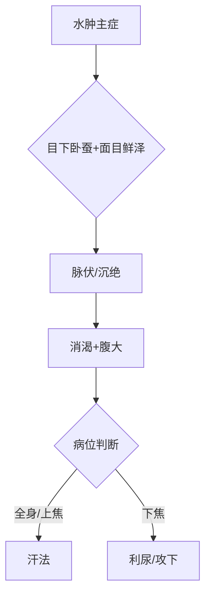
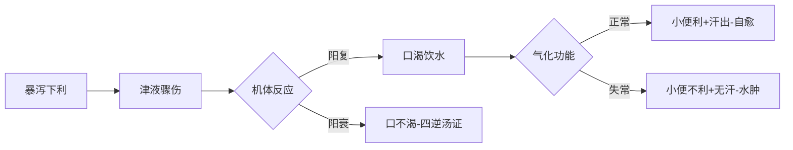

# 水气病脉证并治第十四


水病，就是身上积水了，或肚子变大了，或全身积水，或下半身积水，或早上起来面部肿大积水。

饮病是内发的，自己平常生活习惯不好，比如躺着喝水。水病是外来的，表证失治，本来是桂枝汤或葛根汤证，结果遇到南方温病派，就不会用麻黄葛根桂枝，就用连翘啊，银花啊，板蓝根，诸如此类，这种药都是拿来刷牙漱口的，没办法去掉表证，水就累积在身体。

<!--more-->

## 📜师曰：病有风水，有皮水，有正水，有石水，有黄汗。风水其脉自浮，外证骨节疼痛，恶风。皮水，其脉亦浮外证跗肿，按之没指，不恶风，其腹如鼓，不渴，当发其汗。正水，其脉沉迟，外证自喘。石水，其脉自沉，外证腹满不喘。黄汗，其脉沉迟，身发热，胸满，四肢头面肿，久不愈，必致痈脓。

### 水气病分类与证治

#### 1. 风水  
- **脉证**：脉浮，骨节疼痛，恶风  
- **病机**：表症（太阳病），因出汗时受风，汗液不透发所致  
- **治法**：汗法（如麻黄汤、桂枝汤）  
- **备注**：  
  - 最浅层的水病，失治则转为皮水  
  - 需注意禁忌（如疮家不可发汗）  

#### 2. 皮水  
- **脉证**：脉浮，跗肿（按之凹陷），腹如鼓，不渴，不恶风  
- **病机**：水停三焦系统，气化不足  
- **治法**：汗法（全身性水肿适用）  
- **备注**：  
  - 比风水更深，属少阳范畴  
  - 脚踝及胫骨水肿为典型表现  

#### 3. 正水  
- **脉证**：脉沉迟，自喘  
- **病机**：里寒盛，内脏功能差致积水  
- **治法**：温里散寒（如麻黄附子细辛汤）  
- **备注**：与石水区别在于“喘”症明显  

#### 4. 石水  
- **脉证**：脉沉，腹满，不喘  
- **病机**：里症（体内积水），病位较浅  
- **备注**：  
  - 与正水同为里症，但无喘症  
  - 治法需根据病位（汗、吐、下三法灵活应用）  

#### 5. 黄汗  
- **脉证**：脉沉迟，身发热，胸满，四肢头面肿，汗黄  
- **病机**：湿热停滞三焦（如汗出时入水，毛孔闭塞）  
- **特殊表现**：腋下汗液染黄衣物，皮肤不黄（与黄疸区别）  
- **预后**：久不愈可致痈脓  
- **病因**：常见于劳力后骤冷（如船夫汗出跳入水中）  

---

### 关键总结  
1. **病机层次**：风水（表）→皮水（三焦）→正水/石水（里）→黄汗（湿热深重）。  
2. **治疗原则**：  
   - 风水、皮水以汗法为主；  
   - 正水需温里；  
   - 黄汗需清湿热。  
3. **禁忌**：发汗需辨体质（如疮家忌汗）。  
4. **预后**：久病水停必致化脓（新旧水代谢失常）。

## 📜脉浮而洪，浮则为风，洪则为气，风气相抟，风强则为瘾疹，身体为痒，痒者为泄，风久为痂癞；气强则为水，难以俯仰。风气相繫，身体洪肿，汗出乃愈。恶风则虚，此为风水；不恶风者，小便通利，上焦有寒，其口多，此为黄汗。

### **脉浮而洪的风水与黄汗鉴别**  

#### **1. 脉象与病机**  
- **浮洪脉**：  
  - **浮为风**（外感风邪）  
  - **洪为气**（体内阳气抗邪）  
  - **风气相抟**（风邪与正气相争）  

#### **2. 风强（瘾疹）**  
- **症状**：皮肤瘾疹（荨麻疹）、瘙痒  
- **病机**：汗出受风，汗液郁于皮下  
- **治法**：  
  - **麻黄加术汤**（微发汗，透表湿）  
  - **禁忌**：不可过汗，否则津液受损  
- **失治后果**：久则成痂癞（顽固皮肤病，如干癣）  
  - **治法**：  
    - **针灸**：曲池、合谷、三阴交、血海、筑宾（消炎止痒）  
    - **外敷**：三黄泻心汤 + 白术粉  
    - **内服**：乌梅丸（苦温化湿）  

#### **3. 气强（风水水肿）**  
- **症状**：身体洪肿，难以俯仰  
- **病机**：阳气盛但汗出不透，水停皮下  
- **治法**：发汗（如麻黄汤类方）  
- **关键点**：  
  - **恶风** → 表虚，属风水  
  - **汗出乃愈** → 水邪从表解  

#### **4. 黄汗**  
- **症状**：  
  - **不恶风**（非表证）  
  - **小便通利**（非膀胱气化不利）  
  - **上焦有寒**（肺寒）→ 口多涎（吐白津）  
- **病机**：  
  - 大汗入冷水，毛孔闭，湿热郁于三焦  
  - 肺寒，津液不化，上逆为涎  
- **治法**：  
  - **温肺化饮**（如甘草干姜汤）  
  - **清湿热**（如芪芍桂酒汤）  

---

### **总结对比**  
| **证型** | **关键症状** | **病机** | **治法** |  
|----------|--------------|----------|----------|  
| **风强（瘾疹）** | 皮肤痒疹、荨麻疹 | 风邪郁表，汗液停滞 | 麻黄加术汤（微汗） |  
| **气强（风水）** | 全身洪肿、恶风 | 阳气抗邪，水停皮下 | 发汗（麻黄汤类） |  
| **黄汗** | 不恶风、口多涎、汗黄 | 肺寒+湿热郁三焦 | 温肺+清湿热 |  

**核心要点**：  
1. **风水**（表证）→ **发汗**；**瘾疹**（风郁）→ **微汗+去湿**。  
2. **黄汗**的关键在**肺寒+湿热**，与风水不同（无表证）。  
3. **失治后果**：瘾疹久成干癣，水肿久则湿热化脓。

## 📜寸口脉沉滑者，中有水气，面目肿大，有热，名曰风水；视人之目窠上微肿，如蚕新卧起状，其颈脉动，时时欬，按其手足上，陷而不起者，风水。

### **风水病的诊断与治疗（寸口脉沉滑证）**  

#### **1. 诊断要点**  
- **脉象**：寸口脉沉滑  
  - **沉**：阳入里（非表证）  
  - **滑**：水气内停  
- **症状**：  
  - **面目肿大**（尤其眼睑浮肿，如卧蚕状）  
  - **颈脉动**（颈动脉搏动明显）  
  - **时时咳**（水气犯肺）  
  - **手足按之凹陷不起**（水肿，非气肿）  
  - **身热**（肺热或表郁化热）  

> **望诊关键**：眼袋浮肿（脾土不制水）、面部肿胀（肾气不化水）  

#### **2. 病机分析**  
- **风水**：外感风邪 + 水湿停滞皮下（肺主皮毛，水泛肌表）  
- **水肿来源**：  
  - **心阳不足** → 脚肿（从下往上肿）  
  - **肾气不足** → 头面肿（从上往下肿）  
- **咳嗽成因**：水湿渗肺，肺气不宣  

#### **3. 治疗原则**  
- **汗法**（越婢汤为主方）  
  - **适用条件**：全身性水肿、有汗、咳嗽、身热  
  - **方药组成**：  
    - **麻黄**：开表发汗 + 利尿  
    - **石膏**：清肺热  
    - **生姜、甘草、大枣**：护胃生津，防过汗伤阴  
  - **禁忌**：无汗者慎用（需配伍桂枝）  

#### **4. 鉴别诊断**  
| **证型**       | **关键特征**                  | **治法**          |  
|----------------|-----------------------------|-------------------|  
| **风水（越婢汤证）** | 面目肿、按之凹陷、有汗、咳热 | 发汗清热（越婢汤） |  
| **气肿**         | 按之即起（无凹陷）           | 理气化湿（非汗法） |  
| **皮水**         | 跗肿、腹如鼓、不恶风        | 发汗或利水        |  

#### **5. 临床注意事项**  
1. **发汗时机**：  
   - 风水初起（水在表）→ 汗解  
   - 久病水肿（兼里虚）→ 需温阳利水（如真武汤）  
2. **禁忌**：  
   - 气肿（按之弹起）不可发汗  
   - 肾衰水肿（尿少、面黑）慎用汗法  

### **总结**  
- **风水** = 风邪 + 水停肌表 → **越婢汤**（汗法）  
- **眼睑浮肿 + 颈脉动 + 咳** → 肺脾肾三焦气化失常  
- **治则核心**：发汗透表 + 清热护津，兼顾脏腑功能（心、肾、肺）。

## 📜太阳病，脉浮而紧，法当骨节疼痛，反不疼，身体反重而痠，其人不渴，汗出即愈，此为风水。恶寒者，此为极虚，发汗得之。渴而不恶寒者，此为皮水。身肿而冷，状如周痹胸中窒，不能食，反聚痛，暮躁不得眠，此为黄汗。痛在骨节，软而喘，不渴者，此为肺胀，其状如肿，发汗则愈。然诸病此者，渴而下利，小便数者，皆不可发汗。

### **风水、皮水、黄汗与肺胀的鉴别与治疗**  

#### **1. 风水（表湿证）**  
- **脉证**：太阳病，脉浮而紧（本应骨节疼痛，但反不疼）  
- **症状**：  
  - **身体沉重酸楚**（湿盛）  
  - **不渴**（湿阻津液不化）  
  - **无汗或汗出不畅**（表寒闭郁）  
- **病机**：外感风寒 + 内湿停滞（脾湿不运）  
- **治法**：  
  - **麻黄加术汤**（麻黄汤 + 白术）→ **发汗祛湿**  
  - **禁忌**：过汗易致里虚恶寒（需配伍生姜、甘草、大枣护津）  

> **关键点**：湿家（脾虚湿盛者）得表寒，不可单用麻黄汤，需加白术化湿。  

#### **2. 皮水（三焦水停）**  
- **症状**：  
  - **渴而不恶寒**（水入半表半里，非表证）  
  - **身肿**（三焦水泛）  
- **病机**：水湿停滞三焦系统（决渎之官失常）  
- **治法**：  
  - **发汗或利水**（视病位）  
  - **代表方**：防己茯苓汤（皮水四肢肿）  
- **与风水区别**：  
  - 风水：恶寒、表证明显（麻黄类方）  
  - 皮水：不恶寒、渴（三焦水停）  

#### **3. 黄汗（湿热郁结）**  
- **症状**：  
  - **身肿而冷**（水停肌腠）  
  - **胸中窒、不能食**（水阻气机）  
  - **暮躁不得眠**（阳不入阴）  
  - **汗黄染衣**（湿热郁蒸）  
- **病机**：汗出受凉，水热互结于三焦  
- **治法**：  
  - **黄芪芍桂苦酒汤**（清湿热、固表）  
  - **禁忌**：不可发汗（恐伤津助热）  

> **临床注意**：黄汗与黄疸鉴别（黄疸身黄、目黄；黄汗仅汗黄）。  

#### **4. 肺胀（寒饮犯肺）**  
- **症状**：  
  - **咳喘、不渴**（肺寒饮停）  
  - **状如肿**（肺气壅塞）  
- **病机**：肺失宣降，水饮内停  
- **治法**：  
  - **发汗宣肺**（如小青龙汤）  
  - **代表方**：越婢加半夏汤（热性肺胀）  

### **治疗禁忌与变通**  
1. **不可发汗的情况**：  
   - **渴而下利**（津亏里虚）  
   - **小便频数**（阴液已伤）  
   - **极虚恶寒**（过汗致阳虚）  
2. **津伤处理**：  
   - **生津法**：人参、甘草、生姜、大枣（护胃津）  
   - **食疗**：水梨、西瓜（润燥补水）  
3. **水肿外治**：  
   - **蒲灰散**（外敷消水肿）  

### **总结对比表**  
| **证型** | **关键症状**          | **病机**                | **治法**               |  
|----------|-----------------------|-------------------------|------------------------|  
| **风水** | 身重酸、不渴、恶寒   | 表寒 + 内湿             | 麻黄加术汤（微汗祛湿） |  
| **皮水** | 渴、身肿、不恶寒     | 三焦水停                | 防己茯苓汤（利水消肿） |  
| **黄汗** | 暮躁、汗黄、胸窒     | 湿热郁三焦              | 黄芪芍桂苦酒汤         |  
| **肺胀** | 咳喘不渴、状如肿     | 肺寒饮停                | 小青龙汤/越婢加半夏汤  |  

**核心要点**：  
1. **发汗需辨证**：风水、肺胀可汗；皮水、黄汗慎汗；津伤者禁汗。  
2. **湿病根源**：脾虚湿盛（白术）、三焦失调（防己）、肺失宣降（麻黄）。  
3. **津液保护**：过汗伤阳，需配伍护津药（姜枣草）。

## 📜里水者，一身面目黄肿，其脉沉，小便不利，故今病水；假令小便自利，此亡津液，故令渴，越加术汤主之。

### **里水的辨证与治疗（越婢加术汤证）**  

#### **1. 里水的基本特征**  
- **主症**：  
  - **一身面目黄肿**（全身及面部水肿，肤色偏黄）  
  - **脉沉**（病位在里）  
  - **小便不利**（水液代谢失常）  
- **病机**：水湿内停，三焦气化不利，兼有里热或津伤。  

#### **2. 两种病机与治法**  
| **情况**       | **症状**                | **病机**                | **治法**               |  
|----------------|-------------------------|-------------------------|------------------------|  
| **小便不利**   | 水肿、脉沉、无口渴      | 水停内里，气化失常      | **肾气丸**（温阳利水） |  
| **小便自利**   | 水肿、口渴、亡津液      | 津液亏损，水热互结      | **越婢加术汤**         |  

#### **3. 越婢加术汤的应用**  
- **适用证**：  
  - **水肿伴汗出、口渴、发热**（肺热壅盛）  
  - **肌肉酸痛**（湿阻经络）  
  - **小便不利或正常但津伤**（需兼顾补液）  
- **方药组成**：  
  - **麻黄**：宣肺发汗，通调水道  
  - **石膏**：清肺胃之热  
  - **白术**：健脾祛湿（针对“湿家”体质）  
  - **生姜、甘草、大枣**：补益脾胃，防过汗伤津  

#### **4. 临床要点**  
1. **鉴别关键**：  
   - **口渴与否**：渴为津伤（越婢加术汤），不渴为阳虚水停（肾气丸）。  
   - **汗出与发热**：越婢汤证必有汗出、身热；若无汗则需配伍桂枝（如大青龙汤）。  
2. **湿家体质**：  
   - 长期湿重者（易关节酸重、水肿）需加白术健脾化湿。  
3. **禁忌**：  
   - 津液大亏（如严重脱水、下利）慎用发汗法，需先补津液（如人参、麦冬）。  

#### **5. 现代应用参考**  
- **肾炎水肿**：兼发热、口渴者，可参考越婢加术汤。  
- **特发性水肿**：伴脾虚湿盛时，合用五苓散加减。  
- **代谢综合征**（肥胖、高尿酸）：湿热型水肿可化裁使用。  

### **总结**  
- **里水**=水湿内停+热/津伤，分虚实论治：  
  - **实证**（小便不利）→ **肾气丸**（温阳利水）  
  - **虚热津伤**（小便自利、渴）→ **越婢加术汤**（发汗清热+健脾）。  
- **核心思路**：  
  - “发汗不伤津”是越婢汤的配伍精髓（姜枣草护胃）。  
  - 白术为“湿家”关键药，无湿者去之。

## 📜趺阳脉当伏，今反紧，本自有寒，疝瘕，腹中痛，医反下之，即胸满短气。趺阳脉当伏，今反数，本自有热，消谷小便数，今反不利，此欲作水。

### **趺阳脉诊与水气病预判**

#### **1. 趺阳脉（冲阳脉）的生理与病理**
- **正常脉象**：伏而缓（和缓有力，反映胃气充足）  
- **异常脉象与病机**：  

| **脉象** | **临床意义**           | **伴随症状**          | **误治后果**       |  
|----------|------------------------|-----------------------|--------------------|  
| **紧脉** | 胃中本寒（里寒证）     | 疝瘕、腹中冷痛        | 误下→胸满短气      |  
| **数脉** | 胃中本热（消谷善饥）   | 本应小便数，反不利    | 水液停聚→水肿先兆  |  

#### **2. 寒证误治的机制与处理**
- **病机链**：  
  **里寒（脉紧）** → **误用寒下药** → **下焦虚冷** → **上焦失降（胸满短气）**  
- **关键症状**：  
  - 腹冷痛、月经延期（女性癥瘕/囊肿风险）  
  - 误下后吸气困难（肾不纳气，横膈膜不下沉）  
- **治法**：  
  - **温阳利水**：桂枝、炮附子、茯苓、白术（如真武汤）  
  - **禁忌**：禁用苦寒攻下（如大黄、芒硝）  

> **临床提示**：女性下焦寒湿（脚冷、经迟）需早干预，防癥瘕（卵巢囊肿/肌瘤）。  

#### **3. 热证致水的病机与预警**
- **病机链**：  
  **胃热（脉数）** → **消谷善饥** → **本应小便通利** → **反小便不利** → **水液潴留（水肿）**  
- **关键症状**：  
  - 消渴但小便少（非糖尿病性多尿）  
  - 水肿前期（水热互结，三焦壅滞）  
- **处理原则**：  
  - 清热利水（如白虎加术汤）  
  - 忌盲目滋阴（防助湿）  

> **经典对比**：  
> - **《金匮》**「小便不利，此欲作水」→ 水热互结，需分消走泄。  
> - **《伤寒》**五苓散证（膀胱气化不利）与此不同。  

#### **4. 临床鉴别与拓展**
- **寒湿与湿热水肿的鉴别**：  
  | **证型**   | **脉象** | **二便**       | **治法**          |  
  |------------|----------|----------------|-------------------|  
  | **寒湿**   | 紧/迟    | 便溏、小便清长 | 温阳化湿（真武汤）|  
  | **湿热**   | 数/滑    | 便秘、小便短赤 | 清热利水（茵陈五苓散）|  

- **现代疾病对应**：  
  - **寒湿型**：多囊卵巢综合征、子宫内膜异位症  
  - **湿热型**：急性肾炎、代谢性水肿  

### **核心总结**
1. **脉诊为先**：趺阳脉紧→里寒；数→里热，预判水病趋势。  
2. **治未病**：  
   - 寒湿早温（防癥瘕），如艾灸关元、用药温下焦。  
   - 热证需清利（防水停），如石膏、滑石配白术。  
3. **误治警示**：  
   - 里寒误下→上实下虚（胸满短气）；  
   - 里热不化→水热互结（消渴肿满）。  

**仲景思维**：胃气为水液代谢枢纽，趺阳脉异动是水气病早期信号！

## 📜寸口脉浮而迟，浮脉则热，迟脉则潜，热潜相抟，名日沉。趺阳脉浮而数，浮脉即热，数脉即止，热止相抟，名日伏。沉伏相抟，名曰水。沉则络脉虚，伏则小便难，虚难相抟，水走皮肤，即为水矣。

### **水气病形成的脉象病机与治疗思路**

#### **1. 脉象解析与病机关联**
- **寸口脉（肺/胸阳）**  
  - **浮而迟**：浮为表热，迟为里虚 → **热潜相搏→"沉"**  
    - 表热内虚，阳气不固，水液内潜  
  - **病理链**：肺失宣降 → 水停上焦 → 络脉空虚（身冷无汗）  

- **趺阳脉（胃气）**  
  - **浮而数**：浮为胃热，数为热壅 → **热止相搏→"伏"**  
    - 胃热亢盛，肾气不纳（热迫津耗） → 小便难  
  - **病理链**：胃热津伤 → 三焦气化失司 → 水液潴留  

- **最终病机**：  
  **"沉伏相搏→水"**  
  - 上焦络虚（肺） + 下焦气化不利（胃/肾） → **水走皮肤**（水肿）  

#### **2. 核心病机与症状对应**
| **脉象/病机**       | **临床表现**          | **生理失衡**                |  
|----------------------|-----------------------|-----------------------------|  
| **寸口沉（络脉虚）** | 身冷无汗、皮肤干燥    | 肺阳不足，微循环衰竭        |  
| **趺阳伏（小便难）** | 尿少、消谷善饥        | 胃热灼津，肾气不化          |  
| **水走皮肤**         | 水肿（按之凹陷）      | 水液代谢双系统（肺+三焦）瘫痪 |  

#### **3. 治疗策略**
- **关键原则**：  
  **"协调阴阳，复其气化"**  
  1. **补肺阳、固表**：  
     - **桂枝汤**（基础方）→ 调和营卫，温通络脉  
     - **桂枝加龙骨牡蛎汤**（多梦、盗汗者）→ 潜阳固涩  
  2. **清胃热、利三焦**：  
     - **白虎加人参汤**（胃热消渴）→ 清热生津  
     - **五苓散**（小便不利）→ 恢复三焦气化  
  3. **虚实并治**：  
     - **越婢汤**（表闭水肿）→ 发汗+清里热  
     - **真武汤**（肾阳虚水停）→ 温阳利水  

#### **4. 临床提示**
- **预防水病**：  
  - **运动导引**（如易筋经、八段锦）→ 促进阳气周流，避免"直线劳动"耗气  
  - **桂枝汤保健**：素体虚汗、易感冒者，可小剂量长期服用  
- **误治警示**：  
  - 勿见热纯用寒凉（恐伤肾阳，加重水停）  
  - 勿见水肿盲目利尿（需辨肺/肾/三焦病位）  

### **总结：仲景水病观**
1. **"水为阴邪，其本在肾，其标在肺，其制在脾"**  
   - 本例突出**肺胃协同失调**（寸口+趺阳脉）致水的病机。  
2. **脉诊价值**：  
   - 寸口浮迟→上焦虚热；趺阳浮数→中焦热壅 → **二者合参预判水肿**。  
3. **治疗本质**：  
   - 不是单纯利水，而是**重建"肺宣发-三焦输布-肾气化"循环**。  

> **现代应用**：慢性肾病水肿、代谢综合征（肥胖性水肿）可参考此病机，从调和肺胃入手。

## 📜寸口脉弦而紧，弦则卫气不行，即恶寒，水不沾流，走于肠间。少阴脉紧而况，紧则为痛，沉则为水，小便即难。

### **水气病的脉证演变与治疗关键**

#### **一、水病初起（上焦寒湿）**
- **脉象**：寸口脉弦而紧  
  - **弦脉** → 水邪停滞  
  - **紧脉** → 寒束卫阳  
- **病机**：  
  - **卫气不行**：寒束肌表，恶寒无汗（类似太阳伤寒）  
  - **水走肠间**：水湿不化，渗入肌肉腠理（非肠道，实为"阳间"即体表）  
- **症状特点**：  
  - 恶寒、身重（湿滞）  
  - 皮肤水肿初现（按之轻度凹陷）  
- **治疗**：  
  - **发汗解表**：  
    - 表实无汗 → **麻黄汤**（开表发汗）  
    - 兼里湿 → **麻黄加术汤**（发汗祛湿）  
  - **化饮逐水**（若水聚成实）：  
    - **防己椒目葶苈大黄丸**（水走肠间，腹满喘鸣）  

> **关键点**：水病初起在表，当从汗解，防其入里！

#### **二、水病已成（少阴阳虚）**
- **脉象**：少阴脉（尺部）紧而沉  
  - **紧脉** → 寒凝痛证（腰痛、关节冷痛）  
  - **沉脉** → 水停于里  
- **病机**：  
  - **肾阳不足**：气化无权 → 小便难  
  - **寒水内停**：水肿加重（下肢尤甚）  
- **症状特点**：  
  - 面色苍白、四肢逆冷  
  - 小便不利、腰膝酸冷  
- **治疗**：  
  - **温阳利水**：  
    - **麻黄附子细辛汤**（表里双解）→ 发汗+温肾  
    - **真武汤**（纯里虚寒）→ 附子+白术+茯苓  
  - **急救肾阳**（危证）：  
    - **四逆汤**（肢冷脉微）  

> **关键点**：少阴水病需温肾阳，麻黄附子细辛汤是"开肾盖"的钥匙！

### **三、临床鉴别与拓展**
| **分期**   | **病位** | **脉象**      | **核心症状**       | **代表方剂**          |  
|------------|----------|---------------|--------------------|-----------------------|  
| **初期**   | 上焦/表  | 寸口弦紧      | 恶寒、身重        | 麻黄汤/麻黄加术汤     |  
| **中期**   | 三焦/半表里 | 趺阳浮数    | 消渴、小便不利    | 五苓散/越婢加术汤     |  
| **晚期**   | 少阴/里  | 尺部沉紧      | 肢冷、尿闭        | 麻黄附子细辛汤/真武汤 |  

### **四、经典思维精要**
1. **"水病传变"规律**：  
   **表寒束水（肺）→ 三焦壅滞（胃）→ 肾阳虚衰（少阴）**  
   - 初期失治是里水根源，发汗不及时则祸及肾阳！  

2. **脉诊核心**：  
   - **寸口弦紧** → 果断发汗（防传变）  
   - **尺部沉紧** → 急温肾阳（防尿毒）  

3. **现代应用**：  
   - **急性肾炎**：初期多属"寸口弦紧"，麻黄连翘赤小豆汤加减  
   - **慢性肾衰**：晚期多见"少阴沉紧"，真武汤合大黄附子汤  

> **警示**：见水肿勿盲目利尿！需辨表里阴阳，仲景云："腰以上肿当发汗，腰以下肿当利小便"。

## 📜脉得诸沉者，当责有水，身体肿重，水病脉出者死。

### **水肿病的脉诊生死决断**

#### **一、水肿病的常态脉象**
- **脉象特征**：  
  - **诸沉脉**（重按至骨方得）  
  - **机理**：水湿壅盛，压迫血脉深伏  
- **对应症状**：  
  - 身体肿重（按之凹陷不起）  
  - 小便不利、畏寒肢冷  

> **临床意义**：水肿见沉脉为"脉证相应"，属疾病常态，可治。

#### **二、危证脉象——"脉出者死"**
- **脉象特征**：  
  - **原应沉脉反浮**（轻取即得，浮大无根）  
  - **机理**：阴盛格阳，真阳外脱  
- **伴随症状**：  
  - 极度水肿却突然脉浮  
  - 神疲欲寐、面色惨白  
  - 二便失禁、四肢厥逆  

> **临床意义**：  
> - 脉症不符（阴证见阳脉）→ **元气败露的濒死征象**  
> - 类似现代"心肾衰竭终末期"表现  

#### **三、脉症合参的生死鉴别**
| **情况**         | **形貌表现**       | **脉象特征**      | **预后**  |  
|------------------|--------------------|-------------------|-----------|  
| **顺证**         | 消瘦虚弱           | 脉微细弱          | 可治      |  
| **逆证（死候）** | ① 形销骨立         | 脉洪大数急        | 危殆      |  
|                  | ② 看似壮实         | 脉细如丝          | 危殆      |  

**经典对比**：  
- 《伤寒论》"少阴病，脉微细，但欲寐" → 可温补（四逆汤）  
- 本条"水病脉出" → 真阳脱越，救治极难  

#### **四、临床延伸思考**
1. **现代疾病对应**：  
   - 慢性肾病水肿（尿毒症期）突发脉浮大 → 需警惕高钾血症、心包填塞等急症  
2. **中西医结合视角**：  
   - "脉出"可能对应**容量超负荷致心搏代偿性增强**，但终将衰竭  
3. **治疗警示**：  
   - 水肿见沉脉可大胆温利（真武汤、实脾饮）  
   - 若脉突然浮大 → 急用参附龙牡救逆，慎用利尿剂  

### **核心总结**
- **"诸沉有水"是常**，**"脉出者死"是变**：水肿病脉由沉转浮，揭示阴阳离决。  
- **脉症关系比单一脉象更重要**：形衰脉盛/形强脉弱皆属逆候。  
- **仲景预警价值**：此条实为**水肿病终末期的脉诊预判法则**，至今仍指导临床危重症识别。  

> **医家箴言**：  
> "水肿沉脉犹可治，浮大无根命必危" —— 明·李中梓《医宗必读》

## 📜夫水病人，目下有卧蚕，面日鲜泽，脉伏，其人消渴病水。腹大，小便不利，其脉沉绝者，有水，可下之。

### **水气病的诊断与治疗关键**

#### **一、典型症状（诊断四要素）**
1. **目下卧蚕**  
   - 下眼睑浮肿透亮（区别于正常眼袋）  
   - *注：与相学"贵子贵女"鉴别——水肿呈病态透亮，无血色*  

2. **面目鲜泽**  
   - 皮肤表面异常光亮（水湿外泛的表现）  
   - *区别于健康光泽：指压后凹陷不回弹*  

3. **脉伏或沉绝**  
   - 重按至骨方得（水盛压迫血脉）  
   - *危重指征：脉沉极似无（"沉绝"）*  

4. **消渴与二便异常**  
   - 口渴多饮但小便不利（关键矛盾点）  
   - 腹大如鼓（水聚腹腔）  

#### **二、治疗原则与方药选择**
| **病位**      | **治法**   | **代表方剂**          | **适应症**                |  
|---------------|------------|-----------------------|---------------------------|  
| **全身性水肿** | 发汗解表   | 越婢汤/麻黄加术汤     | 头面肿、恶风、有汗        |  
| **脐上水肿**   | 宣肺利水   | 葶苈大枣泻肺汤        | 胸满喘咳、不得平卧        |  
| **脐下水肿**   | 利尿攻下   | ① 五苓散（轻证）<br>② 大黄附子细辛汤（重证） | 腹大坚满、二便闭、脉沉绝  |  

**重点方解**：  
- **大黄附子细辛汤**：  
  - 针对"脉沉绝+腹大便秘"的寒实水结证  
  - 大黄攻下+附子温阳+细辛散寒，共奏"温下逐水"之功  

#### **三、临床鉴别要点**
1. **真假消渴鉴别**  
   - *水病消渴*：渴但饮水不解，尿少腹大  
   - *糖尿病*：多饮多尿，消瘦（无水肿）  

2. **腹水成因鉴别**  
   ```mermaid  
   graph LR  
   A[腹大如鼓] --> B{小便是否利}  
   B -->|不利| C[水病（五苓散/真武汤）]  
   B -->|尚利| D[气胀/癥瘕（厚朴生姜半夏甘草人参汤）]  
   ```  

3. **危候识别**  
   - **脉症矛盾**：水肿极重反见洪大脉（真阳外越）  
   - **禁忌**：见口渴勿盲目滋阴（恐助水湿）  

#### **四、仲景思想精髓**
1. **"水病治则三层次"**  
   - **发汗**：开鬼门（肺主皮毛）  
   - **利尿**：洁净府（膀胱气化）  
   - **攻下**：去菀陈莝（肠腑壅塞）  

2. **现代应用**  
   - 肝硬化腹水（寒实证）→ 大黄附子汤+鳖甲煎丸  
   - 肾病综合征→ 越婢加术汤合防己黄芪汤  

> **警示**：见"脉沉绝"方可下之，若脉微弱者慎用攻伐！  

### **总结：水病诊疗框架**

掌握此辨治逻辑，即使未见经文原句，亦可依证施治。

## 📜问曰：病下利后，渴饮水，小便不利，腹满因肿者，何也？答曰：此法当病水，若小便自利及汗出者，自当愈。

### **下利后水肿的病理机制与预后判断**

#### **一、典型病程演变**
1. **下利伤津阶段**  
   - 正常反应：下利后口渴欲饮（津液暂亏，胃气来复）  
   - 危重信号：下利后口不渴（阴寒内盛，真阳衰微）  

2. **水病形成阶段**  
   - 关键矛盾：  
     - **"渴饮水"**（津伤求补）  
     - **"小便不利+无汗"**（气化失常）  
   - 结果：水液潴留 → 腹满水肿  

#### **二、病机解析**


#### **三、治疗决策树**  
| **证型**         | **判断要点**               | **处理方案**                |  
|------------------|----------------------------|-----------------------------|  
| **阳复欲愈**     | 口渴+小便利/汗出           | 观察（可辅以米粥调养）      |  
| **水停实证**     | 口渴+小便不利+腹满         | 五苓散（化气行水）          |  
| **阳衰危证**     | 下利不渴+四肢厥冷          | 四逆汤（急救回阳）          |  

#### **四、经典理论精要**
1. **"津液自和者愈"**  
   - 仲景强调机体自我调节能力，反对盲目滋阴  
   - 现代启示：轻症腹泻补液优先口服补液盐而非静脉输液  

2. **"汗尿同源"理论**  
   - 水肿消退双途径：  
     - 表证明显（无汗）→ 发汗（越婢汤）  
     - 里证为主（无尿）→ 利尿（猪苓汤）  

3. **预后标志**  
   - 吉兆：饮水后尿量增加/微微汗出  
   - 凶兆：饮水后腹胀加剧（"水逆"证）  

#### **五、现代临床对应**
- **感染性腹泻后期**：出现口渴、少尿时需警惕低血容量性水肿  
- **抗生素相关性腹泻**：过度使用抗生素后出现水肿，可考虑五苓散恢复气化  

> **关键鉴别**：与心源性水肿（脉沉细结代）、肾性水肿（蛋白尿）相区分，本条专指"津伤-水停"动态失衡过程。  

### **总结：仲景辨证思维**
1. **重功能胜过补物质**：津伤时首重恢复气化（阳化气），而非单纯补水  
2. **动态观察疾病转归**：通过"口渴-二便-汗出"三联征判断自愈倾向  
3. **治疗窗口期把握**：水肿初起（气化未衰）及时干预效果最佳

## 📜心水者，其身重少气，不得卧，烦而躁，其人阴肿。肝水者，其腹大不能自转侧，胁下腹痛，时时津液微生，小便续通。肺水者，其身肿，小便难，时时鸭溏。水者，其腹大，四肢苦重，津液不生，但苦少气，小便难。肾水者，其腹大脐肿，腰痛不得溺，阴下湿如牛鼻上汗，其足逆冷，面反瘦。

### **五脏水病辨证与治疗精要**

#### **一、五脏水病核心鉴别表**
| 病位 | 特征症状                     | 病机关键                  | 经典处方               | 现代对应疾病           |
|------|------------------------------|---------------------------|------------------------|------------------------|
| **心水** | 身重少气、不得卧、阴肿、烦躁 | 心阳不振，水凌心肺        | 木防己汤               | 心衰水肿、心包积液     |
| **肝水** | 腹大如鼓、胁痛、小便断续     | 肝郁血瘀，土壅木郁        | 分消汤（去甘草）       | 肝硬化腹水、肝癌       |
| **肺水** | 身肿、不得卧、鸭溏便         | 肺失宣降，通调失职        | 十枣汤/荨苈大枣泻肺汤  | 肺水肿、胸水           |
| **脾水** | 腹大、四肢重、口干少气       | 脾失运化，津液不布        | 实脾饮                 | 胰腺炎腹水、营养不良性水肿 |
| **肾水** | 脐肿腰痛、阴湿、面瘦足冷     | 肾阳衰微，气化无权        | 真武汤+生硫磺          | 肾病综合征、肾衰       |

#### **二、特色诊断指征**
1. **体位诊断**：
   - 心/肺水：端坐呼吸（十枣汤证）
   - 肾水：晨起面肿（睡前水聚头部）

2. **分泌物观察**：
   - 鸭溏便→肺水
   - 阴囊潮湿如牛鼻汗→肾水

3. **触诊特征**：
   - 脐凸如蛋→肾水危候
   - 腹壁静脉曲张（蜘蛛痣）→肝水

#### **三、阶梯治疗策略**
1. **急则治标（排水）**：
   - 上焦：发汗（越婢汤）
   - 中焦：健脾（五苓散）
   - 下焦：温阳（真武汤）

2. **缓则治本（治脏）**：
   - 心水：桂枝+茯苓（强心利水）
   - 肝水：鳖甲+茜草（软坚化瘀）
   - 肾水：硫磺+附子（温阳化冰）

3. **禁忌红线**：
   - 阴实证禁用甘草（恐助水湿）
   - 血分病慎用单纯利尿（需配合活血）

#### **四、现代应用要点**
1. **肿瘤相关腹水**：
   - 肝癌：柴胡鳖甲汤+茵陈（疏肝利胆）
   - 胰腺癌：半夏泻心汤+莪术（开通痞结）

2. **时辰疗法**：
   - 丑时（1-3点）醒：加郁金、龙胆草（清肝热）
   - 五更泻：四神丸+硫磺（温肾阳）

3. **微观辨证**：
   - 舌下络脉迂曲→肝瘀
   - 唇周青黑→心阳虚

#### **五、预后判断**
1. **吉兆**：
   - 排水后胃气来复（知饥能食）
   - 小便逐渐通畅（色转淡黄）

2. **凶兆**：
   - 利尿后反见脉大无根（阳脱）
   - 腹水消而呃逆不止（胃气败）

> **仲景心法**：治水必先治气，大气一转，其气乃散。临床需把握"排水-扶正-攻坚"的节奏，尤重护胃气为本。

## 📜师曰：诸有水者，腰以下肿，当利小便；腰以上肿，当发汗乃愈。

### **水肿治疗的核心法则与临床活用**

#### **一、治疗总纲**
1. **定位治疗原则**：
   - **腰以上肿**（头面、上肢、胸背）→ **发汗法**  
     - *代表方*：越婢汤、麻黄加术汤  
     - *机理*：开鬼门，洁净府（肺主皮毛）  
   - **腰以下肿**（下肢、阴部、腹部）→ **利尿法**  
     - *代表方*：五苓散、真武汤  
     - *机理*：洁净府，通阳化气  

2. **全身性水肿**：  
   - **汗利同施**（发汗+利尿）  
   - *经典组合*：越婢汤合五苓散  
   - *特殊用药*：**生硫磺**（淡黄者）→ 温阳化气，通利三焦  

#### **二、关键用药——生硫磺的妙用**
| **应用场景**         | **作用机理**                  | **配伍要点**                |  
|----------------------|-------------------------------|-----------------------------|  
| 顽固性全身水肿       | 温通十二经脉，化气行水        | 配麻黄增强发汗透表之力      |  
| 重金属沉积致小便闭   | 化解膀胱五金沉积（如铁质）    | 配伍滑石、甘草梢导浊外出    |  
| 站立体位性水肿       | 改善静脉回流障碍              | 加怀牛膝引药下行            |  

> **鉴别要点**：  
> - 真硫磺：淡黄色（如雏鸡毛色），质轻脆  
> - 假硫磺：褐红色（土硫磺），只供外用  

#### **三、治疗禁忌（四不可发汗）**
1. **津枯者禁汗**：  
   - 下利后口渴未止（阴液未复）  
   - *处理*：先用牡蛎泽泻散利水养阴  

2. **阴竭者禁汗**：  
   - 舌红少苔、皮肤干燥  
   - *处理*：猪苓汤育阴利水  

3. **阳衰者慎汗**：  
   - 脉沉微、四肢厥冷  
   - *处理*：真武汤先温肾阳  

4. **表虚者禁汗**：  
   - 自汗恶风（防己黄芪汤证）  
   - *处理*：黄芪防己汤固表利水  

#### **四、现代疾病应用举例**
1. **肾病综合征**：  
   - 晨起面肿（上焦）→ 越婢加术汤  
   - 傍晚腿肿（下焦）→ 济生肾气丸  

2. **心衰水肿**：  
   - 夜间端坐呼吸→ 木防己汤去石膏加茯苓芒硝  
   - 下肢凹陷肿→ 真武汤合葶苈大枣泻肺汤  

3. **肝硬化腹水**：  
   - 蜘蛛痣+腹壁静脉曲张→ 分消汤（去甘草）  
   - 合并阴囊水肿→ 硫磺3g（棉包煎）+ 麻黄附子细辛汤  

#### **五、仲景思维精要**
1. **"阴阳自和者必自愈"**：  
   - 水肿消退后，需观察小便是否逐渐清长（气化功能恢复）  

2. **"治水三步骤"**：  
   ```mermaid  
   graph TB  
   A[通阳化气] --> B[给邪出路] --> C[固护胃气]  
   ```  
   - 硫磺通阳 → 汗尿分消 → 粳米大枣养胃  

3. **"因地因人制宜"**：  
   - 北方寒地用附子，南方湿地用硫磺  
   - 体力劳动者重用麻黄，脑力劳动者轻用  

> **临证箴言**：  
> "治水如治兵，汗利如攻守，硫磺乃奇兵，胃气是粮道" —— 清·徐灵胎《医学源流论》注

## 📜师曰：寸口脉沉而迟，沉则为水，迟则为寒，寒水相抟，跌阳脉伏，水谷不化，脾气衰则骛溏，胃气衰则身肿。少阳脉卑，少阴脉细，男子则小便不利，妇人则经水不通，经为血，血不利则为水，名曰血分。

### **水病与血分病脉证总结**  

#### **一、寸口脉（心肺脉）沉而迟**  
- **脉象**：沉主水，迟主寒。  
- **病机**：  
  - **“寒水相抟”**：上焦（心肺）阳虚，寒与水互结，气化不利。  
  - **关键**：心阳不足（张仲景隐言心脏，实指心阳虚衰）。  

#### **二、趺阳脉（胃脉）伏**  
- **脉象**：伏脉（沉极似无）代表胃气衰败。  
- **病机**：  
  - **“水谷不化”**：胃虚不运，水饮停积。  
  - **“脾气衰则鹜溏”**：脾失健运，水渗大肠→ 便溏（鸭溏状）。  
  - **“胃气衰则身肿”**：水液不化，泛溢肌肤→ 全身水肿。  

#### **三、少阳脉（三焦）卑（衰）、少阴脉（肾）细**  
- **脉象**：  
  - **少阳脉衰**：三焦气化功能减弱（水道不畅）。  
  - **少阴脉细**：肾阳不足，水液代谢失常。  
- **病机**：  
  - **男子**：小便不利（气化无权，水停膀胱）→ 可用肾气丸。  
  - **妇人**：经水不通（寒凝血瘀）→ **“血不利则为水”**，月经变黄水（里寒极盛）。  

### **临床核心：血分病（妇科水病）**  
1. **病机关键**：  
   - **寒→血瘀→水停**：  
     - 妇人里寒盛，经血不化，反为水湿（经色淡、质稀，或排黄水）。  
     - 血瘀日久（经黑、血块）则为热结，但此处侧重寒证。  

2. **治疗方向**：  
   - **温阳化水**：硫磺（大热破寒）、附子、桂枝（强心阳）。  
   - **活血利水**：当归、川芎、泽兰（血水同治）。  
   - **代表方剂**：  
     - **肾气丸**（男子小便不利）。  
     - **温经汤**（妇人血寒经闭）。  

3. **鉴别诊断**：  
   - **气分病**（病在表、轻浅）→ 易治（如茯苓甘草汤）。  
   - **血分病**（病在里、寒瘀深）→ 难治（需温通久服）。  

### **关键点总结**  
1. **水肿根源**：心阳虚（寸口沉迟）＋胃衰（趺阳伏）＋肾虚（少阴细）。  
2. **妇人经病**：  
   - **寒证**：经淡、黄水→温阳（硫磺、附子）。  
   - **热瘀**：经黑、血块→化瘀（桃仁、丹皮）。  
3. **西医对比**：水钠潴留、内分泌紊乱（中医从整体气化论治）。  

> **注**：仲景强调“血水同病”，治水需调血，治血需温阳，临床尤重妇人寒瘀体质。

## 📜师曰：寸口脉沉而数，数则为出，沉则为入，出则为阳实，入则为阴结。跌阳脉微而弦，微则无胃气，弦则不得息。少阴脉沉而滑，沉则为在里，滑则为实，沉滑相抟，血结胞门，其瘕不写，经络不通，名曰血分。

### **水病与妇科血分病脉证总结**  

#### **一、寸口脉（肺脉）沉而数**  
- **脉象**：沉主水（肾），数主热。  
- **病机**：  
  - **“数则为出，出则为阳实”**：肺热壅盛，表实（毛孔闭塞）导致热无法外散，形成阳实证。  
  - **“沉则为入，入则为阴结”**：水气内停，沉积于三焦系统，结于脏内，形成阴结（水寒互结）。  
- **关联症状**：表实（无汗、怕冷）、肺热（胸闷、烦热）。  

#### **二、趺阳脉（胃脉）微而弦**  
- **脉象**：微为胃气不足，弦主水饮或气滞。  
- **病机**：  
  - 胃虚无法气化水液，水饮内停，阻碍呼吸（“弦则不得息”）。  
- **关键点**：水病根源与脾胃虚寒相关，胃气衰则水湿不化。  

#### **三、少阴脉（肾脉）沉而滑**  
- **脉象**：沉主里，滑主实。  
- **病机**：  
  - **“沉滑相抟，血结胞门”**：下焦（子宫、胞宫）寒凝血瘀，形成瘕积（如肌瘤、囊肿）。  
  - **“经络不通，名曰血分”**：瘀血阻滞经络，属血分病（妇科实证）。  

### **临床延伸与治疗思路**  
1. **病因病机**：  
   - **表实**（毛孔闭塞）→ 热不得散 → 肺热内壅。  
   - **胃虚**（水不气化）→ 水饮内停 → 寒湿结于下焦。  
   - **里寒血瘀**→ 瘕积（子宫肌瘤、卵巢囊肿等）。  

2. **核心治法**：  
   - **去水**：茯苓、泽泻等利水药。  
   - **温阳散寒**：桂枝（导心阳下行）、炮附子（重寒用生附子）。  
   - **活血化瘀**：丹皮、桃仁。  
   - **缓急止痛**：白芍。  
   - **代表方剂**：**桂枝茯苓丸**（加减：寒甚加附子，瘀重加虫类药）。  

3. **预后与调护**：  
   - **疗效判断**：足温、脉象缓和、三阴交压痛消失。  
   - **防复发**：忌冷食、避寒湿，增强运动（开表发汗）、恢复胃气。  
   - **西医对比**：手术切除肌瘤不除根（寒湿瘀未去），中医调体质可根治。  

### **关键点总结**  
- **水病与血分病的关系**：水停致寒，寒凝致瘀，瘀久成瘕（如妇科肿瘤）。  
- **治疗原则**：**“去水、温阳、化瘀”**三法并行，兼顾通络。  
- **辨证要点**：脉沉滑提示下焦实证，须结合腹诊、舌诊（如舌黯紫、苔白滑）。  

> **注**：仲景强调“寒为百病之根”，妇人虚寒体质易发血分病，早期温化可防癥瘕形成。

## 📜问曰：病有血分水分何也？师曰：经水前断后病水，名曰血分，此病难治。先病水后经水断，名曰水分，此病易治，何以故，去水，其经自下。

### **妇人血分与水分病鉴别及治疗总结**

#### **一、血分病（难治）**
**辨证要点：**
- **"经水前断，后病水"**  
  1. 月经先停闭，后出现水肿（两种情形）：
     - 更年期后停经（天癸竭）继而水肿
     - 每次行经后出现水肿
  2. **病机**：瘀血内阻（子宫肌瘤/积血）→ 影响水液代谢  
  3. **特点**：  
     - 经血未净，瘀阻胞宫  
     - 水病根源于血瘀（如冰山不化）  

**治疗方向：**
- **治则**：破血逐瘀为主，利水为辅  
- **方药**（补充方）：  
  - **瞿麦**（破血利尿）  
  - **大黄**（通下焦瘀热）  
  - **桂枝**（温通冲任，引血下行）  
  - **当归**（补血活血）  
  - **茯苓**+**葶苈子**（利三焦/肺水）  
  - **剂型**：丸剂缓攻（如六味地黄丸制法，每次15粒）  
- **外治法**：艾灸关元、中极（温化胞宫寒瘀）  

#### **二、水分病（易治）**
**辨证要点：**
- **"先病水，后经水断"**  
  1. 先有水肿，后月经闭止或经色淡如黄水  
  2. **病机**：水湿壅盛→ 冲任受阻，经血被水稀释  
  3. **特点**：  
     - 月经本质未伤，仅被水湿抑制  
     - 去水则经自通  

**治疗方向：**
- **治则**：发汗/利尿为主  
- **代表方**：  
  - 轻证：五苓散（化气行水）  
  - 重证：真武汤（温阳利水）  

### **关键鉴别与临证要点**
1. **问诊核心**：  
   - **"水肿与月经孰先孰后？"**  
     - 先停经后肿→ **血分**（瘀血为本）  
     - 先肿后停经→ **水分**（水湿为标）  

2. **预后差异**：  
   - 血分病需长期调治（瘀血难化）  
   - 水分病速效（水去经自下）  

3. **现代对应**：  
   - 血分病：多囊卵巢/子宫内膜异位症继发水肿  
   - 水分病：肾病/心衰导致继发性闭经  

> **注**：仲景未出方，此补充方体现"血水同治"思想，临床需结合体质调整（如寒加附子，虚加人参）。妇人水肿必问经史，此乃妇科辨证独到之处。

## 📜问曰：病者苦水，面目身体四肢皆肿，小便不利，脉之，不言水，反言胸中痛，气上冲咽，状如炙肉，当微喘!审如师言，其脉何类？师曰：寸口脉沉而紧，沉为水，紧为寒，沉紧相抟，结在关元。始时尚微，年盛不觉，阳衰之后，营卫相干，阳损阴盛，结寒微动，肾气上冲，咽喉塞噎，胁下急痛。医以为留饮而大下之，气繫不去，其病不除；复重之，胃家虚烦，咽燥欲饮水，小便不利，水谷不化，面目手足浮肿。又与葶苈丸下水，当时如小差，食饮过度，肿复如前，胸胁苦痛，象若奔豚，其水扬溢，则欬喘逆。当先攻击冲气令止，乃治欬，欬止，其喘自差，先治新病，病当在后。

### **水病误治与冲气上逆证治总结**

#### **一、核心病机分析**
1. **主证特点**：
   - 全身水肿（面目四肢肿、小便不利）但患者不以水肿为苦
   - 反以**胸中痛、气冲咽部（如炙肉感）、微喘**为主诉

2. **脉象解析**：
   - **寸口脉沉紧**：
     - 沉为水饮内停  
     - 紧为寒邪凝滞  
   - **沉紧相搏，结在关元**：心阳不足导致寒水凝结下焦（关元穴为关键病位）

#### **二、疾病发展三阶段**
1. **潜伏期（青年阶段）**：
   - 关元穴寒结初起（常因长期饮冷/外寒环境致水液代谢失常）
   - 阳气尚盛时无症状（"年盛不觉"）

2. **发作期（中年阳衰）**：
   - 肾气上冲：咽喉窒塞、胁下急痛（易误诊为留饮）
   - 误治链条：
     - 误用攻下→气逆不除→复误吐→胃津耗伤→咽燥口渴
     - 再误利水（葶苈丸）→暂缓复发→饮食不慎即复发

3. **重症期**：
   - 水饮上逆：咳喘如奔豚
   - 关键矛盾：**冲气上逆为本，水肿为标**

#### **三、辨证治疗要点**
1. **治疗铁律**：
   - **先降冲气，后治咳喘，最后调水肿**（"先治新病，病当在后"）
   - 忌见肿即利水（治标不治本）

2. **代表方剂**：
   | 阶段 | 主方 | 组成 | 作用 |
   |---|---|---|---|
   | 冲气上逆 | 苓桂五味甘草汤 | 茯苓+桂枝+五味子+甘草 | 平冲降逆 |
   | 咳喘不止 | 苓甘五味姜辛汤 | 上方+干姜+细辛 | 温化寒饮 |
   | 寒结关元 | 灸关元穴 | - | 温化下焦陈寒 |

3. **鉴别诊断**：
   - **真留饮**：胸胁满痛伴咳唾涎沫（甘遂半夏汤证）
   - **本证**：水肿伴冲气上逆（根源在关元寒结）

#### **四、现代临床启示**
1. **诊疗思维**：
   - 对反复水肿患者需追问：
     - 是否有咽喉异物感/气上冲感？
     - 水肿与胸胁症状孰轻孰重？
   - 触诊关元穴：寒结者多见局部冰凉/压痛

2. **治疗拓展**：
   - 顽固性水肿可配合：
     - 隔姜灸关元（温化陈寒）
     - 桂枝加桂汤（加强平冲）
   - 预防复发：忌冷饮、避寒湿，常灸关元（尤其水产/冷冻从业人员）

3. **西医对应**：
   - 心源性水肿（右心衰竭）合并胃食管反流
   - 更年期自主神经紊乱伴水肿

> **注**：本条揭示"治病必求于本"的经典范例，水肿只是表象，心肾阳虚、冲气上逆才是本质。临床见肿休治水，需察气化根源。

## 📜风水，脉浮身重，汗出恶风者，防己黄耆汤主之。腹痛者加芍药。

> [!TIP]防己黄耆汤方(见湿病)
>
> 防己一两 | 黄耆一两 | 白术五钱 | 炙甘草五钱
>
> 腹痛者加芍药。同样的，短气者我们加麻黄，诸如此类。有咳嗽加点杏仁。

#### **一、风水核心辨证**
1. **典型症状**：
   - **脉浮**（表证未解）  
   - **身重**（湿困肌肉，脾失运化）  
   - **汗出恶风**（卫阳不固，表虚不任风寒）  

2. **病机关键**：  
   - **表虚湿盛**：汗出当风，水湿郁于肌表三焦  
   - **脾虚失运**："身重"提示湿浊困脾（脾主肌肉）  

#### **二、防己黄芪汤方义**
| 药物   | 剂量 | 作用靶点 | 现代理解 |
|--------|------|----------|----------|
| **防己** | 1两 | 三焦油网 | 利水祛湿，通淋巴系统（治痰湿凝聚） |
| **黄芪** | 1两 | 肌表卫气 | 固表止汗，增强免疫屏障 |
| **白术** | 5钱 | 脾胃中焦 | 健脾燥湿，调节水液代谢 |
| **炙甘草** | 5钱 | 调和诸药 | 缓解防己苦寒，保护胃肠 |

**加减法**：  
- **腹痛**：加芍药（柔肝缓急止痛）  
- **短气**：加麻黄（宣肺开表）  
- **咳喘**：加杏仁（降肺平喘）  

#### **三、临床拓展应用**
1. **代谢性疾病**：  
   - **虚胖/水肿**：本方+茯苓（增强利水）  
   - **淋巴系统疾病**（淋巴肿大/乳癌/淋巴癌）：  
     - 基础方+ **瓦楞子**（化痰散结）  
     - 硬结顽固+ **牡蛎**（软坚散结，30g起用）  

2. **治疗禁忌**：  
   - **切片活检后慎用**：结缔组织瘢痕阻碍药力渗透  
   - **鉴别良恶性**：  
     - 良性：肿块圆滑  
     - 恶性：坚硬粗糙如石（需加重剂量）  

#### **四、与越婢汤的鉴别**
| 方证       | 防己黄芪汤证       | 越婢汤证           |
|------------|--------------------|--------------------|
| **核心指征** | 身重明显           | 身肿无身重         |
| **汗出特点** | 汗出恶风（表虚）   | 可有汗（表实郁热） |
| **病机侧重** | 脾虚湿盛           | 肺郁水停           |
| **现代对应** | 慢性水肿/代谢综合征 | 急性肾炎/过敏水肿  |

#### **五、现代发病机制**
- **空调病/冷库作业**：  
  忽冷忽热→汗孔开阖失常→水湿郁表→"身重如裹"  
- **饮食内伤**：  
  冷饮+高糖→脾阳受损→湿浊内生（"小腹微突"的代谢性肥胖）  

#### **六、治疗原理深度解读**
1. **黄芪的双向调节**：  
   - 既"固表"（关闭异常汗孔）  
   - 又"走表"（促进水湿从微循环排出）  

2. **防己的靶向作用**：  
   - 特异性清除三焦油网（淋巴系统）水湿  
   - 配伍茯苓可修复淋巴管通透性  

3. **白术-甘草药对**：  
   - 重建中焦运化轴（胃肠-胰腺-肝脏代谢网络）  

> **注**：本方体现了张仲景"表里同治"思想，通过调节脾-三焦-肌表轴治疗水肿，为代谢性疾病提供经典治疗范式。

## 📜风水，恶风，一身悉肿，脉浮不渴，续自汗出，无大热越婢汤主之。

> [!TIP]**越婢汤方**
>
> 麻黄六两 | 石膏半斤 | 生姜三两 | 甘草二两 | 大枣十二枚
>
> 上五味，以水六升，先煮麻黄，去上沫，内诸药，煮取三升，分温三服。恶风加附子一枚。风水加术四两。

#### **一、核心辨证要点**
1. **典型症状**：
   - **恶风**（表卫受邪）  
   - **一身悉肿**（水湿泛溢肌表）  
   - **脉浮不渴**（热未伤津，病位在表）  
   - **续自汗出**（肺热迫津外泄，汗出不彻）  
   - **无大热**（表寒郁闭，里热不透发）  

2. **舌脉特征**：
   - 舌质红、苔薄黄干（肺热津伤）  
   - 脉浮数（表邪未解，里有郁热）  

#### **二、越婢汤方义与剂量**
| 药物   | 经方剂量 | 现代换算 | 作用机理 |
|--------|----------|----------|----------|
| **麻黄** | 6两 | 9-12g | 开泄腠理，宣肺发汗（解表逐水） |
| **石膏** | 半斤 | 30-50g | 清泄肺胃郁热（抑制麻黄燥性） |
| **生姜** | 3两 | 9g | 和胃散水，助麻黄宣散 |
| **甘草** | 2两 | 6g | 调和药性，护胃生津 |
| **大枣** | 12枚 | 6枚 | 补脾和营，防石膏寒伤中焦 |

**煎服法**：  
1. 先煮麻黄去沫（减其燥烈之性）  
2. 分三次温服（观察汗出情况调整）  

#### **三、加减化裁关键**
1. **恶风甚者**：  
   - 加**附子1枚**（温阳固表，防过汗亡阳）  
   - 现代应用：心功能不全伴水肿者必加  

2. **肌肉关节湿重**：  
   - 加**白术12g**（形成越婢加术汤）  
   - 适应证：  
     - 水肿伴身重（湿困脾阳）  
     - 黄疸病（湿热郁蒸发黄）  

#### **四、病机与治疗原理**
1. **病理链条**：  
   **肺热壅盛**→ 宣降失常 → **水液停聚**→ 郁热夹湿外泛 → **风水肿满**  

2. **方剂特色**：  
   - **麻黄-石膏药对**：  
     - 麻黄发汗解表，石膏清热制汗  
     - 构成"发汗不留热，清热不冰伏"的动态平衡  
   - **生姜-大枣组合**：  
     - 维护中焦运化，防水湿再生  

#### **五、现代临床应用**
1. **呼吸系统**：  
   - 急性肾炎水肿（颜面浮肿为著）  
   - 过敏性皮炎伴水肿（荨麻疹、血管性水肿）  

2. **代谢性疾病**：  
   - 更年期特发性水肿（汗出不止、烦躁）  
   - 糖尿病肾病早期（湿热困表证）  

3. **鉴别应用**：  
   | 对比项目 | 越婢汤证 | 防己黄芪汤证 |  
   |----------|----------|--------------|  
   | **汗出特点** | 汗出而热不解 | 汗出恶风明显 |  
   | **身重感觉** | 以肿为主 | 身重如裹明显 |  
   | **舌象特征** | 舌红苔黄 | 舌淡苔白腻 |  

#### **六、经典发汗止汗悖论解析**
- **"麻黄止汗"机理**：  
  通过开泄表闭，使郁热得散，**恢复肺卫宣肃功能**，从而实现：  
  1. 初期：发汗排水消肿  
  2. 后期：气机通畅后汗自调  

> **注**：本方体现了"火郁发之"的治疗思想，适用于表闭里热型水肿，与防己黄芪汤的表虚湿盛证形成鲜明对比，临床需严格鉴别。

## 📜皮水为病，四肢肿，水气在皮肤中，四肢聂聂动者，防己茯苓汤主之。

> [!TIP]**防己茯苓汤方**
>
> 防己、黄耆、桂枝各三两 | 茯苓六两 | 甘草二两
>
> 上五味，以水六升，煮取二升，分温三服。

#### **一、主症**：  
- 四肢浮肿（水停皮肤）。  
- 四肢肌肉不自主颤动（“聂聂动”）。  

#### **二、病机与辨证要点**
1. **病位**：  
   - **皮水**（水停半表半里，三焦油网），区别于表证的“风水”（防己黄芪汤证）。  
2. **关键辨证**：  
   - **口渴**：皮水病久入里，必见渴症；风水初起在表，口不渴。  
   - **肌肉颤动**：非单纯手抖，而是肌肉跳动（如帕金森病症状）。  
   - **水肿特点**：四肢肿甚，水气壅滞皮肤。  

#### **三、方剂组成与配伍**
- **药物**：  
  - 防己、黄芪、桂枝各三两 | 茯苓六两 | 甘草二两。  
- **煎服法**：水六升煮取二升，分三次温服。  
- **方源**：防己黄芪汤去白术，加桂枝、茯苓。  

#### **四、方义解析**
1. **防己**：通利三焦，行水消肿。  
2. **黄芪**：补气行水，固表利湿。  
3. **茯苓**：  
   - 生成三焦“黄油”（脂膜津液），助水液代谢。  
   - 重用六两，主导利水。  
4. **桂枝**：  
   - 温通心阳，助心火生脾土，推动水液运行。  
   - 与茯苓配伍，火（阳）与油（阴）结合，促进水液排出。  
5. **甘草**：调和诸药，和中健脾。  

#### **五、鉴别应用**
| **方剂**         | **防己黄芪汤**（风水）       | **防己茯苓汤**（皮水）         |  
|------------------|------------------------------|--------------------------------|  
| **病位**         | 表（初起）                   | 半表半里（三焦油网）           |  
| **主症**         | 浮肿、恶风、身重、不渴       | 四肢肿、肌肉颤动、口渴         |  
| **药物差异**     | 白术                         | 桂枝、茯苓（去白术）           |  
| **病机侧重**     | 表虚水停                     | 三焦水停，阳不化气             |  

#### **六、临床扩展**
- **适用病证**：  
  - 慢性水肿、尿毒症（兼见肌肉颤动者）。  
  - 帕金森病（肌肉不自主跳动）。  
- **核心指征**：水停+肌肉动+渴。  

#### **七、总结要点**
1. **辨证关键**：口渴与否区分表里（风水不渴，皮水必渴）。  
2. **治疗核心**：茯苓生油、桂枝行阳，共促水液代谢。  
3. **现代应用**：注重“肌肉颤动”与“水肿”并见的病机。  

> **提示**：防己茯苓汤通过调和三焦油膜、温阳利水，解决水停半表半里之证，临床需抓住“肿、动、渴”三大主症。

## 📜里水，越婢加术汤主之，甘草麻黄汤亦主之。里水者，一身面目洪肿，其脉沉，小便不利，无渴，故令病水，甘草麻黄汤主之；假今小便自利，此亡津液，故令渴也，越婢加术汤主之。

> [!TIP]越婢加术汤方 见上

> [!TIP]**甘草麻黄汤方**
>
> 甘草二两 | 麻黄四两
>
> 上二味，以水五升，先煮麻黄去上沫，内甘草，取三升，温服一升，重汗出，不汗，再服。慎风寒。

#### 1. 基本概念
- **里水定义**：风水、皮水未愈，水邪内侵形成里水
- **主要症状**：
  - 一身面目洪肿
  - 脉沉
  - 小便不利
  - 无渴（区别于五苓散证）

#### 2. 治疗方剂对比

##### 甘草麻黄汤
- **适用证**：
  - 上焦水肿（尤以头面、脐上为主）
  - 表实无汗
  - 内无里热
- **方药特点**：
  - 组成：麻黄4:甘草2（重用麻黄）
  - 药少力专，强力发汗
  - 可加生半夏利水（治脑积水）
- **禁忌**：
  - 肺热盛者禁用（防高热转肺炎）
  - 脐下水肿不用

##### 越婢加术汤
- **适用证**：
  - 里热盛（舌黄、肺燥）
  - 小便自利而渴（亡津液）
- **方药特点**：
  - 含石膏清里热
  - 配伍生姜/大枣/甘草补津液
  - 白术防过汗

#### 3. 治疗原则
- **双途径**：
  - 发汗（表证明显）
  - 利尿（里水为主）
- **鉴别要点**：
  | 症状        | 方剂          | 病机               |
  |-------------|---------------|--------------------|
  | 小便不利+无渴 | 甘草麻黄汤    | 水邪弥漫           |
  | 小便利+口渴  | 越婢加术汤    | 津液亡失兼里热     |

#### 4. 关键机制
- **麻黄作用**：
  - 轻阳上行，治头面水肿
  - 强心起阳（还魂汤特性）
- **配伍意义**：
  - 生半夏去"至高之水"（协同麻黄）
  - 甘草解毒防食腐（预防止并发症）

#### 5. 脉症解析
- **沉脉本质**：水盛压迫脉管所致
- **口渴差异**：
  - 五苓散渴：下焦停水，津不上承
  - 越婢汤渴：津液亡失，里热伤阴

#### 6. 临床要点
- 治水必察二便情况
- 发汗剂需配伍护津药物
- 肺主皮毛理论指导汗法运用
- 防己/白术的差异化应用：
  - 三焦湿→防己
  - 肌肉湿→白术

## 📜水之为病，其脉沉小，属少阴。浮者为风，无水虚胀者为气水，发其汗即已。脉沉者，宜麻黄附子汤，浮者宜杏子汤。

> [!TIP]**麻黄附子汤方**
>
> 麻黄三两 | 附了一枚 | 甘草二两
>
> 上三味，以水七升，先煮麻黄，去上沫，纳诸药，煮取二升半，温服八分，日三服。

> [!TIP]**杏子汤(方阙陈修园曰恐是麻黄杏仁甘草石膏汤) **

#### 1. 脉症分型
| 脉象   | 病机               | 证型   | 鉴别要点                  |
|--------|--------------------|--------|---------------------------|
| 沉小脉 | 少阴阳虚水停       | 石水   | 伴但欲寐、小便不利        |
| 浮脉   | 风邪袭表，水泛肌肤 | 风水   | 无里虚见证                |
| 虚胀   | 气滞非水           | 气水   | 按之无凹陷，面色不润      |

#### 2. 核心方剂对比

##### 麻黄附子汤（少阴水病）
- **组成**：麻黄3两、附子1枚、甘草2两
- **煎服法**：
  - 先煮麻黄去沫
  - 日三服，温服八合
- **作用机理**：
  - 附子温肾阳（治本）
  - 麻黄利尿非发汗（需配伍附子）
  - 甘草调和药性
- **现代应用**：
  - 肾病水肿
  - 心源性水肿属阳虚者

##### 杏子汤（风水在表）
- **方义考据**：
  - 非麻杏甘石汤（陈修园说存疑）
  - 当为麻黄杏仁甘草汤（去附子加杏仁）
- **组方特点**：
  - 麻黄开肺发汗
  - 杏仁润肺补津
  - 无石膏（区别于肺热证）
- **作用靶点**：
  - 肺主皮毛理论
  - 通过宣肺利水

#### 3. 鉴别诊断
- **真性水肿**：
  - 皮肤按之凹陷
  - 面色光亮
  - 眼袋膨隆
  - 小便不利
- **气胀（风温）**：
  - 按之无凹陷
  - 自觉胀闷
  - 小便基本正常

#### 4. 治疗原则
- **少阴水病**：
  - 温阳利水（麻黄配附子）
  - 忌单纯发汗
- **风水在表**：
  - 宣肺发汗（麻黄配杏仁）
  - 需兼顾肺津

#### 5. 针灸辅助疗法
- **利水要穴**：
  - 天地人三皇（阴陵泉、地机、三阴交）
  - 水分穴（脐上1寸）
  - 水道穴（胃经）
- **应用场景**：
  - 配合汤药增强疗效
  - 慢性水肿调理

#### 6. 临证要点
- 麻黄在不同配伍中的效用差异：
  - 配附子→温阳利尿
  - 配杏仁→宣肺发汗
- 少阴水病本质：
  - 阳虚为本，水停为标
  - 治疗需标本兼顾

## 📜厥而皮水者，蒲灰散主之。

> [!TIP]蒲灰散方(见消渴)

#### **1. 基本概念**  
- **病机**：静脉回流不足，血液淤滞，水液渗出血管，导致水肿。  
- **适用证**：  
  - **皮水**（水停肌肤，全身肿胀）  
  - **厥冷**（四肢逆冷，因水阻阳气）  
  - **严重水肿**（肌肉绷紧，皮肤光亮）  

#### **2. 蒲灰散方解**  
- **组成**：  
  - **蒲灰**（水菖蒲烧灰）——利水消肿  
  - **滑石**（清热利湿）——辅助排水  
- **用法**：  
  - **内服**：强壮者1汤匙，瘦弱者半汤匙。  
  - **外敷**：混合油性基质（如麻油、乳膏）涂于患处。  
- **作用特点**：  
  - **速效排水**，适用于严重水肿。  
  - **替代方案**：若患者能服汤药，优先用防己黄芪汤、防己茯苓汤等。  

#### **3. 鉴别与演变**  
| 阶段 | 证型 | 治法 | 代表方 |  
|------|------|------|--------|  
| **早期**（未水肿） | 静脉回流不足 | 促进血液循环 | **芍药甘草附子汤**（重用白芍+炮附子） |  
| **中期**（水肿初起） | 皮水 | 利水消肿 | **防己黄芪汤、麻黄附子汤** |  
| **晚期**（严重水肿） | 水盛厥冷 | 强力排水 | **蒲灰散**（内服/外敷） |  

#### **4. 临床要点**  
- **适用场景**：  
  - 患者无法口服汤药（如呕吐、昏迷）。  
  - 水肿严重，需快速排水（防坏疽、感染）。  
- **后续调理**：  
  - 水肿退后，体内阴寒仍重，可用**麻黄附子细辛汤**温阳利水。  
- **禁忌**：  
  - 单纯血瘀水肿（非水病）不宜用。  
  - 阴虚水肿（需滋阴利水）慎用。  

#### **5. 现代应用参考**  
- **类似病症**：  
  - **静脉回流障碍**（如慢性静脉功能不全）  
  - **淋巴水肿**（严重者配合外治）  
- **外治拓展**：  
  - 可结合现代透皮吸收技术（如凝胶剂型）增强疗效。  

**总结**：蒲灰散是**严重皮水**的急救方，适用于**水盛厥冷、无法服汤药者**，通过**内服或外敷**快速排水，后续需温阳固本调理。

## 📜问曰：黄汗之为病，身体肿，发热，汗出而渴，状如风水，汗沾衣，色正黄如柏汁，脉自沉，何从得之？师曰：以汗出入水中浴，水从汗孔入得之，宜耆芍桂酒汤主之。

> [!TIP]**黄耆芍药桂枝苦酒汤方**
>
> 黄耆五两 | 芍药、桂枝各三两
>
> 上三味，以苦酒一升，水七升，相和煮取三升，温服一升，当心烦，服至六七日乃解。若心烦不止者，以苦酒阻故也。

#### **1. 核心病机与病因**
- **发病原因**：汗出时入水（如劳动后游泳），水寒外束，汗液郁闭  
- **关键病机**：  
  - **三焦郁热**：汗孔骤闭，营卫壅滞，湿热郁于三焦油网  
  - **表虚湿阻**：汗液滞留肌肤，日久成黄汗  

#### **2. 典型症状**
| 症状               | 辨证要点                          | 鉴别诊断（vs风水/黄疸）          |
|--------------------|-----------------------------------|----------------------------------|
| 身体肿、发热       | 类似风水，但汗色黄                | 风水：汗无色；黄疸：全身发黄    |
| 汗出沾衣如柏汁    | 汗液浓黄（三焦湿热外泄）          | 黄疸：小便黄、目黄、身黄        |
| 口渴、脉沉         | 湿热内郁，津液不布                | 阴虚口渴：舌红少苔；痰湿：脉滑  |

#### **3. 主方解析：黄芪芍桂苦酒汤**
- **组方**：  
  - **黄芪5两**：固表托毒，回收郁滞之汗湿  
  - **桂枝3两**：通阳化气，助营卫循环  
  - **芍药3两**：敛阴和营，与桂枝调和气血  
  - **苦酒（醋）1升**：酸收敛汗，引湿热归三焦  

- **煎服法**：  
  - 水7升 + 醋1升 → 煮取3升，温服1升/次  
  - **服药反应**：  
    - 初期心烦（醋收敛之效）→ 持续服用自解  
    - 若心烦剧烈，可减醋量  

#### **4. 方义深析**
- **黄芪核心作用**：  
  - 修复表虚，回收滞留汗液 → 防肌肤甲错（干癣）  
  - 非单纯补气，重在"收表"（逆转汗孔郁闭）  
- **桂枝-芍药配伍**：  
  - 等量合用 → 加速血液循环，推动三焦湿热归经  
- **苦酒妙用**：  
  - 酸收肝气 → 助疏泄三焦湿热  

#### **5. 现代应用扩展**
- **适用场景**：  
  - 劳力者汗后受凉（如运动员、户外工作者）  
  - 夏季游泳后反复汗黄者  
  - 部分干癣/湿疹伴汗黄病史者  
- **禁忌**：  
  - 纯热证（舌绛苔黄燥）忌用 → 恐助热  
  - 阴虚盗汗者慎用 → 酸收敛阴可能加重  

#### **6. 类证鉴别与治疗对比**
| 证型       | 黄汗病                | 黄疸病                | 风水证                |
|------------|-----------------------|-----------------------|-----------------------|
| **病位**   | 三焦油网              | 肝胆系统              | 肺卫皮毛              |
| **主色**   | 汗黄（局部）          | 身黄、目黄（全身）    | 无特殊色              |
| **治则**   | 收敛透达并施          | 清热利湿退黄          | 发汗解表利水          |
| **代表方** | 黄芪芍桂苦酒汤        | 茵陈蒿汤类            | 越婢汤类              |

#### **7. 临证要点**
1. **汗色辨证**：  
   - 汗黄如柏汁 → 三焦湿热  
   - 汗黄而稀 → 脾虚湿蕴（需加白术、茯苓）  
2. **脉沉意义**：  
   - 非里寒，乃湿热郁闭气机  
3. **后续调护**：  
   - 愈后可用玉屏风散巩固表卫  
   - 忌汗出当风、骤入冷水  

**总结**：黄汗病为"汗-水-热"交互郁闭之证，治需**固表通阳、敛散并举**。黄芪芍桂苦酒汤通过"收（黄芪、醋）-行（桂枝、芍药）"双向调节，恢复三焦气化，堪称仲景调和营卫之典范。

## 📜黄汗之病，两胫自冷，假令发热，此属历节。食已汗出又身常暮盗汗出者，此荣气也。若汗出已，反发热者，久久其身必甲错，发热不止者，必生恶疮。若身重汗出已，辄轻者，久久必身润，润即胸中痛，又从腰以上汗出，下无汗，腰臗弛痛，如有物在皮中状，剧者不能食，身疼重，烦躁小便不利，此为黄汗，桂枝加黄耆汤主之。

> [!TIP]**桂枝加黄耆汤方**
>
> 桂枝、芍药各三两 | 甘草、黄耆各二两 | 生姜三两 | 大枣十二枚
>
> 上六味，以水八升，煮取三升，温服一升，须臾，啜热稀粥一升余，以助药力，温覆取微汗；若不汗更服。

#### **1. 核心辨证要点**
- **主症特征**：
  - **腰以上汗出，腰以下无汗**（湿郁中焦，气化不利）
  - **两胫自冷**（区别于历节病的局部发热）
  - **汗出色黄**（三焦湿热外溢）
- **伴随症状**：
  - 身疼重、烦躁、小便不利（湿阻气机）
  - 食后汗出或暮间盗汗（营卫不和，病在血分）

#### **2. 病机解析**
| 症状                | 病机关键                          | 与黄芪芍桂苦酒汤区别          |
|---------------------|-----------------------------------|-------------------------------|
| 腰以上汗出          | 表实湿郁，汗出不彻                | 表虚汗多（苦酒汤证）          |
| 两胫冷              | 湿性下趋，阳气不达四末            | 历节病局部发热（需鉴别）      |
| 身甲错/恶疮         | 湿热久郁，肌肤失养                | 苦酒汤证更侧重"收表"          |

#### **3. 桂枝加黄芪汤方解**
- **组方**：
  - **桂枝汤基础**（桂枝3两、芍药3两、生姜3两、大枣12枚、甘草2两）  
    → 调和营卫，微发其汗  
  - **黄芪2两** → 轻用固表，引三焦湿热外透  
- **煎服法**：
  - 水八升煮取三升，服后啜热粥助汗（类桂枝汤用法）
  - **关键**：黄芪量须小于桂枝/芍药（防敛邪）

#### **4. 临证应用**
- **适用场景**：
  - 黄汗伴表实（汗出不畅、腰以上局部汗出）
  - 湿郁肌肤见干燥脱屑（甲错）或湿疹疮疡
  - 小儿皮肤粗糙属营卫不和者
- **禁忌**：
  - 纯表虚多汗（需用苦酒汤）
  - 历节病局部红肿热痛（属湿热痹阻）

#### **5. 类证鉴别**
| 证型         | 黄汗（桂枝加黄芪汤） | 历节病           | 普通营卫不和      |
|--------------|----------------------|------------------|-------------------|
| **汗出特点** | 腰以上黄汗           | 关节局部发热汗出 | 全身均匀汗出      |
| **温度感知** | 两胫冷               | 关节灼热         | 无特殊            |
| **疼痛特征** | 腰髋弛痛             | 关节剧痛         | 肌肉酸痛          |

#### **6. 治疗策略对比**
| 方剂                | 黄芪芍桂苦酒汤         | 桂枝加黄芪汤           |
|---------------------|------------------------|------------------------|
| **病机**           | 表虚不固，黄汗外泄     | 表实湿郁，汗出不彻     |
| **黄芪用量**       | 5两（主药）            | 2两（辅佐）            |
| **配伍核心**       | 苦酒收敛               | 桂枝汤发汗             |
| **目标**           | 回收郁汗               | 透发郁湿               |

#### **7. 现代延伸应用**
- **代谢性疾病**：糖尿病汗出异常伴皮肤感染者
- **皮肤病**：局限性湿疹、慢性皮炎属营卫不和者
- **儿科调理**：反复呼吸道感染伴皮肤干燥（需调整剂量）

#### **8. 关键临证要点**
1. **汗出部位辨证**：
   - 但头汗出 → 防己黄芪汤证
   - 腰以上汗出 → 本方案
2. **黄芪使用奥秘**：
   - 量少（2两）助发汗，量多（5两）偏固表
3. **预后判断**：
   - 服后身润反胸痛 → 湿退正虚，需转健脾方（如苓桂术甘汤）

**总结**：仲景治黄汗二方，一收（苦酒汤）一发（本方案），皆以黄芪调控三焦水液代谢。临床需紧扣"汗出部位+温度感知"辨表虚表实，方能药到病除。

## 📜师曰：寸口脉迟而涩，迟则为寒，涩为血不足；趺阳脉微而迟，微则为气，迟则为寒。寒气不足，即手足逆冷；手足逆冷，则营卫不利；营卫不利，则腹满胁鸣；相逐气转，膀胱营卫俱劳，阳气不通，即身冷，阴气不通，即骨疼。阳前通则恶寒，阴前通则痹不仁。阴阳相得，其气乃行，大气一转，其气乃散，实则矢气，虚则遗溺，名曰气分。气分，心下坚大如盘，边如旋盘，桂甘姜枣麻辛附子汤主之。

> [!TIP]**桂甘姜枣麻辛附子汤方**
>
> 桂枝、生姜各三两 | 细辛、甘草、麻黄各二两 | 附子一枚，炮 | 大枣十二枚
>
> 上七味，以水七升，先煮麻黄去上沫，纳诸药，煮取二升，分温三服，当汗出，如虫行皮中，即愈。

#### **1. 核心病机与辨证要点**
- **基本病机**：  
  - **三焦寒凝**（上焦肺寒 + 中焦胃寒 + 下焦肾寒）  
  - **阴阳气机停滞**（8字循环中断，气化失司）  
- **典型症状**：  
  | 症状                | 病机解析                          |  
  |---------------------|-----------------------------------|  
  | 心下坚大如盘        | 寒水壅滞中焦，气分结聚           |  
  | 手足逆冷            | 胃阳衰微，四末失温               |  
  | 腹满胁鸣            | 营卫不利，气滞水停               |  
  | 身冷骨痛            | 阳气不布，阴寒凝滞               |  

#### **2. 方剂解析：桂甘姜枣麻辛附子汤**
- **组方思路**：  
  - **麻黄附子细辛汤**（去下焦寒实）  
  - **桂枝去芍药汤**（强心阳、通营卫）  
  - **姜枣草**（建中焦，调和药性）  
- **药物配伍**：  
  | 药物       | 剂量 | 作用靶点                     |  
  |------------|------|------------------------------|  
  | 麻黄       | 2两  | 开表发汗，协同附子温肾行水   |  
  | 炮附子     | 1枚  | 温补肾阳，破下焦寒积         |  
  | 细辛       | 2两  | 散少阴寒邪，助麻黄附子通阳   |  
  | 桂枝       | 3两  | 强心阳，促营卫循环           |  
  | 生姜       | 3两  | 温胃散饮，宣通中焦           |  
  | 大枣       | 12枚 | 护胃津，防麻附燥烈伤阴       |  
  | 甘草       | 2两  | 调和诸药，缓麻附毒性         |  

#### **3. 关键治疗机制**
- **阴阳气化理论**：  
  - 通过麻黄+附子+细辛**重启下焦气化**  
  - 桂枝+生姜**激活中上焦阳气循环**  
  - 去芍药**避阴敛，专力行阳**  
- **药后反应**：  
  - **虫行皮中**：阴阳气复通，卫气运行之象  
  - **汗出**：寒湿从表而解的佳兆  

#### **4. 现代应用拓展**
- **适用病症**：  
  - 顽固性腹水（非肝硬化性）  
  - 慢性心肾功能不全伴水肿  
  - 代谢综合征（内脏肥胖、手足冷）  
- **禁忌证**：  
  - 阴虚阳亢（舌红绛、脉弦数）  
  - 实热结胸（拒按、便秘）  

#### **5. 类证鉴别**
| 证型         | 气分病（本证）       | 血分病（阴实证）     | 痰饮病            |  
|--------------|----------------------|----------------------|-------------------|  
| **病位**     | 三焦气分            | 肝脾血分            | 胸膈/肠胃         |  
| **主症**     | 心下坚满如盘        | 癥积硬块（如肝硬化） | 痰鸣喘咳          |  
| **治则**     | 温阳化气            | 破血消癥            | 温化痰饮          |  

#### **6. 临证要点**
1. **腹诊关键**：  
   - 按之心下如盘状硬满，但**无压痛**（区别于实热结胸）  
2. **脉象特征**：  
   - 寸口迟涩（寒+血虚）+ 趺阳微迟（胃阳虚）  
3. **预后判断**：  
   - 矢气频作→寒湿外泄（实证向愈）  
   - 遗尿不止→阳气未复（需加鹿茸、益智仁）  

**总结**：此方为仲景治疗**三焦寒凝气滞**的终极方案，通过多靶点温阳（心、肾、胃）配合解表透邪，实现"大气一转，其气乃散"的调控目标。临床需紧扣"心下坚满+手足冷"的辨证眼目，方能精准施治。

## 📜心下坚大如盘，边如旋盘，水饮所作，枳术汤主之。

> [!TIP]**枳术汤方**
>
> 枳实七枚 | 白术二两
>
> 上二味，以水五升，煮取三升，分温三服，腹中輭，即当散也。

#### **1. 核心病机对比**
| 证型               | 桂甘姜枣麻辛附子汤证（气分病）       | 枳术汤证（胃饮证）               |
|--------------------|--------------------------------------|----------------------------------|
| **病位**           | 三焦气分（胃膜外营养停滞）           | 胃内水饮停积（胃-十二指肠区域）  |
| **病理产物**       | 寒凝气滞，营养不归正化               | 脾湿胃寒，水饮不化               |
| **关键病机**       | 阴阳气化失司（8字循环中断）          | 脾湿困阻，胃失和降               |

#### **2. 症状鉴别要点**
| 特征                | 气分病                              | 胃饮证                            |
|---------------------|-------------------------------------|-----------------------------------|
| **腹部触诊**        | 脐周坚满如盘，按之实硬              | 胃区振水声，拍之如囊裹水         |
| **胃肠症状**        | 腹满胁鸣，矢气/遗溺                 | 胃脘胀满，呕恶纳呆               |
| **全身状况**        | 身冷骨痛，手足逆冷                  | 多无显著全身寒象                 |
| **脉象**           | 寸口迟涩+趺阳微迟（少阴脉）         | 关脉弦滑（脾胃脉）               |

#### **3. 枳术汤方解**
- **组方原理**：
  - **白术二两**：  
    → 专祛脾湿，恢复胰液分泌（"甜肉"功能）  
    → 现代对应：改善胰腺外分泌功能  
  - **枳实七枚**：  
    → 苦泄胃浊，清除腐熟停滞之水谷  
    → 现代对应：促进胃肠蠕动排空  

- **煎服特点**：
  - 水五升煮取三升（久煎缓攻）  
  - 腹软即停（中病即止原则）  

#### **4. 现代应用拓展**
- **适用病症**：
  - 胃下垂伴胃潴留  
  - 功能性消化不良（脾虚湿困型）  
  - 糖尿病胃轻瘫（早期）  
- **联合用药**：
  | 兼症           | 加减                |
  |----------------|---------------------|
  | 呕恶明显       | 加生姜、半夏        |
  | 胀痛显著       | 加厚朴、木香        |
  | 舌苔厚腻       | 加苍术、茯苓        |

#### **5. 类方鉴别**
| 方剂               | 靶向病位            | 核心药物组合        | 主治特点            |
|--------------------|---------------------|---------------------|---------------------|
| **枳术汤**         | 胃-十二指肠         | 枳实+白术           | 胃区水饮振摇       |
| **苓桂术甘汤**     | 胸膈-心下           | 茯苓+桂枝+白术      | 心悸伴胃逆          |
| **半夏泻心汤**     | 胃脘-肠腔           | 半夏+黄连+干姜      | 寒热错杂痞满       |

#### **6. 临证要点**
1. **腹诊诀窍**：
   - 气分病：按压脐周有**橡皮样抗力**  
   - 胃饮证：仰卧叩击胃区闻**振水音**  

2. **药效判断**：
   - 有效指征：肠鸣增强→排气增多→腹胀减轻  
   - 过度反应：腹泻如水（需减枳实用量）  

3. **预后调理**：
   - 愈后可用香砂六君子丸健脾防复  

**总结**：仲景二方虽同见"心下坚满"，然气分病重在**三焦气化**，治需麻附温阳；胃饮证病在**脾胃升降**，主以枳术消导。临证当察病位深浅、辨阴阳盛衰，方能执简驭繁。

---

> 作者: [AcuHerb](https://acuherb.xyz)  
> URL: https://acuherb.xyz/posts/jingui-14/  

