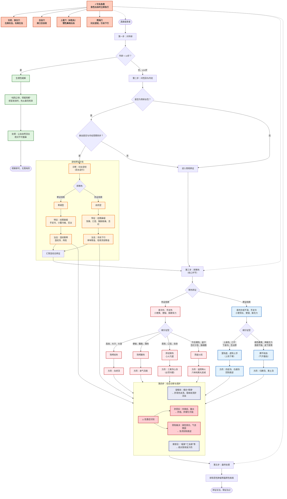

# 倪海厦论鼻衄（流鼻血）全解：从生理自愈到妇科逆经，从急救针灸到生死危症

## 一、核心总纲：鼻衄的根本原理

在倪海厦老师的学术体系中，流鼻血的核心病机可归结为一句话：

> **“阳不固阴，血热离经”**

- **阳**：指身体固摄血液的功能，涵盖心阳、脾阳、卫气等。
- **阴**：指血液本身。
- **血热**：指血液中有热（实热或虚热），热迫血妄行。
- **离经**：血液离开正常循行的经脉。

所有鼻衄的病因病机，皆围绕 **“热迫”** 与 **“阳虚不固”** 两大主线展开。

---

## 二、分类详解：从生理到病理，从轻到重

### （一）生理性、良性鼻衄（无需治疗）

此为倪师反复强调、最具特色的观点，多见于**14岁以下健康儿童**。

#### 1. 纯阳之体，自我调节

- **原因**：14岁以下孩童属“纯阳之体”，阳气旺盛。感冒发烧时，体热与表寒交战，若毛孔闭塞（表邪束表），体内热无处宣泄，便向上从鼻窍（肺之窍）破血而出。
- **特征**：一流鼻血，烧即退，感冒自愈。倪师称之为 **“得衄而解”** ，是身体抵抗力强的表现。
- **原文引述**：“所以会流鼻血的小孩没有高烧问题……一流鼻血烧就退了。”
- **处理**：**绝对不可塞住鼻孔！** 让血自然流出，热泄则安。若用棉花塞住，反致热不外泄，引发高烧。

#### 2. 麻黄汤证之“衄解”

- **原因**：太阳伤寒（麻黄汤证），体质强壮者，服用麻黄汤后，正气鼓动，将寒邪与热一起托出，表现为流鼻血。
- **特征**：流鼻血后，头痛、身痛、发热等症状随之消失。
- **原文引述**：[「太阳病」，脉浮紧，无汗发热，身疼痛，八九日不解，表证仍在，此当发其汗。「麻黄汤」主之。服药已，微除，其人发烦，目瞑，剧者必衄，衄乃解。所以然者，阳气重故也。](https://acuherb.xyz/posts/shanghanlun-51/#%e4%ba%94%e4%b8%80%e5%a4%aa%e9%98%b3%e7%97%85%e8%84%89%e6%b5%ae%e7%b4%a7%e6%97%a0%e6%b1%97%e5%8f%91%e7%83%ad%e8%ba%ab%e7%96%bc%e7%97%9b%e5%85%ab%e4%b9%9d%e6%97%a5%e4%b8%8d%e8%a7%a3%e8%a1%a8%e8%af%81%e4%bb%8d%e5%9c%a8%e6%ad%a4%e5%bd%93%e5%8f%91%e5%85%b6%e6%b1%97%e9%ba%bb%e9%bb%84%e6%b1%a4%e4%b8%bb%e4%b9%8b%e6%9c%8d%e8%8d%af%e5%b7%b2%e5%be%ae%e9%99%a4%e5%85%b6%e4%ba%ba%e5%8f%91%e7%83%a6%e7%9b%ae%e7%9e%91%e5%89%a7%e8%80%85%e5%bf%85%e8%a1%84%e8%a1%84%e4%b9%83%e8%a7%a3%e6%89%80%e4%bb%a5%e7%84%b6%e8%80%85%e9%98%b3%e6%b0%94%e9%87%8d%e6%95%85%e4%b9%9f)
- **处理**：衄后病愈，无需再服药。

---

### （二）病理性鼻衄（需要辨证治疗）

#### 第一大类：热证（血中有热，迫血妄行）

| 证型 | 病机 | 特征 | 方药 |
|------|------|------|------|
| **阳明经热** | 热在阳明经（血脉神经之中），热势亢盛，上冲鼻窍 | 高烧、大汗、大渴、脉洪大；鼻血量多、色鲜红 | 白虎汤 |
| **阳明腑热** | 大便燥结于肠中，浊热不下，反而上攻 | 便秘、腹胀、潮热（午后3-5点）、谵语；口臭、苔黄厚 | 承气汤类 |
| **肝经郁热 / 心火亢盛** | 情志不畅，肝气郁结化火；或心火过旺，移热于肺 | 易怒、目赤、口苦、胁痛；心烦、失眠、舌尖红 | 三黄泻心汤（冷服） |
| **阴虚火旺** | 肝肾阴液不足，虚火上炎 | 夜间盗汗、午后潮热、口干咽燥、舌红少苔、脉细数；鼻血反复发作 | 滋阴降火（如六味地黄丸加减） |

**季节与经络热**：

- **太阳经热**：多见于冬季至春季，外感风寒，阳气抗邪于表，郁而化热致衄。
- **阳明经热**：多见于夏季至秋季，内热加天时之热，两热相加致衄。
- **原文引述**：“从冬至春，衄者太阳；从夏至秋，衄者阳明。”

---

#### 第二大类：虚寒证（阳虚不固，血不归经）

> **此为最易误诊之关键！** 倪师强调，很多流鼻血并非热证，而是虚寒。

| 证型 | 病机 | 特征 | 方药 |
|------|------|------|------|
| **里阳虚，虚阳上浮（上热下寒）** | 肾阳或脾阳虚衰，阴寒内盛，虚阳被逼浮于上（头面） | 上身热、口干、流鼻血，但下身冰冷、小便清长、便溏、舌淡胖；喜热饮或不欲饮 | 四逆汤、白通汤等回阳救逆 |
| **脾不统血（气不摄血）** | 脾气虚弱，不能统摄血液 | 面色萎黄、神疲乏力、食欲不振、皮下易瘀青；鼻血渗渗而出，色淡 | 归脾汤、黄土汤 |

---

#### 第三大类：妇女逆经（倒经）—— 妇科特殊病机

此为倪师理论中极具特色、关乎大病预防的重要内容。

- **核心理论**：月经本质为心脏产生的“奶水”，应下行至子宫。若通道因寒凝或血热堵塞，则逆而上行，从鼻而出。

- **辨证分型**：

| 证型 | 特征 | 治法 |
|------|------|------|
| **寒凝型** | 经期鼻衄，伴手脚冰冷、小腹冷痛、舌淡 | 温经散寒 |
| **血热型** | 经期鼻衄，量多色红，伴急躁、口苦、胸胁胀痛、舌红苔黄 | 凉血下行（倪师云：“单味药的郁金给她吃了就会好。”） |

- **深远危害**：逆行的“奶水”可停滞于肺、心、骨髓、淋巴，分别导致肺癌、红斑狼疮、血癌、淋巴癌。因此，**逆经是重大疾病的早期信号**。

- **治法**：
  - **针灸**：照海穴（通阴𫏋脉，引血下行）
  - **中药**：桂枝茯苓丸、温经汤化裁，或桂枝汤加郁金

---

#### 第四大类：特殊禁忌与危重症

| 类别 | 病机 | 特征与处理 |
|------|------|------------|
| **“衄家”不可发汗** | 常流鼻血者阴血已亏，汗血同源，误汗则重伤阴液 | 危症：额上陷、脉紧急、直视不能眴、不得眠 |
| **“淋家”“疮家”“亡血家”不可发汗** | 阴血津液已伤者，发汗会诱发或加重出血 | 禁忌同上 |
| **肝阴实重症（肝癌、肝硬化）** | 肝脏病变（阴实），无法藏血，血液涌入心肺，致静脉破裂 | 伴黄疸、腹水、蜘蛛痣；出血量极大 |
| **阴阳离决危症** | 大病末期，阳无法固阴，阴血脱失 | 面色惨白、气息微弱、但头汗出；急需大剂回阳救逆或益气固脱 |

---

## 三、诊断与鉴别要点（倪师心法）

### 1. 首辨寒热

| 维度 | 热证线索 | 寒证线索 |
|------|----------|----------|
| **口渴** | 喜冷饮 | 喜热饮或不渴 |
| **手足** | 手足心热 | 手足冰冷（即使上身热） |
| **二便** | 小便黄赤、便秘 | 小便清长、便溏 |

### 2. 关键体征——眼白“晕黄”

- **倪师独门望诊**：观察眼白是否浑浊发黄（晕黄）。
- **意义**：晕黄代表肝肾有热，衄血病根未除；晕黄退去，目睛清澈，代表热退衄止。
- **原文引述**：“目睛晕黄，衄未止；晕黄去，目睛慧了，知衄今止。”

### 3. 脉诊定乾坤

| 证型 | 脉象 |
|------|------|
| **实热** | 脉洪数、浮大有力 |
| **虚寒** | 脉沉迟、细微、无力，或浮大而按之空豁 |

---

## 四、针灸急救与治疗

倪师在针灸教程中给出了立竿见影的方法：

| 穴位 | 定位 | 主治 | 针法 |
|------|------|------|------|
| **天府穴、侠白穴** | 臂内侧，腋前纹头下3寸（天府），下4寸（侠白） | 急性鼻衄 | 左鼻流血针右手，右鼻流血针左手；直刺，得气后血立止 |
| **合谷穴** | 手背第1、2掌骨间 | 头面部出血 | “面口合谷收” |
| **上星穴** | 前发际正中直上1寸 | 慢性鼻病、鼻窦炎所致出血 | 米粒灸 |
| **照海穴** | 内踝尖下方凹陷处 | 妇女逆经 | 通阴𫏋脉，引血下行 |

---

## 五、总结：倪海厦流鼻血辨证心法完整流程图

---

## 六、重要提醒

> **反复、大量、无故的鼻出血**，或伴有严重全身症状（如消瘦、高热、肝病体征），**必须立即就医**，排除血液病、肿瘤、严重肝病等器质性疾病。

---

---

> 作者: [AcuHerb](https://acuherb.xyz/)  
> URL: https://acuherb.xyz/posts/nihaixialunbinue/  

