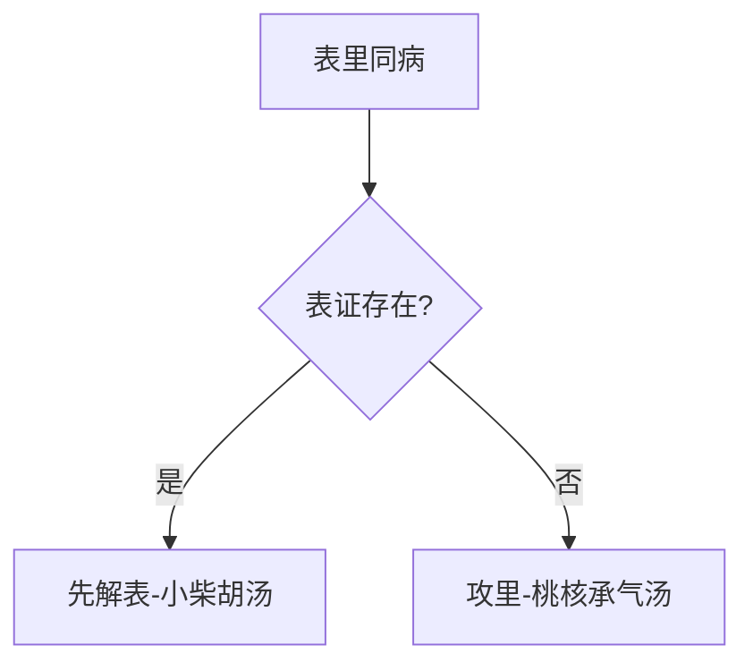

# 辨太阳病脉证并治法中：一一九

## 一一九：「太阳病」不解，热结膀胱，其人如狂，血自下，下者愈；其外不解者，尚未可攻，当先解其外，外解已，但少腹急结者，仍可攻之，宜「桃核承气汤」。

<!--more-->

太阳病不解就是还有太阳病的表证，还有表热没好，桂枝汤、葛根汤、麻黄汤发表的时候没有发出去，这病毒直接从经进入腑，从皮肤表面直接进入膀胱。

腹部的前面是膀胱，中间是精宫，后面是大肠，正常小便出来的水是气化出来的，气化的时候，一部分的水再跑到胆里面，水生木，变成胆汁，气化本来就很热了，当热进入膀胱里面，移热到膀胱，足太阳膀胱经，经络络到膀胱里面，热再进来，太热了血管会破裂，小便就会带血出来，这是一种外证没有好的时候传到里面的现象。

还有一种是打架被踢或运动伤害伤到小便的地方，结果小便堵到了小不出来，里面瘀血，也是一种外伤，用桃核承气汤。

> 或者本来就膀胱有问题，如膀胱结石、膀胱发炎、性病等，一解表发汗，膀胱里的津液没了，小便津液不够，变得很浓稠，则其人如狂。

热结膀胱就是小便太热了，小便带血，桃核承气汤是治疗血症的第一个方子，很浅的方子，其人如狂，并不是发狂，只是情绪烦躁不安，如已发狂的话，桃核承气汤就来不及了，所以是近狂还没到发狂的状态；

血自下，下者愈，如果这个时候小便自己带血下来，就没有关系了，这血通了。

> 一般来说，只要攻下，必须要确定病人没有太阳表症，脉有没有浮。还必须确定你攻的位置对不对。

其外不解者，尚未可攻，当先解其外，解外的时候，用小柴胡汤，因为碰到「腑」上的时候，一定经过中间的三焦，外解已，但少腹急结者，少腹就是在「中极」「关元」一带绷得很紧，病人感觉很痛、很难过，小便小不出来，看皮肤上也是绷得很紧，整个抽筋起来，由这些症状，可以确定血堵在膀胱里面，血下不来。

> 少腹急结者，可能是膀胱、子宫精宫、淋巴结。血结膀胱，一定小便不利。

> 桃核承气汤，是治疗血症，淤血第一方。唐容川，写了一本血证论，很好，认为久病必有淤。

瘀血者血液已越出血管之外，失其血液之性能而成为死血，在医学名词上为瘀血；

死血在生理上不但已失作用，且能遗害于全身，一但化成毒质，刺激脑神经使其发生错乱，或使血液不清洁，发生种种病变，如皮肤病、疡疮、潮热，以及攻冲性、游走性之疼痛诸疾病；

凡属一切急慢性病证与奇病怪疾，临床上久看不好的病，一定是有瘀血在里面，吾人有很多方法，教导如何去辨别，如何知道里面血瘀到了，桃核承气汤、下瘀血汤、抵挡丸汤、桂枝茯苓丸、大黄蟅虫丸等皆为治瘀血之良剂。

桂枝茯苓丸专门用作妇人子宫肌瘤、卵巢瘤的时候用，大黄虫丸腹腔里面有瘀血的时候用，下瘀血汤胸腔里面有瘀血内伤的时候用。

临床上遇到少腹痛的时候，记得先问小便是否正常；举例来说，如果有妇女在月经期间腹痛来找你治疗，你忘了问小便，结果以为是月经引起的腹痛，其实可能是刚好这几天她的膀胱结石引起腹痛，如此处方用药就不正确了。

> [!TIP]**桃核承气汤方**
>
> 桃仁五十个去皮尖 | 桂枝二两 | 大黄四两 | 芒硝二两 | 甘草二两炙
>
> 右五味，以水七升，煮取二升半，去滓，納芒硝，更上火微沸，下火。先食溫服五合，日三服，當微利。

> 外伤踢、撞到阴部、睾丸、膀胱用的最多。

> 桃仁三钱，桂枝二钱，大黄四钱，芒硝二钱，炙甘草二钱。

> 大黄、芒硝、炙甘草，就是调胃承气汤。

> 一般人想到活血化瘀，开丹皮，开很多牛膝，红花。张仲景就用很多桂枝活血化瘀，用桂枝辛香发散，入心脏，让心脏喷射力量加强，能把血喷出来，有心脏动脉的血推动，桃仁这种攻淤的药，攻淤破淤会更强。

脉当为沉，或弦细；舌则红中带紫，苔或白或黄。脉以细，舌以紫青，为瘀血之侯。

> 只要看见一个年轻的小孩子，弓着身子，弯着身子，抱着阴部进来，就是桃核承气汤。

**判断瘀血的方法**

- 一、血会「膈俞」，病人一定会有「膈俞痛」，督脉第七椎外开一寸半，就是「膈俞穴」。

- 二、舌有齿痕，舌头上有牙齿的痕迹，因为舌为心表，心主血，身上循环系统很好的时候，舌头会很光润，循环不好的时候，舌头的循环也会跟着不好，舌头跟牙齿贴到，一拉开来，牙齿印还在上面，就代表瘀血，很多都是妇科子宫的问题。

- 三、「血海」痛，足太阴脾经上的「血海穴」会痛。

- 四、「三阴交」有压痛点，「三阴交痛」大多在妇科里面，「三阴交」主腹、少腹的地方。

- 五、更严重的，在肚子上看到一块一块的青紫。

- 六、口渴而不欲饮。

> 嘴巴很干，口渴，但是就是不想喝水。就是有淤血，血液循环不畅。

张仲景在设计桃核承气汤的时候，考虑把瘀血攻下来，而不要把正常的体能伤到，把坏的攻下去，好的留下来，如何这药一吃，刚好把瘀血攻下来?所以桃核承气汤主要是靠桃仁和桂枝，桃仁专门破血，行血化瘀，所以桃仁用的很多，包括生化汤里面都有桃仁，桃核承气汤实际上就是利用调胃承气汤加减而成。张仲景破除瘀血的时候，会利用桂枝强心、辛香发散的特性，来加强心脏推动血液的力量，然后配合其它破瘀血的药，如此破除瘀血的力量就会增强。

临床上，遇到久病的病人，想要开补血药的时候，记得要先去瘀血，所谓「瘀不去，新不生」，不是一味地开补药就好。

> 所以我们治疗贫血，只补血，给你四物汤，八珍汤，一定要同时去淤血，活血化瘀。有淤血的时候，还不受补，反而吃了更难受。

### 病机传变与临床表现
1. **传变路径**：
   - 太阳表证未解→热邪内陷→结于膀胱
   - 特殊传变：外伤直接导致膀胱瘀血

2. **核心症状群**：
   - 精神症状：其人如狂（烦躁近狂）
   - 局部体征：少腹急结（关元、中极穴区紧绷疼痛）
   - 排泄异常：小便不利或血尿
   - 舌脉特征：
     - 舌质紫暗有齿痕
     - 脉沉弦或细涩

### 治疗策略与禁忌
#### 分步治疗原则

#### 治疗禁忌
- 绝对禁忌：表证未解时径用攻下
- 相对禁忌：
  - 正气虚极
  - 妊娠期（需配伍安胎药）

### 桃核承气汤方解
#### 组成与剂量
**经方原量**：
- 桃仁50个（约15g）
- 桂枝6g
- 大黄12g
- 芒硝6g
- 炙甘草6g

**现代常用量**：
- 桃仁10-15g
- 桂枝6-10g
- 大黄6-12g
- 芒硝3-6g（冲服）
- 炙甘草6g

#### 配伍特点
1. **核心药对**：
   - 桃仁+桂枝：破血行瘀
     - 桃仁：直接破瘀
     - 桂枝：增强心阳推动力

2. **承气底方**：
   - 调胃承气汤（大黄、芒硝、甘草）
   - 作用：通腑泻热，给邪出路

#### 煎服要点
- 先煎四味→去滓→纳芒硝微沸
- 饭前温服（先食服）
- 见效标准：微利为度

### 瘀血辨证要点
#### 诊断指征
1. **穴位诊察**：
   - 膈俞穴压痛（第七胸椎旁开1.5寸）
   - 血海穴压痛（脾经）
   - 三阴交压痛

2. **舌象特征**：
   - 紫暗舌
   - 明显齿痕
   - 瘀斑瘀点

3. **特殊症状**：
   - 口渴不欲饮
   - 皮肤甲错
   - 局部青紫

### 临床拓展应用
1. **急症范围**：
   - 外伤性膀胱瘀血（阴部撞击）
   - 急性膀胱炎伴出血
   - 热性病发狂前期

2. **慢性病应用**：
   - 顽固性痛经
   - 子宫肌瘤初期
   - 前列腺增生伴瘀热

3. **治疗原则**：
   - "瘀不去，新不生"理论
   - 治贫血必先祛瘀
   - 久病怪病多瘀

### 类方鉴别
| 方剂           | 主治重点               | 组成特点               |
|----------------|------------------------|------------------------|
| 桃核承气汤     | 膀胱/下焦瘀热          | 含桂枝、调胃承气底方   |
| 桂枝茯苓丸     | 子宫肌瘤/卵巢囊肿      | 平和缓消               |
| 大黄䗪虫丸     | 干血痨/深层瘀血        | 虫类药攻瘀             |
| 下瘀血汤       | 胸腹部外伤瘀血         | 专攻局部瘀结           |

> **临床注意**：本方为瘀热互结实证而设，若见脉微肢冷等虚寒证，当改用温经汤类方剂。服药后当以"微利"为效验标准，不可过剂伤正。

---

> 作者: [AcuHerb](https://acuherb.xyz)  
> URL: https://acuherb.xyz/posts/shanghanlun-119/  

