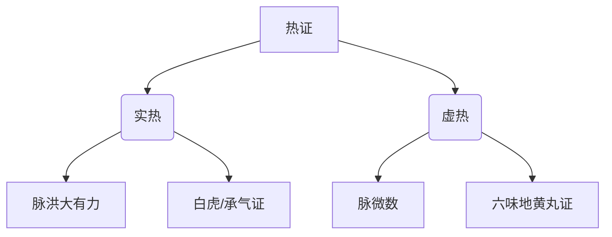

# 辨太阳病脉证并治法中：一二九

## 一二九：微数之脉，慎不可灸：因火为邪，则为烦逆，追虚逐实，血散脉中，火气虽微，内攻有力，焦骨伤筋，血难复也。

<!--more-->

> 只有虚寒时才会用艾灸，比如吃什么拉什么不消化，有热，都不用艾灸，比如发烧、便秘等。

微代表是虚，但跳的是数脉，数代表的是热，所以微数之脉就是病人是虚热的体质。

白虎汤证是讲阳明经热，热在经脉里面，就是白虎汤；

如果是阳明腑热，热在腑里面，热在大肠、小肠、膀胱，热在消化系统里面，就是承气汤证。

白虎汤和承气汤都是实热的范围，脉都是很数，但是脉会洪大，不会微细。

实热跟虚热不一样，实热要攻实，把去实和去热的药加在一起，就可以攻了；

虚热要把去热的药加在里面，还要把补虚的药加在里面，像吃六味地黄丸，六味地黄丸没有什么补，桂附八味丸里面的肉桂和附子下去会很热，像虚热的人吃桂附八味丸，虚热会更热，会嘴巴燥裂，桂附八味丸本来是为了补虚的，所以吃桂附八味丸要加些去热的药在里面可以加黄连、黄芩在里面；如果是热在血里面，口渴阳明热的话，就加白虎在里面。

虚热的病人不要灸，要寒湿或纯虚的病人才灸，因为火是邪的不是正的，会造成病人虚热而生烦逆。

追虚逐实，血散脉中，并不是虚热的病人灸了以后，血就离开脉了，而是血里面有热力，本来是虚热的人，血量已经不足了，肝里面很热，血的热就要往外跑，一加热的时候，血里面更热、津液更少了，这时候热已经离开血管，跑到旁边的经脉里面去，血还在血管里面，火气虽微，内攻有力，焦骨伤筋，血难复也，结果病人更虚，骨头、筋就都会变得比较枯瘦。

### 脉证辨析
1. **微数脉特点**：
   - 脉微：气血不足（虚）
   - 脉数：内有虚热（热）
   - 此脉提示：阴虚内热之体

### 灸法禁忌原理
| 误灸后果       | 病机解释                     | 临床表现               |
|----------------|-----------------------------|-----------------------|
| 烦逆           | 虚火得灸助而亢逆            | 心烦气逆、坐卧不安     |
| 追虚逐实       | 本虚更虚，邪热更盛          | 虚热症状加重           |
| 血散脉中       | 营血耗散，不归经脉          | 肌肤干燥、筋脉失养     |
| 焦骨伤筋       | 阴血枯涸，筋骨失濡          | 骨瘦筋挛、肢体萎弱     |

### 虚实热证鉴别

### 治疗要旨
1. **虚热调理原则**：
   - 滋阴清热（甘寒养阴配苦寒清热）
   - 忌用辛温助火之品

2. **方药举例**：
   - 基础方：六味地黄丸
   - 加减：
     * 上焦热：加黄芩、黄连
     * 血分热：加知母、黄柏
     * 津伤甚：加麦冬、五味

### 临床警示
1. **灸法适用证**：
   - 纯虚寒证（脉沉迟、畏寒、便溏）
   - 寒湿痹证（关节冷痛、遇寒加重）

2. **误灸变证**：
   - 初期：烦热口渴
   - 中期：肌肉消瘦
   - 后期：筋骨萎废

### 预后转归
- **早期纠正**：滋阴清热可复
- **延误失治**：
  - 阴血难复
  - 成痿躄之证

> 注：本条与《金匮要略》"阴虚阳亢，慎用火攻"之训相互发明，强调"辨证施灸"的重要性。虚热误灸导致的"焦骨伤筋"，与现代医学所见骨质疏松、肌萎缩等病症有相通之处。

---

> 作者: [AcuHerb](https://acuherb.xyz)  
> URL: https://acuherb.xyz/posts/shanghanlun-129/  

