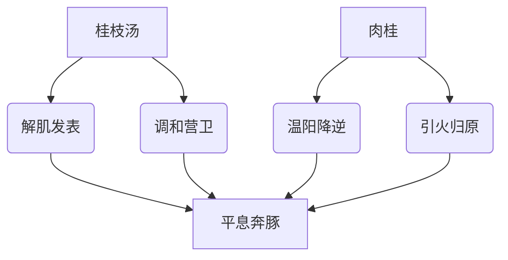

# 辨太阳病脉证并治法中：一三一

## 一三一：烧针令其汗，针处被寒，核起而赤者，必发「奔豚」，气从少腹上冲心者，灸其核上各一壮，与「桂枝加桂汤」。

<!--more-->

对皮肤表面上的脓头，可以用火罐拔掉。

有的脓头在肌肉很深的地方，在过去的脓疡科，把针烧红了以后，刺进皮肤裹面，直接刺到脓头裹面，来发它的脓疡，北派的医生用白朮和附子，就是「术附汤」，金匮里面还有一个「阳和汤」，都是能够让内部的脓疡发表发出来，不管是癌症、骨头烂掉的，都能让里面的浊物清出来，浮到皮肤表面上，应该要这样做才对。

烧针令其汗，针处被寒，医生用烧针来烫，让病人发汗，其实病人原本有伤寒，譬如有寒证，要从里面发出来比较好，用药去攻比较好，结果医生用烧针，例如温针，艾草放在针上面烧，一烧，寒一遇到热，寒就往里面走，而不是往外走。

临床上看，发奔豚的时候，都是在右边的「天枢」开始发，其实奔豚是大肠里面本来有燥屎，干燥的大便在里面，平常不知道，有的时候大便鞭，或大便像羊屎一样没注意它。

实际临床上，此类病人都是惊发的，病人本身很胆小一扎针的时候本来就很怕了，又担心艾草掉下来会烫到，一直在惊，实际上奔豚证就是惊发，奔豚气从腹部一直上来，像手臂一样粗，一直冲上来，看起来像心脏病，痛得受不了，但又不会死，心脏本身好好的，因为人一受惊发，肠子必会筋挛起来，大便的燥气因而跑到肠壁外面的三焦油网里面去了，进入三焦油网渗入血管里面，大便的废气如果跑到脑里面，就会捻衣摸床、谵语、发狂奔走。

如果透过血管跑回肝脏，由肝脏就会影响到心脏跑到血管里面，顺沿着血脉流回心脏，流回心脏以后就会有发奔豚的现象，因为血里面不受气，大肠的燥气流到心脏去了，就发奔豚，所以张仲景看这人原本没有便秘，肠胃功能可能比较差一点，处方开桂枝加桂汤，本身用桂枝汤和解营卫因为是肠子的问题，肠子的浊气从静脉血管跑到心脏里面去了。

桂枝加桂汤，这桂就是肉桂，平常肉桂加五分八分一点点就够了，加肉桂让心脏喷射力量很强，浊气一进到心脏以后，马上从动脉喷走，硬把浊气逼回肠子里去，然后桂枝汤去和解营卫，让肠胃蠕动很好，同时因为他还有伤寒表证。

临床上，看到发奔豚的时候，知道是大肠气在发，要把肠气逼回到血管里面去从血里面再回三焦，再回肠子里面去，就是靠心脏喷出来进入动脉血管的力量，所以是靠桂枝加桂汤。所以第一个处理奔豚的汤方就是桂枝加桂汤。

另一种奔豚的症状，是本来有宿便的人，受到惊吓以后，燥屎的沼气透过肝脏与大肠的血管进入肝脏，所以肝脏送给心脏的血中就会有沼气，心脏就想把沼气往外推，于是就动悸的很厉害，就发奔豚。

方中行曰：「奔豚」肾之积名也。「肾从少腹上冲心」，「奔豚」证发作之状也；盖人之素有肾积者，因针穴处寒得入之，其积逐发，则气自少腹上逆而冲心，状若惊豚突前而奔走，故曰「奔豚」。

实际上就是大肠里面的燥屎，其浊气进入肠壁里面，进入血管冲到心脏里面，才会有这种现象。

还有一种乃针孔发生炎肿或成「破伤风症」也；看起来像奔豚，实际上是破伤风症，病毒侵入身体里面去了，这时候要加强心脏力量，把免疫系统带出来的时候。也是靠桂枝加桂汤，然后可以配合针灸课程中提过的灸法，用隔姜灸；

> 摸到生锈的钉子，破伤风在手指，很痛，一条红线从指肚下到手掌再到内关，在内关上一寸处开始艾灸，手指肚也开始艾灸，灸到第三壮红线已经退回手掌了，再灸后红线过了劳宫就不再艾灸了，之后就会自己好了。

临床上桂枝加桂汤，如果用桂枝，就是桂枝汤里面原本桂枝是三钱，白芍三钱，现在桂枝用六钱，这样力量不好，所以要同样用桂枝汤，桂枝白芍等量，但是加桂是加肉桂，桂枝肉桂是同样的东西，肉桂是桂树的心，桂枝是桂树的皮；肉桂很油很香很浓，肉桂喷发的力量才够，有时候重用桂枝三四剂下去，病人还是奔豚，加肉桂下去一剂就去掉了，二者差很多。

> [!TIP]**桂枝加桂汤方**
> 即桂枝汤加桂枝二两

这汤剂争议很多，有的赞成桂枝，有的赞成肉桂，但临床上看，肉桂极有效，用桂枝汤加肉桂，肉桂用五分，严重的用八分，不需要用到一钱，因为会太辣了。

> 肉桂强心的力量更强，增强喷发的力量。

> 喝桂枝汤时，把肉桂粉冲下去，喝掉。桂枝汤除了解肌，还可以补肠胃津液，加速血液循环。

> 意大利的咖啡里都会放一点肉桂粉，主要靠咖啡补充一下津液，防止肉桂伤到津液。不过咖啡会造成胰脏癌，不要常喝。

> 小编：感觉意大利人也知道单纯喝咖啡不好，用一点肉桂补充阳气，防止得癌症，是人类本能的直觉。

### 基本病机
1. **误治过程**：
   - 烧针发汗（不当汗法）
   - 针处受寒（寒邪内陷）
   - 核起而赤（局部气血郁滞）

2. **传变特点**：
   - 寒邪内陷→扰动下焦
   - 浊气上逆→发为奔豚

### 典型证候
| 主要症状         | 病机解释                     | 鉴别要点               |
|------------------|-----------------------------|-----------------------|
| 气从少腹上冲心   | 浊气循经上逆                | 与真心痛鉴别           |
| 针处核起色赤     | 火毒郁结皮下                | 区别于普通针孔反应     |
| 发作性悸动       | 惊则气乱，引动伏邪          | 与癫痫发作鉴别         |

### 治疗法则
1. **外治法**：
   - 灸核上各一壮（温散局部寒凝）

2. **内服方**：
   - 桂枝加桂汤（重点在肉桂而非桂枝）
     * 桂枝汤：调和营卫
     * 加肉桂：引火归元，降逆平冲

### 方药详解

### 临床要点
1. **肉桂运用关键**：
   - 用量：3-5分为宜（约1-1.5g）
   - 用法：研末冲服效力最佳
   - 配伍：配甘草护胃和中

2. **鉴别诊断**：
   - 真性奔豚（浊气上逆）
   - 破伤风症（外邪深陷）
   - 心脏本脏病（持续心悸）

### 预后转归
- **向愈指征**：
  - 冲气渐平
  - 核肿消退
- **恶化征兆**：
  - 发作频繁
  - 神志昏蒙

### 现代启示
1. **类似情况**：
   - 不当针灸治疗后的异常反应
   - 惊恐诱发的功能性胃肠病

2. **治疗拓展**：
   - 可用于肠易激综合征（腹泻型）
   - 治疗某些功能性心律失常

> 注：本条揭示"惊发奔豚"的特殊病机，体现中医"心与小肠相表里"的理论，为情志致病提供重要治疗思路。肉桂的特殊运用方法，值得现代临床借鉴。

---

> 作者: [AcuHerb](https://acuherb.xyz)  
> URL: https://acuherb.xyz/posts/shanghanlun-131/  

