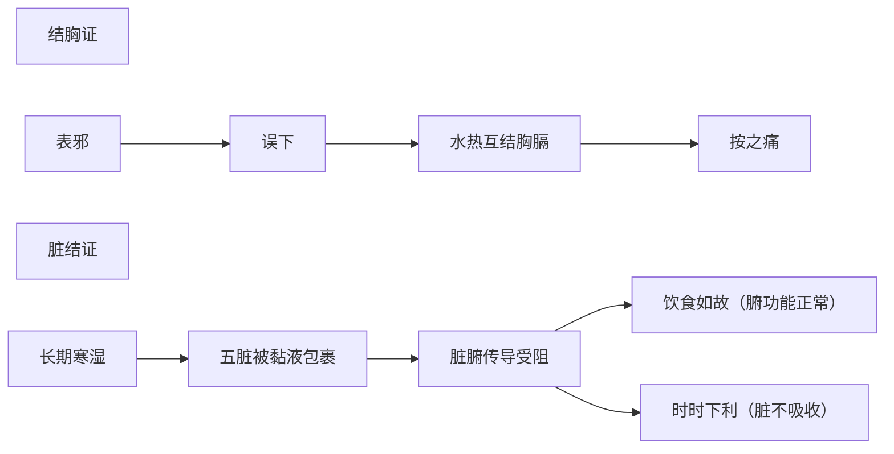

# 辨太阳病脉证并治法下：一四二

## 一四二：问曰：病有「结胸」，有「藏结」，其状何如？答曰：按之痛，寸脉浮，关脉沉，名曰「结胸」也。何谓「藏结」？答曰：如「结胸」状，饮食如故，时时下利，寸脉浮，关脉小细沉紧，名曰「藏结」；舌上自苔滑者，难治。

<!--more-->

寸是指胸，是阳，寸脉浮代表结在上面，关脉沉代表病在胸膈以上，不过中焦。

> 结胸、藏结的脉很像，很难区分。实际上脏结的时候，腑对应的脏为表里，应该是相通的，但是现在有个寒湿在二者中间，像白痰一样粘稠的梗在中间。所以，脏结的成因是慢慢累积起来的。结胸，很快形成的。

> 脏结成因，比如久居湿地；或汗经常不透发，在空调房运动健身，运动就要到户外去接受天地自然之气，就算被正气所伤，也是病在表，很好治，夏天在空调房健身，不好；或者就是养尊处优，常年不流汗不运动。

> 结胸成因，张仲景认为是误治，应该发表，却被攻下了，表面的停水应该发汗掉，因为攻下后水往下走，跑到肺中、心窝，才会结胸。

何谓藏结？如果脾藏的湿渗到关节里面就是风湿，如果湿很盛，病人的体质寒冷，就是没有什么功能，动能不够。

本身湿再遇到寒，慢慢把五脏肝、心、脾、肺、肾，整个外面的一层被黏液都包住了这时候「脏」都没有吸收功能了。

「腑」是消化系统，饮食如故，所以腑没有问题。

脏有问题腑和脏之间的管道都被寒湿包住，时时下利，腑的食物营养要给脏，脏不受，所以通通跑出来了，下利出来的都是食物的精华。

所以关脉小细沉紧，舌头白白滑滑，舌苔黏厚，黏滑代表湿，舌苔上的白代表寒，寒湿结在里面，这种很难治，要开很热的药，用生附，炮附，生姜等热药。病人吃下去的时候很冷，半夜的时候胃气回来，会饿代表脾脏功能恢复了。

### 基本概念对比

| 特征        | 结胸证                     | 脏结证                     |
|-------------|---------------------------|---------------------------|
| **病位**    | 胸膈部位（阳位）          | 五脏周边（阴位）          |
| **形成速度** | 急性（误治后快速形成）    | 慢性（长期寒湿累积）      |
| **病理特点** | 水热互结                  | 寒湿壅滞                  |

### 诊断要点

#### 结胸证
1. **典型表现**：
   - 按之痛（胸膈部压痛）
   - 寸脉浮、关脉沉
2. **形成机制**：
   - 误用攻下法→表邪内陷
   - 水热互结于胸膈

#### 脏结证
1. **典型表现**：
   - 如结胸状（类似胸膈不适）
   - 饮食如故（消化功能尚可）
   - 时时下利（完谷不化）
   - 舌苔白滑（寒湿征象）
   - 关脉小细沉紧
2. **形成机制**：
   - 长期寒湿环境（久居湿地）
   - 汗出不彻（空调房运动）
   - 体质虚寒+湿浊内困

### 病机示意图

### 治疗原则

1. **结胸证**：
   - 主方：大陷胸汤/丸（泻热逐水）
   - 关键：及时攻逐水热

2. **脏结证**：
   - 治疗难点：
     - 寒湿胶着难化
     - 需长期温化
   - 用药特点：
     - 重用生附子、炮附子（温阳）
     - 配伍生姜（散寒）
     - 可加白术、茯苓（健脾化湿）
   - 疗效判断：
     - 胃气恢复（夜间饥饿感）
     - 舌苔由白滑转薄白

### 预防调护建议

1. **结胸预防**：
   - 太阳病慎用攻下法
   - 表证当先解表

2. **脏结预防**：
   - 避免久处湿冷环境
   - 运动应出透汗（忌空调房剧烈运动）
   - 定期发汗排湿

> **临证注意**：脏结证见舌苔白滑、脉象沉紧者，提示寒湿深重，治疗需有方有守，非短期可愈。当以"阳化气"为基本原则，循序渐进。

---

> 作者: [AcuHerb](https://acuherb.xyz)  
> URL: https://acuherb.xyz/posts/shanghanlun-142/  

