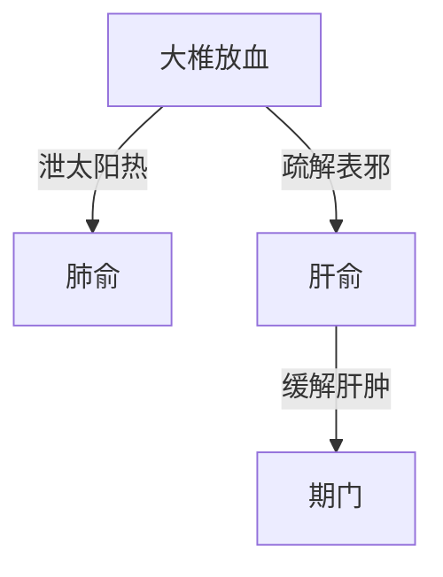

# 辨太阳病脉证并治法下：一五七

## 一五七：「太阳」与「少阳」并病，头项强痛，或眩冒，时如「结胸」，心下痞鞭者，当刺「大椎」第一间、「肺俞」「肝俞」慎不可发汗。发汗则谵语，脉弦，五六日谵语不止，当刺「期门」。

<!--more-->

> 只有纯太阳病才会去发汗发表。不能确定只是太阳病，就不要发汗，先大椎放点血，让热消导一下，再观察一下。

太阳与少阳并病，张仲景只有这一条不能用小柴胡汤。

照理说太阳与少阳并病，小柴胡汤就好了。

如果病人头项强痛，太阳病证有了，或眩冒，头昏，时如结胸，并不是真正的结胸，看起来好像结胸，胃里面很难过，心下痞鞭者，胃里面硬硬的，看起来是。

这里为什么是小柴胡汤的禁忌？这病人在没有得病的时候，本来他胃的津液就是虚的，胃肠津液虚掉的人，平常喝水喝的很多，喝多了又不能止渴，一直在喝的人，就是胃肠津液本来就不够的人，前面讲的就是胃的津液虚，所以如果开小柴胡汤和解的方子，小柴胡汤大剂下去，病人也会流汗的。

遇到这种情形的时候先刺大椎第一间，泄太阳的热，大椎穴放血，三阳会在大椎，所以大椎穴放血的时候，太阳的热会退掉。

为什么扎肺腧？头项强痛，因为肺气无法出，表热不能散，这时候胸阳的热往上冲，造成头痛，扎肺俞让他能解表；

为什么扎肝俞？因肝肿起来；

平常为什么胃的津液不足要去补足它？因为津液如果不足，血里面会太热，血里面的水不够，这时候肝会肿起来，因为肝是最后的血脏，血藏在肝里面，心生血、肝藏血，其实是肝肿起来了，不是小柴胡汤证，肝肿起来顶到胃了，所以胃的地方会硬，这时候扎肝俞，让血里面的热出来，肝里面的血会出来。

所以他不是真正的少阳证，病人津液伤到的时候，可以看的到，所以给病人发汗剂的时候，要先看病人的嘴唇，嘴唇干，就不可以给发汗，发汗则谵语。

> 张仲景，又可以叫张期门，什么都刺期门，身上那么多其他穴道都不用。

为什么一发汗会谵语？一般来说，病人壮热的时候，脑神经就不是很正常，会胡言乱语，脉弦，五六日谵语不止，当刺「期门」，就是肝肿起来了。

> 谵语不止，可能是脑膜炎，大便堵了等等，我们不会用期门，支沟、照海，天枢啊，都可以。

例：有个病人，整个嘴都干裂掉了，脸上冒青春痘，开炮附子三钱，生附一个，干姜三钱，三帖，这个病人平常喝水都不能止渴，因为是虚热，这么热的药下去后就不渴了，这个病人的舌苔是白滑，所以是脏结药下去后，会大下，湿从大便排出来了。

### 1. 核心病机
- **两经同病特点**：
  - 太阳表证未解（头项强痛）
  - 少阳枢机不利（眩冒、心下痞硬）
  - 特殊表现：时如结胸（非真结胸）

### 2. 鉴别诊断
| 鉴别点        | 本证              | 小柴胡汤证        |
|---------------|-------------------|-------------------|
| 病机          | 胃肠津液本虚      | 少阳枢机不利      |
| 口渴特点      | 饮水不止渴        | 口苦咽干          |
| 触诊          | 肝肿顶胃（假性痞）| 胸胁苦满          |
| 治疗禁忌      | 绝对禁汗          | 可和解兼汗        |

### 3. 针刺治疗方案
**主穴组合**：

- **操作要点**：
  1. 大椎穴刺络放血（三阳经交会）
  2. 肺俞解表宣肺（治头项强痛）
  3. 肝俞泄血分热（治肝肿顶胃）
  4. 谵语不止加刺期门（肝募穴）

### 4. 治疗禁忌与误治变证
- **绝对禁忌**：发汗
  - 误汗后果：
    - 津伤化燥→谵语
    - 肝热更甚→脉弦持续
    - 5-6日不解需刺期门救逆

- **津液判断指征**：
  > "唇干不可汗"原则：
  - 嘴唇皲裂
  - 舌苔白滑
  - 饮水不止渴

### 5. 临床案例启示
**阳虚津伤案**：
- 主诉：口唇干裂伴痤疮
- 特殊表现：大量饮水不解渴
- 舌诊：白滑苔（脏结征象）
- 治法：温阳化湿
  - 方药：生附子1枚+炮附子9g+干姜9g
  - 转归：湿从大便出而渴止

### 6. 现代应用提示
1. **鉴别要点**：
   - 排除真结胸（无实热证）
   - 区分肝源性痞硬与胃实质性病变

2. **延伸思考**：
   - 类似证候可见于：
     - 慢性肝病合并感冒
     - 自主神经紊乱伴表证
     - 电解质紊乱患者外感时

> 注：本证特殊处在于虽现"少阳样症状"，实为津伤血热导致的假性少阳证，故为小柴胡汤禁忌证。

---

> 作者: [AcuHerb](https://acuherb.xyz)  
> URL: https://acuherb.xyz/posts/shanghanlun-157/  

