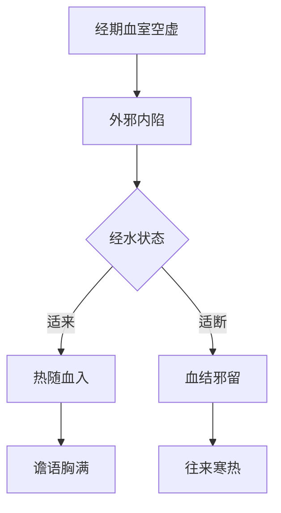

# 辨太阳病脉证并治法下：一五九

## 一五九：妇人「中风」，七八日，续得寒热，发作有时，经水适断者，此为「热入血室」，其血必结，故使如「疟」状，发作有时，「小柴胡汤」主之。

<!--more-->

扎了「期门」，后面就是小柴胡汤证，前一条得了感冒以后，中间来了月经，这条是妇人得了感冒，本来已经好了，刚好月经停的时候，那天又得了感冒这也是热入血室，其血必结，血液循环就不是很好，包括肝脏的循环不是很好，滤过性病毒跑进去了。

如果这血结在那边，一定带有很多病毒，堵到了，肝里面有很多血管，要把血输出来，通利的时候病人就发热，不通的时候，就是出不来的时候病人就发冷状，所以看起来有往来寒热的现象，故使如「疟」状，发作有时，小柴胡汤主之。

> 上面的期门其实也不用刺，就给小柴胡汤。

所以不管是感冒以后月经来了，或是刚好月经断的时候，得到感冒，都是用小柴胡汤来解！

如果开发表的药，可能月经会停掉，因为汗血同源，发汗血就少了，于是月经就停了，也有可能造成逆经，经血从鼻孔来了。

### 1. 证型特点对比

| 证型         | 前条（158条）               | 本条（159条）               |
|--------------|----------------------------|----------------------------|
| **发病时机** | 经水适来（月经刚开始）     | 经水适断（月经刚结束）     |
| **主要症状** | 热除身凉、谵语、胸胁满     | 往来寒热如疟、发作有时     |
| **病机重点** | 邪热乘虚直入血室           | 血结不畅、正邪交争         |
| **治法**     | 刺期门（泻实）             | 小柴胡汤（和解）           |

### 2. 核心病机图解

### 3. 小柴胡汤应用要点
- **辨证关键**：
  - 月经刚结束复感外邪
  - 寒热交替发作（非持续）
  - 发作有定时（似疟非疟）

- **方义解析**：
  - 柴胡：疏解血室郁热
  - 黄芩：清泄半里之热
  - 人参/大枣/甘草：扶正托邪
  - 生姜/半夏：调和胃气

### 4. 治疗禁忌警示
- **禁用发汗**：
  - 可能导致：
    - 月经骤停（汗血同源）
    - 逆经（经血上逆）
    - 血结加重

- **现代对应**：
  - 经期免疫功能波动
  - 激素水平变化期感染

### 5. 临床拓展应用
- **适用场景**：
  - 经期反复发热
  - 产后感染发热
  - 妇科手术后低热

- **加减原则**：
  - 血结甚：加丹皮、赤芍
  - 腹痛：加当归、川芎
  - 热重：加生地、玄参

> 注：本条揭示月经周期不同阶段的外感病特点，确立"血室-少阳"相关理论，为妇科经期外感的标准治法。小柴胡汤通过和解少阳枢机，既能透邪外出，又不伤血分，实为妇科圣方。

---

> 作者: [AcuHerb](https://acuherb.xyz)  
> URL: https://acuherb.xyz/posts/shanghanlun-159/  

