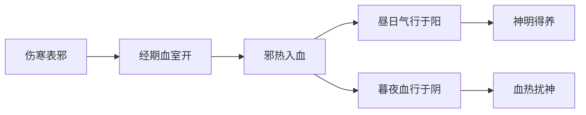

# 辨太阳病脉证并治法下：一六〇

## 一六〇：妇人「伤寒」发热，经水适来，昼日明了，暮则谵语如见鬼状者，此为「热入血室」，无犯胃气及上下焦，必自愈。

<!--more-->

> 伤寒，脉浮紧，无汗，身体痛等。
 
> 伤寒的邪，力量很强，身体正在与之对抗，正好月经来，身体没办法同时应对两种问题，这种情况也可以用小柴胡汤。要不暮则谵语如见鬼状者，也不太好。虽然不治也会好，但是还是要治。

> 如见鬼状，看见家里有人、有鬼，或像受惊。

妇人伤寒发热，感冒，麻黄汤证，来不及吃，月经来了，到晚上就发谵语，因为病毒在血里面。

昼日明了，暮则谵语，如见鬼状者。白天的时候血结在阴，晚上的时候血结在阳，所以病人白天很好，代表「气」没有问题，晚上的时候病人胡言乱语，代表「病」在血里；

平常没有来月经的时候，得到感冒，麻黄汤、葛根汤就好了，不会有谵语。

无犯胃气及上下焦，必自愈，如果不治疗，他也会自己好，用小柴胡汤好得快一点而已，这三条专讲女人，因为男人没有月经，男人的月经在胡子上表现。

### 1. 证候特点
- **昼夜症状差异**：
  - 昼日：神志清醒（气分无伤）
  - 暮夜：谵语如见鬼状（血分受扰）

- **发病条件**：
  - 伤寒表证未解（发热无汗）
  - 经水适来（血室空虚）

### 2. 病机示意图

### 3. 治疗原则
- **三不原则**：
  1. 不犯上焦（忌发汗）
  2. 不犯中焦（忌攻下）
  3. 不犯下焦（忌利水）

- **自愈条件**：
  - 经行通畅
  - 表邪不重
  - 正气尚足

### 4. 可选治疗方案
| 处理方式 | 优点 | 注意事项 |
|---------|------|----------|
| 自愈待期 | 不药而愈 | 需密切观察 |
| 小柴胡汤 | 加速痊愈 | 柴胡用量宜轻 |
| 刺期门 | 泄血分热 | 需专业操作 |

### 5. 性别差异说明
- **女性特有证候**：
  - 经期血室开泄的特殊病理
  - 血热上扰的夜间谵语

- **男性对应现象**：
  > "男子月经在胡须"理论：
  - 胡须生长周期与气血盛衰相关
  - 可作为气血运行观察指标

### 6. 现代临床启示
- **对应疾病**：
  - 经期感染性精神症状
  - 围月经期谵妄状态

- **鉴别诊断**：
  - 排除器质性精神障碍
  - 区分经期相关癫痫发作

> 注：本条揭示昼夜节律对血分病的影响，确立"昼气夜血"的辨证观。虽云"必自愈"，但临床为防变证，仍建议积极干预，小柴胡汤为稳妥之选。

---

> 作者: [AcuHerb](https://acuherb.xyz)  
> URL: https://acuherb.xyz/posts/shanghanlun-160/  

