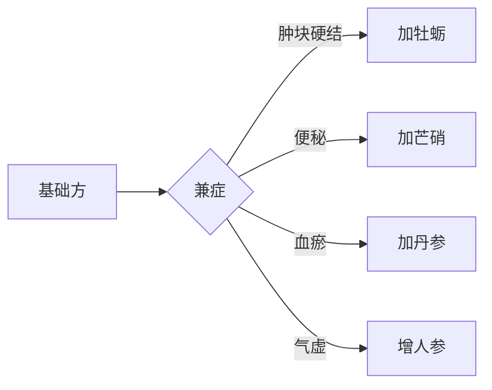

# 辨太阳病脉证并治法下：一六一


## 一六一：「伤寒」六七日，发热微恶寒，支节烦疼，微呕，心下支结，外证未去者，「柴胡桂枝汤」主之。

<!--more-->

> 柴胡桂枝汤，是个很有名的处方。

> 发热微恶寒，支节烦疼，看起来像伤寒，麻黄汤症。但是此时微呕，入少阳，表邪下陷，从很外层的皮表，下陷到肌肉中，桂枝汤是对的，所以是柴胡桂枝汤。

> 所以伤寒下陷，不用麻黄，要确定伤寒病在表，才会用麻黄。

感冒六七曰以后，病人发热微恶寒，代表还有表证，支节烦疼，关节疼痛，心下支结，胃里面梗到的感觉，吃不下东西，外证未去者，柴胡桂枝汤主之。一但有少阳证的时候，就不用麻黄了所以经方中看不到柴胡麻黄汤。

阳经有三，一太阳，一少阳，一阳明，只有在少阳这一圈的时候，就是半表半里，太阳就是表，阳明就是里，太阳少阳重迭的地方就是「外」，就是有太阳表证，也有少阳表证，这时候如果用小柴胡汤去和解，和解不掉，要用柴胡桂枝汤。

> 也可以先吃小柴胡汤，再吃桂枝汤。

有少阳证也有太阳证，最主要是少阳证比较重一点太阳证比较轻一点，所以柴胡用四钱、桂枝、黄芩、人参各一钱半，重用柴胡，再加甘草、半夏芍药、大枣、生姜，刚好是柴胡汤和桂枝汤的并在一起，大枣、生姜重复。

> [!TIP]**柴胡桂枝汤方**
>
> 柴胡一两半 | 桂枝一两半去皮 | 黄苓一两半 | 人参一两半 | 甘草一两炙 | 半夏二合半洗 | 芍药一两半 | 大枣六枚劈 | 生姜一两半切
>
> 右九味，以水七升，煮取三升，去滓，温服。

> 临床上，很少是太阳、少阳一半一半的，所以不管是什么程度，一般都重用柴胡，因为柴胡也可以发汗，会比各半的时候发汗多，不然大多数是小便排出来。柴胡可通利三焦，是少阳的要药。三焦不止上、中、下，包括子宫、卵巢、脑、骨髓、心包、胆、脏腑之间的油网。如果不会开处方，只会一个小柴胡汤，不求无功但求无过，大便不通就大柴胡。最好用就是女子月经期，一吃，女孩就很喜欢你。

> 剂量上可以加重，比如女生体格大，一钱半就太少了，给她三钱，柴胡到五、六钱都没关系。

> 小编：这里可以看出倪师剂量上的精髓了，感觉男生一般就等于体格大的女生，如果是体格大的男生，就是四钱半，柴胡十钱，反正无毒嘛。

有太阳少阳证的时候，不能把太阳的药开太重，而少阳的药要加重，所以柴胡四钱以上，桂枝一钱半，芍药也用一钱半，如果桂枝开得重，药一下去，马上就到肌肉去了，太快了，所以柴胡加重，少阳的热靠柴胡推出去，把少阳的热推到太阳再出去，柴胡加重让桂枝跟着柴胡走，如果桂枝开重，柴胡就跟着桂枝走，桂枝走了柴胡还在后面，就太快了，如果这时候开的是小柴胡汤吃完还要再吃桂枝汤的。

> 此方应用很广，病人拿了病例来子宫肿瘤、淋巴癌、甲状腺肿大等，此时要中虚。不要看病，要看症，比如病人说，风吹很难过，时常忽冷忽热，又带点恶心，就是柴胡桂枝汤了。一和解，疏导，病人体力一恢复，肿块就缩小了。它本来就是堵在三焦淋巴系统里，大剂的柴胡下去，根本还没有加减其他的药，就整个疏散掉了。可以摸到病人的肿块，可以加牡蛎，咸能软坚，就多加这一味，就能把淋巴肿瘤去掉，就算是甲状腺肿瘤，也还是加牡蛎。如果便秘严重，可以只加芒硝攻坚，大黄只是去实，所以我们有柴胡芒硝汤。所以大陷胸汤，里的芒硝，不止是把大便打碎，肿瘤都可以攻坚，打掉。不要怕芒硝寒凉，肿瘤，寒实会有、热实也会有。需要的时候，就是补药，只要人能吃能拉能睡，身上没有阻碍，三焦气机很旺盛，就没有病。

### 1. 证候特点与病机
- **主症特征**：
  - 表里同病：发热微恶寒（太阳） + 微呕心下支结（少阳）
  - 特殊表现：支节烦疼（太阳少阳经气不利）

- **病机图解**：
  ```mermaid
  graph TB
    A[伤寒六七日] --> B{邪传路径}
    B -->|表邪未净| C[太阳]
    B -->|邪陷半表半里| D[少阳]
    C --> E[发热恶寒+肢节疼]
    D --> F[心下支结+微呕]
  ```

### 2. 组方原理与剂量要点
**药物配伍比例**：
| 药物   | 常规量 | 调整原则                |
|--------|--------|-------------------------|
| 柴胡   | 4.5g   | 必重用（6-18g）         |
| 桂枝   | 4.5g   | 维持基础量（4.5-6g）    |
| 黄芩   | 4.5g   | 随热象增减             |
| 人参   | 4.5g   | 虚甚可加               |

**煎服特点**：
- 水七升煮取三升（浓缩煎法）
- 去滓温服（减轻胃肠负担）

### 3. 临床应用拓展
**现代适应症**：
- 经期感冒（最佳适应症）
- 自身免疫性疾病（如风湿性关节炎）
- 肿瘤辅助治疗（淋巴系统病变）

**加减法则**：


### 4. 治疗机理详解
- **柴胡主导作用**：
  1. 引药入少阳（三焦通道）
  2. 促进气机流通（淋巴/体液循环）
  3. 协同桂枝发汗（非直接发汗）

- **桂枝配伍精妙**：
  - 量少则随柴胡走
  - 量多则反客为主
  - 保持1:3比例最佳

### 5. 临床使用禁忌
- **绝对禁忌**：
  - 纯太阳表实证（当用麻黄）
  - 阳明腑实证（需承气类）

- **相对慎用**：
  - 阴虚火旺体质
  - 严重气血两虚

### 6. 倪师经验精华
1. **辨证要点**：
   - "风吹难过+忽冷忽热+恶心"三联征
   - 不必拘泥于具体病名

2. **肿瘤应用**：
   - 三焦气机通畅为要
   - 牡蛎-芒硝组合：
     - 牡蛎：软化固定肿块
     - 芒硝：溶解代谢废物

3. **剂量心法**：
   - "柴胡量大力宏"
   - 体格换算公式：
     ```
     基础量 × (体重kg/60) = 实际用量
     ```

> 注：本方体现"和解为主，兼顾表里"的治疗思想，通过调节三焦气机达到"不治癌而癌自消"的效果。临床运用时当遵循"有是证用是方"原则，不必受现代病名束缚。

---

> 作者: [AcuHerb](https://acuherb.xyz)  
> URL: https://acuherb.xyz/posts/shanghanlun-161/  

