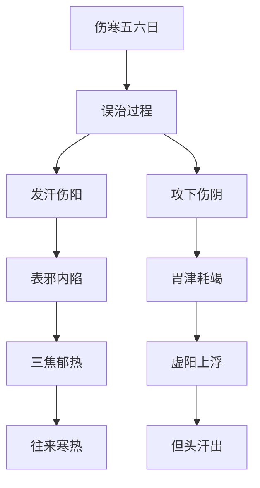
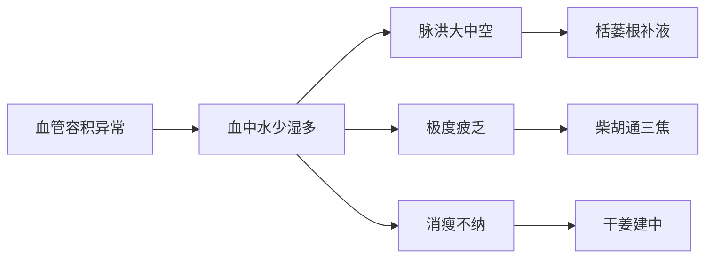

# 辨太阳病脉证并治法下：一六二

## 一六二：伤寒五六日，已发汗而复下之。胸胁满，微结，小便不利，渴而不呕，但头汗出，往来寒热，心烦者，此为未解也，「柴胡桂枝干姜汤」主之。

<!--more-->

如果病人发汗而复下之，就不会结胸了，就是没有发汗攻下才会结胸，现在发汗复下之就代表里面虚掉了，因为攻下的药一定是寒凉的药。

攻下的时候血液住下走，肠胃就虚冷掉了，胸胁满，汗发掉以后，很多还没有发出去的汗，因为攻下汗又回头，结在胸膈的地方，这汗不在胃里面，如果在胃里面一下子就发散掉了、这汗在胃的外面，停在胸膈这儿，所以胸胁满。

> 胃里津液发表了，肠胃津液攻下了。胃扁扁的，空了。如果胃里有宿食，只发汗会恶心，但这里复下了，把宿食排掉了。我们阴阳要平衡，阴是津液，胃火是阳，胃的蠕动有热能，热能储存在津液中，没了津液，热性本轻，热则往上冲到头，头出汗。

微结就是一点点结，如果没发汗攻下会大结，小便不利，因为攻下水跑掉了，发汗水也跑掉了，当然会小便不利。

渴而不呕，嘴巴很口渴，但是人不会恶心，但头汗出，往来寒热，胃在中间，如果胃里面没有水，病人会口渴，如果胃里面有水，不但不渴还会呕吐，胃里面没有水，胃热往上冲，头就一直冒汗，但头汗出。

水一直往上跑，其实这水就是胃里面的津液，常人如果饿过头，手脚一直发抖。头会开始冒冷汗，西医说血糖太低了，心烦者，此为未解也，「柴胡桂枝干姜汤」主之。

> 有往来寒热，心烦。有少阳证，太阳证，同时胃的津液没有了，这种状态之下，就是柴胡桂枝干姜汤。

胸胁满，往来寒热，就是半表半里所以用柴胡，发汗而复下之，还有伤寒脉证，所以要用桂枝，还有加上甘草这几味能温中达表，这就是前面柴胡桂枝汤的意思，能让中焦温起来，让抵抗力到表面上去，把还没有进来的滤过性病毒就排掉了；

因为发汗又下利的状况下，滤过性病毒没有随发汗发掉又顺着汗液回来，所以滤过性病毒是散的，不是集中在表上面，而是停在三焦散开来的，如果这病毒只在肌肉皮肤表面上用桂枝就够了，但是因为滤过性病毒已经进入三焦淋巴系统，所以要用柴胡把它推出来，再用桂枝把它透发了，因为胃的津液已经没了，所以要用甘草补足胃的津液。

渴，张仲景在治渴的时候，喜欢用栝蒌根，栝蒌根能去热止渴，病人只要有渴就可以加栝蒌根可以把肺的津液补足，不渴的话用半夏，决定用半夏就要问病人渴不渴，渴就不要用半夏，不渴就可以用半夏。

胃虚热无大渴往上冲用黄芩，而不是用石膏，石膏是实热证，病人会大渴饮多。但头汗出，牡蛎专门降浮阳，胃的阳气浮在头上面，就像热气球浮在上面降不下来，牡蛎一下去把它整个往下导。

> 芩连是味苦的，石膏是心甘发散的，都是去热。石膏去胃家的实热，不是肠家的实热，比如病人大渴，一直要喝东西，就是胃家的实热。病人有可，但不是大渴，用黄芩。会用到石膏时，一定用在纯热证，有往来寒热，石膏就不对症。

> 牡蛎降浮阳。浮阳，则头汗出。干姜只是温中，同时把浮阳降回来，阳要收敛。阳跑到四肢上的外症，大都用牡蛎。心阳外走，肾阳外走时，就要加龙骨了。火灾时那个救逆汤，收到惊吓，心阳外走，恐惧要逃命，肾脏会被挤压很厉害，西医说就是分泌类固醇，比平常跑的快，还不会累，肾阳外走，所以西医把类固醇，当最后一线的药，不管是心衰还是怎么都在用，我们则用龙骨牡蛎一起。

> 甘草炙过，津液会更多，还会比较热一点，所以一般用干姜时，都用炙甘草。同时重用还能强心。

> [!TIP]**柴胡桂枝干姜汤方**
>
> 柴胡半斤 | 桂枝三两 | 干姜二两 | 黄芩三两 | 栝蒌根四两 | 牡蛎二两 | 甘草二两炙
>
> 右七味，以水一斗二升，煮取六升，去滓，再煎，温服一升，日三服：初服微烦，复服汗出，便愈。

> 临床上，只要病人说，很口渴，全身肌肉没力气，小便不好，只要讲胃里很不舒服，又不会恶心，还没有胃口，就可以开处方了。里面的病可能是，肝硬化、肝癌、胃癌、胰脏癌，不用管，要中虚。最简单是，只要有往来寒热，柴胡一定要用，只要肌肉酸软有汗出，就是桂枝。干姜最主要是温中，生姜是散胃水，二者都能止呕，但是干姜治胃寒，胃太热或有积水则用生姜。此时胃里没有东西，我们用干姜来温中。

有外证所以重用柴胡，柴胡用五钱六钱，桂枝用三钱，干姜用二钱，栝蒌根用四钱，黄芩用三钱，牡蛎用二钱，炙甘草用二钱。

> 栝蒌根，经方中除了柔痉会用，在病人只要有渴，就可以用。如果口渴严重，栝蒌根再加重。专门治疗血管里的水不够。糖尿病的人，就是血管里水不够，血糖才会高，所以病人身体自救才一直口渴，一喝水就从小便排掉。平常喝的水无法进入血脉，一定是食物才可以。肺的津液伤到，心和肺都属于上焦，胸是诸阳之会，所有阳经会在胸部，血在这里交换，肺中是气，如天上的云雾，是大肠气化上来的水，这个水才可以进入血脉，栝蒌根就是补肺里的水，治肺热。

> 劳症，痨瘵。就是怎么吃也吃不饱。遇到一个人看着像桂枝汤，处方下去汗也不流。又想小柴胡，也没有用，就算十全大补汤也没用。人有风湿，在关节就是风湿关节炎，湿在胃则是寒湿，湿在肾则肾功能不好。现在这个湿，在血脉里。劳症的人，一定很瘦，吃大鱼大肉再多也还是瘦，血脉直径比正常人大一倍，瘦小的人血管竟然比高壮的人还要粗，其中只有一半装血，剩下一半就是湿。所以风湿关节炎，或者脏结的药，去湿吃了也没用。血管相当于正常人两倍，所以相当于带一个人在动，很容易疲劳，没有办法持久工作。

> 劳症，本身津液都不够了，头上还有汗，就是湿在血里。吃了药，还会流汗，就是在排血脉里的津液。

> 小孩子不会是劳症，纯阳之体，怎么吃也比较瘦。

> 劳症，只可能会有但头汗出。没有劳证，又发汗，又攻下，不会有小便不出，微结，但头汗出。临床上，柴胡桂枝干姜汤就是劳证第一方，当然还有其他的方子。平常没有劳证的人，得不到这种病。

【类聚方广义】本条方曰：瘵、肺萎、肺痈、痈疽、痔漏、结毒、霉毒等，经久不愈渐就衰惫，胸满，干呕，寒热交作，动悸，烦闷，盜汗，自汗，痰咳，干咳，咽干，口燥，大便溏泄，大便不利面无血色，精神乏困，不耐厚药者，宜此方。

只要是长久不愈的人，就会慢慢消弱下来，所以张仲景出「痨瘵」的第一个方就是「柴胡桂枝干姜汤」。

为什么叫作「痨」？他不能动，一动就一天起不来。

为什么会造成痨？因为工作上的关系，大部份是劳心才会有，劳力的人得到的是疲劳。

痨症的人吃什么药都没有用，吃什么食物都不会胖，摸脉很洪大，但是脉是中空的，遇到这种情形的时候，张仲景开的第一方就是「柴胡桂枝干姜汤」： 明明是桂枝汤的病人，桂枝汤下去没感觉，再开强一点还是没感觉，开麻黄汤下去，汗都不流一滴，这就是痨。

以中医的观念，平常人的湿在中焦。就是内湿，如果湿在关节就是风湿，如果湿在血管里面就是痨。

血液的新陈代谢有一定的量，如果血管有湿沉在里面，会造成一动就来不及补充能量，桂枝能让动脉的血液循环加速，血管的外壁就是淋巴系统，这是三焦网络就要靠柴胡，血管里面的血比较多？水比较少，脉洪大，所以用大剂的栝蒌根把水补足，因为血里面长年津液不足产生的燥热，用黄芩下去把它去掉，但是推动的力量不够，用干姜、炙甘草来建中，一下去把脾胃的功能加强起来，配合在一起，这时候就能把血管里面的湿推上皮肤表面上去，所以柴胡桂枝干姜汤吃下去后，病人所得到的汗是湿汗，所流出来的汗粘答答的。

初服微烦，复服汗出，便愈，这汗出来的时候，湿答答的出来？有湿为什么不用白术？如果湿在关节、肌肉、脾脏上面可以用白朮，但湿在血管里面则不能用白朮，因为白朮收敛的力量很强，白朮可以止利，如用于此，反而不利发散血中之湿。

> 白术，去湿是关节、脏腑之间、肠胃里。血脉里没用。

### 1. 核心病机与证候特点

#### （1）形成机理

#### （2）典型症状群
- **主症**：
  - 胸胁满微结（少阳枢机不利）
  - 但头汗出（虚阳上浮）
  - 往来寒热（正邪交争）

- **兼症**：
  - 小便不利（津液亏损）
  - 渴而不呕（胃阴虚热）
  - 心烦（热扰心神）

### 2. 方药解析与剂量要点

#### （1）组方结构
| 药组       | 药物          | 剂量比例 | 作用靶点               |
|------------|---------------|----------|------------------------|
| **和解枢机** | 柴胡+黄芩     | 8:3      | 三焦淋巴系统           |
| **温阳达表** | 桂枝+干姜     | 3:2      | 中焦→肌表              |
| **滋阴降火** | 栝蒌根+牡蛎   | 4:2      | 血脉→上焦              |
| **建中复脉** | 炙甘草        | 2        | 脾胃根本               |

#### （2）现代剂量换算（基础量）
- 柴胡24g → 黄芩9g
- 桂枝9g → 干姜6g
- 栝蒌根12g → 牡蛎6g
- 炙甘草6g

### 3. 临床应用拓展

#### （1）现代适应症
- **代谢性疾病**：糖尿病（消渴型）
- **慢性肝病**：肝硬化代偿期
- **肿瘤治疗**：放化疗后津伤证
- **免疫疾病**：干燥综合征

#### （2）特殊病机——"痨证"辨治

### 4. 鉴别诊断要点

| 鉴别点        | 本证                | 小柴胡汤证          | 柴胡桂枝汤证        |
|---------------|---------------------|---------------------|---------------------|
| **病机特点**  | 津伤阳浮            | 少阳枢机不利        | 太阳少阳合病        |
| **汗出特征**  | 但头汗出            | 可有全身汗          | 可有全身汗          |
| **胃肠状态**  | 干涸不呕            | 喜呕                | 心下支结            |
| **舌脉特点**  | 舌红少津/脉弦细数   | 舌苔薄白/脉弦       | 舌淡红/脉浮弦       |

### 5. 倪师临床心法

#### （1）用药精要
- **柴胡**："三焦总枢"，用量宜大（15-30g）
- **栝蒌根**："血脉增液剂"，糖尿病必用
- **牡蛎**："浮阳降逆药"，头汗特效

#### （2）治疗警戒
- **三禁原则**：
  1. 禁用发汗（重伤津液）
  2. 禁用攻下（更损胃气）
  3. 禁用利水（加重阴伤）

- **药后反应**：
  - 初服微烦→正邪相争
  - 复服汗出→湿邪外透
  - 粘汗为效→湿毒排出

### 6. 类方比较与进阶应用

#### （1）与补中益气汤鉴别
- **相同点**：乏力、消瘦
- **不同点**：
  - 本证：津伤热浮，脉洪大
  - 补中：气虚下陷，脉弱

#### （2）肿瘤治疗延伸
- **配合思路**：
  - 肝癌：加鳖甲、丹参
  - 肺癌：加麦冬、杏仁
  - 淋巴瘤：加夏枯草、玄参

> 注：本方体现"和解少阳，滋液降火"的治疗大法，凡久病伤津见上热下寒、津亏阳浮者，皆可化裁应用。尤适合现代代谢性疾病与慢性消耗性疾病的治疗。

---

> 作者: [AcuHerb](https://acuherb.xyz)  
> URL: https://acuherb.xyz/posts/shanghanlun-162/  

