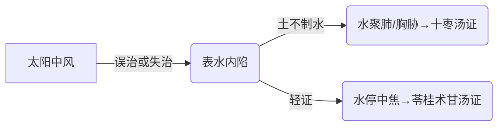

# 辨太阳病脉证并治法下：一六七

## 一六七：「太阳中风」，下利，呕逆，表解者，乃可攻之：其人黎黎汗出，发作有时，头痛，心下痞鞭满，引胁下痛，呕即短气，汗出不恶寒者，此表解里未和也，「十枣汤」主之。

<!--more-->

如果太阳中风，感冒了，同时有下利有呕吐，太阳中风下利是葛根汤，有呕吐就葛根加半夏。如果表解者，乃可攻之。要先解表再攻里。

攻他的时候，结果病人其人黎黎汗出，发汗有时头痛，心下痞鞭满，引胁下痛，呕即短气，汗出不恶寒者。当解了表以后有这种现象，这种现象平常看到的时候，一定是湿气很重的人、还有肠胃功能很差的人。

为什么会严重到用「十枣汤」？平常解表的时候，一定是开发汗剂，这汗一发以后，滤过性病毒和不要的水离开体表以后，好的「水份」还会顺着三焦淋巴系统回到胃里面来，津液会自行返回胃里面，如果津液没有回到胃里面，病人会燥渴，小便就没有了，这时候就是「五苓散证」。

现在这种情形是水回来了，居然并没有回到胃里面，回到肺里面，因为肺主皮毛，为什么回到肺里面？因为土挡到了，脾土太旺，脾伤到了，脾就胀起来，这表水一发出去以后，没有办法回到肠胃里面，就慢慢渗到横膈上去。如果水不多，就「头眩」就是「苓桂术甘汤证」。如果渗得更多，愈来愈严重，就是用「十枣汤」。

还有一种现象就是这病人本来是麻黄汤证表寒，结果没有开麻黄汤，如果病人抵抗力很强，自己会好，有的病人不会好，这时候麻黄汤证转成里寒了，变成小青龙汤证，里面发炎了，没有用麻黄汤发表，里面的免疫系统出来相抗，滤过性病毒往里面走，走到肺里面化热了，病人一直咳嗽，咳嗽的同时，表面有寒里面有痰，这痰就是水，就是表面的滤过性病毒顺着水道系统到肺里面来的，应该是小青龙汤一剂就去掉的，因为小青龙汤是心下有水气，结果又没开小青龙汤这水就慢慢堆积起来，造成「十枣汤」证。

「十枣汤」中医叫「朱雀汤」，是伤寒论里面，目前最峻最强的排水攻水的药。如果这水在皮肤表面上用「越婢汤」，肠里面的水是表水汗水回头的，水正常应该进入肠胃，结果不入肠胃入肺了，所以整个胸膛里面全部都是水，还有一些水渗到脏和腑中间的间膈膜上，就是三焦网膜。所以脏没有积水，可是脏和腑中间的三焦网络全部充水，病人会心下痞鞭满，胃里面胀满的很难过硬硬的，引胁下痛，整个胁肋都积了水，两胁下很痛，呕即短气，恶心想吐，吐又吐不出来因为水不在胃里面。

为什么短气？横膈膜都充水了，像海绵一样，吸气又不能下降被顶着，呼气就吐出来，自然气就很短，汗不出恶寒者，代表他还有流汗没有恶寒，就是没有表证了，所以在喝「十枣汤」之前一定要确定他没有表证。

所以肺里面积水，肺积水，心脏积水，肝积水，肝硬化末期的腹水十枣汤都可以用的。

临床上要注意一点，这里的汗出，病人阳气虚脱的时候，会流出油油的汗，这个时候就不能用十枣汤了。

> [!TIP]**十枣汤方**
>
> 芫花熬 | 甘遂 | 大戟 | 大枣十枚劈
>
> 右三味等分，分别捣为散，以水一升半，先煮大枣肥者十枚，取八合，去滓，纳药末强人服一钱匕，赢人服半钱，温服之，平旦服；若下少，病不除者，明日更服，加半钱；得快下利后，糜粥自养。

> 此药太强，一定要管制，给了一副，吃一次后，第二天看看情况再说。

> 肺积水，主要的症状，但坐不得卧，一躺下去会咳嗽不止，水往上冲，坐着不会咳嗽，但是胸下胁肋横隔处会非常痛，看起来像结胸，但不是结胸，结胸是心下痛。十枣汤是肺积水的唯一处方。

> 肋间积水，就不用十枣汤了，用甘遂半夏汤。

能把胸腔下方、横膈膜、肺的下方的水利出来，完全靠甘遂，所以大陷胸汤和大陷胸丸都是对「结胸」，如果结胸从胃的痞鞭一路往下走，因为比较下面就是大陷胸汤把它攻掉，如同样的结胸在这里但是病往上走，顶到喉咙，脖子都不能弯下来，如果用大陷胸汤就跑太快了，结胸会没有去掉，这时候要改用大陷胸丸，因为丸剂本身是药缓力重，吃大陷胸丸可以因势利导把它导下来，所以结胸有两种症状，一个从从心下往上升的用「大陷胸丸」，一个从心下往下走的用「大陷胸汤」，都是以胸膈为主，所以半夏、甘遂一定会用到，甘遂利水利痰的力量非常强。

> 甘遂，去肺、子宫里的水，非常强。但是主力是用来涤痰。去痰水。

如果水渗到脏腑中间的三焦油网的时候，一定要靠大戟才能打通。甘遂利水利痰，去肺中的积水与子宫中的积水，但甘遂还有涤痰的效果，所以大陷胸汤用甘遂。

肺泡里面都是水的时候用芫花，芫花去除胸腹的积水，所以会用到芫花的病人，一定到了「但坐不得卧」的阶段，就是肺积水不能躺，一躺下去就要喘就再坐起来，吃完十枣汤，三小时就好了。

这三味药磨粉等量的用，各 1/3 钱，一次只给病人一剂，因为这三味药都是碱性的药，胃里面有胃酸，如果光吃这三味药到胃里面，胃就会难过了，所以要靠红枣，过去拿十个红枣去熬。现在大枣比较小，用二三十个浓一点无所谓，红枣汤能中和碱性，且让药发散的力量很强。

> 如果不开红枣，吃完药胃很痛，胃壁整个贴在一起，津液会完全没有了。

强人服一钱匕，胖的人用一汤匙，就是喝汤的汤匙一平匙，羸人服半钱，瘦的人用半匙。

> 一定要早上6点左右，空腹吃，因为会上吐下泻，胃里有食物会梗到喉咙的，呼吸梗死。

平旦服，这就是吃十枣汤的技巧了，一定要早上六点钟吃，五点到七点都可以。因为「肺寅大卯胃辰宫」，大肠开卯时，肺和大肠相表里，水在上焦的时候，用十枣汤攻下去的时候，病人会上吐下泻，如果有痰，上面吐出来的是痰，如果没有痰，只有水，这水是泻出来的，全部从大便排。

病人吃十枣汤后约半小时，开始跑厕所，连续约三小时，中间大概上六七次水才排完。这三味药都是毒药，但是三小时后通通排掉了，若下少者，病不除者，明日更服，加半钱，如果大便三四次，应该下六七次才够，病没有除的，第二天再吃、再加半匙，得快下利后，标准是六次、糜粥自养，这时候喝稀饭，用红枣下去熬稀饭，不能吃油腻食物或肉类，否则会有余热；

> 吃完药，一定马上去厕所，然后抱个桶，上吐下泻。吐痰水能喷到墙上，后面肛门像水龙头打开。如果让西医抽痰水，还会复发，而且之后再用十枣汤效果就不好了。完全没有动过，一剂就出来了。肺法像天，水在天上是云雾，不是游泳池冷水在天上，不赶紧排掉会水生万物，如果的了一个感冒，就是肺炎了。

> 药效持续三小时后，再喝稀饭或吃煮比较烂糊的面，不要放油的东西，可以放一点点海盐，不要吃肉类的东西。吐泻之后，肠胃消化不是很好，吃肉类会有伏热，过两天会有发烧的现象。

> 小编：之前本草时，倪师说过，排腹水，攻水，之后不能吃一点盐，禁盐，否则水会回头，尤其是用甘遂和牵牛时。小编理解的是，肝、脾、肾内脏问题产生的水，排了之后就不要吃盐了，等恢复再说。突然产生的肺积水，还是可以的。

因为吐了很多，用红枣把胃的津液补足，临床上看到肝病的腹水、脾脏病腹水的时候，也是一样用「十枣汤」；不可以每天用「十枣汤」，吃完「十枣汤」后要调理病人的肠胃，北派的观念只要病人的肠胃功能非常好，吸收的功能非常好病人就不会死。

肝病腹水的时候，肚子里面有很多水停在三焦油网脏腑中间，所以大戟加重；

如果积水在肺的上方，三剂等量，如果肺积水甘遂多一点；

> 不管你是肝癌还是什么病，一定要但坐不得卧这个阶段，有十枣汤证才能用，胸下痞鞭、短气、不断汗出、不恶寒。临床如果流的是油汗，汗如油，这是元气要没了，流完了，人就死了，不要用十枣汤。

攻出来的水，其实就是人体内的高蛋白的东西，这营养应该给脏腑、结果被水堵到了，这营养一段时间后会坏掉，所以必须把它排掉。

看到十枣汤的病人，确定没有表证的时候要速攻，不要等到胃气已经没有才攻，十枣汤喝下去结果病人死了，以为是吃到毒药死的。所以要小心麻黄汤证没好变成小青龙汤证，小青龙汤证没好变成十枣汤证。

> 小青龙汤，是用在表寒里寒时，表寒就是全身关节痛、恶寒、脉浮紧，里寒时舌苔白的、口不渴、咳嗽出白痰。

> 我有个病人，很胖，肚子很大，喜欢打撞球，素有中湿，湿很盛，又喜欢喝啤酒。打撞球后流汗，又喝啤酒。中湿的人，越流汗会越来越粘，堵在肠胃，喝冷水下去会梗在这边，无法气化，就会回逆，跑到肺里。也没有伤寒表症和中风表症，然后再被攻下这种情况。他一来，我一看就是十枣汤证。病人很着急的陈述，胸胁很难受，坐卧都难受，一直咳嗽，可是又没有发高烧。

【勿误药室方函口诀】本方条曰：据前田长奄之经验，一人之手肿，余处不肿，元气饮食如故，用此方，经水泻而速愈，亦别开生面法也。其实只有手肿用不到十枣汤的，此说过于牵强。

### （一）病机与辨证要点  
**原文核心**：  
太阳中风后出现 **下利、呕逆**，若表证已解，见以下症状时可用十枣汤：  
- **汗出特点**：漐漐汗出（连绵不断）、发作有时  
- **主症**：  
  - 头痛（水气上冲）  
  - 心下痞硬满、引胁下痛（水停胸胁）  
  - 呕而短气（水饮犯胃迫肺）  
  - **关键鉴别**：汗出但不恶寒（表证已解）  

**病机演变**：  

### （二）十枣汤证的特异性表现  
| **症状**         | **病理基础**                     | **鉴别诊断**               |  
|------------------|----------------------------------|---------------------------|  
| 但坐不得卧      | 肺积水压迫，平卧时水气上逆       | 与心衰喘咳（需端坐呼吸）鉴别 |  
| 胁下牵引痛      | 水饮充斥三焦网膜                 | 结胸证痛感更局限           |  
| 汗出如油        | 阳气外脱（禁用十枣汤！）          | 正常汗出为使用指征         |  

### （三）十枣汤的组成与用法  
**药物配伍**：  
- **甘遂**：专攻肺与子宫积水，兼涤痰  
- **大戟**：疏通三焦网膜积水  
- **芫花**：清除胸腹腔积水（针对"但坐不得卧"）  
- **大枣**：护胃生津，中和毒性  

**煎服要点**：  
1. **制备**：三药等分研末，大枣10枚煎汤送服  
2. **剂量**：  
   - 强人服1钱匕（约1.5g），羸者减半  
3. **服药时间**：平旦（5-7点，肺与大肠经当令）  
4. **反应**：服药后0.5-3小时出现上吐下泻，排水6-7次为度  

**注意事项**：  
- 必须空腹服用，以防呕吐窒息  
- 得效后以糜粥调养，忌油腻、肉类  
- **绝对禁忌**：表证未解、汗出如油（阳脱）、孕妇  

### （四）临床拓展应用  
**1. 现代对应病症**：  
- 渗出性胸膜炎、肺癌胸水  
- 肝硬化腹水（需配伍大戟加重）  
- 重症肺炎肺水肿  

**2. 类证鉴别用药**：  
| **方剂**       | **病位**        | **核心症状**                |  
|----------------|-----------------|----------------------------|  
| 十枣汤         | 胸胁/肺         | 咳喘不得卧，胁痛            |  
| 大陷胸汤       | 心下-腹部       | 心下硬痛拒按，便秘          |  
| 苓桂术甘汤     | 中焦            | 头眩，心悸，轻症水停        |  

**3. 救误要点**：  
- 麻黄汤证误治→小青龙汤证（表寒里饮）→继续失治→十枣汤证  
- **窗口期**：在"但坐不得卧"阶段速攻，若出现恶病质则禁用  

### （五）经典医案启示  
**案例1**：肥胖患者酒后诱发胸水  
- 背景：素体湿盛，饮酒后汗出当风  
- 表现：胸胁胀满、咳喘不得卧（无发热）  
- 辨证：水饮壅肺（非表证）  
- 处治：十枣汤1剂，水泻7次后症状消失  

**案例2**：肝癌腹水误治教训  
- 错误：见腹水即用十枣汤，忽视"汗出如油"  
- 结果：阳气暴脱死亡  
- 要点：必须确认胃气尚存（能进流质）方可攻逐  

> **总结**：十枣汤为攻逐水饮的"核武器"，须严格把握"表解、里实、正未虚"三要素。临床中肺积水、胸水效果最佳，肝病腹水需谨慎评估正气。关键诀窍在于"平旦服药"与"糜粥自养"的配合。

---

> 作者: [AcuHerb](https://acuherb.xyz)  
> URL: https://acuherb.xyz/posts/shanghanlun-167/  

