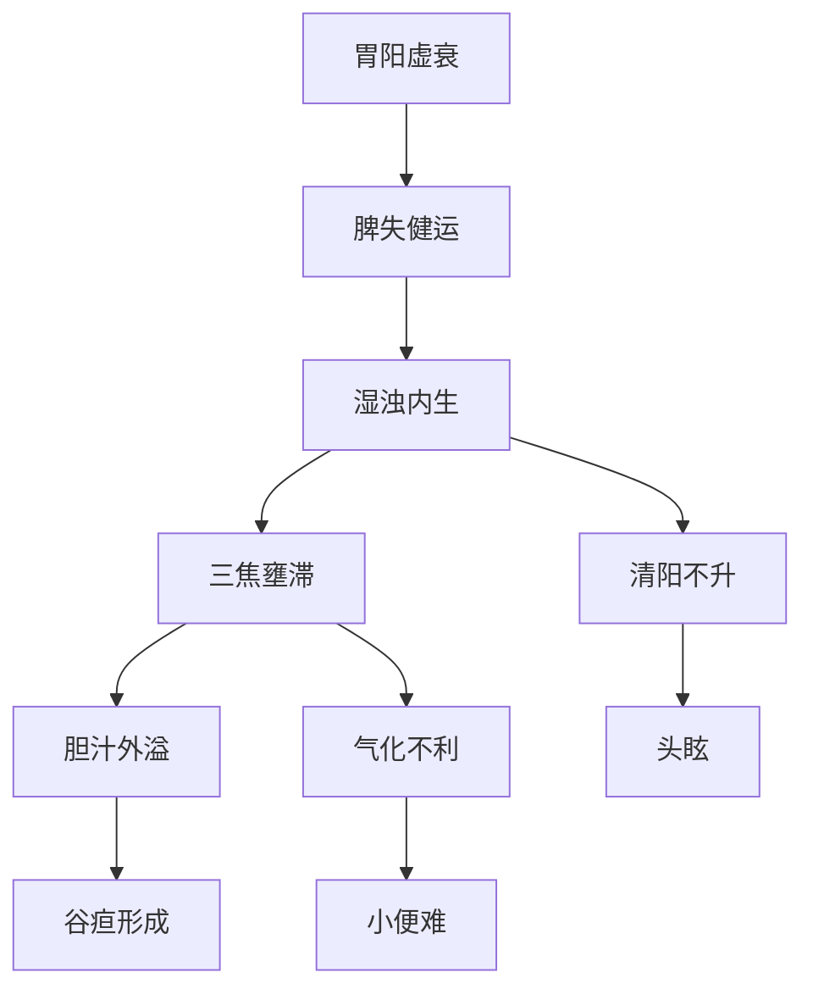

# 辨阳明病脉证并治法：二一一

## 二一一：「 阳明病」，脉迟，食难用饱，饱则微烦，头眩，必小便难此欲作「谷疸」，虽下之，腹满如故，所以然者，脉迟故也。

<!--more-->

阳明病是肠胃的问题，脉迟，就是胃虚掉了，若脉数，照理说就是里面发炎了，或肠里面堵到了。

如果脉数，问有没有大便？答曰：有而且下利，就是他有虚热；食难用饱，吃一点就饱了，饱则微烦，头眩，必小便难，此欲作「谷疽」，造成这些现象大部份的原因是肝、胆、胰分泌的消化液不够，使肠胃的消化不是很好，肠胃就虚寒掉了，饱则微烦，胃里面的东西不能消化，吃下去的东西撑在胃里面，人会感觉到微烦。

> 水的气化是靠胃热。谷的消化，是靠脾的脾阳。

为什么会头眩？人吃东西后，营养第一供应到脑部，现在胃虚寒掉了，食物不能消化，没有营养供应头部，就会有缺血的现象，所以会头昏。

消化系统不正常的时候，小便也会不正常，必小便难，这不正常不见得是量多量少，可能次数多量少，或小便小几滴出来，消化不好，因为脾脏功能不好，湿会越来越盛，湿是往下的，一般来说湿会往下停在下焦，造成腹满，如果湿太多堵到了，小便自然会减少，如果小便很正常，代表湿有管道排掉，造成虚寒的原因就是里面湿太盛了，湿气太重了，湿堵在里面就全身发黄，就是「谷疸」，因为消化系统里面有肝、脾、胆的分泌液进来消化，现在肝脏和脾脏的功能都不好，脾主湿，湿就会越来越盛，功能不好的时候就是肿起来，虽下之腹满，攻下了就应该不会腹满，这腹满是脾脏的肿大，是湿堵在里面，脉会变得很缓，如果有这类肿的现象、病人一定会发黄，甚至可说发黄的病人必是中湿的。

> 阳明，病人大便不是很好，但是脉是迟的，所以我们要治脾才对，而不是胃。谷的消化靠脾，吃一点点就撑到了，比如我平常是一碗饭的量，吃两口就饱了，但是会习惯性再吃，就会有这种现象。脾脏功能不好，你硬吃下去，一定不消化，出现的现象就是腹满、谷疸，脉迟就是里面比较冷比较寒。

### 核心证候分析
1. **典型症状群**：
   - 脉迟（胃阳不足）
   - 食难用饱（脾失健运）
   - 饱则微烦（食积化热）
   - 头眩（清阳不升）
   - 小便难（气化不利）

2. **病势发展**：
   - 初期：消化不良（食难用饱）
   - 进展期：湿浊中阻（腹满小便难）
   - 危重期：发为谷疸（全身发黄）

### 病机解析图示

### 治疗误区警示
1. **误治分析**：
   - 误判为阳明腑实（实则中焦虚寒）
   - 误用攻下法（下之腹满如故）
   - 后果：更伤阳气，湿浊更盛

2. **辨证关键**：
   - 脉迟（区别于阳明热证的脉数）
   - 食少即胀（区别于实热证的消谷善饥）

### 正确治疗策略
| 病变阶段 | 治疗原则 | 代表方剂 | 组成特点 |
|----------|----------|----------|----------|
| **初期**（食少腹胀） | 温运脾阳 | 理中汤 | 干姜+白术+人参+甘草 |
| **中期**（小便不利） | 温阳利湿 | 茵陈五苓散 | 茵陈+五苓散 |
| **晚期**（身目发黄） | 温化寒湿 | 茵陈术附汤 | 茵陈+白术+附子 |

### 临床鉴别要点
1. **虚实鉴别**：
   - 实热谷疸：脉数、苔黄腻、口渴
   - 虚寒谷疸：脉迟、苔白滑、口不渴

2. **病位鉴别**：
   - 脾病为主：食少腹胀明显
   - 肾病为主：水肿畏寒显著

### 现代临床启示
1. **对应疾病**：
   - 慢性胃炎伴消化不良
   - 胆汁淤积性黄疸
   - 代谢综合征

2. **调护要点**：
   - 少食多餐（减轻脾运负担）
   - 忌生冷油腻（防伤阳气）
   - 适当运动（助阳化湿）

注：本条揭示了阳明病中特殊类型"虚寒性谷疸"的发病机制，强调"治疸当辨寒热"的基本原则，为临床处理消化系统功能障碍导致的黄疸提供重要思路，突出脾阳在运化水谷中的关键作用。

---

> 作者: [AcuHerb](https://acuherb.xyz)  
> URL: https://acuherb.xyz/posts/shanghanlun-211/  

