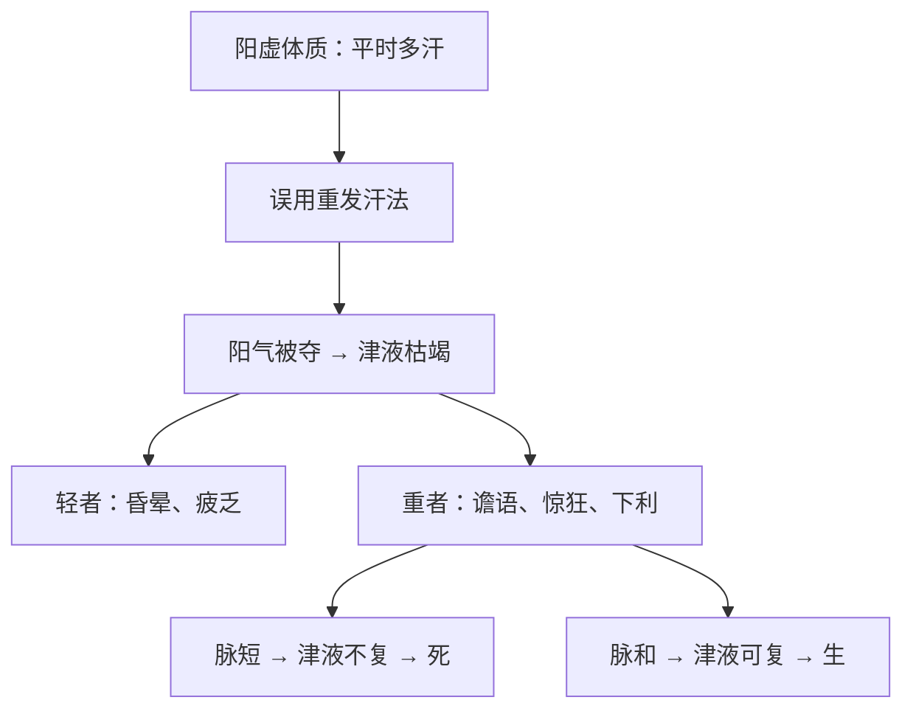
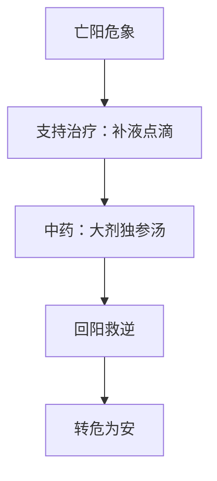
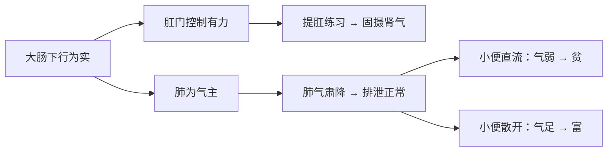

# 辨阳明病脉证并治法：二二八

## 二二八：发汗多，若重发汗者，亡其阳；谵语，脉短者，死；脉自和者，生。

<!--more-->

病人平常没有病的时候，汗很多，一直在流汗，表示病人本身就是阳虚自汗的人，发汗很多。

若重发汗者，如果遇到这种人，你开重发汗的药，结果亡其阳，亡其阳者轻者昏眩，如果汗伤的比较轻的，病人头会昏，如果发的比较重的时候，重者惊狂，所以如果不该吃麻黄汤的时候，却大剂的喝下去，病人就会发狂奔走，古人就是有这过失，所以南派的医生麻黄不敢用，用一分分的。

亡阳就是流汗、体能流失掉了，谵语，脉短者，死，汗丧失太多，津液伤到的时候，病人有脱水的现象，如果病人谵语，脉短促，代表津液不能回头了，救不回来了，如果脉自和者，脉很正常，脉还是一息四至，代表津液会慢慢回来，就只有这一条辨，倪子赞成打点滴，但仍须配合大剂的独参汤。

如果看到病人讲话都讲不清楚了，又一直在下利，代表人虚的肛门都收不起来了，已经差不多了，肠子完全没有蠕动，所以练功夫的时候，要提肛，小便的时候，小完以后，最后再把肛门提起来，用力再小最后一滴，相书云小便小的很直流的就是一辈子贫穷到老，如果小便散开的大富大贵，所以为什么大肠和肺是表里的，所有排泄出去的力量就是靠肺气往下降。

### 证候分析
1. **阳虚自汗基础**：患者平素无病时即汗多不止，属阳虚自汗体质
2. **误治加重**：医者重用发汗药（如麻黄汤），导致阳气亡失
   - 轻症：头昏目眩
   - 重症：惊狂奔走（常见于麻黄汤误用）

### 预后判断关键
1. **危候指征**：
   - 谵语伴脉短 → 津液枯竭，预后不良
2. **生机表现**：
   - 脉象和缓（一息四至）→ 津液可复，预后良好

### 治疗建议
1. **急救措施**：
   - 静脉补液（倪海厦认可）
   - 大剂量独参汤回阳固脱
2. **危重征兆**：
   - 谵语合并下利不止 → 肛门失约，肠蠕动衰竭
   - 提示肺气败绝（肺与大肠相表里）

### 养生附注
1. **练功要诀**：日常提肛训练（便后收缩肛门）
2. **传统相法**：
   - 小便直流：主贫（气降太过）
   - 小便散开：主贵（气化正常）

### 亡阳病机与转归示意图

### 现代处置建议流程图

### 功法与气机调摄：提肛与肺大肠关系图

---

### 附言

古人对气血阴阳的掌握不仅体现在药方上，也体现在对日常行为的体察中。练功收摄、提肛固下、调息降浊，皆是养阳保命的自然法门。

---

> 作者: [AcuHerb](https://acuherb.xyz)  
> URL: https://acuherb.xyz/posts/shanghanlun-228/  

