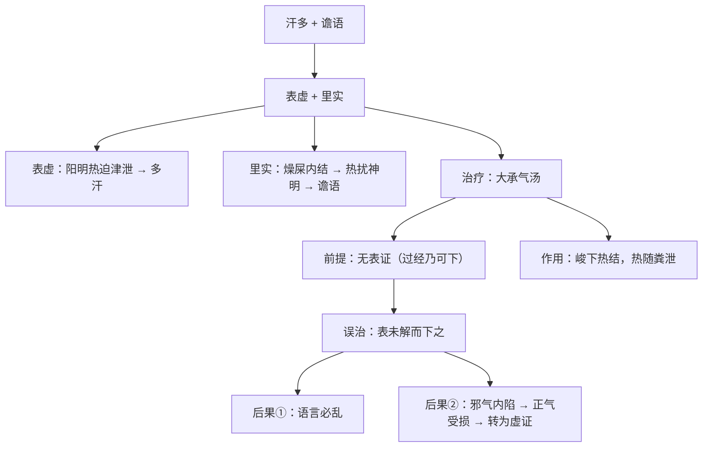

# 辨阳明病脉证并治法：二三五

## 二三五：汗出，此为风也，谵语者，以有燥矢在胃中；此表虚里实故也，须下之，下之则愈，宜「大承气汤」。过经乃可下之，下之若早，语言必乱。

<!--more-->

流汗，汗出来很多，此为风也，风就是热，这里的风当然热，不要当桂枝汤的中风，所以多汗的人，没事汗流浃背的人，其体有热，有的人汗流的很少，就是体有寒，谵语者，如果病人已经胡说八道了，又流汗很多，就可以确定有干燥的大便在肠里面。

张仲景讲的胃就是讲肠，这就是表虚里实故也，须下之，下之则愈，宜大承气汤。过经乃可下之，下之若早，语言必乱。

> 语言必乱，和谵语不太一样。

这就是讲要用大承气汤之前要确定病人没有表证，因为大承气汤走的很快，大概喝下去十分钟，芒硝就到肛门了，它把血往下导，所以大承气汤一下，整个血往下降，所以高热会退下来，如果有表证，一喝大承气汤，滤过性病毒会很快的从皮表进来，结果大便出来会引起后遗症，所以下之若早，语言必乱，就变成谵语了，本来是实的就会变成虚证。

### **证候特点**  
1. **表虚（汗出多）**：  
   - **汗出不止**（非桂枝汤证的中风，而是阳明里热迫津外泄）  
   - **体有热**（多汗者多热，少汗者多寒）  

2. **里实（燥屎内结）**：  
   - **谵语**（热扰神明）  
   - **燥屎在胃（肠）中**（张仲景言“胃”多指肠）  

3. **病机关键**：  
   - **表虚里实**（表气不固，里热结实）  

### **治疗原则**  
1. **主方**：**大承气汤**（峻下热结）  
2. **使用时机**：  
   - **必须确认无表证**（否则邪气内陷，加重病情）  
   - **“过经乃可下之”**（表证已解，纯属里实方可攻下）  

### **误下后果**  
- **下之过早**（表未解而用攻下）：  
  - **语言必乱**（非典型谵语，而是邪陷正虚的错乱）  
  - **可能转为虚证**（正气受损，邪气内陷）  

### **临床要点**  
1. **鉴别诊断**：  
   - **表证未解**（恶寒、脉浮）→ 不可用大承气汤  
   - **纯里实热结**（潮热、谵语、腹满痛）→ 方可用大承气汤  

2. **大承气汤的作用特点**：  
   - **药效迅猛**（服后约10分钟即起效，血热下行）  
   - **高热可退**（釜底抽薪，热随粪泄）  

3. **误治警示**：  
   - 若表证未清而早下，可能导致邪气内陷，病情复杂化。  

### **总结**  
- **汗多+谵语=燥屎内结**（大承气汤证）  
- **必先解表，后攻里**（否则“语言必乱”）  
- **大承气汤为峻剂，须严格把握适应证**

---

> 作者: [AcuHerb](https://acuherb.xyz)  
> URL: https://acuherb.xyz/posts/shanghanlun-235/  

