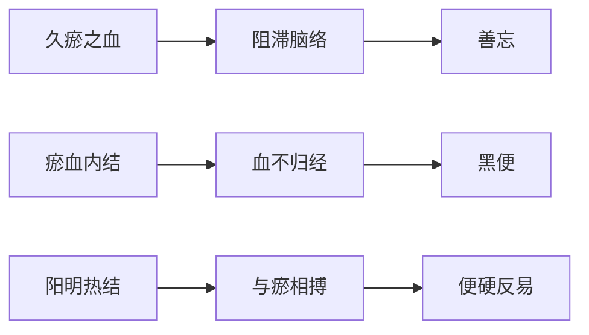

# 辨阳明病脉证并治法：二五二

## 二五二：「阳明证」，其人善忘者，必有蓄血，所以然者，本有久瘀之血，故令善忘；矢虽鞭，大便反易，其色必黑，宜「抵当汤」下之。

<!--more-->

平常阳明证，病人发狂奔走，已经全无意识了，其人善忘者，灵枢第八十篇「大惑论」：「上气不足，下气过实，其人善忘」。

> 下气过实，大便堵到，或下焦湿热，上焦是虚的，血气没办法供应到上焦，心肺、脑部，上气不足，就会善忘。

平常有阳明证，常常东西记不清，年龄大的人，善忘可能被西医判定为老人痴呆证，刚刚讲的可能马上忘了，最近的事都忘了，可是很久以前的事会记得，如果是大承气汤就攻大承气汤，如果是抵当汤就攻抵当汤。

> 抵当汤证，一般是腹腔里面有淤血，或子宫里面有肿瘤或淤血。外症，就是善忘，大便是黑色。

这条辨就是说善忘就是必有蓄血，定有瘀血瘀在里面，所以然者，本有久瘀之血，故令善忘；矢虽鞭，大便反易，其色必黑，大便颜色黑了代表有瘀血，从舌证上看，舌上有青紫色的，就是舌头全红而且有青紫色的瘀点，表示体内有瘀，有点白苔在舌头上才正常的。前面提过的三阴交穴压痛、舌苔齿痕明显、渴而不欲饮水，都可以用来诊断是否内有瘀血。

> 淤血最明显的症状，就是渴不欲饮。三阴交穴压痛、舌苔齿痕明显、渴而不欲饮水这都是使用抵当汤的时机，就是唯一处方，没有第二个处方。

> 肝病，肝硬化、肝癌，大便都是黑色的，因为在排毒。

如果病是太阳蓄血，血蓄在膀胱里面，就是桃核承气汤，如果是阳明蓄血，蓄在肠胃里面就是抵当汤，如果胃出血，西医灌流质入胃里面，一直洗胃，西医治疗完后，大都变成抵当汤证了，因为血干燥在里面，如果是大便干燥用芒硝一打就碎了，如果是血块，芒硝打不下来，就要用虻虫、水蛭才打得出来。

张隐庵曰：「太阳」蓄血，验其小便；「阳明」蓄血，验其大便；不用「桃仁」而用「抵当」者，以久瘀故也。

### 主证特点
1. **核心症状**
   - 善忘（近期记忆减退）
   - 大便虽硬而反易出
   - 便色漆黑如柏油

2. **伴随体征**
   - 舌质紫暗或有瘀斑
   - 三阴交穴压痛
   - 渴不欲饮

### 病机解析

### 鉴别诊断
| **证型**       | **病位** | **主症**               | **二便特点**           | **治疗方剂** |
|----------------|----------|------------------------|------------------------|--------------|
| 太阳蓄血       | 膀胱     | 如狂、少腹急结        | 小便自利               | 桃核承气汤   |
| 阳明蓄血       | 胃肠     | 善忘、黑便            | 大便硬而反易           | 抵当汤       |
| 阳明腑实       | 肠道     | 谵语、潮热            | 大便硬结难下           | 承气汤类     |

### 治疗要点
**抵当汤组成**
- 水蛭（熬）三十个
- 虻虫（去翅足，熬）三十个
- 桃仁（去皮尖）二十个
- 大黄（酒洗）三两

**应用指征**
1. 久瘀证候（病程较长）
2. 瘀血体征明显（舌紫、黑便等）
3. 排除单纯阳明腑实证

### 临床拓展
1. **现代对应病证**
   - 上消化道出血后瘀血滞留
   - 盆腔瘀血综合征
   - 部分老年痴呆症（瘀血型）

2. **诊断要点**
   - 问诊：近期记忆障碍与远期记忆保存
   - 望诊：面色黧黑、唇暗
   - 切诊：少腹硬满拒按

### 治疗警示
1. **禁忌**
   - 体质极度虚弱者慎用
   - 无明确瘀血指征者禁用

2. **预后观察**
   - 服药后当见瘀血下行
   - 便色由黑转黄为效

注：本方体现"瘀血不去，新血不生"的治疗原则，适用于瘀血与热邪互结之重证。与桃核承气汤相较，本方破血逐瘀之力更峻，适用于病程较久、病位较深之瘀血证。

---

> 作者: [AcuHerb](https://acuherb.xyz)  
> URL: https://acuherb.xyz/posts/shanghanlun-252/  

