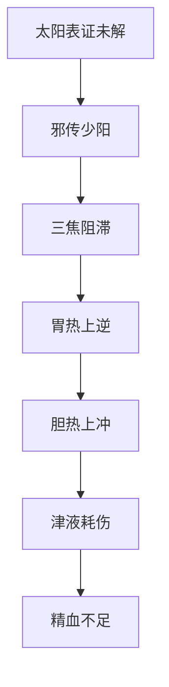

# 辨少阳病脉证并治法：二八二

## 二八二：「三阳合病」，脉浮大，上关上，但欲眠睡，目合则汗。

<!--more-->

「三阳合病」，应该和解少阳。如果病人脉浮，就是太阳证，脉大就是阳明证。

上关上，关脉跳到上面了，右边的关是脾胃，左边的关是胆，关脉已经跳到寸了，就是阳热往上焦走的现象。

因为胆胃太热了，所以胆汁上逆，病人会口苦，就知道胃热和胆热往上跑，代表小柴胡汤，所以在摸脉的时候可以知道身体的过程；

但欲眠睡，病人体力在太阳的时候已经耗掉很多，进入少阳的时候，肠胃吸收又不好，食物不能化生成血，因为被三焦阻隔到，所以精血的来源不够，病人就会有但欲眠睡的现象。目合则汗，眼睛闭起来会流汗，就是人很虚的现象，正常的流汗一定是在运动或动过后，可是现在病人躺着都会流汗，代表津液一直在丧失的阶段，这就是和解少阳，这时候用小柴胡汤。

> 目合则汗，不动就会流汗，代表表症还有。

如果查到病人胃里面有燥实、大便很少，津液一直在丧失，就知道病是介在少阳和阳明之间，所以是大柴胡汤，大柴胡汤里面有大黄。可以同时解少阳阳明并病。

### 核心辨证要点
1. **脉象特征**
   - **脉浮**：太阳表证未解
   - **脉大**：阳明里热已盛
   - **上关上**（关脉上越寸部）：
     - 右关→胃热上逆
     - 左关→胆热上冲

2. **典型症状**
   - **但欲眠睡**：
     - 病机：三焦阻滞→谷气不化→精血亏虚
   - **目合则汗**：
     - 特点：静卧盗汗
     - 病机：少阳枢机不利+太阳卫阳不固

### 病机分析

### 治疗策略
1. **基本治法**：和解少阳（小柴胡汤）
   - 适用：纯少阳证为主
   - 方义：
     - 柴胡、黄芩→清解少阳
     - 人参、甘草、大枣→固护津液

2. **变通治法**：少阳阳明双解（大柴胡汤）
   - 鉴别要点：
     | 指征           | 小柴胡汤证       | 大柴胡汤证         |
     |----------------|------------------|--------------------|
     | 大便情况       | 正常             | 燥实不通           |
     | 汗出特点       | 目合则汗         | 可能伴潮热         |
     | 腹部体征       | 无显著胀满       | 心下痞硬           |

### 临床注意事项
1. **辨证关键**：
   - 必须四诊合参，尤其注意：
     - 问诊：大便情况、口苦程度
     - 腹诊：心下压痛与否

2. **治疗禁忌**：
   - 禁用单纯发汗（伤阳）
   - 禁用单纯攻下（伤阴）

3. **预后判断**：
   - 正确用药后：
     - 盗汗止→三焦通畅
     - 精神振→谷气化生

> **注**：本条体现张仲景"保胃气、存津液"的治疗思想，在复杂合病情况下，当以调和少阳枢机为要，根据阳明腑实程度灵活选用柴胡类方。

---

> 作者: [AcuHerb](https://acuherb.xyz)  
> URL: https://acuherb.xyz/posts/shanghanlun-282/  

