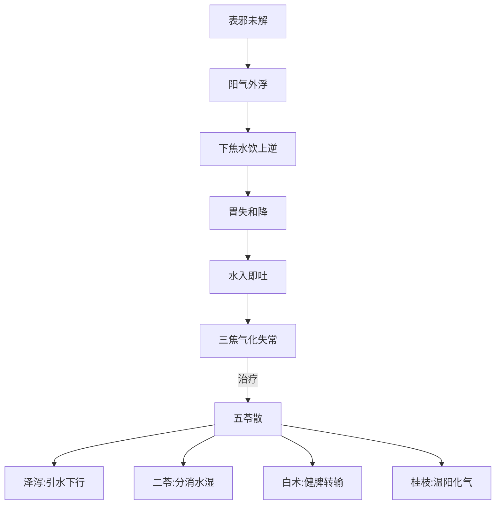

# 辨太阳病脉证并治法中：八十

## 八十：「中风」发热，六七日不解而烦，有表里证，渴欲饮水，水入则吐者，名曰「水逆」，「五苓散」主之。

<!--more-->

> 发汗之后，病没有去，病人说他口渴，却一喝水就吐。常常我们临床上，病人说奇怪吃东西都吃不下去，连喝水都吐，这就已经是五苓散症了。只要喝水就吐，就给他五苓散。

胃里面的水，发表发到表面以后，阳往上冲，阳被发到皮肤上去，阳就居上居外，下面的水就往上吸，下焦的水应该小便小掉的，结果虹吸原理被往回头走，这样就有间隙，有表里证，喝水就吐出来了，下面的水往上走，胃又没有办法蒸发掉，喝进来的水，就不能受，所以用猪苓、茯苓、泽泻，把下焦的水利掉，又健脾整胃，恢复脾胃的功能，所以用五苓散。

> 有时候五苓散症不见得是因为中风，吃了发表的药。

临床上常看到有些病人因为喝水喝得太多太快，结果水停在中膈，也变成五苓散证。

五苓散里面用到少量的桂枝，配伍非常精妙，桂枝有温阳化水的功能，这温化的功能是温胃，如果五苓散少了桂枝，像温病派那样不敢用桂枝，那么效果就差多了。

### 水逆证核心辨证要点
1. **典型症状组合**：
   - 表证：发热持续（六七日不解）
   - 里证：烦渴欲饮
   - 特征性表现：水入即吐

2. **病机关键**：
   - 三焦气化失司→水液代谢紊乱
   - 下焦水饮上逆→胃失和降
   - 表邪未解→阳浮于外

### 五苓散作用机理图解

### 临床鉴别诊断
| 鉴别项目 | 水逆证 | 痰饮呕吐 | 胃热呕吐 |
|---------|--------|----------|----------|
| **呕吐特点** | 饮水即吐 | 吐涎沫 | 食入即吐 |
| **口渴情况** | 渴欲饮但吐 | 口不渴 | 大渴引饮 |
| **舌象特征** | 舌淡润有齿痕 | 舌苔白滑 | 舌红苔黄 |
| **脉象特点** | 浮滑 | 弦滑 | 洪数 |

### 现代临床拓展应用
1. **急症处理**：
   - 急性胃肠炎脱水期（口渴但水入即吐）
   - 化疗后呕吐（伴小便不利者）

2. **慢性病症**：
   - 梅尼埃病发作期（眩晕呕吐）
   - 妊娠恶阻（顽固性呕吐）

3. **特殊用法**：
   - 散剂冷服法（治格拒）
   - 配合针刺（内关、足三里）

### 治疗注意事项
1. **桂枝的关键作用**：
   - 必需配伍（即使少量）
   - 温阳化气不可替代
   - 与泽泻形成"升降相因"药对

2. **剂型选择原则**：
   - 急症用汤剂（量宜轻）
   - 慢性病用散剂（便于坚持）

3. **预后判断**：
   - 有效指标：小便通利为转机
   - 禁忌：肾功能衰竭者慎用

> **临证心法**：凡见"渴欲饮水，水入则吐"之症，不论是否伴发热，皆可考虑水逆证。五苓散之妙，在于恢复人体水液气化之常，非单纯止吐利水。桂枝于此方中如画龙点睛，少之则效减，去之则方废。

---

> 作者: [AcuHerb](https://acuherb.xyz)  
> URL: https://acuherb.xyz/posts/shanghanlun-80/  

