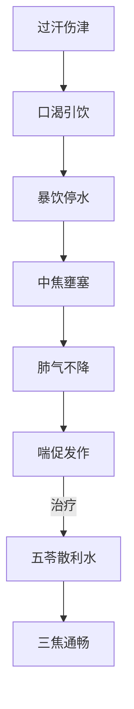

# 辨太阳病脉证并治法中：八二

## 八二：发汗后，饮水多，必喘，以水灌之，亦喘。

<!--more-->

> 所以发汗之后，口渴代表病好了，但是不要喝水喝太快，一下喝太多，慢慢喝，或者喝稀饭，把肠胃的津液慢慢补回去。吃麻黄汤后，肺的津液缺失，口渴，多吃点豆腐、水梨等，补充津液，也不要吃太快。

这大多是发汗发太过了，所以喝水少少与之就好了；

喝太多了，胃没有办法把水消化掉：水停在中焦，肺气就没有办法下降，正常的津液应该要自肺下到五脏六腑，但是中焦堵到了.水气下不去，就会喘，如果遇到这种情形用「五苓散」来解。

柯韵伯曰：未发汗因风寒而喘，是「麻黄证」。下后微喘者，「桂枝加厚朴杏仁证」。喘而汗出者，「葛根黄芩黄连证」，此汗后津液不足，饮水多而喘者，是「五苓散」。平常感冒药桂枝汤、麻黄汤、葛根汤剂量如果开得很好，刚好把病毒赶出去，没有进入身体，然后让好的液留着，如果开的剂量不足，汗一发出去，四分之三的病毒发出去了，发汗之后津液还会回胃中，四分之一的病毒随着津液进入肠胃，结果变成肠胃发炎下利，用「葛芩连汤」下去解利，津液不足，用葛根把津液补足。

### 病机与证候
1. **核心病机**：
   - 发汗太过→津液耗伤→饮水自救
   - 暴饮停水→中焦壅塞→肺气不降

2. **临床表现**：
   - 主症：汗后暴饮致喘
   - 兼症：胸闷、短气、咳唾清水
   - 特征：喘促与饮水量直接相关

### 鉴别诊断
| 喘证类型 | 诱发因素 | 病机特点 | 治疗方剂 |
|----------|----------|----------|----------|
| 汗后水喘 | 暴饮冷水 | 水停中焦 | 五苓散 |
| 麻黄汤喘 | 风寒束表 | 肺气郁闭 | 麻黄汤 |
| 下后微喘 | 误下伤正 | 表邪内陷 | 桂枝加厚朴杏子汤 |
| 协热下利喘 | 热迫大肠 | 肺热下利 | 葛根芩连汤 |

### 治疗要点
1. **五苓散应用指征**：
   - 汗后饮水多致喘
   - 伴小便不利、口渴
   - 舌苔白滑、脉浮

2. **预防调护**：
   - 汗后宜"少少与饮之"
   - 推荐替代饮品：
     - 粳米汤（最佳）
     - 梨汁（肺燥者宜）
     - 豆浆（阴虚者适）

### 病机演变图示

### 临床启示
1. **现代意义**：
   - 术后/运动后补水过速致肺水肿
   - 输液反应中的急性肺水肿

2. **治疗禁忌**：
   - 禁用止咳平喘治标
   - 忌用苦寒伤阳之品

3. **传变预警**：
   - 误治可转为支饮（苓甘五味姜辛汤证）
   - 迁延不愈易成痰饮（小青龙汤证）

> **仲景心法**：本条揭示"汗-水-喘"的病理链条，强调治病当求其本。五苓散通过恢复三焦气化，使水津四布，喘自平复。临床见喘当先问饮水史，别于他证。

---

> 作者: [AcuHerb](https://acuherb.xyz)  
> URL: https://acuherb.xyz/posts/shanghanlun-82/  

