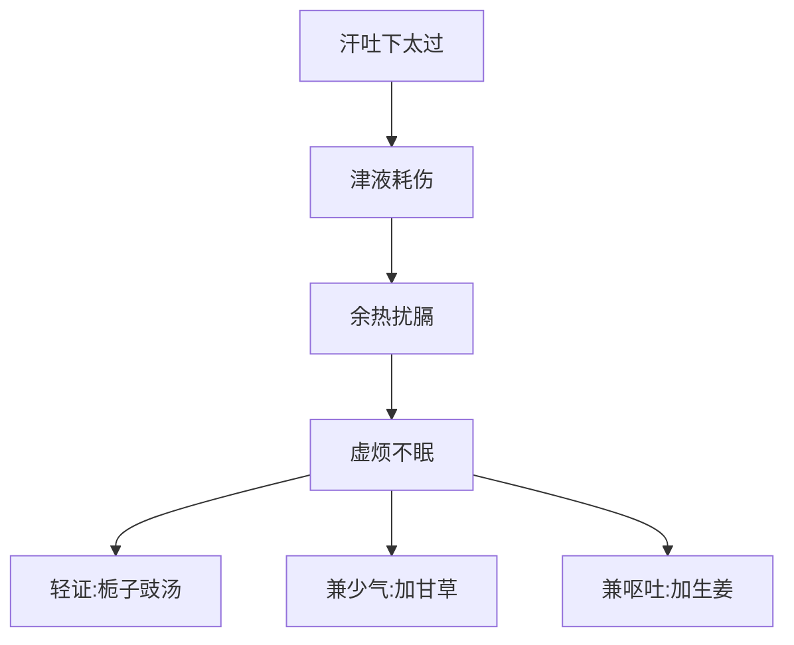

# 辨太阳病脉证并治法中：八四

## 八四：发汗吐下后，虚烦不得眠，若剧者，必反复颠倒，心中懊儂「栀子豉汤」主之。若少气者，「栀子甘草豉汤」主之。若呕者，「栀子生姜豉汤」主之。

<!--more-->

> 病愈了后，病人没法睡觉，栀子豉汤，可去虚烦不得眠。还是津液伤到的症状，用于病后调理。如果有呕，恶心的感觉，再加生姜除烦止呕。

栀子，这药专门能去上焦的热，上焦就是讲肺、心，栀子去上焦的热和石膏不同，石膏去的是实热，栀子去的是虚热，实热和虚热病人都会感觉烦躁，但是虚热的人舌苔是淡黄，实热的舌苔黄而且干燥干裂，还有看脉的力量如果是比较无力，重按就不见了，就是虚热。

> 栀子，质很轻，不像黄连是根，质很重能跑到很深的地方。栀子可去心脏的虚热。

> 豆豉可生肠胃的津液，阴津。

临床上看到病人有黄疸的时候，看到的是虚热，现代说的急性肝炎也可能用到栀子，豆豉这药本身也会发汗，但是没有桂枝麻黄那么强，是介于补药和发表中间的药。

发汗、吐、下，会给病人发汗一定是有表证，汗吐下就是水已经去掉了，水去掉的同时，病人身体是很虚弱的，因为津液伤到了，如果半夜津液慢慢回来，胃口开了，吃东西就好了，就不用管他了，有的人没有办法恢复，就变成虚烦不得眠，如果严重的时候，就会反复颠倒，就是在床上睡不着，翻来覆去，心中很懊侬，就是心中很烦闷，胃里面怪怪的，所以栀子豉汤，这个药是病后调理的药。

少气就是四肢没有力量，手脚的力量不够、加甘草进去，甘草能健脾胃，能解百毒，除去胃中坏死的食物。

> 病刚好，肠胃元气刚刚恢复，消化不是很好，肠胃中可能就有久陈、坏死的食物。

若呕者，加生姜，生姜本来就是除烦止呕的，为什么不加半夏?因为这剂药是调理的，半夏是治病的，不需要用半夏那么强的药，因为胃中没有停水，发汗吐下后，津液才刚回来，还不是很足，用了半夏又会把津液去掉，所以只用生姜；金匮中治疗妊娠呕吐不止的干姜人参半夏丸，孕妇吐水不止，就一定要用到生半夏。

> 会用到半夏，都是因为有停水。水生万物，可以滋养你，也能生不好的东西，正常人的水是气化的水，水中有热，一但是冷水，就要排掉，否则冷水占着地方新水不会过来。所以病人口渴，胃火很小，大量水喝下去，胃就会产生停水，这个现象很常见，因为我们治病后，病人一下恢复了，从不口渴变成口渴这种好转的现象，还有胃口也恢复了，结果大量喝水，把胃中才刚起来的微火浇灭了，有了停水。停水就是冷水、寒水，再加上肠胃中的宿食，食物就发酵烂掉了。

> 孕妇吐水不止，半夏干姜人参，效果非常好。西医只会用胃镜，进进出出，还是不知道为什么，还可能把脾脏弄破了。

临床上用这栀子豉汤一个礼拜，急性肝炎的指数就退掉了，还有更好的药在后面，这只是最初期的。虚烦不得眠、心中懊侬、小便黄黄的、吃东西吃不下去、手脚没有力、恶心、想吐，都是肝炎的症状，所以一般身体虚的时候，一发表。发完后才会有这种现象，就用这方，所以这方是病后调理的汤剂。

因为血虚，常常晚上睡不着的时候，灸灸「三毛」，睡不着、虚烦的时候，魂在眼睛上面。「三毛」刚好在肝经脾经交会的地方，因为脾是生血的，肝是藏血的，灸它的时候，血马上就进入肝，魂就归肝，自然就睡了。

栀子豆豉两者皆属苦寒之品，苦可清心除烦，寒可消炎退热，且「栀子」能降血压，使脑神经宁静，「豆豉」能生水液，以滋胃阴，两者合用，成为清心宁神之良方。虚烦不眠，大多起于热病之后，余热未清，正气未复之时，「栀子豉汤」实有特效。

「栀子豉汤」，为温病汗吐下后余热未尽之佳方。凡温病最容易耗散阴液。阴液既伤，虽经汗或吐或下后，病邪虽解，残余之热毒往往不净，成为午后潮热或五心烦热、失眠、心烦等证：所以这个证是发汗吐下以后才会有的，没有发汗吐下的话，就看不到这个证。还有一种情形，就是服用发表药以后，如果吃肉类食物所产生的虚热，也会出现这种症状。

> [!TIP]**栀子豉汤方**
>
> 桅子十四枚劈 | 香鼓四合绵裹
>
> 右二味，以水四升，先煮栀于得二升半，内豉，煮取一升半，去滓，分温二服。

栀子一般五钱，豆豉也是五钱，不要把豆豉煮烂掉了，所以先煮栀子。

> [!TIP]**栀子甘草豉汤方**
>
> 栀子十四枚 | 甘草二两 | 香鼓四合
>
> 右三味，以水四升，先煮栀子、甘草得二升半，内豉，煮取一升半，去滓，分温二服。

栀子用五钱，甘草二钱，豆豉也是五钱。

这汤剂是用在病人食物中毒，吃坏肚子了以后，造成的胃肠不适，造成吐，如果因为食物引起的问题，只有吐没有下利的时候，就用栀子甘草豉汤。

如果有下利，这汤剂就没有效了，就应该用葛芩连汤。一般来说上吐下泻，一定是热证，也就发炎了。

> 该发表时，却被下了，表邪下陷。感冒病毒跑到了肠子里，就下利了，如果在胃里则会呕吐，用生姜。小孩子的肠病毒，就是表邪下陷造成的，葛芩连汤，很好玩的是，当小孩子他需要的时候，黄芩黄连非常苦，吃下却感觉是甜的。就好像得水则吐，开五苓散的时候，喝水都吐，肯定喝不下去，结果就五苓散可以喝下去。

【千金方】本方条曰：「栀子甘草豉汤方」，治食宿饭、陈羹、臭肉、宿菜而发者。

### 证候体系总览
| 方证         | 核心症状                     | 药物组成                  | 现代对应病症               |
|--------------|----------------------------|-------------------------|--------------------------|
| 栀子豉汤证   | 虚烦不眠，心中懊憹          | 栀子+豆豉               | 病后神经衰弱、肝炎初期     |
| 栀子甘草豉汤 | 虚烦少气（四肢无力）        | 上方+甘草               | 食物中毒后虚弱状态         |
| 栀子生姜豉汤 | 虚烦伴呕                    | 上方+生姜               | 胃肠型感冒恢复期           |

### 核心病机图解

### 药物作用机理
1. **栀子**：
   - 性味：苦寒质轻
   - 靶点：上焦虚热（心、肺）
   - 现代药理：保肝利胆、中枢镇静

2. **豆豉**：
   - 特殊功效：生津不敛邪
   - 配伍意义：与栀子形成"清补兼施"组合

3. **加减法**：
   - 甘草：建中气（用量宜轻）
   - 生姜：和胃止呕（不用半夏之理）

### 临床鉴别要点
1. **虚实之辨**：
   - 实热：舌苔黄燥，脉洪大（石膏证）
   - 虚热：舌淡红苔薄黄，脉细数（本证）

2. **类证鉴别**：
   - 黄连阿胶汤证：真阴亏虚之烦
   - 酸枣仁汤证：肝血不足之失眠

### 现代拓展应用
1. **传染病恢复期**：
   - 新冠肺炎后遗神经症状
   - 病毒性肝炎转氨酶异常

2. **情志病**：
   - 焦虑症之躯体化障碍
   - 更年期综合征

3. **儿科应用**：
   - 肠病毒感染后调理
   - 疫苗接种后低热烦躁

### 特殊用药技巧
1. **煎服法**：
   - 先煎栀子，后下豆豉（保其生津之性）
   - 少量频服（防格拒）

2. **外治法配合**：
   - 灸三毛穴（大敦穴上毫毛处）
   - 耳穴压豆（心、神门）

> **仲景心法**：本条揭示"祛邪不伤正"的治疗思想。栀子豉汤类方体现"清余热、护胃气、生津液"三法合一，为温病学派"清热透邪"治法之先导。临床运用时需把握"病后余热"的特殊病机，不可用于实热炽盛之证。

---

> 作者: [AcuHerb](https://acuherb.xyz)  
> URL: https://acuherb.xyz/posts/shanghanlun-84/  

