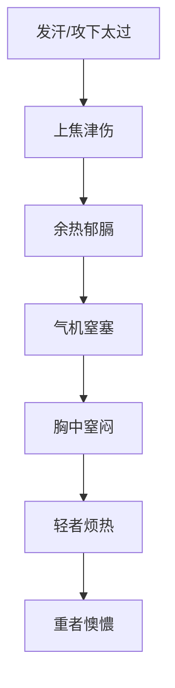

# 辨太阳病脉证并治法中：八五

## 八五：发汗，若下之，而烦热，胸中窒者，「栀子豉汤」主之。

<!--more-->

> 此时还是虚热。一般来说，体格很好的人，肠胃很好，不会出现。所以一定要保养好肠胃。

发汗，被攻了以后，感觉烦热，胸中窒者就是呼吸呼不过来，就是栀子豉汤。

### 核心辨证要点
1. **典型症状组合**：
   - 主症：胸中窒塞感（非疼痛）
   - 伴随症状：
     - 烦热（自觉发热但体温可正常）
     - 呼吸不畅（非哮喘样发作）
     - 轻度的坐卧不安

2. **发病特点**：
   - 必有误治史（发汗太过或误下）
   - 起病于热病后期或误治后
   - 症状轻重与情绪波动相关

### 病机三维分析

### 鉴别诊断表
| 鉴别要点 | 栀子豉汤证 | 结胸证 | 胸痹证 |
|---------|------------|--------|--------|
| **疼痛性质** | 窒塞感无痛 | 硬痛拒按 | 闷痛彻背 |
| **发病诱因** | 误治后出现 | 素有痰饮 | 阳虚感寒 |
| **舌象特征** | 舌红苔薄黄 | 舌苔厚腻 | 舌淡苔白 |
| **脉象特点** | 脉细数 | 脉沉紧 | 脉阳微阴弦 |
| **治疗原则** | 清热除烦 | 泻热逐水 | 通阳宣痹 |

### 现代临床扩展
1. **适用病症**：
   - 心脏神经官能症
   - 更年期综合征胸闷
   - 胃食管反流病（非糜烂型）
   - 新冠恢复期胸窒感

2. **体质特点**：
   - 多见于"木火型"体质
   - 常见于长期脑力劳动者
   - 胃肠功能紊乱者易发

### 治疗注意事项
1. **用药技巧**：
   - 栀子宜生用（不必炮制）
   - 豆豅选择淡豆豉（非咸豆豉）
   - 可加少量粳米护胃

2. **疗程控制**：
   - 中病即止（一般3-5剂）
   - 见效指标：胸窒减轻、夜寐转安

3. **禁忌人群**：
   - 脾胃虚寒者慎用
   - 阳虚水泛者禁用
   - 孕妇需配伍使用

> **仲景心法**：本条揭示"热郁胸膈"的特殊证型，其胸窒特点为"自觉窒塞而查无实邪"。临床需与器质性胸痛严格鉴别，本方体现"轻可去实"的治疗智慧，通过清透郁热而非攻逐实邪来解除胸窒。

---

> 作者: [AcuHerb](https://acuherb.xyz)  
> URL: https://acuherb.xyz/posts/shanghanlun-85/  

