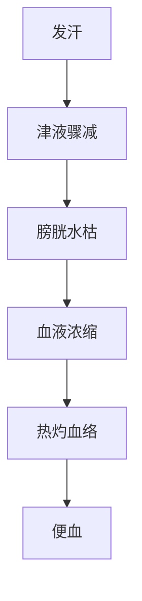

# 辨太阳病脉证并治法中：九二

## 九二：「淋家」不可发汗，发汗必便血。

<!--more-->

> 小便有石淋，小便滴滴答答，或小便有痛有发炎，或小便可以看到白浊的东西。

> 足太阳膀胱经，你一发汗，膀胱里的水份会没有，小便会很浓。

中医讲的淋家，不单单是包含了西医的淋病、性病在内，小便有石淋，下消有石头在里面也算，石淋，西医可能讲成膀胱结石或肾脏结石；还有膏淋，小便浓浓的，浓浊白白的，可能里面发炎了，可能是把精液都小出来了，因为禁不住了；还有血淋，小便出来带很多血，小便有问题的人，大部份平常血就素虚了，这时候不可以发汗，一发汗的时候，一定会便血，因为汗会使水没有了，只剩下血了，血里面的水不够了，单纯只有血的时候，体温会升高、温度一升高，血管就破掉了，血就出来了，所以这种病常常用「猪苓汤」。

### 核心理论
- **淋家定义**：泛指各类小便异常患者（不限于西医淋病）
- **禁忌原理**：发汗会加重津液耗伤，导致膀胱热灼血络

### 淋证分类与特征
| 类型   | 临床表现               | 现代对应疾病           |
|--------|------------------------|------------------------|
| 石淋   | 小便涩痛、尿路结石     | 膀胱/肾结石            |
| 膏淋   | 小便浑浊如米泔或精浊   | 乳糜尿/前列腺炎        |
| 血淋   | 小便带血、灼热刺痛     | 泌尿系感染/结核        |

### 发汗变证机制

### 治疗要点
1. **禁忌**  
   - 绝对禁用辛温发汗法（如麻黄汤、桂枝汤）

2. **代表方剂**  
   - **猪苓汤**（利水清热养阴）  
     ▸ 组成：猪苓、茯苓、泽泻、阿胶、滑石  
     ▸ 针对：阴虚水热互结之淋证  

3. **病机关键**  
   - 素体阴血不足（淋家多兼阴虚）  
   - 发汗后"血中缺水"致血管脆裂  

> **临床警示**：遇长期小便异常患者，需先问诊排除淋家，避免误汗伤阴动血。

---

> 作者: [AcuHerb](https://acuherb.xyz)  
> URL: https://acuherb.xyz/posts/shanghanlun-92/  

