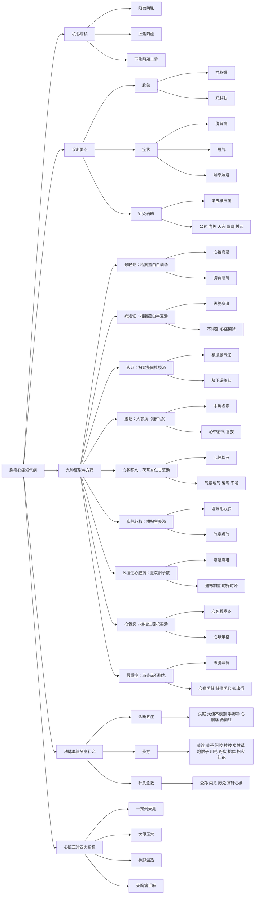

# 经方治疗心脏病之体系与临床应用

## 一、总论：中医对心脏病的独特认知

中医认为“心为君主之官”，神明藏焉，本身不受病。若心脏本体有病，则为死症。临床上所见各类心脏病，多非心脏本体之病，而是痰饮、瘀血、寒邪等病理产物阻滞心脉、心包，或脏腑功能失调（如肠胃虚寒）导致心阳不伸所致。张仲景在《金匮要略》中，以“胸痹”统摄此类疾病，根据病邪所在部位（心包、纵膈、横膈）及病情轻重缓急，立下了一系列效如桴鼓的方剂，如果配合针灸治疗，对于“心脏病”的治疗可以做到立竿见影。

## 二、胸痹核心病机：阳微阴弦

张仲景指出，胸痹的核心脉象为“阳微阴弦”。  
- **阳微**：寸脉微弱，指上焦阳气不足，胸阳不振。  
- **阴弦**：尺脉弦紧，指下焦阴寒、水饮之气上乘阳位。  

正因上焦阳虚，下焦阴寒之邪（痰、饮、水、寒）得以逆而上行，痹阻胸阳，发为胸痛、短气、喘息等症。

## 三、胸痹九种证型与对应方药（由轻至重）

| 阶段 | 证型 | 核心症状 | 病机 | 代表方剂 |
| :--- | :--- | :--- | :--- | :--- |
| **第一阶段** | 胸痹轻证 | 喘息咳唾，胸背痛，短气，寸口脉沉迟 | 心包有痰湿，胸阳郁闭 | **栝蒌薤白白酒汤** |
| **第二阶段** | 痰饮较重 | 不得卧，心痛彻背 | 纵膈腔痰浊壅盛，病情进展 | **栝蒌薤白半夏汤** |
| **第三阶段** | 实证（气滞痰阻） | 心中痞气，气结在胸，胸满，胁下逆抢心 | 横膈膜气逆，痰饮停滞 | **枳实薤白桂枝汤** |
| **第四阶段** | 虚证（中焦虚寒） | 心中痞气，气结在胸，胸满 | 中焦虚寒，心阳不伸 | **人参汤（理中汤）** |
| **第五阶段** | 水饮凌心 | 胸中气塞，短气，隐痛，不渴，躺下胸闷加重 | 心包积液（心包积水） | **茯苓杏仁甘草汤** |
| **第六阶段** | 痰阻心肺 | 胸中气塞，短气 | 湿痰阻滞于心肺之间 | **橘枳生姜汤** |
| **第七阶段** | 寒湿痹阻 | 胸痹缓急（时好时坏，遇寒加重） | 风湿性心脏病，寒湿内侵 | **薏苡附子散** |
| **第八阶段** | 心包炎 | 心中痞，诸逆，心悬痛（心悬半空） | 心包膜发炎，痰湿郁结 | **桂枝生姜枳实汤** |
| **第九阶段** | 重症（寒痰凝滞） | 心痛彻背，背痛彻心（如虫行） | 上焦极寒，痰湿在纵膈腔游走 | **乌头赤石脂丸**（临床多用乌梅丸化裁） |

## 四、关键方剂解析

### 1. **栝蒌薤白白酒汤**
- **药物**：栝蒌实、薤白、白酒  
- **方义**：栝蒌实形似心脏，能开胸中郁结、涤痰散结；薤白辛温滑利，通阳散结，善祛心包之痰；白酒（或甜酒酿）辛散温通，助药力上行，宣发胸中阳气。  
- **主治**：胸痹最轻证，表现为胸背隐痛、短气、喘息。

### 2. **栝蒌薤白半夏汤**
- **药物**：栝蒌实、薤白、半夏、白酒  
- **方义**：在栝蒌薤白白酒汤基础上加入半夏，增强化痰逐饮之力。  
- **主治**：病情进展，出现“不得卧、心痛彻背”，提示痰浊壅盛，已影响纵膈。

### 3. **枳实薤白桂枝汤 vs. 人参汤**
- **实证用枳实薤白桂枝汤**：枳实开胸，厚朴降气，桂枝通阳，薤白涤痰，栝蒌实散结。专治“胁下逆抢心”之实证，以通为用。  
- **虚证用人参汤（理中汤）**：人参、白术、干姜、甘草，温中健脾，补益中焦。中焦阳旺，则上焦之气自降，胸闷自除。

### 4. **茯苓杏仁甘草汤 vs. 橘枳生姜汤**
- **茯苓杏仁甘草汤**：茯苓利水渗湿，杏仁润肺开肺气，甘草缓中。主治心包积液，症见“胸中气塞、短气、隐痛、不渴”。  
- **橘枳生姜汤**：橘皮（陈皮）理气化痰，枳实开胸，生姜散水。主治湿痰阻于心肺之间，症见“胸中气塞、短气”。

### 5. **薏苡附子散**
- **药物**：薏苡仁、炮附子  
- **方义**：薏苡仁祛湿，炮附子温阳散寒。  
- **主治**：风湿性心脏病，遇寒加重，时好时坏。此为“胸痹缓急”之正治。

### 6. **乌头赤石脂丸（临床多用乌梅丸化裁）**
- **药物**：乌头（或乌梅）、蜀椒、干姜、附子、赤石脂  
- **方义**：蜀椒、干姜、附子大辛大热，破上焦寒凝；乌梅酸收，入肝以制心；赤石脂涩以固之。  
- **主治**：最严重之胸痹，症见“心痛彻背，背痛彻心，如虫行”，为寒痰凝滞纵膈。

## 五、动脉血管堵塞（冠状动脉硬化）之辨治

### 1. **诊断要点（四大症状）**
- **失眠**：无故失眠，心不藏神。
- **大便不规则**：心与小肠表里，心率不齐则小肠蠕动异常。
- **手脚冷**：心阳不足，四末失温。
- **心胸刺痛**：如刀刺，持续且固定。

### 2. **处方思路**
- **活血化瘀**：川芎、丹皮、桃仁、红花
- **入心导药**：黄连、黄芩（苦寒，引药入心，兼解心火之毒）
- **补心血**：阿胶
- **通心阳**：桂枝、炙甘草
- **温阳散寒**：炮附子
- **开胸痹**：枳实

### 3. **针灸急救**
- **主穴**：公孙、内关（八脉交会穴，通于心胸胃）
- **配穴**：天突、巨阙、关元（心三针）
- **井穴**：厉兑（井主心下满，用于急性痛）
- **耳针**：心点

## 六、心脏正常之四大指标

- **睡眠**：一觉到天亮。
- **大便**：每日一行，规律成形。
- **手足**：温热，尤其是脚趾尖。
- **胸痛**：无胸闷、刺痛，手指无麻痛。

## 七、结语

《胸痹心痛短气病脉证并治》第九篇，构建了一套从轻到重、从实到虚、从痰到水、从寒到瘀的完整心脏病治疗体系。其核心在于“通阳”、“祛痰”、“化饮”、“逐瘀”、“温寒”。经方治疗心脏病，尤其在急性胸痛、心律不齐、心包积液等症上，往往能取得“立竿见影”之效，远非现代医学单纯对症治疗所能比拟。

掌握此篇，不仅可治“心脏病”，更可预防因心脏功能失调而引发的诸多疑难杂症（如乳癌、红斑狼疮等），实为中医临床之瑰宝。

## 八、思维导图

---
**说明**：本文基于《金匮要略》原文及倪海厦先生讲授内容整理，旨在传承经典，临床应用请结合具体病情，在专业医师指导下进行。

---

> 作者: [AcuHerb](https://acuherb.xyz/)  
> URL: https://acuherb.xyz/posts/yihua-7-jfzlxzbztxylcyy/  

