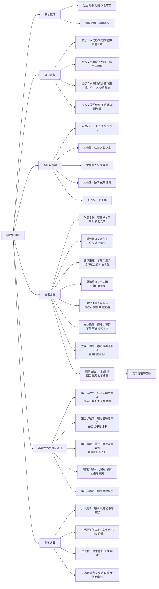

# 痰饮欬嗽病：从内伤之源到温阳利水之治

## 引言：饮病——百病之源

在中医理论中，“饮”是一个独特而重要的概念。它不同于外感六淫所致的水气病，而是由内伤七情、饮食不节、劳倦过度等因素，导致体内水液代谢失常，停聚于某处而成的病理产物。张仲景在《金匮要略》中特立“痰饮欬嗽病”一篇，系统阐述了饮病的分类、病机、诊断与治法。倪海厦先生曾言：“饮常常停在内脏的下方，如果不去掉，日后必成大患。”掌握此篇，不仅能治咳嗽、水肿，更能阻断诸多疑难重症的发生。

## 一、总纲：饮有四——痰饮、悬饮、溢饮、支饮

张仲景开篇即点明：“夫饮有四，何谓也？师曰：有痰饮，有悬饮，有溢饮，有支饮。”此四饮，虽同属水饮停聚，但其部位、症状、治法各有不同。

| 饮名 | 病位 | 主症 | 病机 |
| :--- | :--- | :--- | :--- |
| **痰饮** | 肠间 | 素盛今瘦，水走肠间，沥沥有声 | 水走肠间，渗入肠外腹膜 |
| **悬饮** | 胁下 | 饮后水流在胁下，欬唾引痛 | 水停肋膜之间，如悬空中 |
| **溢饮** | 四肢 | 饮水流行，归于四肢，当汗出而不汗出，身体疼重 | 水溢肌表，不得汗出 |
| **支饮** | 胸膈 | 欬逆倚息，不得卧，其形如肿 | 水停胸膈，上迫于肺 |

**核心病机**：饮病由内伤所致，情志不遂（喜伤心、思伤脾、怒伤肝、忧伤肺、恐伤肾）是其根本原因。治疗总则：**温阳利水**。

## 二、五脏水饮辨

张仲景进一步将饮病落实到五脏，为临床辨证提供精准依据：

- **水在心**：心下坚筑，短气，恶水不欲饮（水气凌心）。
- **水在肺**：吐涎沫，欲饮水（肺中水饮，津液不布）。
- **水在脾**：少气身重（脾主四肢，水湿困脾）。
- **水在肝**：胁下支满，嚏而痛（肝经循行部位）。
- **水在肾**：心下悸（脐下悸动，肾水不化）。

## 三、饮病九大证型与对应方药（由浅入深）

### 1. 浅层水饮：苓桂术甘汤证
**症状**：心下有痰饮，胸胁支满，目眩。  
**病机**：水停胃中，阳气不升。  
**方义**：桂枝通阳，茯苓利水，白术健脾，甘草缓中。  
**要点**：此方治“目眩”，为水饮之最浅者。病人常因大渴猛灌水而得。晕车晕船、神经衰弱、心脏动悸皆可用。

### 2. 微饮轻证：苓桂术甘汤 vs. 肾气丸
**症状**：短气有微饮。  
**病机**：水停中焦（苓桂术甘汤）或肾不纳气（肾气丸）。  
**要点**：二者皆可治微饮，但一治胃，一治肾。若短气兼有腰酸、脚冷、舌干，则属肾气丸证。

### 3. 留饮重症：甘遂半夏汤证
**症状**：脉伏，其人欲自利，利反快，虽利，心下续坚满。  
**病机**：水饮停于胸膈深处，无管道可排，利后复聚。  
**方义**：甘遂攻水，半夏利水，白芍酸收挤压脏腑之水，甘草缓药性，蜂蜜解毒。  
**要点**：此方治“留饮”——饮去复来，心下硬满。与十枣汤的区别：十枣汤证不能平躺，甘遂半夏汤证可以平躺。

### 4. 悬饮重症：十枣汤证
**症状**：脉沉而弦，悬饮内痛，欬逆倚息，不得卧。  
**病机**：肺下积水，肺泡充水。  
**方义**：甘遂、芫花、大戟等分，峻下逐水；红枣汤送服，护胃保津。  
**要点**：此方为治疗胸水的唯一处方。病人但坐不得卧，咳吐涎沫。服后上吐下泻，水饮尽去。西医抽水后水仍复来，十枣汤一剂可愈。

### 5. 溢饮：大青龙汤 vs. 小青龙汤
**症状**：溢饮（四肢水肿，身体疼重）。  
**病机**：表寒里热（大青龙汤）或表寒里寒（小青龙汤）。  
**方义**：
- **大青龙汤**：麻黄重用开腠理，石膏清里热，治“外寒里热”之溢饮。
- **小青龙汤**：麻黄、桂枝解表，干姜、细辛温里，治“外寒里寒”之溢饮。
**要点**：舌苔黄用大青龙，舌苔白用小青龙。

### 6. 膈间支饮：木防己汤 vs. 木防己去石膏加茯苓芒硝汤
**症状**：膈间支饮，喘满，心下痞坚，面色黧黑，脉沉紧。  
**病机**：宿食堵于胃下，寒湿与伏热互结。  
**方义**：
- **木防己汤**：防己通利三焦，桂枝行阳，人参补虚，石膏清伏热。
- **木防己去石膏加茯苓芒硝汤**：若实者（宿垢已成），去石膏，加茯苓利水，芒硝攻坚。
**要点**：面色黧黑（胃气不荣）是本方关键。若治后三日复发，为实者，需加芒硝攻坚。

### 7. 支饮眩冒：泽泻汤证
**症状**：心下有支饮，其人苦冒眩。  
**病机**：脾脏积水，清阳不升。  
**方义**：泽泻利水，白术健脾。  
**要点**：此方治“左肋痛”伴严重眩晕、眼前发黑。脾脏肿大初期即为此证。

### 8. 支饮胸满：厚朴大黄汤证
**症状**：支饮胸满。  
**病机**：下焦便秘，浊气上逆。  
**方义**：厚朴降逆，枳实开胸，大黄通便。  
**要点**：此方与小承气汤相似，但重用厚朴以降气，治“胸满”由下焦不通所致。

### 9. 支饮不得息：葶苈大枣泻肺汤证
**症状**：支饮不得息。  
**病机**：肺中痰热壅盛，痰水互结。  
**方义**：葶苈子苦寒涤痰，大枣护胃。  
**要点**：病人呼吸可闻痰鸣，咳吐浓痰，舌苔黄腻。此为肺中积痰所致。

## 四、饮病变证与层层递进之治法

张仲景在饮病篇后半部分，详细描述了小青龙汤发汗后，因病人本虚而出现的系列变证，并给出层层递进的解决方案，堪称临床典范。

### 变证一：冲气上逆（桂苓五味甘草汤）
**症状**：小青龙汤后，多唾口燥，寸脉沉，尺脉微，手足厥逆，气从小腹上冲胸咽，面翕热如醉状，小便难，时复冒。  
**方义**：桂枝降冲气，茯苓利水，五味子敛逆，甘草补虚。  
**要点**：此为阴虚阳亢，冲气上逆。病人常诉“头上像戴了帽子”。

### 变证二：咳满又作（苓甘五味姜辛汤）
**症状**：冲气即低，而反更欬，胸满。  
**方义**：去桂枝，加干姜、细辛，温肺化饮。  
**要点**：冲气虽降，但伏饮被带出，肺中寒饮作祟。

### 变证三：呕而支饮（苓甘五味姜辛半夏汤）
**症状**：咳满即止，而冲气复发，渴反止，冒而呕。  
**方义**：加半夏，降逆止呕，去水饮。  
**要点**：支饮在胸胁，引动恶心，加半夏即效。

### 变证四：形肿津亏（苓甘五味加姜辛半夏杏仁汤）
**症状**：水去呕止，其人形肿。  
**方义**：加杏仁，润肺生津。  
**要点**：病人血虚，不可用麻黄，以杏仁代之。形肿非水，乃肺燥。

### 变证五：胃热上冲（苓甘五味加姜辛夏杏大黄汤）
**症状**：面热如醉。  
**方义**：加大黄，通腑泄热。  
**要点**：此为胃中宿食化热，上熏于面。

## 五、核心方剂解析

### 1. 小半夏汤 / 小半夏加茯苓汤
**组成**：半夏、生姜（、茯苓）  
**主治**：呕家本渴，今反不渴，心下有支饮。  
**要点**：呕吐后不渴，是饮未去。加茯苓治中焦停水。

### 2. 五苓散
**组成**：泽泻、猪苓、茯苓、白术、桂枝  
**主治**：瘦人脐下有悸，吐涎沫，而癫眩。  
**要点**：水停下焦，膀胱气化不利。脐下动悸、口渴、小便不利，是其主证。

### 3. 己椒苈黄丸
**组成**：防己、椒目、葶苈子、大黄  
**主治**：腹满，口舌干燥，肠间有水气。  
**要点**：水在肠外，肠中干燥。腹满肠鸣，口舌干燥，大便不通。丸剂缓攻，芒硝冲服。

## 六、总结：温阳利水，治未病之要

痰饮病篇，张仲景不仅为我们提供了从浅到深、从表到里的完整治疗方案，更揭示了“治未病”的核心思想。倪海厦先生强调：“平常吃东西太快，喝水太快就容易有饮在身上。当我们发现有饮，要赶紧去掉，这个水是最好的生病环境，水生万物。”

所有饮病的治疗，不离“温阳利水”四字真诀。无论是苓桂术甘汤的温中化饮，还是十枣汤的峻下逐水，或是木防己汤的通利三焦，其本质都是恢复人体阳气，使水液得以正常气化、输布、排泄。

**饮病四大指标（判断是否治愈）**：
- 口不渴（津液已复）
- 小便通利（水道已通）
- 头不眩（清阳已升）
- 身不重（水湿已去）

掌握此篇，不仅可治咳嗽、水肿、胸水、腹水，更能从根本上阻断诸多疑难重症的发生。正如仲景所言：“病痰饮者，当以温药和之。”此语虽简，实为治饮之总纲。

## 七、思维导图

---

**说明**：本文基于《金匮要略》原文及倪海厦先生临床讲授整理，旨在传承经典、启发思路。临床应用请结合具体病情，在专业医师指导下进行。

---

> 作者: [Acuherb](https://acuherb.xyz/)  
> URL: https://acuherb.xyz/posts/yihua-8-tyksbcnszydwylszz/  

